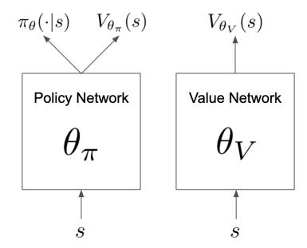
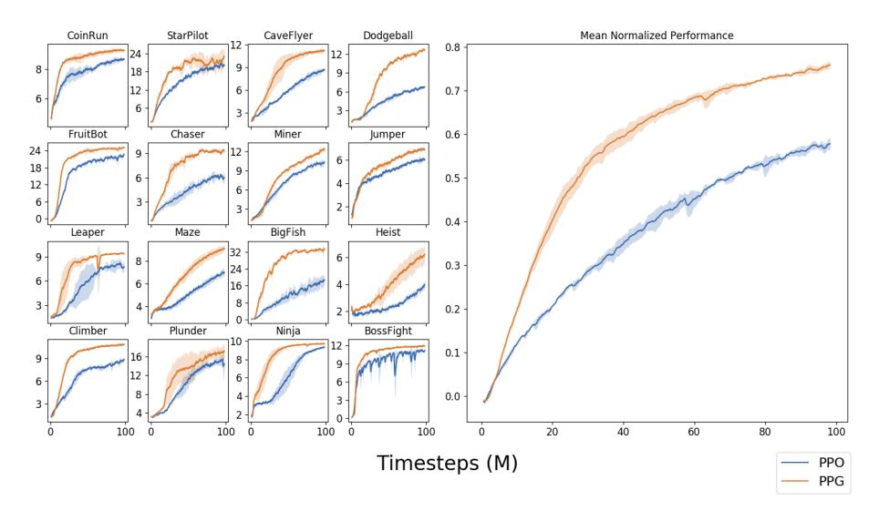
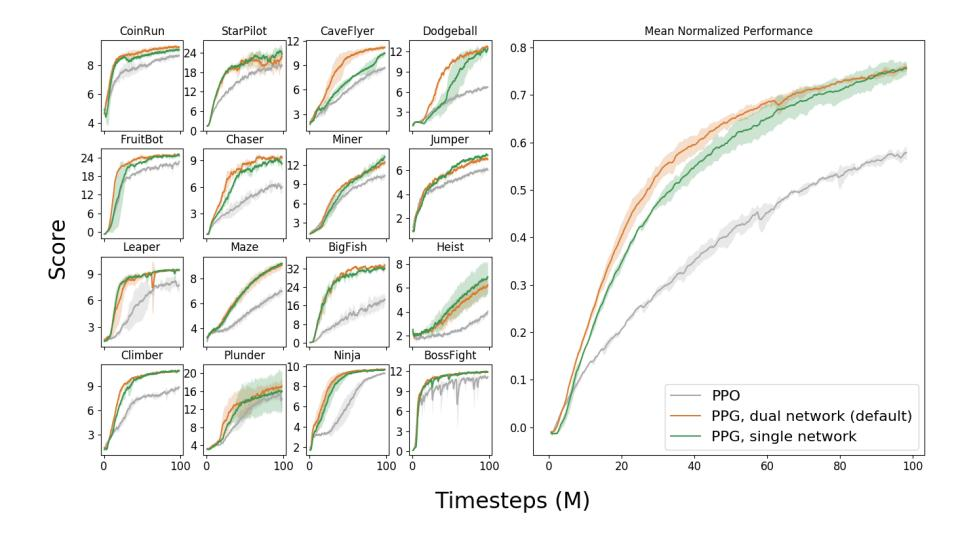
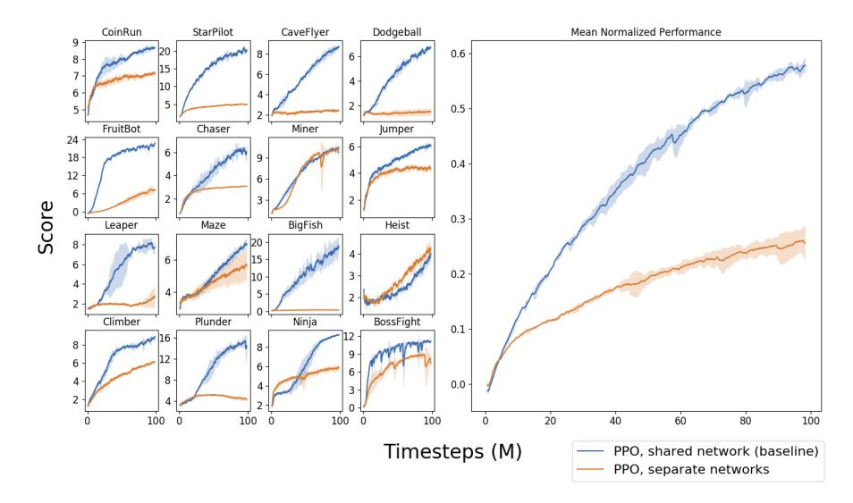
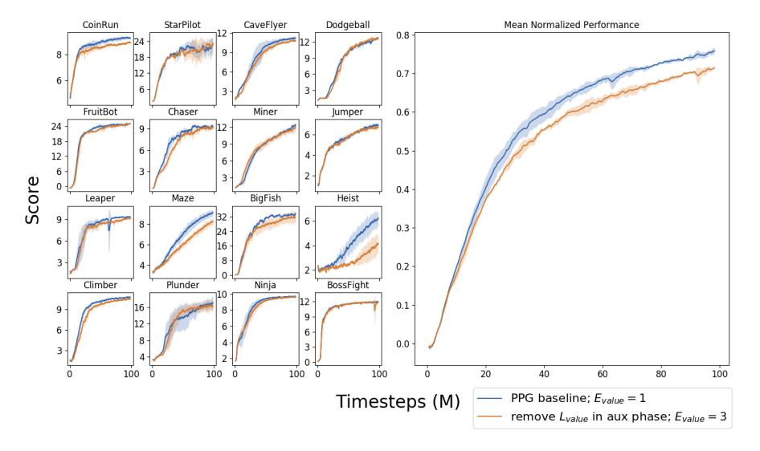

### Phasic Policy Gradient

Karl Cobbe karl@openai.com Jacob Hilton jhilton@openai.com Oleg Klimov oleg@openai.com John Schulman joschu@openai.com

#### Abstract

We introduce Phasic Policy Gradient (PPG), a reinforcement learning framework which modifies traditional on-policy actor-critic methods by separating policy and value function training into distinct phases. In prior methods, one must choose between using a shared network or separate networks to represent the policy and value function. Using separate networks avoids interference between objectives, while using a shared network allows useful features to be shared. PPG is able to achieve the best of both worlds by splitting optimization into two phases, one that advances training and one that distills features. PPG also enables the value function to be more aggressively optimized with a higher level of sample reuse. Compared to PPO, we find that PPG significantly improves sample efficiency on the challenging Procgen Benchmark.

### 1 Introduction

Model free reinforcement learning (RL) has enjoyed remarkable success in recent years, achieving impressive results in diverse domains including DoTA [\(OpenAI](#page-11-0) [et al.](#page-11-0) , [2019b\)](#page-11-0), Starcraft II [\(Vinyals et al.](#page-12-0) , [2019\)](#page-12-0), and robotic control [\(OpenAI](#page-11-1) [et al.](#page-11-1) , [2019a\)](#page-11-1). Although policy gradient methods like PPO [\(Schulman et al.](#page-11-2) , [2017\)](#page-11-2), A3C [\(Mnih et al.](#page-11-3) , [2016\)](#page-11-3), and IMPALA [\(Espeholt et al.](#page-10-0) , [2018\)](#page-10-0) are behind some of the most high profile results, many related algorithms have proposed a variety of policy objectives [\(Schulman et al.](#page-11-4) , [2015a](#page-11-4) ; [Wu et al.](#page-12-1) , [2017](#page-12-1) ; [Peng](#page-11-5) [et al.](#page-11-5) , [2019](#page-11-5) ; [Song et al.](#page-11-6) , [2019](#page-11-6) ; [Lillicrap et al.](#page-11-7) , [2015](#page-11-7) ; [Haarnoja et al.](#page-10-1) , [2018\)](#page-10-1). All of these algorithms fundamentally rely on the actor-critic framework, with two key quantities driving learning: the policy and the value function. In practice, whether or not to share parameters between the policy and the value function networks is an important implementation decision. There is a clear advantage to sharing parameters: features trained by each objective can be used to better optimize the other.

However, there are also disadvantages to sharing network parameters. First, it is not clear how to appropriately balance the competing objectives of the policy and the value function. Any method that jointly optimizes these two objectives with the same network must assign a relative weight to each. Regardless of how well this hyperparameter is chosen, there is a risk that the optimization of one objective will interfere with the optimization of the other. Second, the use of a shared network all but requires the policy and value function objectives to be trained with the same data, and consequently the same level of sample reuse. This is an artificial and undesirable restriction.

We address these problems with Phasic Policy Gradient (PPG), an algorithm which preserves the feature sharing between the policy and value function, while otherwise decoupling their training. PPG operates in two alternating phases: the first phase trains the policy, and the second phase distills useful features from the value function. More generally, PPG can be used to perform any auxiliary optimization alongside RL, though in this work we take value function error to be the sole auxiliary objective. Using PPG, we highlight two important observations about on-policy actor-critic methods:

- 1. Interference between policy and value function optimization can negatively impact performance when parameters are shared between the policy and the value function networks.
- 2. Value function optimization often tolerates a significantly higher level of sample reuse than policy optimization.

By mitigating the interference between the policy and value function objectives while still sharing representations, and by optimizing each with the appropriate level of sample reuse, PPG significantly improves sample efficiency.

### <span id="page-1-0"></span>2 Algorithm

In PPG, training proceeds in two alternating phases: the *policy phase*, followed by the *auxiliary phase*. During the policy phase, we train the agent with Proximal Policy Optimization (PPO) (Schulman et al., 2017). During the auxiliary phase, we distill features from the value function into the policy network, to improve training in future policy phases. Compared to PPO, the novel contribution of PPG is the inclusion of periodic auxiliary phases. We now describe each phase in more detail.

During the policy phase, we optimize the same objectives from PPO, notably using disjoint networks to represent the policy and the value function (Figure 1). Specifically, we train the policy network using the clipped surrogate objective

$$L^{clip} = \hat{\mathbb{E}}_t \left[ \min(r_t(\theta) \hat{A}_t, \operatorname{clip}(r_t(\theta), 1 - \epsilon, 1 + \epsilon) \hat{A}_t) \right]$$

where  $r_t(\theta) = \frac{\pi_{\theta}(a_t|s_t)}{\pi_{\theta_{old}}(a_t|s_t)}$ , and  $\hat{A}_t$  is an estimator of the advantage function at timestep t. We optimize  $L^{clip} + \beta_S S[\pi]$ , where  $\beta_S$  is a constant and S is a an entropy bonus for the policy. To train the value function network, we optimize

$$L^{value} = \hat{\mathbb{E}}_t \left[ \frac{1}{2} (V_{\theta_V}(s_t) - \hat{V}_t^{\text{targ}})^2 \right]$$

where  $\hat{V}^{\text{targ}}$  are value function targets. Both  $\hat{A}$  and  $\hat{V}^{\text{targ}}$  are computed with GAE (Schulman et al., 2015b).

<span id="page-2-0"></span>

Figure 1: PPG uses disjoint policy and value networks to reduce interference between objectives. The policy network includes an auxiliary value head.

During the auxiliary phase, we optimize the policy network with a joint objective that includes an arbitrary auxiliary loss and a behavioral cloning loss:

$$L^{joint} = L^{aux} + \beta_{clone} \cdot \hat{\mathbb{E}}_t \left[ KL[\pi_{\theta_{old}}(\cdot|s_t), \pi_{\theta}(\cdot|s_t)] \right]$$

where  $\pi_{\theta_{old}}$  is the policy right before the auxiliary phase begins. That is, we optimize the auxiliary objective while otherwise preserving the original policy, with the hyperparameter  $\beta_{clone}$  controlling this trade-off. In principle  $L^{aux}$  could be any auxiliary objective. At present, we simply use the value function loss as the auxiliary objective, thereby sharing features between the policy and value function while minimizing distortions to the policy. Specifically, we define

$$L^{aux} = \frac{1}{2} \cdot \hat{\mathbb{E}}_t \left[ (V_{\theta_{\pi}}(s_t) - \hat{V}_t^{\text{targ}})^2 \right]$$

where  $V_{\theta_{\pi}}$  is an auxiliary value head of the policy network, shown in Figure 1.

#### Algorithm 1 PPG

```
for phase = 1, 2, \dots do
 Initialize empty buffer B
 for iteration = 1, 2, ..., N_{\pi} do
                                                                                                    ▶ Policy Phase
       Perform rollouts under current policy \pi
       Compute value function target \hat{V}_t^{\text{targ}} for each state s_t
       for epoch = 1, 2, ..., E_{\pi} do
                                                                                                  ▶ Policy Epochs
            Optimize L^{clip} + \beta_S S[\pi] wrt \theta_{\pi}
      \begin{array}{l} \mathbf{for} \ \mathrm{epoch} = 1, 2, ..., E_V \ \mathbf{do} \\ \mathrm{Optimize} \ L^{value} \ \mathrm{wrt} \ \theta_V \end{array}
                                                                                                   ▶ Value Epochs
      Add all (s_t, \hat{V}_t^{\text{targ}}) to B
 Compute and store current policy \pi_{\theta_{old}}(\cdot|s_t) for all states s_t in B
\begin{array}{l} \textbf{for epoch} = 1, 2, ..., E_{aux} \ \textbf{do} \\ \text{Optimize } L^{joint} \ \text{wrt} \ \theta_{\pi}, \ \text{on all data in } B \end{array}
                                                                                              ▶ Auxiliary Phase
       Optimize L^{value} wrt \theta_V, on all data in B
```

<span id="page-3-0"></span>

Figure 2: Sample efficiency of PPG compared to a PPO baseline

This auxiliary value head and policy itself share all parameters except for the final linear layers. The auxiliary value head is used purely to train representations for the policy; it has no other purpose in PPG. Note that the targets Vˆ targ are the same targets computed during the policy phase. They remain fixed throughout the auxiliary phase. During the auxiliary phase, we also take the opportunity to perform additional training on the value network by further optimizing L value. Note that L value and L joint share no parameter dependencies, so we can optimize these objectives separately.

We briefly explain the role of each hyperparameter. N<sup>π</sup> controls the number of policy updates performed in each policy phase. E<sup>π</sup> and E<sup>V</sup> control the sample reuse for the policy and value function respectively, during the policy phase. Although these are conventionally set to the same value, this is not a strict requirement in PPG. Note that E<sup>V</sup> influences the training of the true value function, not the auxiliary value function. Eaux controls the sample reuse during the auxiliary phase, representing the number of epochs performed across all data in the replay buffer. It is usually by increasing Eaux, rather than E<sup>V</sup> , that we increase sample reuse for value function training. For a detailed discussion on the relationship between Eaux and E<sup>V</sup> , see Appendix [C.](#page-15-0) Default values for all hyperparameters can be found in Appendix [A.](#page-13-0) Code for PPG can be found at [https://github.com/openai/phasic-policy-gradient.](https://github.com/openai/phasic-policy-gradient)

# 3 Experiments

We report results on the environments in Procgen Benchmark [\(Cobbe et al.,](#page-10-2) [2019\)](#page-10-2). This benchmark was designed to be highly diverse, and we expect im-

<span id="page-4-0"></span>

Figure 3: Performance with varying levels of policy sample reuse

provements on this benchmark to transfer well to many other RL environments. Throughout all experiments, we use the hyperparameters found in Appendix [A](#page-13-0) unless otherwise specified. When feasible, we compute and visualize the standard deviation across 3 separate runs.

#### 3.1 Comparison to PPO

We begin by comparing our implementation of PPG to the highly tuned implementation of PPO from [Cobbe et al.](#page-10-2) [\(2019\)](#page-10-2). We note that this implementation of PPO uses a near optimal level of sample reuse and a near optimal relative weight for the value and policy losses, as determined by a hyperparameter sweep. Results are shown in Figure [2.](#page-3-0) We can see that PPG achieves significantly better sample efficiency than PPO in nearly every environment.

We have noticed that the importance of representation sharing between the policy and value function does seem to vary between environments. While it is critical to share parameters between the policy and the value function in Procgen environments (see Appendix [B\)](#page-14-0), this is often unnecessary in environments with a lower dimensional input space [\(Haarnoja et al.,](#page-10-1) [2018\)](#page-10-1). We conjecture that the high dimensional input space in Procgen contributes to the importance of sharing representations between the policy and the value function. We therefore believe it is in environments such as these, particularly those with vision-based observations, that PPG is most likely to outperform PPO and other similar algorithms.

<span id="page-5-0"></span>

Figure 4: Performance with varying levels of value function sample reuse

### <span id="page-5-1"></span>3.2 Policy Sample Reuse

In PPO, choosing the optimal level of sample reuse is not straightforward. Increasing sample reuse in PPO implies performing both additional policy optimization and additional value function optimization. This leads to an undesirable confounding of effects, making it harder to analyze the impact of policy sample reuse alone. Empirically, we find that performing 3 epochs per rollout is best in PPO, given our other hyperparameter settings (see Appendix [D\)](#page-16-0).

In PPG, policy and value function training are decoupled, and we can train each with different levels of sample reuse. In order to better understand the impact of policy sample reuse, we choose to vary the number of policy epochs (Eπ) without changing the number of value function epochs (E<sup>V</sup> ). Results are shown in Figure [3.](#page-4-0)

As we can see, training with a single policy epoch is almost always optimal or near-optimal in PPG. This suggests that the PPO baseline benefits from greater sample reuse only because the extra epochs offer additional value function training. When value function and policy training are properly isolated, we see little benefit from training the policy beyond a single epoch. Of course, various hyperparameters will influence this result. If we use an artificially low learning rate, for instance, it will become advantageous to increase policy sample reuse. Our present conclusion is simply that when using well-tuned hyperparameters, performing a single policy epoch is near-optimal.

<span id="page-6-0"></span>

Figure 5: Performance with varying auxiliary phase frequency

#### <span id="page-6-1"></span>3.3 Value Sample Reuse

We now evaluate how performing additional epochs during the auxiliary phase impacts performance. We expect there to be a trade-off: using too many epochs runs the risk of overfitting to recent data, while using fewer epochs will lead to slower training. We vary the number of auxiliary epochs (Eaux) from 1 to 9 and report results in Figure [4.](#page-5-0)

We find that training with additional auxiliary epochs is generally beneficial, with performance tapering off around 6 auxiliary epochs. We note that training with additional auxiliary epochs offers two possible benefits. First, due to the optimization of L joint, we may expect better-trained features to be shared with the policy. Second, due to the optimization of L value, we may expect to train a more accurate value function, thereby reducing the variance of the policy gradient in future policy phases. In general, which benefit is more significant is likely to vary between environments. In Procgen environments, the feature sharing between policy and value networks appears to play the more critical role. For a more detailed discussion of the relationship between these two objectives, see Appendix [C.](#page-15-0)

#### 3.4 Auxiliary Phase Frequency

We next investigate alternating between policy and auxiliary phases at different frequencies, controlled by the hyperparameter Nπ. As described in Section [2,](#page-1-0) we perform each auxiliary phase after every N<sup>π</sup> policy updates. We vary this hyperparameter from 2 to 32 and report results in Figure [5.](#page-6-0)

It is clear that performance suffers when we perform auxiliary phases too

<span id="page-7-0"></span>

Figure 6: The impact of replacing the clipping objective (L clip) with a fixed KL penalty objective (L KL)

frequently. We conjecture that each auxiliary phase interferes with policy optimization, and that performing frequent auxiliary phases exacerbates this effect. It's possible that future research will uncover more clever optimization techniques to mitigate this interference. For now, we conclude that relatively infrequent auxiliary phases are critical to success.

#### 3.5 KL Penalty vs Clipping

As an alternative to clipping, [Schulman et al.](#page-11-2) [\(2017\)](#page-11-2) proposed using an adaptively weighted KL penalty. We now investigate the use of a KL penalty in PPG, but we instead choose to keep the relative weight of this penalty fixed. Specifically, we set the policy gradient loss (excluding the entropy bonus) to be

$$L^{KL} = \hat{\mathbb{E}}_t \left[ -\hat{A}_t \frac{\pi_{\theta}(a_t|s_t)}{\pi_{\theta_{old}}(a_t|s_t)} + \beta_{\pi} \cdot KL[\pi_{\theta_{old}}(\cdot|s_t), \pi_{\theta}(\cdot|s_t)] \right]$$

where β<sup>π</sup> controls the weight of the KL penalty. After performing a hyperparameter sweep, we set β<sup>π</sup> to 1. Results are shown in Figure [6.](#page-7-0) We find that a fixed KL penalty objective performs remarkably similarly to clipping when using PPG. We suspect that using clipping (or an adaptive KL penalty) is more important when rewards are poorly scaled. We avoid this concern by normalizing rewards so that discounted returns have approximately unit variance. In any case, we highlight the effectiveness of the KL penalty variant of PPG since L KL is arguably easier to analyze than L clip, and since future work may wish to build upon either objective.



Figure 7: A comparison between the default implementation of PPG which trains two separate networks, and a single-network variant that mimics the same training dynamics by detaching the gradient when necessary. PPO shown for reference.

#### 3.6 Single-Network PPG

By default, PPG comes with an increased memory footprint. Since we use disjoint policy and value function networks instead of a single unified network, we use approximately twice as many parameters compared to the PPO baseline. We can recover this cost and maintain most of the key benefits of PPG by using a single network that appropriately detaches the value function gradient. During the policy phase, we detach the value function gradient at the last layer shared between the policy and value heads, preventing the value function gradient from influencing shared parameters. During the auxiliary phase, we take the value function gradient with respect to all parameters, including shared parameters. This allows us to benefit from the representations learned by the value function, while still removing the interference during the policy phase.

As we can see, using PPG with this single shared network performs almost as well as PPG with a dual network architecture. We were initially concerned that the value function might be unable to train well during the policy phase with the detached gradient, but in practice this does not appear to be a major problem. We believe this is because the value function can still train from the full gradient during the auxiliary phase.

## 4 Related Work

[Igl et al.](#page-11-9) [\(2020\)](#page-11-9) recently proposed Iterative Relearning (ITER) to reduce the

impact of non-stationarity during RL training. ITER and PPG share a striking similarity: both algorithms alternate between a standard RL phase and a distillation phase. However, the nature and purpose of the distillation phase varies. In ITER, the policy and value function teachers are periodically distilled into newly initialized student networks, in an effort to improve generalization. In PPG, the value function network is periodically distilled into the policy network, in an effort to improve sample efficiency.

Prior work has considered the role the value function plays as an auxiliary task. [Bellemare et al.](#page-10-3) [\(2019\)](#page-10-3) investigate using value functions to train useful representations, specifically focusing on a special class of value functions called Adversarial Value Functions (AVFs). They find that AVFs provide a useful auxiliary objective in the four-room domain. [Lyle et al.](#page-11-10) [\(2019\)](#page-11-10) suggest that the benefits of distributional RL [\(Bellemare et al.,](#page-10-4) [2017\)](#page-10-4) can perhaps be attributed to the rich signal the value function distribution provides as an auxiliary task. We find that the representation learning performed by the value function is indeed critical in Procgen environments, although we consider only the value function of the current policy, and we do not model the full value distribution.

Off-policy algorithms like Soft Actor-Critic (SAC) [\(Haarnoja et al.,](#page-10-1) [2018\)](#page-10-1), Deep Deterministic Policy Gradient (DDPG) [\(Lillicrap et al.,](#page-11-7) [2015\)](#page-11-7), and Actor-Critic with Experience Replay (ACER) [\(Wang et al.,](#page-12-2) [2016\)](#page-12-2) all employ replay buffers to improve sample efficiency via off-policy updates. PPG also utilizes a replay buffer, specifically when performing updates during the auxiliary phase. However, unlike these algorithms, PPG does not attempt to improve the policy from off-policy data. Rather, this replay buffer data is used only to better fit the value targets and to better train features for the policy. SAC also notably uses separate policy and value function networks, presumably, like PPG, to avoid interference between their respective objectives.

Although we use the clipped surrogate objective from PPO [\(Schulman et al.,](#page-11-2) [2017\)](#page-11-2) throughout this work, PPG is in principle compatible with the policy objectives from any actor-critic algorithm. [Andrychowicz et al.](#page-10-5) [\(2020\)](#page-10-5) recently performed a rigorous empirical comparison of many relevant algorithms in the on-policy setting. In particular, AWR [\(Peng et al.,](#page-11-5) [2019\)](#page-11-5) and V-MPO [\(Song](#page-11-6) [et al.,](#page-11-6) [2019\)](#page-11-6) propose alternate policy objectives that move the current policy towards one which weights the likelihood of each action by the exponentiated advantage of that action. Such objectives could be used in PPG, in place of the PPO objective.

There are also several trust region methods, similar in spirit to PPO, that would be compatible with PPG. Trust Region Policy Optimization (TRPO) [\(Schulman et al.,](#page-11-4) [2015a\)](#page-11-4) proposed performing policy updates by optimizing a surrogate objective, whose gradient is the policy gradient estimator, subject to a constraint on the KL-divergence between the original policy and the updated policy. Actor Critic using Kronecker-Factored Trust Region (ACKTR) [\(Wu](#page-12-1) [et al.,](#page-12-1) [2017\)](#page-12-1) uses Kronecker-factored approximated curvature (K-FAC) to perform a similar trust region update, but with a computational cost comparable to SGD. Both methods could be used in the PPG framework.

### 5 Conclusion

The results in Section [3.2](#page-5-1) and Section [3.3](#page-6-1) make it clear that the optimal level of sample reuse varies significantly between the policy and the value function. Training these two objectives with varying sample reuse is not possible in a conventional actor-critic framework using a shared network architecture. By decoupling policy and value function training, PPG is able to reap the benefits of additional value function training without significantly interfering with the policy. To achieve this, PPG does introduce several new hyperparameters, which creates some additional complexity relative to previous algorithms. However, we consider this a relatively minor cost, and we note that the chosen hyperparameter values generalize well across all 16 Procgen environments.

By mitigating interference between the policy and the value function while still maintaining the benefits of shared representations, PPG significantly improves sample efficiency on the challenging Procgen Benchmark. Moreover, PPG establishes a framework for optimizing arbitrary auxiliary losses alongside RL training in a stable manner. We have focused on the value function error as the sole auxiliary loss in this work, but we consider it a compelling topic for future research to evaluate other auxiliary losses using PPG.

### References

- <span id="page-10-5"></span>M. Andrychowicz, A. Raichuk, P. Sta´nczyk, M. Orsini, S. Girgin, R. Marinier, L. Hussenot, M. Geist, O. Pietquin, M. Michalski, et al. What matters in onpolicy reinforcement learning? a large-scale empirical study. arXiv preprint arXiv:2006.05990, 2020.
- <span id="page-10-3"></span>M. Bellemare, W. Dabney, R. Dadashi, A. A. Taiga, P. S. Castro, N. Le Roux, D. Schuurmans, T. Lattimore, and C. Lyle. A geometric perspective on optimal representations for reinforcement learning. In Advances in Neural Information Processing Systems, pages 4360–4371, 2019.
- <span id="page-10-4"></span>M. G. Bellemare, W. Dabney, and R. Munos. A distributional perspective on reinforcement learning. In Proceedings of the 34th International Conference on Machine Learning-Volume 70, pages 449–458. JMLR. org, 2017.
- <span id="page-10-2"></span>K. Cobbe, C. Hesse, J. Hilton, and J. Schulman. Leveraging procedural generation to benchmark reinforcement learning. arXiv preprint arXiv:1912.01588, 2019.
- <span id="page-10-0"></span>L. Espeholt, H. Soyer, R. Munos, K. Simonyan, V. Mnih, T. Ward, Y. Doron, V. Firoiu, T. Harley, I. Dunning, S. Legg, and K. Kavukcuoglu. IMPALA: scalable distributed deep-rl with importance weighted actor-learner architectures. CoRR, abs/1802.01561, 2018.
- <span id="page-10-1"></span>T. Haarnoja, A. Zhou, P. Abbeel, and S. Levine. Soft actor-critic: Off-policy maximum entropy deep reinforcement learning with a stochastic actor. arXiv preprint arXiv:1801.01290, 2018.

- <span id="page-11-9"></span>M. Igl, G. Farquhar, J. Luketina, W. Boehmer, and S. Whiteson. The impact of non-stationarity on generalisation in deep reinforcement learning. arXiv preprint arXiv:2006.05826, 2020.
- <span id="page-11-11"></span>D. P. Kingma and J. Ba. Adam: A method for stochastic optimization. arXiv preprint arXiv:1412.6980, 2014.
- <span id="page-11-7"></span>T. P. Lillicrap, J. J. Hunt, A. Pritzel, N. Heess, T. Erez, Y. Tassa, D. Silver, and D. Wierstra. Continuous control with deep reinforcement learning. arXiv preprint arXiv:1509.02971, 2015.
- <span id="page-11-10"></span>C. Lyle, M. G. Bellemare, and P. S. Castro. A comparative analysis of expected and distributional reinforcement learning. In Proceedings of the AAAI Conference on Artificial Intelligence, volume 33, pages 4504–4511, 2019.
- <span id="page-11-3"></span>V. Mnih, A. P. Badia, M. Mirza, A. Graves, T. Lillicrap, T. Harley, D. Silver, and K. Kavukcuoglu. Asynchronous methods for deep reinforcement learning. In International conference on machine learning, pages 1928–1937, 2016.
- <span id="page-11-1"></span>OpenAI, I. Akkaya, M. Andrychowicz, M. Chociej, M. Litwin, B. McGrew, A. Petron, A. Paino, M. Plappert, G. Powell, R. Ribas, J. Schneider, N. Tezak, J. Tworek, P. Welinder, L. Weng, Q. Yuan, W. Zaremba, and L. Zhang. Solving rubik's cube with a robot hand. arXiv preprint arXiv:1910.07113, 2019a.
- <span id="page-11-0"></span>OpenAI, C. Berner, G. Brockman, B. Chan, V. Cheung, P. Debiak, C. Dennison, D. Farhi, Q. Fischer, S. Hashme, C. Hesse, R. J´ozefowicz, S. Gray, C. Olsson, J. Pachocki, M. Petrov, H. P. de Oliveira Pinto, J. Raiman, T. Salimans, J. Schlatter, J. Schneider, S. Sidor, I. Sutskever, J. Tang, F. Wolski, and S. Zhang. Dota 2 with large scale deep reinforcement learning. arXiv preprint arXiv:1912.06680, 2019b.
- <span id="page-11-5"></span>X. B. Peng, A. Kumar, G. Zhang, and S. Levine. Advantage-weighted regression: Simple and scalable off-policy reinforcement learning. arXiv preprint arXiv:1910.00177, 2019.
- <span id="page-11-4"></span>J. Schulman, S. Levine, P. Abbeel, M. Jordan, and P. Moritz. Trust region policy optimization. In International conference on machine learning, pages 1889–1897, 2015a.
- <span id="page-11-8"></span>J. Schulman, P. Moritz, S. Levine, M. Jordan, and P. Abbeel. High-dimensional continuous control using generalized advantage estimation. arXiv preprint arXiv:1506.02438, 2015b.
- <span id="page-11-2"></span>J. Schulman, F. Wolski, P. Dhariwal, A. Radford, and O. Klimov. Proximal policy optimization algorithms. CoRR, abs/1707.06347, 2017.
- <span id="page-11-6"></span>H. F. Song, A. Abdolmaleki, J. T. Springenberg, A. Clark, H. Soyer, J. W. Rae, S. Noury, A. Ahuja, S. Liu, D. Tirumala, et al. V-mpo: On-policy maximum a posteriori policy optimization for discrete and continuous control. arXiv preprint arXiv:1909.12238, 2019.

- <span id="page-12-0"></span>O. Vinyals, I. Babuschkin, W. M. Czarnecki, M. Mathieu, A. Dudzik, J. Chung, D. H. Choi, R. Powell, T. Ewalds, P. Georgiev, et al. Grandmaster level in starcraft ii using multi-agent reinforcement learning. Nature, 575(7782): 350–354, 2019.
- <span id="page-12-2"></span>Z. Wang, V. Bapst, N. Heess, V. Mnih, R. Munos, K. Kavukcuoglu, and N. de Freitas. Sample efficient actor-critic with experience replay. arXiv preprint arXiv:1611.01224, 2016.
- <span id="page-12-1"></span>Y. Wu, E. Mansimov, R. B. Grosse, S. Liao, and J. Ba. Scalable trust-region method for deep reinforcement learning using kronecker-factored approximation. In Advances in neural information processing systems, pages 5279–5288, 2017.

### <span id="page-13-0"></span>A Hyperparameters

We use the Adam optimizer [\(Kingma and Ba,](#page-11-11) [2014\)](#page-11-11) in all experiments.

#### A.1 PPG-Specific Hyperparameters

| Nπ                                 | 32 |
|------------------------------------|----|
| Eπ                                 | 1  |
| EV                                 | 1  |
| Eaux                               | 6  |
| βclone                             | 1  |
| # minibatches per aux epoch per Nπ | 16 |

#### A.2 Other Hyperparameters

| γ                              | .999     |
|--------------------------------|----------|
| λ                              | .95      |
| # timesteps per rollout        | 256      |
| # minibatches per epoch        | 8        |
| Entropy bonus coefficient (βS) | .01      |
| PPO clip range ()              | .2       |
| Reward Normalization?          | Yes      |
| Learning rate                  | 5 × 10−4 |
| # workers                      | 4        |
| # environments per worker      | 64       |
| Total timesteps                | 100M     |
| LSTM?                          | No       |
| Frame Stack?                   | No       |

### <span id="page-14-0"></span>B Shared vs Separate Networks



Figure 8: A comparison between two implementations of PPO on Procgen Benchmark. The baseline shares features between the policy and value networks, while the ablation trains separate policy and value networks.

### <span id="page-15-0"></span>C Auxiliary Phase Value Function Training

<span id="page-15-1"></span>

Figure 9: The performance of a variant of PPG which skips the optimization of L value during the auxiliary phase, in favor of additional optimization of L value during the policy phase.

We now discuss the relative importance of optimizing L value and L joint during the auxiliary phase. From Appendix [B,](#page-14-0) we know that L joint is crucial; without some optimization of this objective, there is no mechanism to share features between the value function and the policy. Although it is convenient to optimize L value during the auxiliary phase as well, it is not strictly necessary. It is also viable to perform extra value function optimization during the policy phase (by increasing E<sup>V</sup> ), while removing the optimization of L value from the auxiliary phase. A comparison between this variant and the PPG baseline are shown in Figure [9.](#page-15-1) Although the PPG baseline has a slight advantage, we can see that the choice to optimize L value during the auxiliary phase is not an essential element of PPG.

## <span id="page-16-0"></span>D PPO Sample Reuse


Figure 10: A comparison between different levels of sample reuse in PPO.

We sweep over the different values for sample reuse in PPO, from 1 to 6. Empirically, we find that a sample reuse of 3 is optimal, given our other hyperparameter settings. As discussed in Section [3.2,](#page-5-1) the results with PPG suggest that the poor performance of PPO with low sample reuse is due to the fact that the value function, not the policy, is being under-trained.