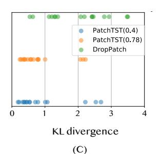
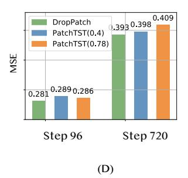
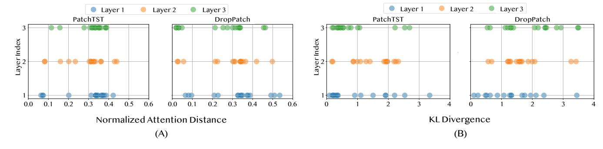
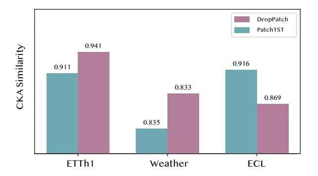
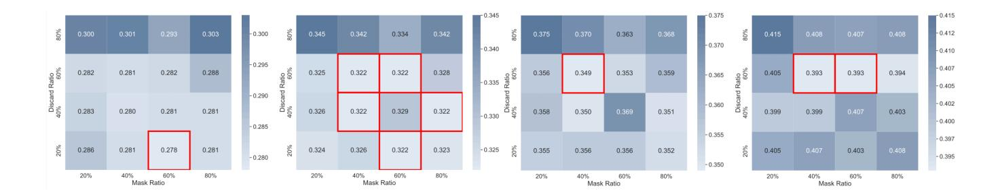
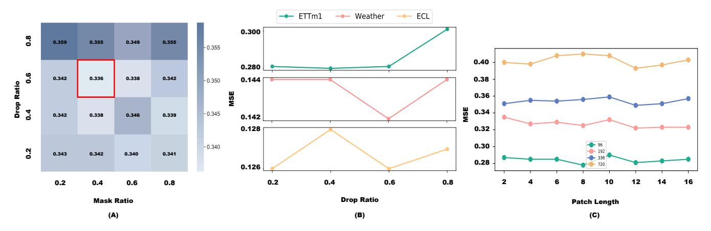

# Enhancing Masked Time-Series Modeling via Dropping Patches

Tianyu Qiu1 , Yi Xie1\*, Yun Xiong1 , Hao Niu1 , Xiaofeng Gao2

1Shanghai Key Lab of Data Science, School of Computer Science, Fudan University, Shanghai, China {tyqiu22, yixie18, yunx, hniu18}@fudan.edu.cn 2MoE Key Lab of Artificial Intelligence, Shanghai Jiao Tong University, Shanghai, China gao-xf@cs.sjtu.edu.cn

#### Abstract

This paper explores how to enhance existing masked timeseries modeling by randomly dropping sub-sequence level patches of time series. On this basis, a simple yet effective method named DropPatch is proposed, which has two remarkable advantages: 1) It improves the pre-training efficiency by a square-level advantage; 2) It provides additional advantages for modeling in scenarios such as in-domain, cross-domain, few-shot learning and cold start. This paper conducts comprehensive experiments to verify the effectiveness of the method and analyze its internal mechanism. Empirically, DropPatch strengthens the attention mechanism, reduces information redundancy and serves as an efficient means of data augmentation. Theoretically, it is proved that DropPatch slows down the rate at which the Transformer representations collapse into the rank-1 linear subspace by randomly dropping patches, thus optimizing the quality of the learned representations.

# Introduction

In recent years, masked modeling has emerged as a prevalent self-supervised method in various fields, including natural language processing (Devlin et al. 2018; Liu et al. 2019) and computer vision (Baevski et al. 2022; He et al. 2022; Bao et al. 2021). This technique improves representation learning by reconstructing masked content based on unmasked parts. Masked modeling has also been adapted for timeseries analysis. A notable advancement involves segmenting time-series into patches (sub-sequence) and applying a patch-level masking strategy, which has received considerable attention since its inception (Nie et al. 2022). This method not only shows promising performance in transfer learning, but also significantly enhances supervised forecasting by employing self-supervised pre-training to initialize model parameters, consistent with recent findings (Amos, Berant, and Gupta 2023). Building upon the patching technique, numerous time-series foundation model works have emerged and achieve significant performance in time-series forecasting (Goswami et al. 2024; Woo et al. 2024).

Despite its potential, we observed that masked time-series modeling, represented by PatchTST (Nie et al. 2022), faces a

Copyright © 2025, Association for the Advancement of Artificial Intelligence (www.aaai.org). All rights reserved.

dilemma. A relatively low mask ratio reduces effectiveness in learning useful features (He et al. 2022; Zhang, Wang, and Wang 2022). Given the characteristic of periodicity and repetitive pattern of time-series data, the masked patch can be recovered with little high-level understanding of the underlying patterns, leading to superficial learning and overfitting as shown in Figure 1 (A). A natural idea is to increase the mask ratio, but another issue emerges: the presence of an excessive number of masked patches can further dilute the attention mechanism's capacity to concentrate on the relevant and informative parts of data, termed as scattered attention as shown in Figure 1 (C). It can lead to the degradation of downstream task performance as the representations gradually lose their distinctiveness (Noci et al. 2022; Dong, Cordonnier, and Loukas 2021; Zhai et al. 2023).

We introduce a simple yet effective strategy, DropPatch, to encourage learning useful features and improve the overall performance. Building on foundational time-series pretraining techniques (Nie et al. 2022), DropPatch randomly removes a predefined proportion of patches. The remaining patches are subsequently processed for masking and reconstruction. It is crucial to distinguish between dropping and masking in the context of pre-training. For a given time-series sample, the dropping operation is applied prior to masking and reconstruction. Removed patches are entirely excluded from all training processes during the current epoch. In contrast, masked patches, represented as zero tensors overlaid with positional encoding, remain part of the training process throughout the epoch.

In our empirical study, DropPatch demonstrates clear advantages in mitigating over-fitting (Figure 1 (B)), enhancing attention focus (Figure 1 (C)), and improving forecasting performance (Figure 1 (D)). The reduction in the number of patches due to the dropping operation leads to significant improvements in computational efficiency and reduced memory consumption.

Extensive experiments validate the effectiveness of Drop-Patch. Through detailed experimental analysis, we uncover the underlying mechanisms driving these improvements. The DropPatch strategy enhances the attention mechanism by enabling a sharper focus on multi-scale and diverse information. It strengthens the model's ability to capture critical patterns while reducing redundancy in representation. Furthermore, our theoretical findings indicate that the ran-

\*Corresponding author.

Figure 1: (A) The loss curve of PatchTST with lower mask ratio 0.4 (official implementation); (B) The loss curve of DropPatch (unless otherwise stated, the drop ratio and mask ratio is 0.6 and 0.4 throughout this paper); (C) The Kullback-Leibler (KL) divergence between the attention coefficients of the final encoder layer and a uniform distribution, where each dot represents an individual attention head. A larger KL divergence indicates that this set of attention distributions is farther from a uniform distribution and thus more focused. PatchTST(0.78) refers to the PatchTST configured with a mask ratio of 0.78, matching the number of visible patches in DropPatch. (D) Comparison of MSE metrics between PatchTST and DropPatch with forecasting steps  $T \in \{96,720\}$  on ETTm1.

dom dropping of patches effectively slows the convergence of the Transformer's representations toward a rank-1 linear subspace, thereby promoting the feature diversity.

Overall, our contributions can be summarized as follows:

- We introduce DropPatch, a simple yet effective strategy that enhances masked time-series modeling.
- Extensive experiments demonstrate that the DropPatch strategy improves pre-training efficiency and delivers substantial performance gains across diverse downstream tasks. Additionally, we compile comprehensive synthesized datasets to evaluate its role as a core component in foundational models for time-series analysis.
- Through rigorous empirical and theoretical analysis, we validate the effectiveness of DropPatch and provide insights into the mechanisms driving these improvements.

#### Method

In this section, we describe the details of our proposed pretraining method, DropPatch, as shown in Fig. 2. We denote that DropPatch is an effective pre-training strategy, the model does not perform the dropping operation during the fine-tuning stage.

#### **Patching and Channel-Independence**

For each sample of multivariate time-series  $\mathbf{X} \in \mathbb{R}^{L \times c}$ , where L represents the length of time-series, and c denotes the number of channels (variates). We first split the entire time-series sample into non-overlapping subseries-level patches, which are served as input tokens to Transformer, like PatchTST (Nie et al. 2022). We permute the original data of time-series into  $\mathcal{X} \in \mathbb{R}^{c \times P \times L_P}$ , where  $L_P$  denotes the length of each subseries-level patch, and P denotes the total number of patches.

#### **Dropping Patches**

After the patching operation, we will first conduct the positional encoding for these patches. The positional encoding process is designed to preserve the positional information during the self-attention computation and following the dropping operation. It should be noted that the positional encoding of each token is computed prior to dropping operation, ensuring that the original sequence position of each token is maintained after the removal.

We randomly drop patches in the patched time-series, which is the core idea of our proposed DropPatch. Let r denotes the ratio of dropping with condition  $0 \le r \le 1$ , implying that only (1-r)P patches remains for further training and others will be directly absent in the subsequent operations. Formally, the remained patches and positional encoding will be denoted as  $\bar{\mathcal{X}} \in \mathbb{R}^{c \times (1-r)P \times L_P}$ ,  $\bar{PE} \in \mathbb{R}^{c \times (1-r)P \times d_{model}}$ .

#### **Representation Learning**

Subsequently, a patch-level random masking strategy is applied to generate masked data, the resultant masked dataset can be expressed as  $\bar{\mathcal{X}}_{masked} \in \mathbb{R}^{c \times (1-r)P \times L_P}$ . Given a mask ratio  $m \in [1,0]$ , we denote that the number of masked patches is (1-r)mP.

The masked data is then embedded, and the previously dropped positional encodings are added back to these embeddings to formulate the encoder input  $\mathbf{E}$ . After the encoder, we can obtain the representation  $\mathbf{Z}$  of the input series which can be formalized as:

$$\mathbf{E} = Embed(\bar{\mathcal{X}}_{masked}) + \overline{PE},\tag{1}$$

$$\mathbf{Z} = Encoder(\mathbf{E}),\tag{2}$$

where  $\mathbf{E}, \mathbf{Z} \in \mathbb{R}^{c \times (1-r)P \times d_{model}}$ . Finally, the representation  $\mathbf{Z}$  is fed into a reconstruction head to obtain the reconstruction results  $\hat{X} \in \mathbb{R}^{c \times (1-r)P \times L_P}$ . In the implementation, we

Figure 2: The overall pre-training framework of DropPatch.

simply adopt a linear layer as the head. We choose to use the Mean Squared Error (MSE) loss to mesure the reconstruction and the ground truth. Only the reconstructions on the masked patches are considered in the loss.

Here, we present a corollary to describe from the perspective of representation space why DropPatch is effective, which will be validated through both experimental and theoretical approaches in the following text.

**Lemma 1.** Let SAN denote a self-attention layer, and consider stacking L such layers. Then, under certain conditions, the representations within the stacked self-attention layers will converge to a rank-1 matrix as  $L \to \infty$ .

**Corollary 1.** The DropPatch strategy effectively slows down the rate at which the representation matrix of a Transformer degenerates into a rank-1 matrix.

#### **Experiments**

We perform time-series forecasting task under in-domain, cross-domain, few-shot and cold start settings to demonstrate the effectiveness of our proposed method. Furthermore, we do evaluations on two merged synthesized time-series datasets containing over 3.76 millons and 36 million data points, respectively. It worth noting that we maintain consistent drop ratio and mask ratio to be fixed across various tasks and datasets, demonstrating the effectiveness and robustness of our approach.

**Datasets** We evaluate performance of our proposed method DropPatch1 on 12 popular datasets. For in-domain, cross-domain and few-shot experiments, Weather, ECL, Traffic and 4 ETT datasets (ETTh1, ETTh2, ETTm1, ETTm2) are inclued. In addition, we incorporate Exchange and PEMS dataset for cold start scenario in cross-domain transfer learning. All datasets are available on (Wu et al. 2021) (Liu et al. 2022). Moreover, we compile two synthesized datasets to conduct multi-dataset pre-training

(Goswami et al. 2024), demonstrating the potential of Drop-Patch strategy in time-series foundation model.

**Implementation** We choose seven competitive selfsupervised baseline methods, including the masked modeling method: PatchTST (Nie et al. 2022), SimMTM (Dong et al. 2024), Ti-MAE (Cheng et al. 2023), TST (Zerveas et al. 2021), the contrastive learning methods: LaST (Wang et al. 2022), CoST (Woo et al. 2022), TS2Vec (Yue et al. 2022). We also include supervised methods iTransoformer (Liu et al. 2023), DLinear (Zeng et al. 2023) and FEDformer (Zhou et al. 2022) in comparison with the cross-domain transfer results of DropPatch and PatchTST. We denote that PatchTST refer to the self-supervised version PatchTST. We conduct experiments in both in-domain and cross-domain settings. For the in-domain setting, we pre-train and finetune the model using the same dataset. In the cross-domain setting, we pre-train the model on one dataset and then finetune it on other target datasets to evaluate its adaptability and generality across diverse scenarios. Unless otherwise stated, the input sequence length of DropPatch is set to 512, and the patch length is fixed at 12 following the self-supervised PatchTST (Nie et al. 2022). This configuration results in a total of 42 patches.

**Main Results** Our proposed DropPatch exhibits significant improvement over other established strong baselines in various time-series forecasting scenarios, while enjoying the computational efficienty and reduced memory usage.

#### **In-Domain Forecasting**

We conduct time-series forecasting experiments under an indomain setting, where models are pre-trained and fine-tuned on the same datasets. The results are summarized in Table 1.

In-domain experiments show that our DropPatch strategy surpasses existing methods in 13 out of 14 metrics across 7 datasets. Each metric demonstrates significant superiority in comparison with other baselines. PatchTST is noted as a strong baseline. Nevertheless, by simply applying the DropPatch strategy, performance is further improved in both MSE

&lt;sup>1In this section, we refer to DropPatch as DropPatch strategy implemented on top of the PatchTST backbone

| Models  | DropPatch   | PatchTST SimMTM         | Ti-MAE      | TST         | LaST        | CoST        | TS2Vec      |
|---------|-------------|----------------------------|-------------|-------------|-------------|-------------|-------------|
| Metrics | MSE MAE     | MSE MAE MSE MAE         | MSE MAE     | MSE MAE     | MSE MAE     | MSE MAE     | MSE MAE     |
| ETTm1   | 0.336 0.378 | 0.341 0.379 0.340 0.379 | 0.682 0.532 | 0.494 0.471 | 0.383 0.399 | 0.477 0.486 | 0.664 0.689 |
| ETTm2   | 0.254 0.315 | 0.258 0.318 0.260 0.318 | 0.392 0.417 | 0.425 0.371 | 0.389 0.394 | 0.825 0.651 | 0.359 0.420 |
| ETTh1   | 0.400 0.429 | 0.430 0.445 0.404 0.428 | 0.721 0.591 | 0.624 0.562 | 0.571 0.532 | 0.710 0.627 | 0.643 0.728 |
| ETTh2   | 0.347 0.390 | 0.355 0.394 0.348 0.391 | 0.482 0.488 | 0.429 0.458 | 0.499 0.497 | 1.664 0.999 | 0.801 0.856 |
| Weather | 0.220 0.259 | 0.225 0.261 0.235 0.280 | 0.324 0.343 | 0.419 0.448 | 0.237 0.268 | 1.111 0.801 | 0.658 0.751 |
| ECL     | 0.157 0.249 | 0.157 0.252 0.162 0.356 | 0.561 0.554 | 0.310 0.353 | 0.186 0.274 | 0.228 0.335 | 0.354 0.427 |
| Traffic | 0.378 0.257 | 0.382 0.259 0.392 0.264 | 0.916 0.423 | 0.611 0.503 | 0.713 0.397 | 0.760 0.428 | 0.501 0.375 |

Table 1: In-domain time-series forecasting results, averaged from all forecasting steps T ∈ {96, 192, 336, 720}.

and MAE, with only half the time consumption and memory usage in pre-training stage.

The forecasting performance of PatchTST, SimMTM, and DropPatch is significantly superior to other baselines. The commonality among these three methods is the use of channel-independent masked time-series modeling.

Compared to PatchTST, the DropPatch strategy offers further improvements in this task. This is primarily because the masked time-series modeling task can be done with a little understanding of underlying patterns in the timeseries, which can lead to superficial learning and over-fitting. Random dropping introduces a significant amount of randomness to each sample, thus acting as a data augmentation method that helps mitigate the over-fitting issue. In the meanwhile, the challenging pre-training task requires a comprehensive understanding of underlying patterns and thus encourages the learning of useful representation.

## Cross-Domain Forecasting

In this section, we explore multiple scenarios in crossdomain transfer learning. We perform fine-tuning on target datasets using all available training samples. Specifically, we conduct experiments with 1) ECL as the fixed source dataset, following the setup in (Nie et al. 2022), and 2) ETTm1 as the fixed target dataset. The results are summarized in Table 2 3. Notably, when the source dataset has a mismatch in the number of channels compared to the target dataset, some baseline models are unable to perform the transfer. Although SimMTM is capable of transferring under conditions of channel mismatch, we encountered an out-ofmemory (OOM) issue when pre-training SimMTM on the ECL dataset, even with a batch size of 1. Therefore, we also include supervised models for comparison when using ECL as the source dataset.

From the comparison, we observe that DropPatch significantly surpasses the other baselines. Notably, while PatchTST falls behind some supervised methods, Drop-Patch consistently outperforms these supervised methods. The improved performance stems from the prevention of severe over-fitting in the source dataset, ensuring the model's robustness and generalization capability when applied to unseen target datasets. In contrast, over-fitting can hinder PatchTST's ability to generalize effectively to new patterns.

## Evaluations on Synthesized Dataset

In the cross-domain experiments mentioned above, the models are initially pre-trained on a single source dataset and then fine-tuned on a target dataset. For the purpose of developing time-series foundation models (Goswami et al. 2024; Woo et al. 2024; Liu et al. 2024), the source dataset could be a mixed dataset. In the mixed dataset, time-series samples are from different domains, exhibiting varying frequencies, and containing diverse semantic information. This setup aims to enhance the model's robustness and ability to generalize across different scenarios, while also posing a challenge for models to handle diverse data.

We compile two synthesized datasets to facilitate multidataset pre-training for evaluation. This section primarily focuses on exploring the potential of applying DropPatch to time-series foundation models, without the concern with pushing state-of-the-art results.

Specifically, we merge 10 datasets to compile a synthesized time-series dataset, named STS66M, which has a total file size of over 66 MB and consists of more than 3.76 million data points. The models are pre-trained on STS66M and subsequently fine-tuned on other target datasets. The averaged results are in Table 4. DropPatch significantly outperforms PatchTST, demonstrating its superior adaptability to diverse pre-training data and its ability to learn more robust and general representations for downstream tasks.

An important application of pre-trained models is to provide priori knowledge for downstream datasets, particularly in scenarios with limited fine-tuning data availability, commonly referred to as few-shot learning. This capability is crucial for the fast adaptation of deep models, which has been demonstrated remarkable performance in NLP (Brown et al. 2020; Achiam et al. 2023). To further explore this, we expand the size of our synthesized time-series dataset by including ECL and PEMS07. The expanded dataset has a file size over 162MB, named STS162M, consisting of 32.5 million data points. We then conduct few-shot learning experiments using models pre-trained on STS162M. The results are presented in Table 5. For each unseen target dataset, we employ only the headmost 100, 300, and 500 training samples to evaluate DropPatch and PatchTST. DropPatch can generalize well and achieve improved performance.

Table 2: Cross-domain time-series forecasting results. ECL→ETTm1 denotes the models are pre-trained on ECL and then are fine-tuned on ETTm1. iTransformer, DLinear, and FEDformer are trained directly on the target dataset using supervised learning. Results are averaged from all forecasting steps T ∈ {96, 192, 336, 720}.

| Models      | DropPatch   | PatchTST    | iTransformer | DLinear     | FEDformer   |
|-------------|-------------|-------------|--------------|-------------|-------------|
| Metrics     | MSE MAE     | MSE MAE     | MSE MAE      | MSE MAE     | MSE MAE     |
| ECL→ETTm1   | 0.349 0.383 | 0.346 0.383 | 0.371 0.400  | 0.357 0.379 | 0.382 0.422 |
| ECL→ETTm2   | 0.258 0.321 | 0.257 0.318 | 0.272 0.333  | 0.267 0.332 | 0.292 0.343 |
| ECL→ETTh1   | 0.395 0.426 | 0.434 0.448 | 0.451 0.462  | 0.423 0.437 | 0.428 0.454 |
| ECL→ETTh2   | 0.350 0.392 | 0.354 0.395 | 0.387 0.418  | 0.431 0.447 | 0.388 0.434 |
| ECL→Weather | 0.222 0.260 | 0.226 0.264 | 0.246 0.279  | 0.246 0.300 | 0.310 0.357 |
| ECL→Traffic | 0.379 0.257 | 0.411 0.285 | 0.380 0.271  | 0.434 0.295 | 0.604 0.372 |

Table 3: Cross-domain time-series forecasting results. ETTh1→ETTm1 denotes the models are pre-trained on ETTh1 and then are fine-tuned on ETTm1. Results are averaged from all forecasting steps T ∈ {96, 192, 336, 720}. Notation "−" means transfer learning is not feasible due to the mismatch in the number of channels.

| Models        | DropPatch   | PatchTST    | SimMTM      | Ti-MAE      | TST         | LaST        | TF-C        | CoST        | TS2Vec      |
|---------------|-------------|-------------|-------------|-------------|-------------|-------------|-------------|-------------|-------------|
| Metrics       | MSE MAE     | MSE MAE     | MSE MAE     | MSE MAE     | MSE MAE     | MSE MAE     | MSE MAE     | MSE MAE     | MSE MAE     |
| ETTh1→ETTm1   | 0.352 0.386 | 0.352 0.386 | 0.346 0.384 | 0.666 0.529 | 0.482 0.444 | 0.353 0.390 | 0.746 0.562 | 0.359 0.407 | 0.697 0.616 |
| ETTh2→ETTm1   | 0.361 0.390 | 0.364 0.391 | 0.365 0.384 | 0.688 0.535 | 0.472 0.448 | 0.475 0.489 | 0.750 0.654 | 0.377 0.413 | 0.606 0.556 |
| ETTm2→ETTm1   | 0.343 0.382 | 0.353 0.390 | 0.351 0.383 | 0.682 0.531 | 0.480 0.455 | 0.414 0.464 | 0.758 0.669 | 0.354 0.401 | 0.756 0.638 |
| Weather→ETTm1 | 0.348 0.385 | 0.359 0.390 | 0.358 0.388 | -           | -           | -           | -           | -           | -           |

## Cold Start

This task aims to forecast in target datasets where lookback Lf t is relatively short, providing limited historical information for fine-tuning. The experimental setup was first introduced in time-series forecasting by (Jin et al. 2022). In our experiments, the lookback length is fixed at Lf t = 96, which is shorter than the lookback length Lpt = 512 on the pretraining stage. We perform experiments on Exchange and four PEMS(PEMS03, PEMS04, PEMS07, PEMS08) as the target datasets. The source dataset is fixed as ECL. Forecasting steps T ∈ {96, 192, 336, 720} for Exchange and T ∈ {12, 24, 48, 96} for the PEMS datasets. We denote that under cold start scenario, the pre-trained models are expected to leverage the limited historical information for future forecasting. In Table 6, we present the averaged results across the target datasets. Our method consistently outperforms the baseline methods.

## Model Efficiency

We compared the training speed and memory usage during the pre-training stage, results are presented in Table 7. All experiments are conducted on a single NVIDIA Tesla V100- SXM2-32GB GPU. In comparison with the other two leading masked time-series modeling methods, DropPatch significantly reduces the memory usage and training time consumption by a large margin. This computational efficiency makes it feasible to scale up and potentially improve model performance by exposing the model to a larger dataset.

# Discussion

Since its inception, the self-supervised PatchTST, which employs a patch-level masking pre-training paradigm, has consistently achieved state-of-the-art performance. Our proposed method DropPatch improves upon this by dropping a certain proportion of patches prior to applying the patchlevel masking strategy, resulting in superior performance in both in-domain and cross-domain scenarios. This raises several questions: How does DropPatch strategy differ from PatchTST, and what drives its enhanced performance?

In the main text, we will provide a brief description and present the findings for each empirical study. Similar results are observed across various datasets; results on ETTm1 is displayed here as a representative example. Unless otherwise specified, the experiments are conducted in an indomain scenario using the ETTm1 dataset.

# Normalized Attention Distance

Firstly, we analyze the averaged attention distances before and after applying the DropPatch strategy. Specifically, following previous work (Xie et al. 2023), we define *distance* as the absolute position difference between two patches, and *normalized attention distance* as the product of these attention distances with the attention weights. Intuitively, a larger normalized attention distance indicate a focus on global information, while a smaller one reflect attention to local information. The results for each head in all layers are shown in Figure 3 (A).

Table 4: Cross-domain fine-tuning results. Models are pre-trained on STS66M, then fine-tuned on other unseen datasets. Forecasting steps T ∈ {96, 192, 336, 720}.

|           | Datasets | Weather     | ETTh1       | ETTh2       | ETTm1       | ETTm2       | ECL         | Traffic     |
|-----------|----------|-------------|-------------|-------------|-------------|-------------|-------------|-------------|
| Models    | S        | MSE MAE     | MSE MAE     | MSE MAE     | MSE MAE     | MSE MAE     | MSE MAE     | MSE MAE     |
|           | 96       | 0.142 0.190 | 0.374 0.409 | 0.288 0.346 | 0.289 0.345 | 0.171 0.261 | 0.129 0.221 | 0.361 0.255 |
|           | 192      | 0.186 0.234 | 0.401 0.427 | 0.352 0.385 | 0.334 0.373 | 0.229 0.301 | 0.148 0.239 | 0.378 0.262 |
| DropPatch | 336      | 0.238 0.274 | 0.406 0.437 | 0.360 0.401 | 0.361 0.394 | 0.282 0.337 | 0.165 0.258 | 0.389 0.268 |
|           | 720      | 0.312 0.330 | 0.446 0.469 | 0.384 0.426 | 0.408 0.426 | 0.365 0.389 | 0.201 0.290 | 0.427 0.289 |
|           | AVG      | 0.220 0.257 | 0.407 0.436 | 0.346 0.390 | 0.348 0.385 | 0.262 0.322 | 0.161 0.252 | 0.389 0.269 |
|           | 96       | 0.144 0.193 | 0.381 0.412 | 0.303 0.355 | 0.293 0.346 | 0.170 0.262 | 0.131 0.224 | 0.372 0.266 |
|           | 192      | 0.191 0.240 | 0.407 0.430 | 0.367 0.390 | 0.336 0.375 | 0.235 0.309 | 0.148 0.240 | 0.389 0.272 |
| PatchTST  | 336      | 0.244 0.281 | 0.411 0.435 | 0.366 0.403 | 0.364 0.394 | 0.280 0.334 | 0.165 0.258 | 0.396 0.273 |
|           | 720      | 0.317 0.334 | 0.443 0.464 | 0.395 0.431 | 0.412 0.428 | 0.366 0.387 | 0.203 0.291 | 0.434 0.293 |
|           | AVG      | 0.224 0.262 | 0.411 0.435 | 0.358 0.395 | 0.351 0.386 | 0.263 0.323 | 0.162 0.253 | 0.398 0.276 |

Table 5: Few-shot learning results. Models are pre-trained on STS162M, then fine-tuned on other unseen datasets using limited training samples. Forecasting steps is fixed at 96.

|           | Datasets  | Weather     | ETTh1       | ETTh2       | ETTm1       | ETTm2       | Traffic     |
|-----------|-----------|-------------|-------------|-------------|-------------|-------------|-------------|
| Models    | # Samples | MSE MAE     | MSE MAE     | MSE MAE     | MSE MAE     | MSE MAE     | MSE MAE     |
|           | 100       | 0.242 0.290 | 0.626 0.525 | 0.372 0.411 | 0.502 0.465 | 0.277 0.343 | 0.447 0.309 |
| DropPatch | 300       | 0.223 0.273 | 0.506 0.488 | 0.312 0.366 | 0.531 0.478 | 0.237 0.311 | 0.399 0.275 |
|           | 500       | 0.212 0.263 | 0.474 0.461 | 0.317 0.366 | 0.518 0.476 | 0.210 0.292 | 0.395 0.275 |
|           | 100       | 0.247 0.294 | 0.666 0.552 | 0.381 0.401 | 0.521 0.474 | 0.282 0.347 | 0.450 0.313 |
| PatchTST  | 300       | 0.222 0.271 | 0.520 0.503 | 0.319 0.375 | 0.508 0.469 | 0.257 0.327 | 0.399 0.276 |
|           | 500       | 0.225 0.274 | 0.483 0.481 | 0.323 0.372 | 0.493 0.461 | 0.214 0.298 | 0.396 0.275 |

Finding 1 : By comparing normalized attention distances, we found that the DropPatch strategy enables each attention head in the model to focus on information at varying scales. Specifically, this strategy enhancing the model's ability to capture both short-term and long-term dependencies, empowering the model with a more comprehensive understanding of the time-series.

## Attention Coefficients Distribution

We then analyze the distributions of attention coefficients across different heads and layers. Uniform attention coefficients lead to a loss of distinctiveness, effectively diminishing the model's ability to capture unique patterns. In contrast, distributions with sharper focus and higher distinctiveness are regarded as more effective (Zhou et al. 2021; Chen et al. 2022; Vyas, Katharopoulos, and Fleuret 2020; Choromanski et al. 2020). In our empirical study, we quantify the distinctiveness of these distributions by computing the Kullback-Leibler (KL) divergence between the uniform distribution and the attention distributions. A larger KL divergence indicates a greater deviation from the uniform distribution, reflecting sharper and more distinctive attention patterns. The results are shown in Figure 3 (B).

Finding 2 : The results indicate that applying the Drop-Patch strategy sharpens the focus of attention heads, facilitating the identification of more valuable information and underlying patterns.

# Attention Coefficients Difference

The previous two subsections reveal that attention heads in DropPatch exhibit greater diversity in behavior. In this subsection, we further investigate whether different attention heads capture diverse information. Specifically, we conduct an analysis of the attention distribution across different heads by calculating the KL divergence between attention heads in the same layer. This comparison highlights the distributional differences among attention heads. A higher KL divergence indicates greater differences, suggesting that each head has learned distinct information, thereby reducing redundancy in the information captured by different heads. As shown in Figure 4, attention heads in DropPatch exhibit higher KL divergence compared to those in PatchTST.

Finding 3 : The analysis of attention distributions demonstrates that the DropPatch strategy enables attention heads to capture distinct information, thereby reducing redundancy and enhancing the model's representation capabilities.

## Central Kernel Alignment Analysis

We use CKA (Central Kernel Alignment) values (Kornblith et al. 2019) to compare the similarity of representations in a pre-trained model before and after downstream fine-tuning. Specifically, we calculate CKA similarity using the last layer representations between the pre-trained model and the finetuned model.

Table 6: Results of cold start setup. The lookback length  $L_{ft}$  is fixed at 96. Results are averaged from all forecasting steps.

| Models   | DropPatch   | PatchTST    |
|----------|-------------|-------------|
| Metrics  | MSE MAE     | MSE MAE     |
| Exchange | 0.348 0.396 | 0.354 0.400 |
| PEMS03   | 0.198 0.293 | 0.205 0.296 |
| PEMS04   | 0.264 0.339 | 0.273 0.343 |
| PEMS07   | 0.214 0.312 | 0.219 0.323 |
| PEMS08   | 0.225 0.300 | 0.233 0.305 |

Table 7: Model efficiency comparison. *Mem.* denotes the memory usage, measured in megabytes (MB). *T.C.* denotes the time consumption per epoch in seconds.

| Models  | DropPatch  | PatchTST    | SimMTM      |
|---------|------------|-------------|-------------|
| Metrics | Mem. T.C.  | Mem. T.C.   | Mem. T.C.   |
| ETTm1   | 1404 32.2  | 1722 44.5   | 29090 823.3 |
| Weather | 2094 42.1  | 3914 75.1   | OOM         |
| ECL     | 4256 306.7 | 11050 528.5 | OOM         |

Figure 3: Analysis of (A) normalized distance, and (B) KL divergence between attention distributions and uniform distribution for each head across all layers. Each dot represents an individual attention head, while different colors indicate different layers.

Figure 4: Attention distribution difference across attention heads in the last layer.

**Finding 4**: From the results as shown in Figure 5, we found that DropPatch strategy significantly enhances the representation ability. For in-domain tasks, DropPatch achieves high CKA similarity, indicating that the model better learns the underlying patterns of the dataset. For cross-domain tasks, DropPatch exhibits reduced CKA similarity, which we attribute to the model's improved ability to handle

Figure 5: Models are pre-trained on the ECL dataset and subsequently fine-tuned on ECL (in-domain) and on the ETTh1 and Weather (cross-domain) datasets.

domain shifts and adapt to unseen distributions after applying the DropPatch strategy.

#### Conclusion

In this paper, we propose DropPatch, an enhancement to masked time-seires modeling achieved by introducing the random dopping of sub-series patches. This approach yields significant improvements in pre-training efficiency and various downstream tasks. Extensive experiments validate the effectiveness, highlighting its ability to improve the attention mechanism by enabling a sharper focus on multi-scale and diverse information. Furthermore, out theoretical analysis reveals that this technique slows the degeneration of Transformer representations toward a rank-1 linear subspace, underlying its beneficial impact on model performance.

# References

- Achiam, J.; Adler, S.; Agarwal, S.; Ahmad, L.; Akkaya, I.; Aleman, F. L.; Almeida, D.; Altenschmidt, J.; Altman, S.; Anadkat, S.; et al. 2023. Gpt-4 technical report. *arXiv preprint arXiv:2303.08774*.
- Amos, I.; Berant, J.; and Gupta, A. 2023. Never Train from Scratch: Fair Comparison of Long-Sequence Models Requires Data-Driven Priors. *arXiv preprint arXiv:2310.02980*.
- Baevski, A.; Hsu, W.-N.; Xu, Q.; Babu, A.; Gu, J.; and Auli, M. 2022. Data2vec: A general framework for selfsupervised learning in speech, vision and language. In *International Conference on Machine Learning*, 1298–1312. PMLR.
- Bao, H.; Dong, L.; Piao, S.; and Wei, F. 2021. Beit: Bert pre-training of image transformers. *arXiv preprint arXiv:2106.08254*.
- Brown, T.; Mann, B.; Ryder, N.; Subbiah, M.; Kaplan, J. D.; Dhariwal, P.; Neelakantan, A.; Shyam, P.; Sastry, G.; Askell, A.; et al. 2020. Language models are few-shot learners. *Advances in neural information processing systems*, 33: 1877– 1901.
- Candanedo, L. 2017. Appliances Energy Prediction. UCI Machine Learning Repository. DOI: https://doi.org/10.24432/C5VC8G.
- Candanedo, L. M.; Feldheim, V.; and Deramaix, D. 2017. Data driven prediction models of energy use of appliances in a low-energy house. *Energy and buildings*, 140: 81–97.
- Chen, J.; Agarwal, A.; Abdelkarim, S.; Zhu, D.; and Elhoseiny, M. 2022. Reltransformer: A transformer-based long-tail visual relationship recognition. In *Proceedings of the IEEE/CVF Conference on Computer Vision and Pattern Recognition*, 19507–19517.
- Cheng, M.; Liu, Q.; Liu, Z.; Zhang, H.; Zhang, R.; and Chen, E. 2023. Timemae: Self-supervised representations of time series with decoupled masked autoencoders. *arXiv preprint arXiv:2303.00320*.
- Choromanski, K.; Likhosherstov, V.; Dohan, D.; Song, X.; Gane, A.; Sarlos, T.; Hawkins, P.; Davis, J.; Mohiuddin, A.; Kaiser, L.; et al. 2020. Rethinking attention with performers. *arXiv preprint arXiv:2009.14794*.
- Devlin, J.; Chang, M.-W.; Lee, K.; and Toutanova, K. 2018. Bert: Pre-training of deep bidirectional transformers for language understanding. *arXiv preprint arXiv:1810.04805*.
- Dong, J.; Wu, H.; Zhang, H.; Zhang, L.; Wang, J.; and Long, M. 2024. Simmtm: A simple pre-training framework for masked time-series modeling. *Advances in Neural Information Processing Systems*, 36.
- Dong, Y.; Cordonnier, J.-B.; and Loukas, A. 2021. Attention is not all you need: Pure attention loses rank doubly

- exponentially with depth. In *International Conference on Machine Learning*, 2793–2803. PMLR.
- Godahewa, R.; Bergmeir, C.; Webb, G. I.; Hyndman, R. J.; and Montero-Manso, P. 2021. Monash time series forecasting archive. *arXiv preprint arXiv:2105.06643*.
- Goswami, M.; Szafer, K.; Choudhry, A.; Cai, Y.; Li, S.; and Dubrawski, A. 2024. MOMENT: A Family of Open Time-series Foundation Models. *arXiv preprint arXiv:2402.03885*.
- He, K.; Chen, X.; Xie, S.; Li, Y.; Dollar, P.; and Girshick, ´ R. 2022. Masked autoencoders are scalable vision learners. In *Proceedings of the IEEE/CVF conference on computer vision and pattern recognition*, 16000–16009.
- He, K.; Fan, H.; Wu, Y.; Xie, S.; and Girshick, R. 2020. Momentum contrast for unsupervised visual representation learning. In *Proceedings of the IEEE/CVF conference on computer vision and pattern recognition*, 9729–9738.
- Hendrycks, D.; and Gimpel, K. 2016. Gaussian error linear units (gelus). *arXiv preprint arXiv:1606.08415*.
- Hogue, J. 2019. Metro Interstate Traffic Volume. UCI Machine Learning Repository. DOI: https://doi.org/10.24432/C5X60B.
- Jin, X.; Park, Y.; Maddix, D.; Wang, H.; and Wang, Y. 2022. Domain adaptation for time series forecasting via attention sharing. In *International Conference on Machine Learning*, 10280–10297. PMLR.
- Kornblith, S.; Norouzi, M.; Lee, H.; and Hinton, G. 2019. Similarity of neural network representations revisited. In *International conference on machine learning*, 3519–3529. PMLR.
- Liang, Y.; Wen, H.; Nie, Y.; Jiang, Y.; Jin, M.; Song, D.; Pan, S.; and Wen, Q. 2024. Foundation Models for Time Series Analysis: A Tutorial and Survey. *arXiv preprint arXiv:2403.14735*.
- Liu, M.; Zeng, A.; Chen, M.; Xu, Z.; Lai, Q.; Ma, L.; and Xu, Q. 2022. Scinet: Time series modeling and forecasting with sample convolution and interaction. *Advances in Neural Information Processing Systems*, 35: 5816–5828.
- Liu, Y.; Hu, T.; Zhang, H.; Wu, H.; Wang, S.; Ma, L.; and Long, M. 2023. itransformer: Inverted transformers are effective for time series forecasting. *arXiv preprint arXiv:2310.06625*.
- Liu, Y.; Ott, M.; Goyal, N.; Du, J.; Joshi, M.; Chen, D.; Levy, O.; Lewis, M.; Zettlemoyer, L.; and Stoyanov, V. 2019. Roberta: A robustly optimized bert pretraining approach. *arXiv preprint arXiv:1907.11692*.
- Liu, Y.; Zhang, H.; Li, C.; Huang, X.; Wang, J.; and Long, M. 2024. Timer: Transformers for Time Series Analysis at Scale. *arXiv preprint arXiv:2402.02368*.
- Nie, Y.; Nguyen, N. H.; Sinthong, P.; and Kalagnanam, J. 2022. A time series is worth 64 words: Long-term forecasting with transformers. *arXiv preprint arXiv:2211.14730*.
- Noci, L.; Anagnostidis, S.; Biggio, L.; Orvieto, A.; Singh, S. P.; and Lucchi, A. 2022. Signal propagation in transformers: Theoretical perspectives and the role of rank collapse. *Advances in Neural Information Processing Systems*, 35: 27198–27211.

- Paszke, A.; Gross, S.; Massa, F.; Lerer, A.; Bradbury, J.; Chanan, G.; Killeen, T.; Lin, Z.; Gimelshein, N.; Antiga, L.; et al. 2019. Pytorch: An imperative style, high-performance deep learning library. *Advances in neural information processing systems*, 32.
- Radford, A.; Wu, J.; Child, R.; Luan, D.; Amodei, D.; Sutskever, I.; et al. 2019. Language models are unsupervised multitask learners. *OpenAI blog*, 1(8): 9.
- Raffel, C.; Shazeer, N.; Roberts, A.; Lee, K.; Narang, S.; Matena, M.; Zhou, Y.; Li, W.; and Liu, P. J. 2020. Exploring the limits of transfer learning with a unified text-to-text transformer. *Journal of machine learning research*, 21(140): 1–67.
- Salam, A.; and El Hibaoui, A. 2023. Power Consumption of Tetouan City. UCI Machine Learning Repository. DOI: https://doi.org/10.24432/C5B034.
- Vaswani, A.; Shazeer, N.; Parmar, N.; Uszkoreit, J.; Jones, L.; Gomez, A. N.; Kaiser, Ł.; and Polosukhin, I. 2017. Attention is all you need. *Advances in neural information processing systems*, 30.
- Vito, S. 2016. Air Quality. UCI Machine Learning Repository. DOI: https://doi.org/10.24432/C59K5F.
- Vyas, A.; Katharopoulos, A.; and Fleuret, F. 2020. Fast transformers with clustered attention. *Advances in Neural Information Processing Systems*, 33: 21665–21674.
- Wang, Z.; Xu, X.; Zhang, W.; Trajcevski, G.; Zhong, T.; and Zhou, F. 2022. Learning latent seasonal-trend representations for time series forecasting. *Advances in Neural Information Processing Systems*, 35: 38775–38787.
- Woo, G.; Liu, C.; Kumar, A.; Xiong, C.; Savarese, S.; and Sahoo, D. 2024. Unified training of universal time series forecasting transformers. *arXiv preprint arXiv:2402.02592*.
- Woo, G.; Liu, C.; Sahoo, D.; Kumar, A.; and Hoi, S. 2022. Cost: Contrastive learning of disentangled seasonal-trend representations for time series forecasting. *arXiv preprint arXiv:2202.01575*.
- Wu, H.; Xu, J.; Wang, J.; and Long, M. 2021. Autoformer: Decomposition transformers with auto-correlation for longterm series forecasting. *Advances in neural information processing systems*, 34: 22419–22430.
- Xie, Z.; Geng, Z.; Hu, J.; Zhang, Z.; Hu, H.; and Cao, Y. 2023. Revealing the dark secrets of masked image modeling. In *Proceedings of the IEEE/CVF conference on computer vision and pattern recognition*, 14475–14485.
- Xie, Z.; Zhang, Z.; Cao, Y.; Lin, Y.; Bao, J.; Yao, Z.; Dai, Q.; and Hu, H. 2022. Simmim: A simple framework for masked image modeling. In *Proceedings of the IEEE/CVF conference on computer vision and pattern recognition*, 9653– 9663.
- Yue, Z.; Wang, Y.; Duan, J.; Yang, T.; Huang, C.; Tong, Y.; and Xu, B. 2022. Ts2vec: Towards universal representation of time series. In *Proceedings of the AAAI Conference on Artificial Intelligence*, volume 36, 8980–8987.
- Zeng, A.; Chen, M.; Zhang, L.; and Xu, Q. 2023. Are transformers effective for time series forecasting? In *Proceedings of the AAAI conference on artificial intelligence*, volume 37, 11121–11128.

- Zerveas, G.; Jayaraman, S.; Patel, D.; Bhamidipaty, A.; and Eickhoff, C. 2021. A transformer-based framework for multivariate time series representation learning. In *Proceedings of the 27th ACM SIGKDD conference on knowledge discovery & data mining*, 2114–2124.
- Zhai, S.; Likhomanenko, T.; Littwin, E.; Busbridge, D.; Ramapuram, J.; Zhang, Y.; Gu, J.; and Susskind, J. M. 2023. Stabilizing transformer training by preventing attention entropy collapse. In *International Conference on Machine Learning*, 40770–40803. PMLR.
- Zhang, Q.; Wang, Y.; and Wang, Y. 2022. How mask matters: Towards theoretical understandings of masked autoencoders. *Advances in Neural Information Processing Systems*, 35: 27127–27139.
- Zhou, H.; Zhang, S.; Peng, J.; Zhang, S.; Li, J.; Xiong, H.; and Zhang, W. 2021. Informer: Beyond efficient transformer for long sequence time-series forecasting. In *Proceedings of the AAAI conference on artificial intelligence*, volume 35, 11106–11115.
- Zhou, T.; Ma, Z.; Wen, Q.; Wang, X.; Sun, L.; and Jin, R. 2022. Fedformer: Frequency enhanced decomposed transformer for long-term series forecasting. In *International conference on machine learning*, 27268–27286. PMLR.

# Related Works

## Time Series Forecasting

Time series forecasting has seen significant advancements in recent years, particularly the Transformer-based models, which have proven highly successful in supervised learning. While earlier works (Zhou et al. 2021; Wu et al. 2021; Zhou et al. 2022) involved modifications to the key components of the vanilla Transformer (Vaswani et al. 2017), leading state-of-the-art methods PatchTST (Nie et al. 2022)and iTransformer (Liu et al. 2023)implement minimal alterations. PatchTST applies patching to the input series and maintains channel independence, and iTransformer simply inverts the temporal and channel dimensions of the input. Notably, both PatchTST and iTransformer achieve state-ofthe-art performance by solely altering the shape of the input time series.

In addition, time series forecasting has incorporated numerous self-supervised learning techniques, which have already demonstrated substantial progress in natural language processing (NLP)(Radford et al. 2019; Devlin et al. 2018; Raffel et al. 2020; Brown et al. 2020) and computer vision (CV)(He et al. 2020; Xie et al. 2022; Bao et al. 2021; He et al. 2022). Self-supervised learning aims to extract knowledge from large-scale, multi-domain unlabeled data, yielding valuable and generalizable representations. These techniques mainly include contrastive learning and masked modeling. Compared to contrastive learning methods, masked modeling tends to perform better in time series forecasting tasks because it can capture more low-level information according to (Xie et al. 2023, 2022). Mask modeling can further enhance performance under in-domain forecasting scenarios (Nie et al. 2022), where models are pretrained and fine-tuned on the same dataset. This improvement aligns with the latest results presented in (Amos, Berant, and Gupta 2023). In the meanwhile, mask modeling also shows the promising results in cross-domaim forecasting scenarios(Nie et al. 2022; Dong et al. 2024).

#### **Masked Time Series Modeling**

Masked modeling is an essential pre-training technique that trains models by reconstructing the masked content based on the visible information. Leveraging advancements in NLP and computer vision, masked time series modeling has become crucial in time series forecasting. This approach enables models to learn more robust and general representations, which are beneficial across various downstream forecasting datasets and domains.

TST(Zerveas et al. 2021) first applies point-level masking strategy into time series analysis using a Transformerbased framework. TimeMAE(Cheng et al. 2023) integrates both masked codeword classification and masked representation regression to pre-train the model effectively. SimMTM(Dong et al. 2024) reconstructs the masked content by weighted aggregation of multiple masked series. PatchTST(Nie et al. 2022) employs patching technique and develops a patch-level masking strategy, which has led to significant advancements in forecasting tasks, establishing it as an ideal backbone for further time series pre-training studies. It has become a common practice in time series forecasting to segment time series into patches. This approach effectively encapsulates local dynamics within input tokens, enhancing the model's ability to capture and analyze temporal patterns.(Liang et al. 2024). Building upon the patching technique, numerous time series foundation model works have emerged and achieve significant performance in time series forecasting (Goswami et al. 2024; Woo et al. 2024).

# Theoretical Analysis: slowing down the rank collapse of Transformer

**Lemma 2.** Let SAN denote a self-attention layer, and consider stacking L such layers. Then, under certain conditions, the representations within the stacked self-attention layers will converge to a rank-1 matrix as  $L \to \infty$ .

*Proof.* Similar with (Dong, Cordonnier, and Loukas 2021), consider the residual defined by

$$res(\mathbf{X}) = \mathbf{X} - \mathbf{1}\mathbf{x}^{\top},\tag{3}$$

where  $\mathbf{x} = \frac{1}{n} \mathbf{1}^{\top} \mathbf{X}$  and  $\mathbf{1} \in \mathbb{R}^n$  is the all-ones vector. When  $\operatorname{res}(\mathbf{X}) = \mathbf{0}$ , the matrix  $\mathbf{X}$  has identical rows and thus is rank-1. Let SAN be a self-attention layer and assume there exist constants  $\gamma, \beta, d$  such that for any  $\mathbf{X} \in \mathbb{R}^{n \times d}$ ,

$$\|\operatorname{res}(\operatorname{SAN}(\mathbf{X}))\|_{1,\infty} \le C \|\operatorname{res}(\mathbf{X})\|_{1,\infty}^3,$$
 (4)

where

$$C = \frac{4\gamma\beta}{\sqrt{d}}. (5)$$

Define

$$r_L = \|\operatorname{res}(\operatorname{SAN}^L(\mathbf{X}))\|_{1,\infty}, \quad r_0 = \|\operatorname{res}(\mathbf{X})\|_{1,\infty}.$$
 (6)

For L=1, we have

$$r_1 \le Cr_0^3. \tag{7}$$

By induction, assume

$$r_L \le C^{\frac{3^L - 1}{2}} r_0^{3^L}. \tag{8}$$

Applying the single-layer inequality to  $SAN^{L}(\mathbf{X})$ ,

$$r_{L+1} \le C(r_L)^3. \tag{9}$$

Substituting the inductive hypothesis.

$$r_{L+1} \le C \left(C^{\frac{3^L-1}{2}} r_0^{3^L}\right)^3 = C^{\frac{3^{L+1}-1}{2}} r_0^{3^{L+1}},$$
 (10)

so the induction is complete and the inequality holds for all L

Next, considering the growth rate of  $r_L$ :

$$\ln(r_L) \le \frac{3^L - 1}{2} \ln(C) + 3^L \ln(r_0) \tag{11}$$

Since  $\ln(r_L) \leq \frac{3^L-1}{2} \ln(C) + 3^L \ln(r_0)$ , the behavior as L grows large depends on the sign of  $\ln(r_0) + \frac{1}{2} \ln(C)$ . If  $r_0 < C^{-1/2}$ , then  $\ln(r_0) + \frac{1}{2} \ln(C) < 0$ , and thus the term  $r_0^{3^L}$  vanishes faster than  $C^{\frac{3^L-1}{2}}$  can grow, implying  $r_L \to 0$ . Therefore, if  $r_0 < C^{-1/2}$ ,  $\operatorname{res}(\operatorname{SAN}^L(\mathbf{X}))$  converges to  $\mathbf{0}$  as  $L \to \infty$ , and hence  $\operatorname{SAN}^L(\mathbf{X})$  converges to a rank-1 matrix.

**Corollary 2.** The DropPatch strategy effectively slows down the rate at which the representation matrix of a Transformer degenerates into a rank-1 matrix.

*Proof.* Suppose  $\mathbf{X} \in \mathbb{R}^{L \times d}$  is the input representation matrix and

$$A = \operatorname{Softmax}((\mathbf{X}W_Q + \mathbf{1}b_Q^{\top})(\mathbf{X}W_K + \mathbf{1}b_K^{\top})^{\top}) \in \mathbb{R}^{L \times L}$$
(12)

the corresponding attention matrix. Consider a scenario where we form  $\mathbf{X}' \in \mathbb{R}^{L' \times d}$  by uniformly and independently dropping rows, remaining L' < L rows from  $\mathbf{X}$ , and letting

$$A' = \operatorname{Softmax} \left( (\mathbf{X}' W_Q + \mathbf{1} b_Q^{\top}) (\mathbf{X}' W_K + \mathbf{1} b_K^{\top})^{\top} \right) \in \mathbb{R}^{L' \times L'}$$
(13)

be the new attention matrix. We assume that there exist real numbers  $\mu_i$  and small perturbations  $\delta_{ij}$  such that for  $S_{ij} = (\mathbf{X}W_Q)_i(\mathbf{X}W_K)_j^{\mathsf{T}}$ , we have  $S_{ij} = \mu_i + \delta_{ij}$  with  $\sum_j \delta_{ij} = 0$  and  $|\delta_{ij}| \leq \epsilon$  for all (i,j), where  $\epsilon > 0$  is sufficiently small. Under this assumption, we can approximate  $\exp(\mu_i + \delta_{ij}) = \exp(\mu_i)(1 + \delta_{ij} + O(\epsilon^2))$ , and the softmax denominator  $\sum_{k=1}^L \exp(\mu_i + \delta_{ik}) = L \exp(\mu_i)(1 + O(\epsilon^2))$  via Taylor expansion. Consequently,

$$A_{ij} = \frac{\exp(\mu_i + \delta_{ij})}{\sum_k \exp(\mu_i + \delta_{ik})}$$

$$= \frac{1 + \delta_{ij} + O(\epsilon^2)}{L(1 + O(\epsilon^2))}$$

$$= \frac{1 + \delta_{ij}}{L} + O(\epsilon^2).$$
(14)

Similarly,

$$A'_{ij} = \frac{1 + \delta_{ij}}{L'} + O(\epsilon^2).$$
 (15)

Define  $\Delta_i = \max_{i,i'} |\delta_{ii} - \delta_{ii'}|$ . Then

$$|A_{ij} - A_{ij'}| = \frac{|\delta_{ij} - \delta_{ij'}| + O(\epsilon^2)}{L} \le \frac{\Delta_i}{L} + O(\epsilon^2),$$
 (16)

$$|A'_{ij} - A'_{ij'}| \le \frac{\Delta_i}{L'} + O(\epsilon^2). \tag{17}$$

Thus

$$\max_{i,j'} |A'_{ij} - A'_{ij'}| = \frac{\Delta_i}{L'} + O(\epsilon^2), \tag{18}$$

and

$$\max_{i,j'} |A_{ij} - A_{ij'}| = \frac{\Delta_i}{L} + O(\epsilon^2).$$
 (19)

As  $\epsilon \to 0$ , we ge

$$\frac{\max_{j,j'} |A'_{ij} - A'_{ij'}|}{\max_{j,j'} |A_{ij} - A_{ij'}|} \approx \frac{L}{L'} > 1.$$
 (20)

Next, consider  $\sum_{i=1}^L \max_{j,j'} |A_{ij} - A_{ij'}| \approx \frac{1}{L} \sum_{i=1}^L \Delta_i + O(\epsilon^2)$ . After row dropping, let  $\mathcal{I}'$  be the set of remained L' rows. Then

$$\sum_{i=1}^{L'} \max_{j,j'} |A'_{ij} - A'_{ij'}| \approx \frac{1}{L'} \sum_{i \in \mathcal{T}'} \Delta_i + O(\epsilon^2).$$
 (21)

Since each row is chosen with probability p = L'/L, the expectation satisfies

$$\mathbb{E}\left[\frac{1}{L'}\sum_{i\in\mathcal{I}'}\Delta_i\right] = \frac{1}{L'}(pL)\overline{\Delta} = \overline{\Delta},\tag{22}$$

where  $\overline{\Delta} = \frac{1}{L} \sum_{i=1}^{L} \Delta_i$ . Hence in expectation and with high probability (using concentration inequalities if  $\Delta_i$  are bounded and weakly dependent), we have

$$\mathbb{E}\left[\sum_{i=1}^{L'} \max_{j,j'} |A'_{ij} - A'_{ij'}|\right] \approx \frac{1}{L} \sum_{i=1}^{L} \Delta_i + O(\epsilon^2), \quad (23)$$

showing that  $\sum_i \max_{j,j'} |A_{ij} - A_{ij'}|$  remains essentially unchanged by row dropping. Now consider  $\max_{j,j'} \sum_i |A_{ij} - A_{ij'}|$ . Since  $\sum_j \delta_{ij} = 0$ ,

$$\sum_{i=1}^{L} |A_{ij} - A_{ij'}| \approx L|\overline{A}_j - \overline{A}_{j'}| + O(\epsilon^2).$$
 (24)

After row dropping,

$$\sum_{i=1}^{L'} |A'_{ij} - A'_{ij'}| \approx L' |\overline{A}_j - \overline{A}_{j'}| + O(\epsilon^2), \quad (25)$$

hence

$$\frac{\sum_{i=1}^{L'} |A'_{ij} - A'_{ij'}|}{\sum_{i=1}^{L} |A_{ij} - A_{ij'}|} \approx \frac{L'}{L} < 1.$$
 (26)

Recall (Dong, Cordonnier, and Loukas 2021), we have:

$$\gamma \ge \frac{\sqrt{\max_{i,j,j'} |A_{ij} - A_{ij'}| \sum_{i} \max_{j,j'} |A_{ij} - A_{ij'}|}}{\max_{j,j'} \sum_{i} |A_{ij} - A_{ij'}|},$$
(27)

the numerator is influenced by a factor that increases approximately by L/L', while the denominator decreases by about L'/L. Thus after the row dropping, the new  $\gamma'$  satisfies an inequality with a larger lower bound, roughly scaling as

$$\gamma' \ge \gamma \cdot \frac{\sqrt{L/L'}}{(L'/L)} = \gamma \cdot \frac{L}{L'} \sqrt{\frac{L}{L'}} > \gamma.$$
 (28)

According to (Dong, Cordonnier, and Loukas 2021), we have an inequality of the form

$$r_{L+1} \le \left(\frac{4\gamma\beta}{\sqrt{d}}\right)^{\frac{3^L-1}{2}} r_L^{3^L},\tag{29}$$

implying

$$\frac{r_{L+1}}{r_L} \le \left(\frac{4\gamma\beta}{\sqrt{d}}\right)^{\frac{3^L-1}{2}} r_L^{3^L-1}.$$
 (30)

Since  $\gamma'$  is larger than  $\gamma$ , the upper bound on  $\frac{r_{L+1}}{r_L}$  increases, causing the residual to shrink more slowly layer by layer and thus delaying the rank-1 degeneration of the representation matrix. Under the assumptions of sufficiently small  $\epsilon$ , independent uniform random selection of rows, and bounded (or weakly correlated)  $\Delta_i$ , the argument holds in expectation and with high probability. Therefore, the DropPatch operation effectively slows down the rate at which the representation matrix degenerates to a rank-1 matrix.

#### **Implementation Details**

Experiments are conducted five times, implemented using Pytorch (Paszke et al. 2019), and carried out on a single NVIDIA Tesla V100-SXM2-32GB GPU. We replicate the baseline methods based on their official implementations and adhere to the configurations specified in their original papers. We utilize the mean square error (MSE) and mean absolute error (MAE) for the time series forecasting.

#### **Datasets**

Table 8 presents the information about the 12 public datasets used in experiments. The ETT datasets(Zhou et al. 2021) track various electrical transformer statistics such as load capacity and oil temperature. The ECL dataset(Wu et al. 2021) records electricity consumption for 321 clients from 2012 to 2014, measured in kilowatts. The Traffic dataset(Wu et al. 2021) monitors road occupancy rates using data from 862 sensors located on freeways in the San Francisco Bay area, encompassing 48 months of hourly data from 2015 to 2016, provided by the California Department of Transportation. The Weather dataset(Wu et al. 2021) comprises 21 meteorological factors collected every 10 minutes throughout 2020 from the Weather Station at the Max Planck Biogeochemistry Institute. The Exchange dataset(Wu et al. 2021) tracks the daily exchange rates of eight currencies (Australian Dollar, Pound Sterling, Canadian Dollar, Swiss Franc, Chinese Yuan, Japanese Yen, New Zealand Dollar, and Singapore Dollar) against the US Dollar, covering a span of 26 years from 1990 to 2016. The PEMS dataset includes public traffic network data from California, collected in 5-minute intervals. For our experiments, we utilize the same four public subsets (PEMS03, PEMS04, PEMS07, PEMS08) adopted in (Liu et al. 2023, 2022).

For STS66M dataset, we merged 10 datasets from different domains, with various frequency. The details of the datasets are presented in Table 9. We also add ECL and PEMS07 to STS66M to formulate a larger synthesized dataset, namely STS162M. Details about ECL and PEMS07 can be found in Table 8. STS66M contains over 3.76 million data points, with a file size 66M in total; STS162M contains over 32.5 million data points, with a file size 162M in total.

As the different datasets contain various number of variants, we split all the datasets to univariate series for a convenient pre-training. When conducting pre-training on STS datasets, the batch size is set to 8192.

The Wind Power dataset comprises a lengthy daily time series detailing wind power production in megawatts (MW), with measurements taken every 4 seconds starting from August 1, 2019. We subsample this dataset to a one-minute frequency for analysis. Similarly, the Solar Power dataset records solar power production in MW every 4 seconds from the same start date, which we also subsample to oneminute intervals. The Sunspot dataset includes a historical daily time series of sunspot numbers, spanning from January 8, 1818, to May 31, 2020. This dataset provides a detailed record of solar activity over more than two centuries. The Saugreen River Flow dataset documents the daily mean flow of the Saugeen River at Walkerton in cubic meters per second, covering a period from January 1, 1915, to December 31, 1979. This dataset is valuable for studying long-term changes in river flow. The Aus. Electricity Demand dataset contains five time series, each representing the half-hourly electricity demand of five Australian states: Victoria, New South Wales, Queensland, Tasmania, and South Australia. These datasets are accessible as part of the collection described in (Godahewa et al. 2021).

We also collect data from the UCI Machine Learning Repository. The Appliances Energy dataset (Candanedo 2017; Candanedo, Feldheim, and Deramaix 2017) logs energy usage data every 10 minutes over approximately 4.5 months. It includes two main types of data: energy consumption recorded every 10 minutes using m-bus energy meters and weather data from the nearest airport weather station (Chievres Airport, Belgium). The weather data, obtained from a public dataset from Reliable Prognosis (rp5.ru), is merged with the energy data using the date and time rows. The Metro Interstate Traffic Volume dataset (Hogue 2019) provides hourly traffic volume data for westbound I-94 in Minneapolis-St. Paul, MN, from 2012 to 2018, including weather conditions. The Power Consumption of Tetouan City dataset (Salam and El Hibaoui 2023) pertains to the electricity consumption of three different distribution networks in Tetouan city, located in northern Morocco. The Air Quality dataset (Vito 2016) features hourly readings from a gas multisensor device deployed in an Italian city, capturing various air quality indicators. Additionally, we include the USWeather dataset in our synthesized dataset, as introduced by (Zhou et al. 2021).

## Experiments Implementation

Baseline Setup. For PatchTST, we rely on the officially reported results from the original study (Nie et al. 2022), which is a strong baseline. The official implementation for SimMTM uses a lookback length of 336. However, we have observed a degradation in SimMTM's performance when increasing the pre-training look-back length to 512 on ETT and Weather datasets. And an Out-of-Memory (OOM) issue arises when pre-training on the ECL and Traffic datasets, even with a batch size of 1. Therefore, we directly report results from the official paper (Dong et al. 2024).

For other baseline models, experiments are conducted using the official code and configurations at two different lookback lengths, 336 and 512. We choose and report the better results from these tests.

Pre-training Setup. DropPatch is pre-trained for 50 epochs using a learning rate of 1e − 3, and batch sizes are set at either 16 or 64. Specifically, for pre-training on STS datasets, the batch size is significantly increased to 8192 to accommodate the extensive dataset size. Across all experiments, the drop ratio is consistently fixed at 0.6 and the mask ratio at 0.4. The OneCycle learning rate schedule is utilized to optimize training dynamics. We fix the lookback length to 512 for our method following the self-supervised PatchTST(Nie et al. 2022).

Fine-tuning Setup. We fine-tune DropPatch for 1 epoch under in-domain and full fine-tuning settings. The learning rate is in {0.001, 0.0003, 0.0001, 0.00003, 0.00001} and the batch size is in {4, 8, 16}. For cold-start and few-shot scenarios, we fine-tune the models for 10 epochs. The learning rate is in {0.001, 0.0001} and the batch size is in {8, 16, 32, 64}.

Model Parameters. DropPatch is typically configured with three encoder layers, each featuring 16 attention heads (H = 16) and a latent space dimension of 128 (D = 128). The feed-forward network within these encoders has a dimension of F = 256 and uses the GELU activation function(Hendrycks and Gimpel 2016). For smaller datasets like ETTh1 and ETTh2, particularly under in-domain settings, we adapt the model configuration to a smaller encoder with three layers, but with fewer attention heads (H = 4), a reduced latent space dimension (D = 16), and a smaller feedforward dimension (F = 128). When conduct fully finetuning on larger datasets such as Traffic and ECL, we utilize a larger encoder configuration with four layers, maintaining H = 16 and F = 256 but increasing the latent space dimension to 256 (D = 256).

# Full Results

We present the full comparison results of all experimental performances in this section.

Table 8: Dataset description in detail. *Feature* denotes the number of variates; *Size* denotes the total number of time points in Train/valid/test set; *Frequency* denotes the sampling rate. *Usage* denotes in which experiments the datasets are used.

| Datasets      | Feature | Size                | Frequency | Task                        | Information    |
|---------------|---------|---------------------|-----------|-----------------------------|----------------|
| ETTh1 & ETTh2 | 7       | (8545,2881,2881)    | Hourly    | In & Cross-domain, Few-shot | Device         |
| ETTm1 & ETTm2 | 7       | (34465,11521,11521) | 15min     | In & Cross-domain, Few-shot | Device         |
| Weather       | 21      | (36792,5271,10540)  | 10min     | In & Cross-domain, Few-shot | Weather        |
| ECL           | 321     | (18317,2633,5261)   | Hourly    | In & Cross-domain, Few-shot | Electricity    |
| Traffic       | 862     | (12185,1757,3509)   | Hourly    | In & Cross-domain, Few-shot | Transportation |
| Exchange      | 8       | (5120,665,1422)     | Daily     | Cold-start                  | Economy        |
| PEMS03        | 358     | (15617,5135,5135)   | 5min      | Cold-start                  | Transportation |
| PEMS04        | 307     | (10172,3375,281)    | 5min      | Cold-start                  | Transportation |
| PEMS07        | 883     | (16911,5622,468)    | 5min      | Cold-start                  | Transportation |
| PEMS08        | 170     | (10690,3548,265)    | 5min      | Cold-start                  | Transportation |

Table 9: STS dataset description in detail. *Feature* denotes the number of variates; *Size* denotes the total number of time points; *Frequency* denotes the sampling rate. STS dataset comprises over 3.76 million data points in total. We partitioned the entire dataset into training and validation sets with ratios of 0.8 and 0.2, respectively. The STS dataset is specifically merged for pre-training purposes, thus does not include a testing set.

| Datasets                          | Feature | Size   |        | Frequency Information | Source                                                                                 |
|-----------------------------------|---------|--------|--------|-----------------------|----------------------------------------------------------------------------------------|
| Wind Power                        | 1       | 493144 | 1min   | Energy                | Monash Time Series Forecasting Archive(Godahewa et al. 2021)                           |
| Solor Power                       | 1       | 493149 | 1min   | Energy                | Monash Time Series Forecasting Archive(Godahewa et al. 2021)                           |
| Sunspot                           | 1       | 73924  | Daily  | Nature                | Monash Time Series Forecasting Archive(Godahewa et al. 2021)                           |
| Saugeen River Flow                | 1       | 23741  | Daily  | Nature                | Monash Time Series Forecasting Archive(Godahewa et al. 2021)                           |
| Aus. Electricity Demand           | 5       | 230736 | 30min  | Electricity           | Monash Time Series Forecasting Archive(Godahewa et al. 2021)                           |
| Appliances Energy                 | 26      | 19735  | 10min  | Energy                | UCIMachine Learning Repository(Candanedo 2017; Candanedo, Feldheim, and Deramaix 2017) |
| Metro Interstate Traffic Volume   | 1       | 48204  | Hourly | Traffic               | UCIMachine Learning Repository(Hogue 2019)                                             |
| Power Consumption of Tetouan City | 8       | 52417  | 10min  | Social                | UCIMachine Learning Repository(Salam and El Hibaoui 2023)                              |
| Air Quality                       | 13      | 9358   | 5min   | Air Quality           | UCIMachine Learning Repository(Vito 2016)                                              |
| USWeather                         | 12      | 35064  | Hourly | Weather               | https://www.ncei.noaa.gov/data/local-climatological-data/USWeather                     |

## Full Results of In-domain Forecasting

The comparison of full results of the four forecasting steps across all 7 datasets with the 7 baseline in-domain tasks is shown in Table 10.

# Full Results of Cross-domain Forecasting

For the evaluation of cross-domain tasks, we set up two groups of experiments: one with a fixed source dataset transferring to different target datasets, and the other using different source datasets transferring to a fixed target dataset. The former is shown in Table 11, the latter is shown in Table 12.

## Full Results of Cold Start

The full results under cold start scenario is presented in Table 13.

## Parameter Sensitivity

Experiment results of sensitivity on drop and mask ratio for different forecasting steps are shown in Figure 6, and the averaged results in 7 (A). We observed that the optimal mask ratio is 0.4, aligning with the official implementation of the PatchTST mask ratio.

Consequently, we fixed the mask ratio at 0.4 and varied the drop ratio across different datasets. The result is displayed in Figure 7 (B). For each dataset, a drop ratio of 0.6 proves to be the reasonable choice, demonstrating the robustness and effectiveness of the DropPatch strategy.

We also study the effect of patch lengths on the forecasting performance of the ETTm1 dataset. We fix the lookback length Lpt = Lf t = 512 and vary the patch length LP ∈ {2, 4, 6, 8, 10, 12, 14, 16}. In Figure 7 (C), we showcase the different forecasting results across various steps.

# Reproducibility

The complete source code of DropPatch is available at https://github.com/qityy/DropPatch.

# Limitations and Future Works

The limitations and future works of this study mainly include two aspects:

- 1. In this paper, we only discussed the strategy of randomly performing patch dropping and did not use other dropping strategies. In future work, we will explore different dropping strategies, such as those based on kernel density functions, binomial distributions, and clustering methods, to investigate their similarities and differences;
- 2. Our synthesized dataset is still insufficient and not adequate to serve as a basis for training a foundation model. In future work, we will further seek stronger computa-

Figure 6: MSE performance of DropPatch on ETTm1 dataset (in-domain setting) with different dropping ratio and masking ratio. The forecasting step from left to right is 96 192, 336, 720. The standard deviations of DropPatch are within 0.002 for MSE and within 0.001 for MAE.

Figure 7: (A) MSE performance of DropPatch on ETTm1 dataset (in-domain setting) with all drop ratio and mask ratio. The values are averaged from different forecasting steps  $T \in \{96, 192, 336, 720\}$ . The lighter color denotes the better performance. (B) MSE performance of DropPatch adopting varying drop ratio r, mask ratio is fixed to be 0.4. (C) MSE performance of DropPatch on ETTm1 of forecasting steps  $T \in \{96, 192, 336, 720\}$ .

tional power and more data to advance towards a foundation model for time series.

# **Potential Impact**

Our work is rooted in the field of time series modeling. In this specific field, time series exhibit a relatively low signal-to-noise ratio, and this characteristic directly leads to the rank collapse phenomenon being particularly prominent. It is worth noting that the rank collapse phenomenon is not exclusive to time series modeling and also exists widely in many other Transformer-based fields. From a theoretical perspective, the DropPatch we proposed has unique advantages. It can effectively slow down the rate of rank collapse in any field where representation learning is carried out with the help of Transformer. Based on theoretical grounds, DropPatch is, in

principle, applicable to various different types of representation learning tasks. We sincerely hope that Drop-Patch and its derivative variants can not only effectively solve more complicated problems but also bring us richer and more diverse inspirations as well as deeper and more comprehensive thoughts in the process.

Table 10: In-domain time series forecasting full results, forecasting steps T ∈ {96, 192, 336, 720}. Models are pre-trained and fine-tuned in the same dataset. For ETTh1, the standard deviations of DropPatch are within 0.005 for MSE and within 0.004 for MAE. For other datasets, the standard deviations of DropPatch are within 0.002 for MSE and within 0.001 for MAE.

|         | Models          | DropPatch                                                                                       | PatchTST | SimMTM  | Ti-MAE  | TST     | LaST    | CoST    | TS2Vec  |
|---------|-----------------|-------------------------------------------------------------------------------------------------|----------|---------|---------|---------|---------|---------|---------|
|         | Metrics MSE MAE |                                                                                                 | MSE MAE  | MSE MAE | MSE MAE | MSE MAE | MSE MAE | MSE MAE | MSE MAE |
|         | 96              | 0.369 0.406 0.366 0.397 0.367 0.402 0.708 0.570 0.503 0.527 0.399 0.412 0.514 0.512 0.493 0.511 |          |         |         |         |         |         |         |
|         | 192             | 0.402 0.426 0.431 0.443 0.403 0.425 0.725 0.587 0.601 0.552 0.484 0.468 0.655 0.590 0.617 0.732 |          |         |         |         |         |         |         |
| ETTh1   | 336             | 0.409 0.433 0.450 0.456 0.415 0.430 0.713 0.589 0.625 0.541 0.580 0.533 0.790 0.666 0.818 0.807 |          |         |         |         |         |         |         |
|         | 720             | 0.419 0.452 0.472 0.484 0.430 0.453 0.736 0.618 0.768 0.628 0.432 0.432 0.880 0.739 1.190 0.863 |          |         |         |         |         |         |         |
|         | AVG             | 0.400 0.429 0.430 0.445 0.404 0.428 0.721 0.591 0.624 0.562 0.474 0.461 0.710 0.627 0.643 0.728 |          |         |         |         |         |         |         |
|         | 96              | 0.275 0.339 0.284 0.343 0.288 0.347 0.443 0.465 0.335 0.392 0.331 0.390 1.061 0.819 0.541 0.673 |          |         |         |         |         |         |         |
|         | 192             | 0.343 0.382 0.355 0.387 0.346 0.385 0.533 0.516 0.444 0.441 0.751 0.612 1.669 0.998 0.680 0.712 |          |         |         |         |         |         |         |
| ETTh2   | 336             | 0.367 0.402 0.379 0.411 0.363 0.401 0.445 0.472 0.455 0.494 0.460 0.478 1.856 1.052 0.753 0.882 |          |         |         |         |         |         |         |
|         | 720             | 0.403 0.437 0.400 0.435 0.396 0.431 0.507 0.498 0.481 0.504 0.552 0.509 2.049 1.097 1.231 1.156 |          |         |         |         |         |         |         |
|         | AVG             | 0.347 0.390 0.355 0.394 0.348 0.391 0.482 0.488 0.429 0.458 0.499 0.497 1.659 0.992 0.801 0.856 |          |         |         |         |         |         |         |
|         | 96              | 0.281 0.338 0.289 0.344 0.289 0.343 0.647 0.497 0.454 0.456 0.322 0.361 0.376 0.420 0.563 0.551 |          |         |         |         |         |         |         |
|         | 192             | 0.322 0.367 0.323 0.368 0.323 0.369 0.597 0.508 0.471 0.490 0.348 0.373 0.420 0.451 0.599 0.558 |          |         |         |         |         |         |         |
| ETTm1   | 336             | 0.349 0.388 0.353 0.387 0.349 0.385 0.699 0.525 0.457 0.451 0.392 0.409 0.482 0.494 0.685 0.594 |          |         |         |         |         |         |         |
|         | 720             | 0.393 0.418 0.398 0.416 0.399 0.418 0.786 0.596 0.594 0.488 0.471 0.451 0.628 0.578 0.831 0.698 |          |         |         |         |         |         |         |
|         | AVG             | 0.336 0.378 0.341 0.379 0.340 0.379 0.682 0.532 0.494 0.471 0.383 0.399 0.477 0.486 0.669 0.600 |          |         |         |         |         |         |         |
|         | 96              | 0.167 0.259 0.166 0.256 0.166 0.257 0.304 0.357 0.363 0.301 0.160 0.254 0.327 0.418 0.275 0.353 |          |         |         |         |         |         |         |
|         | 192             | 0.223 0.295 0.221 0.295 0.223 0.295 0.334 0.387 0.342 0.364 0.225 0.300 0.537 0.554 0.313 0.351 |          |         |         |         |         |         |         |
| ETTm2   | 336             | 0.271 0.326 0.278 0.333 0.282 0.334 0.420 0.441 0.414 0.361 0.239 0.366 0.824 0.705 0.352 0.387 |          |         |         |         |         |         |         |
|         | 720             | 0.355 0.381 0.365 0.388 0.370 0.385 0.508 0.481 0.580 0.456 0.397 0.382 1.492 0.948 0.496 0.587 |          |         |         |         |         |         |         |
|         | AVG             | 0.254 0.315 0.258 0.318 0.260 0.318 0.392 0.417 0.425 0.371 0.255 0.326 0.795 0.656 0.359 0.420 |          |         |         |         |         |         |         |
|         | 96              | 0.142 0.191 0.144 0.193 0.151 0.202 0.216 0.280 0.292 0.370 0.153 0.211 0.797 0.646 0.231 0.285 |          |         |         |         |         |         |         |
|         | 192             | 0.188 0.236 0.190 0.236 0.223 0.295 0.303 0.335 0.410 0.473 0.207 0.250 0.794 0.667 0.393 0.412 |          |         |         |         |         |         |         |
| Weather | 336             | 0.239 0.277 0.244 0.280 0.246 0.283 0.351 0.358 0.434 0.427 0.249 0.264 1.029 0.771 0.771 0.893 |          |         |         |         |         |         |         |
|         | 720             | 0.312 0.330 0.320 0.335 0.320 0.338 0.425 0.399 0.539 0.523 0.319 0.320 1.361 0.916 1.235 1.412 |          |         |         |         |         |         |         |
|         | AVG             | 0.220 0.259 0.225 0.261 0.235 0.280 0.324 0.343 0.419 0.448 0.232 0.261 0.995 0.750 0.658 0.751 |          |         |         |         |         |         |         |
|         | 96              | 0.126 0.217 0.126 0.221 0.133 0.223 0.399 0.412 0.292 0.370 0.166 0.254 0.230 0.353 0.322 0.401 |          |         |         |         |         |         |         |
|         | 192             | 0.145 0.236 0.145 0.238 0.147 0.237 0.400 0.460 0.270 0.373 0.178 0.278 0.253 0.371 0.343 0.416 |          |         |         |         |         |         |         |
| ECL     | 336             | 0.161 0.255 0.164 0.256 0.166 0.265 0.564 0.573 0.334 0.323 0.186 0.275 0.197 0.287 0.362 0.435 |          |         |         |         |         |         |         |
|         | 720             | 0.196 0.288 0.193 0.291 0.203 0.297 0.880 0.770 0.344 0.346 0.213 0.288 0.230 0.328 0.388 0.456 |          |         |         |         |         |         |         |
|         | AVG             | 0.157 0.249 0.157 0.252 0.162 0.256 0.561 0.554 0.310 0.353 0.186 0.274 0.228 0.335 0.354 0.427 |          |         |         |         |         |         |         |
|         | 96              | 0.347 0.242 0.352 0.244 0.368 0.262 0.781 0.431 0.559 0.454 0.706 0.385 0.751 0.431 0.466 0.367 |          |         |         |         |         |         |         |
|         | 192             | 0.368 0.250 0.371 0.253 0.373 0.251 0.911 0.428 0.583 0.493 0.709 0.388 0.751 0.424 0.476 0.367 |          |         |         |         |         |         |         |
| Traffic | 336             | 0.377 0.256 0.381 0.257 0.395 0.254 0.911 0.502 0.637 0.469 0.714 0.394 0.761 0.425 0.499 0.376 |          |         |         |         |         |         |         |
|         | 720             | 0.420 0.280 0.425 0.282 0.432 0.290 1.106 0.530 0.663 0.594 0.723 0.421 0.780 0.433 0.563 0.390 |          |         |         |         |         |         |         |
|         | AVG             | 0.378 0.257 0.382 0.259 0.392 0.264 0.916 0.423 0.611 0.503 0.713 0.397 0.760 0.428 0.501 0.375 |          |         |         |         |         |         |         |

Table 11: Cross-domain time series forecasting full results. The source dataset is fixed as ECL. Forecasting steps T ∈ {96, 192, 336, 720}. iTransformer, DLinear, and FEDformer are models that directly conduct supervised learning on the target dataset. The standard deviations of DropPatch are within 0.002 for MSE and within 0.001 for MAE.

|             | Models          | DropPatch | PatchTST | iTransformer | DLinear                                                     | FEDformer |
|-------------|-----------------|-----------|----------|--------------|-------------------------------------------------------------|-----------|
|             | Metrics MSE MAE |           | MSE MAE  | MSE MAE      | MSE MAE                                                     | MSE MAE   |
|             | 96              |           |          |              | 0.287 0.342 0.288 0.345 0.311 0.366 0.299 0.343 0.326 0.390 |           |
|             | 192             |           |          |              | 0.331 0.371 0.330 0.372 0.348 0.385 0.335 0.365 0.365 0.415 |           |
| ECL→ETTm1   | 336             |           |          |              | 0.364 0.393 0.359 0.392 0.380 0.405 0.369 0.386 0.392 0.425 |           |
|             | 720             |           |          |              | 0.412 0.425 0.406 0.421 0.443 0.444 0.425 0.421 0.446 0.458 |           |
|             | AVG             |           |          |              | 0.349 0.383 0.346 0.383 0.371 0.400 0.357 0.379 0.382 0.422 |           |
|             | 96              |           |          |              | 0.169 0.262 0.164 0.256 0.179 0.273 0.167 0.260 0.180 0.271 |           |
|             | 192             |           |          |              | 0.225 0.299 0.223 0.296 0.242 0.315 0.224 0.303 0.252 0.318 |           |
| ECL→ETTm2   | 336             |           |          |              | 0.281 0.338 0.277 0.332 0.291 0.345 0.281 0.342 0.324 0.364 |           |
|             | 720             |           |          |              | 0.356 0.384 0.365 0.387 0.377 0.398 0.397 0.421 0.410 0.420 |           |
|             | AVG             |           |          |              | 0.258 0.321 0.257 0.318 0.272 0.333 0.267 0.332 0.292 0.343 |           |
|             | 96              |           |          |              | 0.365 0.397 0.368 0.398 0.400 0.425 0.375 0.399 0.376 0.415 |           |
|             | 192             |           |          |              | 0.387 0.416 0.425 0.439 0.427 0.443 0.405 0.416 0.423 0.446 |           |
| ECL→ETTh1   | 336             |           |          |              | 0.396 0.428 0.470 0.471 0.454 0.464 0.439 0.443 0.444 0.462 |           |
|             | 720             |           |          |              | 0.431 0.461 0.472 0.484 0.521 0.516 0.472 0.490 0.469 0.492 |           |
|             | AVG             |           |          |              | 0.395 0.426 0.434 0.448 0.451 0.462 0.423 0.437 0.428 0.454 |           |
|             | 96              |           |          |              | 0.282 0.344 0.285 0.345 0.299 0.359 0.289 0.353 0.332 0.374 |           |
|             | 192             |           |          |              | 0.349 0.383 0.350 0.388 0.377 0.406 0.383 0.418 0.407 0.446 |           |
| ECL→ETTh2   | 336             |           |          |              | 0.365 0.403 0.378 0.410 0.429 0.442 0.448 0.465 0.400 0.447 |           |
|             | 720             |           |          |              | 0.404 0.438 0.401 0.438 0.444 0.466 0.605 0.551 0.412 0.469 |           |
|             | AVG             |           |          |              | 0.350 0.392 0.354 0.395 0.387 0.418 0.431 0.447 0.388 0.434 |           |
|             | 96              |           |          |              | 0.145 0.195 0.145 0.195 0.168 0.220 0.176 0.237 0.238 0.314 |           |
|             | 192             |           |          |              | 0.188 0.237 0.193 0.243 0.209 0.254 0.220 0.282 0.275 0.329 |           |
| ECL→Weather | 336             |           |          |              | 0.240 0.278 0.244 0.280 0.266 0.295 0.265 0.319 0.339 0.377 |           |
|             | 720             |           |          |              | 0.315 0.331 0.321 0.337 0.341 0.345 0.323 0.362 0.389 0.409 |           |
|             | AVG             |           |          |              | 0.222 0.260 0.226 0.264 0.246 0.279 0.246 0.300 0.310 0.357 |           |
|             | 96              |           |          |              | 0.348 0.242 0.388 0.273 0.352 0.257 0.410 0.282 0.576 0.359 |           |
|             | 192             |           |          |              | 0.369 0.251 0.400 0.277 0.374 0.268 0.423 0.287 0.610 0.380 |           |
| ECL→Traffic | 336             |           |          |              | 0.379 0.256 0.408 0.280 0.386 0.274 0.436 0.296 0.608 0.375 |           |
|             | 720             |           |          |              | 0.419 0.278 0.447 0.310 0.409 0.284 0.466 0.315 0.621 0.375 |           |
|             | AVG             |           |          |              | 0.379 0.257 0.411 0.285 0.380 0.271 0.434 0.295 0.604 0.372 |           |

Table 12: Cross-domain time series forecasting full results. The target dataset is fixed as ETTm1. Forecasting steps T ∈ {96, 192, 336, 720}. The standard deviations of DropPatch are within 0.002 for MSE and within 0.001 for MAE.

|            | Models          | DropPatch | PatchTST                            | SimMTM                                                                                          | Ti-MAE  | TST     | LaST    | CoST    | TS2Vec  |
|------------|-----------------|-----------|-------------------------------------|-------------------------------------------------------------------------------------------------|---------|---------|---------|---------|---------|
|            | Metrics MSE MAE |           | MSE MAE                             | MSE MAE                                                                                         | MSE MAE | MSE MAE | MSE MAE | MSE MAE | MSE MAE |
|            | 96              |           |                                     | 0.290 0.345 0.289 0.344 0.290 0.348 0.667 0.521 0.425 0.381 0.295 0.387 0.248 0.332 0.605 0.561 |         |         |         |         |         |
| ETTh1      | 192             |           |                                     | 0.337 0.376 0.336 0.375 0.327 0.372 0.561 0.479 0.495 0.478 0.335 0.379 0.336 0.391 0.615 0.561 |         |         |         |         |         |
| ↓          | 336             |           |                                     | 0.366 0.395 0.365 0.395 0.357 0.392 0.690 0.533 0.456 0.441 0.379 0.363 0.381 0.421 0.763 0.677 |         |         |         |         |         |
| ETTm1      | 720             |           |                                     | 0.415 0.428 0.417 0.431 0.409 0.423 0.744 0.583 0.554 0.477 0.403 0.431 0.469 0.482 0.805 0.664 |         |         |         |         |         |
|            | AVG             |           |                                     | 0.352 0.386 0.352 0.386 0.346 0.384 0.666 0.529 0.482 0.444 0.353 0.390 0.359 0.407 0.697 0.616 |         |         |         |         |         |
|            | 96              |           |                                     | 0.290 0.346 0.294 0.348 0.322 0.347 0.658 0.505 0.449 0.343 0.314 0.396 0.253 0.342 0.466 0.480 |         |         |         |         |         |
| ETTh2      | 192             |           |                                     | 0.344 0.379 0.345 0.379 0.332 0.372 0.594 0.511 0.477 0.407 0.587 0.545 0.367 0.392 0.557 0.532 |         |         |         |         |         |
| ↓          | 336             |           |                                     | 0.374 0.398 0.373 0.400 0.394 0.391 0.732 0.532 0.407 0.519 0.631 0.584 0.388 0.431 0.646 0.576 |         |         |         |         |         |
| ETTm1      | 720             |           |                                     | 0.435 0.437 0.444 0.437 0.411 0.424 0.768 0.592 0.557 0.523 0.368 0.429 0.498 0.488 0.752 0.638 |         |         |         |         |         |
|            | AVG             |           |                                     | 0.361 0.390 0.364 0.391 0.365 0.384 0.688 0.535 0.472 0.448 0.475 0.489 0.377 0.413 0.606 0.556 |         |         |         |         |         |
|            | 96              |           |                                     | 0.285 0.339 0.289 0.347 0.297 0.348 0.647 0.497 0.471 0.422 0.304 0.388 0.239 0.331 0.586 0.515 |         |         |         |         |         |
| ETTm2      | 192             |           |                                     | 0.329 0.373 0.333 0.377 0.332 0.370 0.597 0.508 0.495 0.442 0.429 0.494 0.339 0.371 0.624 0.562 |         |         |         |         |         |
| ↓          | 336             |           |                                     | 0.356 0.392 0.363 0.398 0.364 0.393 0.700 0.525 0.455 0.424 0.499 0.523 0.371 0.421 1.035 0.806 |         |         |         |         |         |
| ETTm1      | 720             |           |                                     | 0.402 0.422 0.427 0.437 0.410 0.421 0.786 0.596 0.498 0.532 0.422 0.450 0.467 0.481 0.780 0.669 |         |         |         |         |         |
|            | AVG             |           |                                     | 0.343 0.382 0.353 0.390 0.351 0.383 0.682 0.531 0.480 0.455 0.414 0.464 0.354 0.401 0.756 0.638 |         |         |         |         |         |
|            | 96              |           | 0.290 0.345 0.295 0.349 0.304 0.354 |                                                                                                 | -       | -       | -       | -       | -       |
| Weather    | 192             |           | 0.331 0.373 0.343 0.378 0.338 0.375 |                                                                                                 | -       | -       | -       | -       | -       |
| ↓ ETTm1 | 336             |           | 0.360 0.395 0.374 0.400 0.371 0.397 |                                                                                                 | -       | -       | -       | -       | -       |
|            | 720             |           | 0.411 0.427 0.424 0.434 0.417 0.426 |                                                                                                 | -       | -       | -       | -       | -       |
|            | AVG             |           | 0.348 0.385 0.359 0.390 0.358 0.388 |                                                                                                 | -       | -       | -       | -       | -       |

Table 13: Full results under cold start scenario. Forecasting steps T ∈ {96, 192, 336, 720}. Models are pre-trained and fine-tuned in the same dataset.

|          | Models          | DropPatch               | PatchTST |
|----------|-----------------|-------------------------|----------|
|          | Metrics MSE MAE |                         | MSE MAE  |
|          | 96              | 0.081 0.199 0.083 0.202 |          |
|          | 192             | 0.168 0.292 0.174 0.297 |          |
| Exchange | 336             | 0.321 0.410 0.338 0.419 |          |
|          | 720             | 0.821 0.681 0.837 0.689 |          |
|          | AVG             | 0.348 0.396 0.358 0.402 |          |
|          | 12              | 0.081 0.194 0.082 0.194 |          |
|          | 24              | 0.127 0.240 0.127 0.237 |          |
| PEMS03   | 48              | 0.219 0.317 0.227 0.322 |          |
|          | 96              | 0.363 0.419 0.383 0.430 |          |
|          | AVG             | 0.198 0.293 0.205 0.296 |          |
|          | 12              | 0.105 0.217 0.105 0.216 |          |
|          | 24              | 0.165 0.274 0.164 0.271 |          |
| PEMS04   | 48              | 0.291 0.371 0.300 0.375 |          |
|          | 96              | 0.493 0.495 0.522 0.508 |          |
|          | AVG             | 0.264 0.339 0.273 0.343 |          |
|          | 12              | 0.079 0.188 0.094 0.220 |          |
|          | 24              | 0.128 0.238 0.148 0.280 |          |
| PEMS07   | 48              | 0.231 0.320 0.246 0.349 |          |
|          | 96              | 0.386 0.426 0.388 0.442 |          |
|          | AVG             | 0.206 0.293 0.219 0.323 |          |
|          | 12              | 0.091 0.199 0.097 0.209 |          |
|          | 24              | 0.139 0.243 0.141 0.247 |          |
| PEMS08   | 48              | 0.247 0.327 0.253 0.328 |          |
|          | 96              | 0.423 0.430 0.439 0.435 |          |
|          | AVG             | 0.225 0.300 0.233 0.305 |          |