# <span id="page-0-1"></span>LeJEPA: Provable and Scalable Self-Supervised Learning Without the Heuristics

Randall Balestriero<sup>1,2</sup>,\* Yann LeCun<sup>3,2</sup>,\*

<sup>1</sup> Brown University <sup>3</sup> New York University (NYU) <sup>2</sup> Meta-FAIR

\* Equal contribution

Learning manipulable representations of the world and its dynamics is central to AI. Joint-Embedding Predictive Architectures (JEPAs) offer a promising blueprint, but lack of practical guidance and theory has led to ad-hoc R&D. We present a comprehensive theory of JEPAs and instantiate it in **LeJEPA**, a lean, scalable, and theoretically grounded training objective. First, we identify the isotropic Gaussian as the optimal distribution that JEPAs' embeddings should follow to minimize downstream prediction risk. Second, we introduce a novel objective—**Sketched Isotropic Gaussian Regularization** (SIGReg)—to constrain embeddings to reach that ideal distribution. Combining the JEPA predictive loss with SIGReg yields LeJEPA with numerous theoretical and practical benefits: (i) single trade-off hyperparameter, (ii) linear time and memory complexity, (iii) stability across hyper-parameters, architectures (ResNets, ViTs, ConvNets) and domains, (iv) heuristics-free, e.g., no stop-gradient, no teacher—student, no hyper-parameter schedulers, and (v) distributed training-friendly implementation requiring only  $\approx 50$  lines of code. Our empirical validation covers 10+ datasets, 60+ architectures, all with varying scales and domains. As an example, using imagenet-1k for pretraining and linear evaluation with frozen backbone, LeJEPA reaches 79% with a ViT-H/14. We hope that the simplicity and theory-friendly ecosystem offered by LeJEPA will reestablish self-supervised pre-training as a core pillar of AI research (GitHub repo).

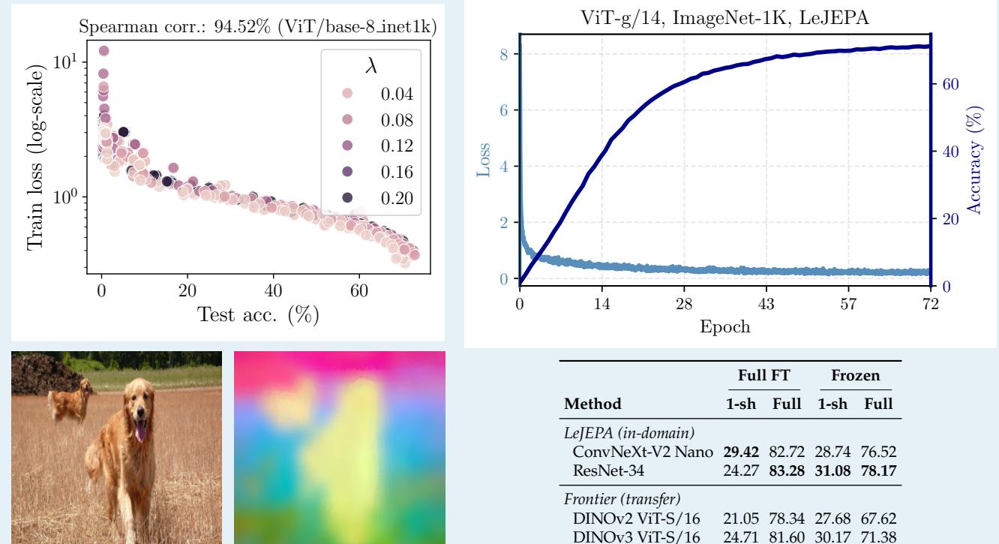

<span id="page-0-0"></span>**Figure 1. LeJEPA overview. Top-left:** Training loss exhibits strong correlation with downstream linear probe performance on ImageNet-1k (ViT-base), providing the first practical loss for model selection without supervised probing. **Top-right:** Training stability without heuristics even on 1.8B ViT-g models, stable training loss. **Bottom-left:** PCA features from ImageNet-1k pretrained LeJEPA ViT-Large demonstrate clear semantic relationships. **Bottom-right:** Galaxy10 in-domain results showcasing LeJEPA's in-domain pretraining consistently outperforms state-of-the-art frontier foundation models transfer learning (DINOv2/v3 trained on natural images) across data regimes from 1-shot to full supervision. This demonstrates that *domain-specific SSL beats generic transfer learning*, even against massive-scale frontier models, when the framework scales effortlessly to any domain, model, and data scale.

### <span id="page-1-0"></span>1 Introduction

Learning manipulable representations of the world and its dynamics is a long-standing question in AI, with roots dating back centuries ago [Von Helmholtz, 1867, Tolman, 1948, Gregory, 1980, Sutton, 1991, Friston, 2010]. Across domains, e.g., image recognition, robotics, physics, space exploration, the unifying question is how to learn an organized and actionable high-dimensional embedding space from observations? Using Deep Networks-parameterized nonlinear operators  $f_{\theta}$ -to map observations to embeddings is a standard first piece of that puzzle [LeCun et al., 2015, Goodfellow et al., 2016]. The second, less standardized, piece of that puzzle is how to train  $f_{\theta}$ . Joint-Embedding Predictive Architectures (JEPAs) suggest training  $f_{\theta}$  by maximizing predictive agreement between the embeddings of semantically related views [Bromley et al., 1993, LeCun, 2022, Balestriero et al., 2023]. Views can come in two forms: transformations or corruptions. They can involve masking, cropping, blurring, temporal or spatial translations, geometric or photometric transformations, viewpoint changes, views from different sensor modalities, etc. The supervised forms involve human-produced components such as image-caption pairs, text-code pairs, etc [Tian et al., 2020]. In any case, views are expected to share some degree of semantic relationship to allow the prediction task to align  $f_{\theta}$ 's embeddings towards the underlying knowledge present in the data.

Alas, JEPA's prediction task admits failure modes, such as representation collapse, where  $f_{\theta}$  maps all inputs to nearly identical embeddings (complete collapse) or to a lowdimensional subspace (dimensional collapse) [Jing et al., 2021][Jing et al., 2021, Cosentino et al., 2022, Balestriero and LeCun, 2022]. To mitigate such shortcut solutions, state-of-the-art recipes rely on heuristics-stop-gradient [Chen et al., 2020a], asymmetric view generation [Wang et al., 2022], teacher-student networks with carefully tuned EMA schedules [Caron et al., 2021, Tian et al., 2021], explicit normalization and whitening layers [Ermolov et al., 2021, Chen et al., 2021]—and a delicate balance of hyperparameters. As a result, today's JEPA training is brittle and most research has shifted toward scaling data [Vo et al., 2024], models [Fan et al., 2025] and even post-training Rodas et al. [2025] while leaving the theoretical foundations of JEPAs largely unexplored.

Our study proposes to break that cycle by questioning some of the fundamental design principles underpinning JEPAs. That introspection will start by asking what are the necessary conditions that JEPAs should abide by? Those minimal conditions will then act as axioms for us to design a novel and lean JEPA. We identify two axioms: (i) solving the prediction task while (ii) enforcing an isotropic Gaussian distribution of the embeddings

(Section 3). While (i) follows standard practice [Balestriero and LeCun, 2022], we introduce in Section 4 a novel distribution matching objective-Sketched Isotropic Gaussian Regularization (SIGReg)-to enforce (ii). The use of SIGReg not only removes the need for the numerous heuristics previously employed to prevent representation collapse, but SIGReg also exhibits favorable scaling properties as its memory and computational complexity is linear in dimension and sample size. Crucially, SIGReg's isotropic Gaussian enforcement solves the collapsed shortcut solution and provably minimizes the model's expected risk over the space of downstream tasks to be encountered post-training. The resulting JEPA solution–coined Latent-Euclidean JEPA (LeJEPA)-is introduced in Section 5. Beyond theoretical optimality, LeJEPA offers numerous benefits such as (i) provable statistical guarantees, (ii) removal of heuristics such as teacher-student networks, (iii) linear memory and computational complexity, and most importantly (iv) a unified design with a single trade-off parameter that works out of the box across datasets, architectures and scales (see Section 6). We summarize our contributions below.

Contribution 1: We prove the optimal embedding distribution for foundation models. We establish that the isotropic Gaussian uniquely minimizes downstream prediction risk across broad task families. In Section 3, we derive this result rigorously for both linear (Section 3.1) and nonlinear probes (Section 3.2), providing the first principled answer to what distribution  $f_{\theta}$ 's embeddings should follow. This theoretical result transforms JEPA design from heuristic exploration to targeted optimization. Contribution 2: We introduce SIGReg, a distribution matching objective that uniquely combines provable correctness with computational efficiency at scale. We present Sketched Isotropic Gaussian Regularization (SIGReg), a novel objective that enforces distributional alignment via random projections and characteristic-function matching (Section 4 and Figure 2). SIGReg provides statistical guarantees (Sections 4.1 and 4.2) while achieving linear complexity and bounded gradients—a combination that existing distribution matching methods do not offer. Critically, its projection-based construction defeats the curse of dimensionality (Section 4.3), making it both theoretically sound and practically efficient for high-dimensional embeddings.

Contribution 3: We design LeJEPA, a statistically optimal JEPA that eliminates collapse by construction. By combining JEPA's predictive objective with SIGReg targeting the isotropic Gaussian, we introduce *LeJEPA*—Latent-Euclidean JEPA (Section 5). LeJEPA requires only a single hyperparameter, eliminates representational collapse without stop-gradients or teacher-student architectures, and transfers across architectures and datasets without hyperparameter tuning. This demonstrates that principled

<span id="page-2-1"></span>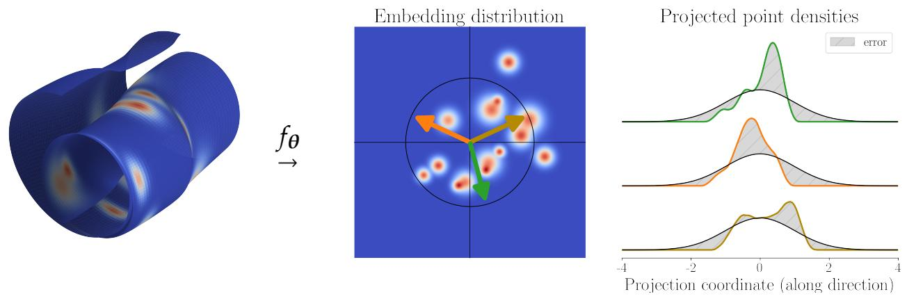

**Figure 2. Sketched Isotropic Gaussian Regularization (SIGReg):** Given some arbitrary input data with density  $p_x$  with support that may or may not lie on a manifold (**left**), a Deep network (DN) encoder ( $f_\theta$ ) produces embeddings  $z = f_\theta(x)$  with some distribution  $z \sim p_z$  (**middle**). Our proposed Backward Cramér-Wold Statistics (Section 4) objective pushes  $p_z$  to match a target distribution  $p_t$  by projecting the embeddings along 1d directions (**middle**, **arrows**) and enforcing that the univariate densities (**right**, **colored lines**) match the distribution of  $p_t$ , projected along the same directions. Any popular statistical test (provided in Section 4.2) can assess the goodness-of-fit-in practice we argue for characteristic function tests (Section 4.2). By using SIGReg with  $p_t$  isotropic Gaussian (**right**, **black lines**), we introduce a lean and provably optimal (Section 3) JEPA, coined LeJEPA, free of numerous heuristics and able to produce competitive performances (Sections 5 and 6).

theory directly yields practical simplicity.

Contribution 4: We validate LeJEPA at scale across diverse architectures and establish in-domain pretraining as viable. Our experiments (Section 6) span ViTs, ConvNeXts, ResNets, MaxViTs, and Swin Transformers at scales approaching 1 billion parameters, where LeJEPA matches or exceeds state-of-the-art methods while maintaining training simplicity and robustness. Critically, on domain-specific datasets (Galaxy10, Food101), LeJEPA outperforms DINOv2-based transfer learning when pretrained directly on target data. This challenges the transfer learning paradigm and demonstrates that principled SSL can unlock effective in-domain pretraining—previously considered impractical for small datasets.

### <span id="page-2-0"></span>2 Background and Notations

We start by introducing some of the notations we will be using throughout our manuscript (Section 2.1), followed by a review of JEPAs (Section 2.2), and existing literature studying their design (Section 2.3).

### <span id="page-2-2"></span>2.1 Notations and Definitions

**Data.** We are in possession of a dataset of shape  $(N, V, D) \in \mathbb{N}^{*3}$  where N is the number of samples, V is the number of views, and D is the dimension. One entry of this dataset is accessed via  $x_{n,v,d}$ . Those dimensions are often interpreted as follows: (**N**) is the number of independent samples, e.g., different images or different videos, (**V**) is the number of *views*, e.g., data-augmentations for images, frames for videos, and (**D**) is the dimension of each  $x_{n,v}$ , e.g., number of RGB pixels for images. In many cases the ordering over V is given by time-but in some cases, e.g., data-augmentation of an image, ordering becomes

irrelevant. Our study does not require any particular choice to organize one's dataset into a (N, V, D) tensorand none of our theory and implementation assumes a particular design decision for that tensor. However, we will rely on the following two properties, (independence) the samples  $x_n, x_{n'}$  have been obtained independently from each other  $\forall n \neq n'$ , and (identically distributed) the sampling process was identical among  $x_n, \forall n$ .

**Deep Networks.** Today's AI solutions rely on *Deep (Neural) Networks* (DNs), which are compositions of a large number of parameterized linear and nonlinear operators. We denote the DN's mapping as  $f_{\theta}: \mathbb{R}^D \to \mathbb{R}^K$  with K the dimension of the embedding space. The internals of  $f_{\theta}$  are designed by the researcher to incorporate as much prior knowledge about the data as possible. The details of  $f_{\theta}$  are irrelevant to our study—as we will see the proposed LeJEPA works out-of-the-box on any  $f_{\theta}$ . In any case, all the *learnable parameters* are gathered in the vector  $\theta \in \mathbb{R}^P$ , with P counting the total number of parameters. A central challenge in AI research is to design the right architecture and training objective so that  $\theta$  can be learned from gradient descent to ultimately produce a useful system, or foundation model,  $f_{\theta}$ .

**JEPAs.** A foundation model is any system, e.g., a DN, able to solve numerous downstream tasks without requiring any change in its internal parameters  $\theta$ . This is in sharp contrast with a supervised model that only considers its training task. JEPAs have formally been introduced by LeCun [2022] as a vehicle to produce foundation models. The core building blocks of JEPAs rely on numerous well-established techniques such as siamese networks [Bromley et al., 1993] and predictive coding [Helmholtz et al., 1867, Bruner and Postman, 1949]. While the exact blueprint of

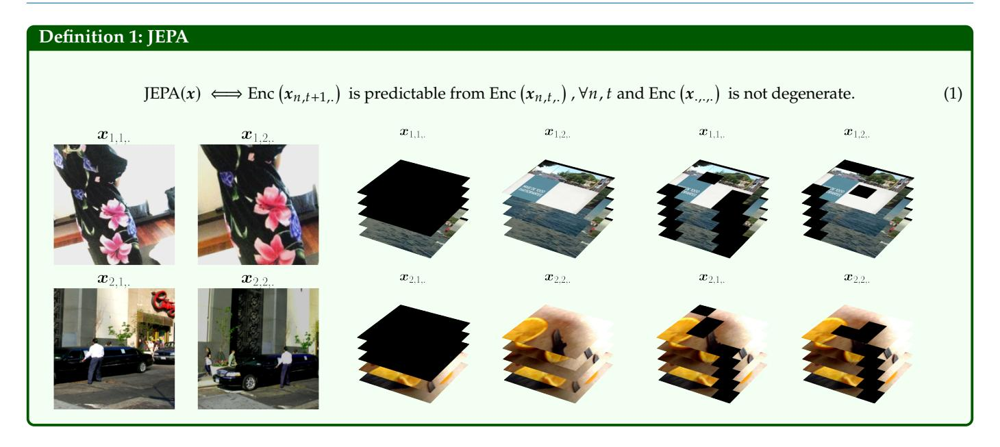

JEPAs varies greatly between use-cases, they all rely on two core principles: (i) being able to predict the embedding of a view  $x_{n,v}$  from the embedding of another view  $x_{n,v'}, v' \neq v$ , all while (ii) ensuring that the embeddings do not become degenerate. Concretely, once a JEPA is designed and trained, it should be able to solve numerous downstream tasks in zero or few shots. The JEPA objective function, along with some examples for x, is provided in Equation (1). The predictability criterion can be done by directly comparing the embeddings of the partial views  $Enc(x_{n,v_{i}})$  and  $Enc(x_{n,v_{i}})$  with a metric, e.g.,  $\ell_{p}$ . In some cases, an additional DN coined *Pred*, is employed to compare  $Pred(Enc(\mathbf{x}_{n,v_{\cdot}}))$  against  $Enc(\mathbf{x}_{n,v_{\cdot}})$ —which is only justified when there exists an asymmetry between the information content of the different views, e.g., by conditioning the predictions on observed actions from robotics data [Khazatsky et al., 2024].

### <span id="page-3-0"></span>2.2 The Need for Reliable Pretraining

The JEPA's prediction task is designed based on a priori knowledge of the data. Its design is often quite natural since it is relatively intuitive to form x so that its views share the relevant information content one hope to capture. On the other hand, the design of the "anti-collapse" criterion is much closer to a game of Whac-A-Mole. Today's designs rely on many different under-specified safeguards which are carefully combined in the hope that degenerate shortcut solutions are avoided during training. Such mechanisms include (i) feature whitening [Ermolov et al., 2021, Bardes et al., 2021], (ii) negative samples [Chen et al., 2020a, He et al., 2020], and (iii) asymmetric views and teacher-student networks with stop-gradient [Caron et al., 2021, Assran et al., 2023]. Those mechanisms all suffer from at least two of the following limitations: (i)

<span id="page-3-2"></span>under-specification, i.e., the criteria can be minimized while embeddings are in a degenerate configuration, (ii) quadratic time and memory complexity with mini-batch size and/or embedding dimension, (iii) sensitivity to data distribution, hyperparameters, architecture, and (iv) lack of theoretical understanding and guarantees.

### <span id="page-3-1"></span>2.3 The Need for Actionable Theory

For decades, the two major solutions for AI were supervised learning [LeCun et al., 2015] and learning by reconstruction [Rumelhart et al., 1986]-sometimes combined together, e.g., for semi-supervised learning [Kingma et al., 2014]. In supervised learning, the labels both ensure that semantically similar samples are close to each other in embedding space while preventing complete representation collapse. In particular, it is possible to measure the amount of collapse in supervised learning as a function of the number of classes [Papyan et al., 2020]. The reconstruction objective is similarly well suited to prevent representation collapse as the original input must be recovered from the embeddings, i.e., the embeddings must be as informative about the input as possible-up to some optional denoising tasks that users can setup as part of the training [Vincent et al., 2010].

Because supervised and reconstruction-based learning have been widely studied for decades, there exists a large body of work to explain and inform practical designs—as well as studying their limitations in producing foundation models [Balestriero and LeCun, 2024, Van Assel et al., 2025]. This is not the case for the more recent JEPAs where empirical advances quickly outpace anyone hoping to delve into their inner workings. This dynamic led the community to focus on post-hoc theoretical justification of already found solutions [Liu et al., 2021, Shwartz Ziv

and LeCun, 2024, Shwartz-Ziv et al., 2022, Zhang et al., 2023]. In most cases, those studies involve the *Mutual Information (MI)* [Shannon, 1948, Cover, 1999] whose different bounds recover established methods [Gutmann and Hyvärinen, 2010, Ma and Collins, 2018, Oord et al., 2018, Poole et al., 2019, Hjelm et al., 2018, McAllester and Stratos, 2020]. Because existing studies focus on explaining and interpreting already developed JEPAs, too little principled guidance and innovation has been brought forward. Instead, most of the recent empirical advances take the form of collecting larger dataset, scaling up pre-existing training recipes [Goyal et al., 2019, Chen et al., 2020b, Oquab et al., 2023, Fan et al., 2025], and deriving novel data curation processes [Vo et al., 2024, Kerdreux et al., 2025].

In contrast, our goal in the following Sections 3 to 5 will be to derive a novel JEPA solution from first principles, i.e., whose design relies on proved necessary conditions for optimality, and with a pretraining recipe that can finally reconcile exploratory research, scalability, and state-of-theart performances.

### <span id="page-4-0"></span>3 Latent Euclidean: Embeddings Should be Isotropic Gaussian

We address a fundamental question: which distribution should  $\operatorname{Enc}(x)$  follow to minimize empirical risk on any downstream task? We prove that the isotropic Gaussian is the unique optimal distribution for both linear (Section 3.1) and nonlinear probing (Section 3.2), with geometric intuition provided in Section 3.3. This theoretical result establishes the necessary design principle for our JEPA; Section 4 then provides the practical implementation to achieve it.

### <span id="page-4-1"></span>3.1 Linear Probing

We begin by identifying the optimal distribution for  $f_{\theta}$ 's embeddings by analyzing linear probes—one of the most popular methods for frozen encoder evaluation. Specifically, we ask: which distribution for  $f_{\theta}(x)$  would be most favorable for solving arbitrary downstream tasks, i.e., for any realization of targets y?

Denote as  $\mathbf{Z} \in \mathbb{R}^{\bar{N} \times K}$  the matrix of N embeddings, each K-dimensional, from  $f_{\theta}(x_n)$ . The *unknown* corresponding labels are denoted as  $\mathbf{y} \in \mathbb{R}^N$ . Without loss of generality, we consider univariate targets; the following analysis extends to multivariate targets. The linear probe minimizes the following least square problem [Bishop and Nasrabadi, 2006]

<span id="page-4-6"></span>
$$\hat{\beta} = \underset{\beta \in \mathbb{R}^K}{\text{arg min}} \| \boldsymbol{y} - \boldsymbol{Z}\beta \|_2^2 + \lambda \| \beta \|_2^2, \tag{OLS}$$

where  $\hat{\beta}$  is the optimal probe parameters, and  $\lambda \geq 0$  is an hyperparameter controlling the Tikhonov regularizer strength [Bishop, 1995, Golub et al., 1999]. Despite

not knowing y, it is possible to describe the bias and variance of the estimator  $\hat{\beta}$  as a function of the distribution of  $\mathbf{Z}$ . Consider two embeddings with identical column spans  $\mathbf{Z}_{\text{aniso}}$ ,  $\mathbf{Z}_{\text{iso}}$ .  $\mathbf{Z}_{\text{aniso}}$ 's covariance matrix eigenvalues are given by  $\{\lambda_k\}_{k=1}^K$  with at least two distinct values, while  $\mathbf{Z}_{\text{iso}}$ 's covariance matrix eigenvalues are all equal to  $\frac{1}{K}\sum_{k=1}^K \lambda_k$ . Hence, the two candidate embeddings  $\mathbf{Z}_{\text{aniso}}$ ,  $\mathbf{Z}_{\text{iso}}$  capture the same intrinsic features and have same energy, but different geometries.

#### <span id="page-4-4"></span>Lemma 1: Anisotropy amplifies bias

Whenever  $\lambda_K > \lambda_1$ , there always exists a downstream task (y) for which  $\mathbf{Z}_{\text{aniso}}$  produces a higher bias estimator than  $\mathbf{Z}_{\text{iso}}$  for  $\lambda > 0$ . (Proof in Section B.1.)

### <span id="page-4-5"></span>Lemma 2: Anisotropy amplifies variance

With  $\lambda = 0$ , the total variance of  $\hat{\beta}$  (OLS) is minimized for  $\mathbf{Z}_{iso}$  with  $tr(Var(\hat{\boldsymbol{\beta}}_{aniso})) > tr(Var(\hat{\boldsymbol{\beta}}_{iso}))$ . (Proof in Section B.2.)

From the above lemmas. 1 and 2 we obtain that the distribution of features must be isotropic. We now move to nonlinear probing where the standard Gaussian will emerge as the unique optimum.

### <span id="page-4-2"></span>3.2 Nonlinear Probing

To allow for more flexible evaluation of the pretrained encoder  $f_{\theta}$ , it has become increasingly common to work with a nonlinear probe. We analyze two widely-used nonlinear methods: radius-based k-NN [Taunk et al., 2019, Sun and Huang, 2010, Zhang et al., 2017, Abu Alfeilat et al., 2019] for its simplicity and kernel methods [Nadaraya, 1964, Watson, 1964] for their theoretical tractability.

As in Section 3.1, we ask ourselves which distribution of embeddings would be preferable for a foundation model. We first define our prediction function. The training data consists of the N embeddings along with their training labels  $\{(z_n, y_n)\}_{n=1}^N$ . The prediction, using radius-based k-NN for a query vector q is formed as

$$\widehat{y}(q) := \frac{1}{|\mathcal{N}_{r_0}(q)|} \sum_{n \in \mathcal{N}_{r_0}(q)} y_n, \quad (kNN)$$

where  $\mathcal{N}_{r_0}(q) = \{n : ||z_n - q|| \le r_0\}$ . The specific choice of radius  $r_0$  controls how many neighbors predictions are averaged to form the query's prediction. The kernel's prediction at a query  $q \in \mathbb{R}^K$  is given by

$$\widehat{y}(q) \triangleq \frac{\sum_{n=1}^{N} K_h(q-z_n) y_n}{\sum_{n=1}^{N} K_h(q-z_n)}.$$
 (Kernel)

<span id="page-4-3"></span>We search over all distributions of Z subject to a fixed total variance constraint, e.g.,  $Tr(Cov(Z)) = \kappa_1 \text{ or } ||Cov(Z)||_F = \kappa_2$ . The specific value of  $\kappa$  does not affect the optimal dis-

<span id="page-5-3"></span>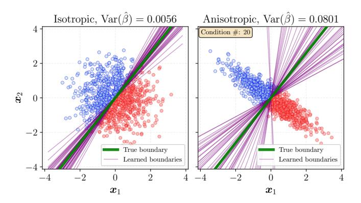

**Figure 3.** Illustration of lemma. 2 showcasing how anisotropic (**right**) embeddings lead to higher variance estimator compared to isotropic embeddings (**left**). We sample 100 training points for the 2-class classification task and fit a logistic regression–repeating the process over numerous training set sample. Each sampling results in a decision boundary (**purple**).

tribution shape. Following the same type of derivations as done in the linear regime—with the exception of some additional regularity conditions—we are able to precisely identify the isotropic Gaussian as the unique optimum to minimize bias as formalized below.

### Theorem 1: isotropic Gaussian Optimality

The integrated square bias (ISB) over query points is given by

ISB<sub>k-NN</sub> = 
$$\frac{r_0^4}{(K+2)^2} \tau_g^2 J(p) + O(r_0^4)$$
, (k-NN)

$$ISB_{kernel} \le \left(\frac{h^2 \mu_2(K)}{2}\right)^2 \left(2B^2 + 8L^2 J(p)\right) + o(h^4),$$
 (kernel)

and among distributions with a scalar-based covariance constraint, the isotropic Gaussian is the unique minimizer of the integrated square bias. (Proof in Sections B.4 and B.7.)

Numerous additional details and discussions on the regularity assumptions we employed are provided in Section A. Together, these results establish the isotropic Gaussian distribution as the optimal design to minimize the worst-case risk of a foundation model across downstream tasks.

### <span id="page-5-2"></span>3.3 Geometric and Practical Insights

We now empirically validate that the isotropic Gaussian is optimal when no information about downstream tasks is available. We focus on linear probing (Section 3.1), where all considered distributions have the same total variance.

When employing a linear probe, an anisotropic distribution increases both bias (with Tikhonov regularization) and variance. Examining bias first (lemma. 1), we present in Figure 18 visualizations for both continuous regression and discrete classification tasks. We observe that the cosine similarity between estimated and ground-truth

parameters equals 1 only for isotropic distributions, degrading for anisotropic cases regardless of sample size or regularization strength. Regarding variance (lemma. 2), we show in Figure 3 that learned parameters vary significantly more across training sets when the covariance is anisotropic (right) compared to isotropic (left)—even when using logistic regression instead of OLS. Figure 17 further illustrates this effect, showing the distribution of learned  $\beta$  parameters across different training samples for both cases. The anisotropic distribution clearly produces higher-variance estimators.

These theoretical and empirical results establish our design principle for LeJEPA: *embeddings*  $f_{\theta}(x)$  *should follow* an isotropic Gaussian distribution to minimize worst-case risk across downstream tasks encountered post-training. Section 4 introduces a novel regularizer to achieve this distribution.

# <span id="page-5-0"></span>4 SIGReg: Reliable Isotropic Gaussian Regularization in High-Dimension

Having established the isotropic Gaussian as the optimal embedding distribution (Section 3), we now introduce *Sketched Isotropic Gaussian Regularization* (SIGReg)–a distribution matching objective that is simultaneously (i) *differentiable*, (ii) *scalable*, (iii) *provable*, and (iv) *interpretable*. SIGReg builds on three key innovations. First, we formulate distribution matching as a statistical test under the null hypothesis  $P_{\theta} = Q$  (Section 4.1). Second, we identify a test that guarantees bounded gradients and curvature while maintaining linear complexity and efficient multi-GPU scaling (Section 4.2). Third, SIGReg bypasses the curse of dimensionality, eliminating collapsed shortcut solutions entirely (Section 4.3).

### <span id="page-5-1"></span>4.1 Hypothesis Testing as a Judge

Asking for  $f_{\theta}(x)$ 's distribution  $P_{\theta}$  to match a target distribution Q is typically done by creating various measures of distance or divergence, and estimating them in high-dimension. We propose a different starting point grounded in statistics. Consider the hypothesis testing framework [Fisher, 1928, Neyman and Pearson, 1933] given by

$$H_0: P_{\theta} = Q \quad \text{vs.} \quad H_1: P_{\theta} \neq Q,$$
 (2)

with  $H_0$  being referred to as the *null hypothesis*. That is, we are asking in Equation (2) if there is enough empirical evidence to reject the null. To answer that question, one (i) employs a *test-statistic*, i.e., a single scalar value summarizing the evidence from the empirical samples, (ii) determines a critical value  $\tau_{\alpha}$  for the test-statistic based on the probability  $\alpha$  of Type I error, i.e., of mistakenly rejecting a true null hypothesis, (iii) compares the test-statistic to

the critical value  $\tau_{\alpha}$ ; if the test-statistic exceeds  $\tau_{\alpha}$ , reject the null hypothesis. If the null is not rejected, we can only claim that there is not sufficient empirical evidence against  $P_{\theta} = Q$ .

As it stands, Equation (2) remains impractical in large dimension as existing tests have at least quadratic complexity with the number of samples considered (more details in Section F). We thus propose to derive a sketching strategy by decomposing Equation (2) into simpler univariate tests. Denoting the push-forward distributions  $P_{\theta}^{(a)} \triangleq (a^{\top})_{\#} P_{\theta}$  and  $Q^{(a)} \triangleq (a^{\top})_{\#} Q$ , we can define the following *directional* univariate test

$$H_0(a): P_{\theta}^{(a)} = Q^{(a)} \text{ vs. } H_1(a): P_{\theta}^{(a)} \neq Q^{(a)},$$
 (3)

for a given directional unit-norm vector  $\mathbf{a} \in \mathcal{S}^{K-1}$ . The corresponding *directional test-statistic* of Equation (3) is computed as  $T(\{\mathbf{a}^{\top}f_{\theta}(\mathbf{x}_n)\}_{n=1}^{N})$ . Examples of tests T will be provided in the later Section 4.2. Repeating that process over a set of M directions  $\mathbb{A} \triangleq \{a_1, \ldots, a_M\}$  and aggregating the individual values lead to the following *global test-statistic* 

$$T_{\mathbb{A}}(\{f_{\theta}(\mathbf{x}_n)\}_{n=1}^N) \triangleq \max_{\mathbf{a} \in \mathbb{A}} T(\{\mathbf{a}^{\top} f_{\theta}(\mathbf{x}_n)\}_{n=1}^N). \tag{4}$$

We now provide a formal statement asserting the consistency of Equation (4) to test the original multivariate null hypothesis from Equation (2). Our result leverages the well-known union-intersection principle [Roy, 1953], and a slightly modified Cramér-Wold theorem. We denote by  $\stackrel{d}{=}$  equality in distribution.

#### <span id="page-6-8"></span>Lemma 3: Hyperspherical Cramér-Wold

Let X, Y be  $\mathbb{R}^d$ -valued random vectors, then

$$\langle u, X \rangle \stackrel{d}{=} \langle u, Y \rangle, \forall u \in \mathbb{S}^{d-1} \iff X \stackrel{d}{=} Y.$$

Convergence in distribution also holds. (Proof in Section B.8.)

### <span id="page-6-3"></span>Theorem 2: Sufficiency of directional tests

Equation (4) is a valid statistical test for Equation (3) as

$$P = Q \implies \limsup_{n \to \infty} \Pr \left( T_{\mathbb{A}}(\{f_{\theta}(x_n)\}_{n=1}^N) \ge \tau_{\alpha} \right) \le \alpha$$
, (level)

$$P \neq Q \implies \limsup_{n \to \infty} \Pr \left( T_{\mathbb{A}}(\{f_{\theta}(x_n)\}_{n=1}^N) \ge \tau_{\alpha} \right) = 1, \text{ (power)}$$

(Proof in Section B.9.)

<span id="page-6-0"></span>The assumptions required in the proof of thm. 2 hold for classical consistent univariate tests T such as the ones presented in the following Section 4.2.

<span id="page-6-7"></span>

<span id="page-6-1"></span>**Figure 4.** Examples of distributions living on the surface of the sphere with varying Sobolev smoothness coefficients  $\alpha$ . As per thm. 5, the greater  $\alpha$  is, the more global will be the impact of SIGReg for a given number of directions M. Practically, this represents the distribution of the encoder's output. Because the target density (isotropic Gaussian) is smooth, the  $\alpha$  coeffcients of the embedding will quickly grow hereby making SIGReg (def. 2) immune to the curse of dimensionality.

# 4.2 SIGReg: Sketching the Epps-Pulley Test is Stable and Scalable

<span id="page-6-2"></span>Our proposed regularizer–coined Sketched Isotropic Gaussian Regularization (SIGReg)–follows directly from thm. 2 using any statistical test *T* targeted towards the isotropic Gaussian, illustrated in Figures 2 and 5, and formalized below.

### <span id="page-6-4"></span>Definition 2: SIGReg (PyTorch code in algorithm 1)

SIGReg sketches a statistical test *T* towards isotropic Gaussian

<span id="page-6-5"></span>
$$SIGReg_{T}(\mathbb{A}, \{f_{\theta}(x_{n})\}_{n=1}^{N}) \triangleq \frac{1}{|\mathbb{A}|} \sum_{a \in \mathbb{A}} T(\{a^{\top}f_{\theta}(x_{n})\}_{n=1}^{N}),$$
(SIGReg)

where we recommend the Epps-Pulley test (Section 4.2.3) for T.

We replace the maximum over  $a \in \mathbb{A}$  in thm. 2 by an average in (SIGReg) to avoid sparse gradient over the directions in  $\mathbb{A}$ . We now delve on the choice of T for which we compare well-known candidate tests in the field of statistics that are categorized into (i) moment based (Section 4.2.1), (ii) CDF based (Section 4.2.2), and (iii) CF based (Section 4.2.3) statistics—ultimately justifying our choice of the Epps-Pulley statistic.

### <span id="page-6-6"></span>4.2.1 Moments are Unstable and Insufficient

The first family of statistics we consider are moment-based. Taking the standard Gaussian as an instanciation for the moments, we can define the Jarque-Bera [Jarque and Bera, 1980] test that compares the third and fourth moments,

<span id="page-7-0"></span>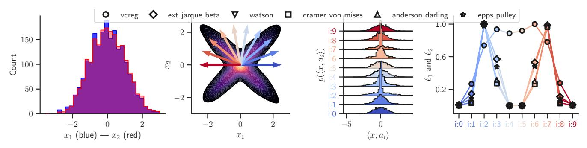

**Figure 5.** Constructed data density with "X" distribution whose marginals are standard Gaussian and whose covariance is identity (**left densities**). Applying M = 10 projections on the half circle directions produces 10 univariate distributions that can be compared against a standard Gaussian (**left**) using any preferred statistic from Section 4.2. The appropriate direction is able to capture the degenerate distribution of the data hereby creating a spike in the statistic value.

i.e., skewness and kurtosis, as

$$JB(u) \triangleq \frac{N}{6} \left( \widehat{\text{skew}}(u)^2 + \left( \frac{\widehat{\text{kurt}}(u) - 3}{2} \right)^2 \right), \quad \text{(Jarque-Bera)}$$

where skew is the skewness computed from the data as  $\frac{1}{n} \sum_{i=1}^{n} (x_i - \hat{\mu})^3$  and kurt is the kurtosis  $\frac{1}{n} \sum_{i=1}^{n} (x_i - \hat{\mu})^4$ . Typically, the (Jarque-Bera) test is used to see if a density follows a Gaussian distribution of any mean and variance—hence it only looks at moments 3 and 4. In our case we aim for a standard Gaussian test and thus add the usual statistics on the first two moments, leading to the extended test

$$EJB(u) \triangleq \frac{N\hat{\mu}(u)^2}{\hat{\sigma}(u)^2} + \frac{(N-1)\left(\hat{\sigma}(u)^2 - 1\right)^2}{2} + JB(u).$$
(Extended Jarque-Bera)

The (Extended Jarque-Bera) acts as a moment matching problem over the first four moments. Such moment matching methods have proven powerful not only for statistical tests but also as mean to learn parametric and nonparametric models of data.

The Stability and Identifiability Conundrum. We now explain why moment-based tests—albeit powerful—will not be suited for LeJEPA. The  $k^{th}$  of a distribution P is denoted as  $m_k(P)$ . The first observation is that well-behaved distributions abiding the Carleman's condition  $\sum_{k=1}^{\infty} m_{2k}(Q)^{-1/(2k)} = \infty$  [Carleman, 1926], such as the Gaussian, or for distributions with finite interval [Hausdorff, 1923] are uniquely determined by their moments. However, using a finite number of moments creates the following non-identifiability issue which well-known in statistics and often used as a motivation to use all moments [Lehmann and Romano, 2005].

### <span id="page-7-4"></span>Theorem 3: Insufficiency of K Moments

<span id="page-7-2"></span>Minimizing the following objective with  $c_k > 0$ ,  $\forall k$ 

$$\sum_{k=1}^{K} c_k \left( m_k \left( P_{\theta}^{(a)} \right) - m_k \left( Q^{(a)} \right) \right)^2,$$

for finite *K* does not imply  $P_{\theta}^{(a)} = Q^{(a)}$ . (Proof in Section B.11.)

Hence thm. 3 prescribes us with the guideline to employ as large K as possible to remove collapsed shortcut solution by making sure our distribution matching is accurate. Yet, doing so leads to unstable gradient-based training due to the gradient norm scaling as O(k), and the variance of Monte Carlo gradient estimates growing as  $O(k^2m_{2(k-1)})$  for the k-th moment since  $\|\nabla_{\theta}m_k(P_{\theta}^{(a)})\| = \|\mathbb{E}\left[k(a^{\mathsf{T}}f_{\theta}(x))^{k-1}a^{\mathsf{T}}J_{f_{\theta}}(x)\right]\|$ , with  $J_{f_{\theta}}(x) \in \mathbb{R}^{K \times P}$  the Jacobian matrix–hereby creating an impractical situation where training stability and identifiability can not be achieved simultaneously.

### <span id="page-7-3"></span><span id="page-7-1"></span>4.2.2 Cumulative Density Functions are Impractical

The second family of tests acts upon the CDF. Because those tests require sorting, let's denote the  $k^{\rm th}$  order-statistics of N samples by  $x_{k:N}$ . Two highly standard tests are quadratic Empirical Density Function statistics with different weighting known as Cramér-von Mises [Cramér, 1928, Von Mises, 1981] and Anderson Darling [Anderson and Darling, 1952], and given by

<span id="page-7-5"></span>
$$T_w = N \int_{-\infty}^{\infty} (F_N(x) - F(x))^2 w(x) dF(x)$$

$$w(x) = 1,$$
 (Cramér-von Mises)
$$w(x) = [F(x)(1 - F(x))]^{-1},$$
 (Anderson-Darling)

where w(x) is a weighting function. Adding the  $U^2$  statistics on top of Equation (Cramér-von Mises) recovers the

<span id="page-8-2"></span>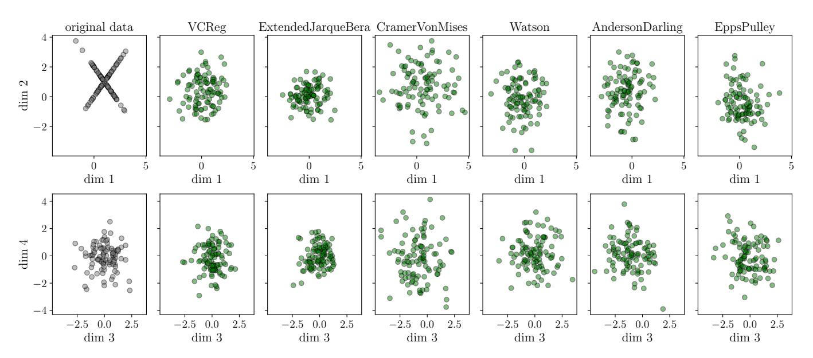

**Figure 6.** N = 100 samples are drawn from a 1024-dimensional standard Gaussian, and the first 2 coordinates are altered to produce the "X" distribution from Figure 5 (**left-most column**). For each statistic (**all other columns**), we perform gradient descent on the samples to minimize their value, at each iteration step with sample M = 10 random directions to evaluate SIGReg (recall def. 2). We obtain that albeit this is a high-dimensional distribution with limited number of samples, SIGReg is able to capture the degenerate subspace and adapt the data accordingly to match an isotropic Gaussian distribution. Additional figures with varying dimensions and number of 1d projections are provided in Figure 16.

Watson test [Watson, 1961]

<span id="page-8-3"></span>
$$U^2 = T_w - N\left(\bar{F} - \frac{1}{2}\right)^2.$$
 (Watson)

We do not consider the Kolmogorov-Smirnov test [Kolmogorov, 1933] as it employs the  $\ell_{\infty}$ -norm instead of the  $\ell_2$ -norm hereby producing sparse gradients. Another common test is the Shapiro-Wilk test [Shapiro and Wilk, 1965] which we found to be unstable in practice–details are provided in Section E.

<span id="page-8-0"></span>Lack of Scalability and Differentiability. CDF-based tests require sorting that have been highly optimized, e.g., with the  $O(N \log(N))$  Quicksort algorithm [Hoare, 1962] but that nonetheless breaks the embarrassingly parallel nature of SGD–especially on multi-GPU [Tanasic et al., 2013, Maltenberger et al., 2022] due to synchronization requirements. Moreover, these tests involve non-differentiable operations (sorting and order statistics), making them unsuitable for gradient-based optimization without relaxations [Cuturi et al., 2019, Grover et al., 2019, Petersen et al., 2022]. While there exists intricate sketching solutions [Dunning and Ertl, 2019, Masson et al., 2019, Dunning, 2021], each of those solutions introduce numerous additional hyper-parameters—going against our first motivation for LeJEPA.

# 4.2.3 Characteristic Functions are Stable, Scalable and Identifiable

The third family of tests is concerned with Empirical Characteristic Functions (ECF) which are the Fourier transform of the density function. The Epps–Pulley test [Epps and Pulley, 1983] is one of the most popular test and simply compares in weighted  $\ell_2$ -norm the ECF of the data against a target CF

<span id="page-8-1"></span>
$$EP = N \int_{-\infty}^{\infty} |\hat{\phi}_X(t) - \phi(t)|^2 w(t) dt.$$
 (Epps-Pulley)

The first crucial observation is that the ECF being defined as  $\hat{\phi}_X(t) = \frac{1}{n} \sum_{j=1}^n e^{itX_j}$  is naturally differentiable and easily computed in distributed settings via efficient all\_reduce operations, as the ECF is a simple average of complex exponentials. The weight function is typically Gaussian, such as  $w(t) = e^{-t^2/\sigma^2}$  with  $\sigma$  commonly set to 1.

Other tests, e.g., based on the Entropy [Székely and Rizzo, 2005] are not considered here as they require numerous additional design choices for the univariate Entropy estimation [Silverman, 2018, Beirlant et al., 1997], e.g., using kernels [Joe, 1989], or M-estimators [Miller, 2003].

**Epps-Pulley has bounded loss, gradient and curvature.** We now consider the remaining two families of tests: moment-based and CF-based. First, recall that moments are polynomial in the data and with extreme growth rate

<span id="page-9-1"></span>**Algorithm 1.** SIGReg with Epps-Pulley statistic with DDP support and O(N) time and memory complexity. x is a (N, K) tensor, num\_slices is  $|\mathbb{A}|$  in def. 2, 'global\_step' is used for sync. sampling across GPUs and can be omitted for single-GPU training. An optimized implementation with caching is also provided in our official codebase, computation times provided in Table 6.

```
def SIGReg(x, global_step, num_slices=256):
    # slice sampling -- synced across devices
    dev = dict(device=x.device)
    g = torch.Generator(**dev)
    g.manual_seed(global_step)
    proj_shape = (x.size(1), num_slices)
    A = torch.randn(proj_shape, generator=g, **dev)
    A /= A.norm(p=2, dim=0)
     -- Epps-Pulley stat. see Sec. 4.3 for alt. -
    # integration points
    t = torch.linspace(-5, 5, 17, **dev)
    # theoretical CF for N(0, 1) and Gauss. window
    exp_f = torch.exp(-0.5 * t**2)
    # empirical CF -- gathered across devices
    x_t = (x @ A) . unsqueeze(2) * t # (N, M, T)
    ecf = (1i * x t).exp().mean(0)
    ecf = all_reduce(ecf, op="AVG")
    # weighted L2 distance
    err = (ecf - exp_f).abs().square().mul(exp_f)
    N = x. size(0) * world_size
    T = torch.trapz(err, t, dim=1) * N
    return T
```

for higher moment–assuming they even exist. Even for well-behaved distributions, raising values to a power of k can quickly lead to exploding gradients. This comes in sharp contrast with the ECF which is always bounded and with bounded gradients for any input distribution for the projected samples  $z_i = a^T f_\theta(x_n)$ , n = 1, ..., N.

### <span id="page-9-2"></span>Theorem 4: Stability of Epps-Pulley Test

(Epps–Pulley) satisfies for samples  $z_1, \ldots, z_N$ 

$$\left| \frac{\partial EP(\mathbf{a})}{\partial z_i} \right| \leq \frac{4\sigma^2}{N}, \quad \left| \frac{\partial^2 EP(\mathbf{a})}{\partial z_i^2} \right| \leq \frac{C\sqrt{\pi}\sigma^3}{2N},$$

with constant C, and bandwidth  $\sigma$ . (Proof in Section B.12.)

By the chain rule, thm. 4 directly gives  $\|\nabla_{\theta} EP(\mathbf{a})\| \leq \frac{4\sigma^2}{N} \sum_{i=1}^N \|\mathbf{a}^\top \nabla_{\theta} f_{\theta}(\mathbf{x}_i)\|$ , providing stable gradients. The limitations of moment-based and CDF-based tests coupled with thm. 4 justifies our choice of the (Epps–Pulley): (i) DDP-friendly and scalable, (ii) uniformly bounded gradients and curvature regardless of input distribution, and (iii) hyper-parameter free implementation. Lastly, we highlight that our implementation has a linear memory and computational complexity of O(N), with N the minibatch size. The implementation of SIGReg using that statistical test is provided in algorithm 1, along with computation times of the forward-backward pass in Table 6.

As a last step before introducing LeJEPA, we ought to

<span id="page-9-3"></span>

**Figure 7.** Expected directional statistic at the end of training (**y-axis**) for varying *M* (number of directions used at each training step, **x-axis**). The *M* directions are either resampled (**green**) or kept fixed (**blue**) at each training step. While for fixed directions we benefit from thm. 5 bound where increasing *M* reduces the overall expected loss, being able to resample at every step provides significant coverage boost for free.

study the requirements on the number of directions ( $|\mathbb{A}|$ ) for (2) to be effective in high-dimension.

# <span id="page-9-0"></span>4.3 How SIGReg Beats the Curse of Dimensionality

This last section seeks to characterize how many slices in A one must sample for (SIGReg) to be an effective statistical test. That design is crucial if we hope for LeJEPA to successfully converge towards isotropic Gaussian embeddings.

#### **Smoothness Beats the Curse of Dimensionality**

Our first argument arguing for a favorable scaling of  $|\mathbb{A}|$  with the embedding dimension K relies on the smoothness of  $P_{\theta}$  as measured by its Sobolev regularity  $\alpha$  [Adams and Fournier, 2003]. We formalize below a bound on the directional test from Equation (3) over all possible directions a when the test statistic is minimized over  $|\mathbb{A}| = M$  directions. While we provide bounds on the expected discrepancy over random directions a when the EP test is satisfied (equals zero) on a finite set of directions, the provided proof includes the case of moment-based and CDF-based tests as well.

#### <span id="page-10-1"></span>**Theorem 5: Unified Error Bounds**

Let  $p_{\theta} \in H^{\alpha}(\mathbb{R}^{K})$ ,  $a \sim \mathcal{U}(S^{K-1})$ , and (Epps–Pulley)= 0, i.e.,  $P_{\theta}^{(\mathbf{a})} = Q^{(\mathbf{a})}$ ,  $\forall a \in \mathbb{A}$ , then

$$\begin{split} \mathbb{E}_{a}\left[\int_{\mathbb{R}}\left|\varphi_{a}(t)-\varphi_{N}(t)\right|^{2}dt\right] &\leq C(K,\alpha)|\mathbb{A}|^{-2\alpha/(K-1)}\\ &\times \int_{0}^{\infty}\left\|\varphi.(r)-\varphi_{N}(r)\right\|_{H^{\alpha}(\mathcal{S}^{K-1})}^{2}dr, \end{split}$$

(Proof in Section B.10.)

As  $|\mathbb{A}| \to \infty$ , the bound decays as  $|\mathbb{A}|^{-2\alpha/(K-1)}$ , showing that  $|\mathbb{A}| = O(K)$  directions suffice for  $\epsilon$ -approximation when  $\alpha$  is large. Some examples of embedding densities with varying  $\alpha$  are provided in Figure 4. The following statement characterizes how the M directions actually constrain the entire space as a function of  $\alpha$ . The constant  $C(K,\alpha) = \frac{2^{2\alpha}\pi^{(K-1)/2}\Gamma(\alpha+\frac{K-1}{2})}{(K-1)\Gamma(\alpha)\Gamma(\frac{K-1}{2})}$  is visualized in Figure 15 (left) depicting how  $\alpha$  and  $|\mathbb{A}|$  interact. In words, we obtain that thanks to the natural smoothness of DN–either stemming from the architecture or the implicit and explicit regularizers used during training–applying SIGReg on  $|\mathbb{A}|$  directions can be sufficient to tightly constrain the entire space. We note that considering the worst case over  $\alpha$  or using low-discrepancy sequences for  $\alpha$  does not impact the asymptotic bounds, details provided in Section D.

#### **SGD Beats the Curse of Dimensionality**

Our second argument leverages the iterative nature of DN training. Although we may use only  $|\mathbb{A}|$  to be a few hundreds, the cumulative number of sampled directions grows linearly with training time. This resampling effect (illustrated in Figure 7, bottom) enables rapid convergence. Even small  $|\mathbb{A}|$  achieves tight distributional matching compared to keeping the set  $\mathbb{A}$  fixed throughout minibatches (recall thm. 5). Our experiments show that even with  $|\mathbb{A}|$  as low as 16 can easily outperform a fixed set with  $|\mathbb{A}|$  of order of thousands thanks to the compounding effect of resampling at each minibatch.

#### **Empirical Validation on Synthetic Data**

We conclude this section with a controlled experiment applying (SIGReg) with gradient-based training to produce isotropic embeddings. In this setup, we directly consider embeddings  $\mathbf{Z}$  which we will differentiate and optimized to minimize (SIGReg). By directly optimizing the embeddings we are able to observe the impact of the loss without any possible constraint and regularization that would come from the architecture. We sample N i.i.d. samples  $x_n$  in a D-dimensional space. This sampling is based on an isotropic Gaussian distribution—but the first

<span id="page-10-3"></span>**Algorithm 2.** LeJEPA implementation—works out-of-the-box on any dataset, with DDP, with any backbone, e.g., torchvision or timm. For non-ViT architectures (e.g., ResNet), set global\_views = all\_views. We use bs for the minibatch size, SIGReg is from algorithm 1.

```
def LeJEPA(global_views, all_views, lambd):
    """global_views and all_views are lists of
    tensors, lambd is a scalar"""

# embedding of global views
g_emb = forward(torch.cat(glob_views))
# embedding of local views
# if resnet: skip with a_emb=g_emb
a_emb = forward(torch.cat(all_views))

# LeJEPA loss
centers = g_emb.view(-1, bs, K).mean(0)
a_emb = a_emb.view(-1, bs, K)\nsim = (centers - a_emb).square().mean()
sigreg = mean(SIGReg(emb, global_step) for emb
    in a_emb)
return (1-lambd)*sim + lambd*sigreg
```

two dimensions are again set to the adversarial "X" shape. That is, among the D dimensions, only two must be transformed as all the other ones already obey the isotropic Gaussian target distribution. We then make the samples  $x_n$  differentiable and optimize then to minimize the value of the different statistical tests compute on M random M random directions. Those directions are resampled after each gradient step—which follows the procedure we will employ in LeJEPA. We present the results in Figure 6 demonstrating that even in challenging case, i.e., D = 512 and M = 16, SIGReg is able to detect the two degenerate dimensions and unfold them back to how they should look like under the target distribution.

### <span id="page-10-0"></span>5 LeJEPA: Stable and Scalable Implementation

Having established that isotropic Gaussians are the optimal embedding distribution for foundation models (Section 3) and introduced SIGReg to achieve this distribution (def. 2), we now present the complete LeJEPA framework. We first evaluate candidate statistical tests (Sections 4.2.1 and 4.2.2) and identify characteristic function-based tests as optimal for gradient-based training (Section 4.2.3). The full LeJEPA implementation follows in Section 5.1.

### <span id="page-10-2"></span>5.1 LeJEPA: SIGReg + Prediction Loss

We now discuss the implementation of LeJEPA starting with SIGReg and followed by the prediction and total losses.

The SIGReg Loss. We chose (Epps–Pulley) for its provable boundedness (thm. 4) and its scalability. Its implementation follows exactly the equation except for the integrate which is estimated using a quadrature approximation. We

find that the simple trapezoidal quadrature rule is sufficient even with as few knots as 17, as ablated in Figure 20. In particular, we leverage the symmetry of the integrand to double the number of knots for free, see the official code. On the other hand, the use of minibatches introduces a bias vanishing at rate O(1/N), as formalized below.

#### <span id="page-11-3"></span>Theorem 6: Vanishing gradient bias

The expectation of (Epps-Pulley) satisfies

$$\mathbb{E}\left[\widehat{L}_n(\theta)\right] = L(\theta) + \frac{1}{N} \int_{\mathbb{D}} w_s(t) \left(1 - |\varphi_P(t)|^2\right) dt,$$

therefore both the loss and its derivative have a bias of order O(1/n). (Proof in Section B.13.)

Hence, the gradients we obtain from using (Epps–Pulley) are biased by an explicit O(1/N) term. We found this bias to be minimal and not a concern even for minibatches as small as 16. Unbiased alternatives include using U-statistic debiasing of  $|\phi_{\theta}|^2$  or sample splitting, which we do not explore in this study. Our final implementation of the SIGReg term with Epps-Pulley statistic is provided in algorithm 1.

**The Prediction Loss.** To standardize notations, we adopt the DINO [Caron et al., 2021] setup of generating  $V_g$  global views and  $V_l$  local views, leading to a total of  $V = V_g + V_l$  views. We set the first  $1, \ldots, V_g$  indices of each  $z_{n,v}$  as the global views. For the cases without local views, simply set  $V_l = 0$ . The prediction loss is then given by having all views predict the global views as

$$\mathcal{L}_{\text{pred}}(\{z_{n,v}\}_{v=1}^{V}) = \frac{1}{V_g} \sum_{v=1}^{V_g} \frac{1}{V} \sum_{v'=1}^{V} \|z_{n,v} - z_{n,v'}\|_2^2$$
 (5)

$$= \frac{1}{V} \sum_{v'=1}^{V} \left\| \frac{1}{V_g} \sum_{v=1}^{V_g} z_{n,v} - z_{n,v'} \right\|_{2}^{2}$$
 (6)

$$\triangleq \frac{1}{V} \sum_{v'=1}^{V} \| \boldsymbol{\mu}_n - \boldsymbol{z}_{n,v'} \|_2^2, \tag{7}$$

where we denote  $\mu_n \triangleq \frac{1}{V_g} \sum_{v=1}^{V_g} z_{n,v}$ , the Equation (5) to Equation (6) derivations are detailed in Section B.6.

**LeJEPA Loss.** The final total loss simply combines the above prediction loss along with SIGReg on each views as per

$$\mathcal{L}_{\text{LeJEPA}}(\{x_{n,v}\}_{n,v=1}^{B,V}) = \frac{\lambda}{V} \sum_{v=1}^{V} \text{SIGReg}(\{\{z_{n,v}\}_{n=1}^{B}\}) + \frac{1-\lambda}{B} \sum_{n=1}^{B} \mathcal{L}_{\text{pred}}^{(V_g)}(\{z_{n,v}\}_{v=1}^{V}). \quad \text{(LeJEPA)}$$

We present (LeJEPA)'s implementation in algorithm 2. Altogether, the entire implementation–besides the usual model definitions, optimizers, and data loaders–only takes a few dozens lines in PyTorch (algorithms 1 and 2). The absence of prototypes, stop-gradients, and teacher-student networks makes (LeJEPA) appealing as it only contains one hyperparameter,  $\lambda$ , balancing the trade-off between the prediction and isotropic Gaussian terms.

### 5.2 Relation to Prior Work

Prior to presenting our experiments (Section 6), we conclude by discussing how our proposed LeJEPA and SIGReg objective relate to existing frameworks in the literature.

While there is no existing solution employing such slicing and distribution matching for JEPAs, there exists similar pipelines for generative models and optimal transport. Notably, the Sliced Score Matching [Song et al., 2020] proposes to leverage univariate slicing of the space to ease the estimation of a density for generative models. In a similar vein, the sliced Wasserstein distance [Bonneel et al., 2015, Nguyen and Ho, 2023] uses such strategy to speed up and improve optimal transport. Furthermore, when the integral of the (Epps-Pulley) test is computed exactly, as opposed to our quadrature, each slice loss value recovers the kernel MMD [Sriperumbudur et al., 2010, Gretton et al., 2012, Chwialkowski et al., 2016] measuring the distance between two distributions-albeit with a quadratic complexity. Lastly, it is possible to recover some existing SSL frameworks in the limit by employing LeJEPA with a particular test-instead of the preferred (Epps-Pulley). For example, Setting  $T(\lbrace x_n \rbrace_{n=1}^B) = \text{mean}(\lbrace x_n \rbrace_{n=1}^B)^2 + (\text{std}(\lbrace x_n \rbrace_{n=1}^B) - 1)^2$ and using that T with SIGReg in LeJEPA recovers the VICReg SSL method in the limit of large number of slices. In fact, SIGReg will enforce in expectation that  $\mathbb{E}[\mathbf{Z}] = \mathbf{0}$ and  $Cov(\mathbf{Z}) = \mathbf{I}_d$ , where  $\mathbf{I}_d$  denotes the  $d \times d$  identity matrix-derivations provided in Section B.14. And since our invariance term is simply the  $\ell_2$  distance between the views' embeddings, LeJEPA recovers VICReg for this degenerate statistical test. Based on thm. 3, we however strongly advocate against such a setting as it would lead to shortcut solutions—a phenomenon already observed in VICReg.

### <span id="page-11-1"></span><span id="page-11-0"></span>6 LeJEPA: Empirical Validation

<span id="page-11-2"></span>We now use the LeJEPA implementation described in Section 5.1 to demonstrate its effectiveness through comprehensive experiments. We show that LeJEPA: (i) trains reliably across diverse architectures and datasets (Section 6.1), (ii) provides an informative training loss for model selection (Section 6.2), (iii) outperforms frontier vision models on small-scale in-domain pretraining (Section 6.3), (iv) scales successfully to nearly 1 billion parameters on ImageNet-1k (Section 6.4), and (v) learns rich

<span id="page-12-1"></span>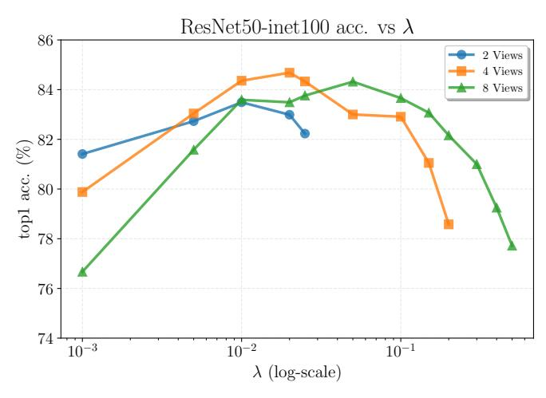

**Figure 8.** Inet100 with 400 pretraining epochs and resnet50 backbone. We depict linear probe performances as a function of  $\lambda$  and the number of views V (recall (LeJEPA)). We observe that performances are stable over  $\lambda$ -with **peak performance obtain by slightly adjust**  $\lambda$  **proportionally to the number of views**. The corresponding performance values are provided in Table 7.

semantic segmentation features without explicit supervision.

# <span id="page-12-0"></span>6.1 LeJEPA's Stability Across Hyper-Parameters and Architectures

We now demonstrate LeJEPA's stability across hyperparameters, architectures, and experimental setups. Additional cross-domain stability results are presented in Section 6.3.

Stability across standard hyperparameters. We begin by evaluating LeJEPA on ImageNet-100 and ImageNet-1K. On ImageNet-100, we train a ResNet-50 and vary the number of views and the loss weighting  $\lambda$  (Figure 8). Performance remains stable across both dimensions, leading us to recommend  $\lambda = 0.05$  as a robust default. On ImageNet-1K, we train a ViT-Large/14 and explore batch size, as well as the number of global ( $V_g$ ) and local ( $V_l$ ) views (Table 1b). We find that the configuration commonly used in prior work ( $V_g = 2$ ,  $V_l = 8$ ) transfers well to LeJEPA. Notably, LeJEPA achieves competitive performance with batch sizes as small as 128 on ImageNet-1K (Table 1c), suggesting reduced memory requirements compared to existing methods. We thus recommend to use  $\lambda = 0.05$ ,  $V_g = 2$ ,  $V_l = 8$ , and batch size  $\geq 128$  as starting points.

Stability across Epps-Pulley hyperparameters. We next examine hyperparameters specific to LeJEPA: the number of slices  $|\mathcal{A}|$  in SIGReg, the integration domain for the Epps-Pulley test (Epps-Pulley), and the number of quadrature points for numerical integration. Table 1a shows ablations on ImageNet-1K with ViT-Large/14. Both the integration domain and number of quadrature points have negligible impact on performance. This is expected: since the characteristic function is accurate at zero, the

<span id="page-12-2"></span>**Table 1.** ViT/Large-14, on inet1k pretraining for 100 epochs and evaluated with frozen backbone linear probing (top1 accuracy, %).**LeJEPA's performance is stable across all its hyperparameters** and while some may slightly improve performance, e.g., the number of slices |A| and the projector sizes, none of the choices lead to a catastrophic collapse.

| (a          | (a) (Epps–Pulley) parameters |                       |       |       |  |  |  |  |  |  |  |
|-------------|------------------------------|-----------------------|-------|-------|--|--|--|--|--|--|--|
| integration | num_slices                   | config/bstat_n_points |       |       |  |  |  |  |  |  |  |
|             |                              | 5                     | 17    | 41    |  |  |  |  |  |  |  |
| [-1,1]      | 512                          | 71.82                 | 72.13 | 72.04 |  |  |  |  |  |  |  |
|             | 2048                         | 72.88                 | 72.30 | 72.69 |  |  |  |  |  |  |  |
| [-3, 3]     | 512                          | 73.95                 | 74.16 | 74.04 |  |  |  |  |  |  |  |
|             | 2048                         | 75.02                 | 74.68 | 74.77 |  |  |  |  |  |  |  |
| [-5, 5]     | 512                          | 73.71                 | 74.21 | 74.15 |  |  |  |  |  |  |  |
|             | 2048                         | 74.50                 | 74.80 | 74.77 |  |  |  |  |  |  |  |

| (b) Number of lo                                        | (b) Number of local/global views |       |       |  |  |  |  |  |  |  |  |  |
|---------------------------------------------------------|----------------------------------|-------|-------|--|--|--|--|--|--|--|--|--|
| # global_views ( $V_g$ )<br># views ( $V = V_g + V_l$ ) | 1                                | 2     | 4     |  |  |  |  |  |  |  |  |  |
| 4                                                       | 53.06                            | 72.26 | _     |  |  |  |  |  |  |  |  |  |
| 6                                                       | 58.65                            | 73.07 | 73.68 |  |  |  |  |  |  |  |  |  |
| 8                                                       | 64.46                            | 74.24 | 73.94 |  |  |  |  |  |  |  |  |  |
| 10                                                      | 68.97                            | 74.06 | 75.08 |  |  |  |  |  |  |  |  |  |

| (c) Mini-batch size |        |        |       |        |  |  |  |  |  |
|---------------------|--------|--------|-------|--------|--|--|--|--|--|
| batch size          | 128    | 256    | 512   | 1024   |  |  |  |  |  |
| buten_5ize          | 120    | 200    | 012   | 1021   |  |  |  |  |  |
|                     |        |        |       |        |  |  |  |  |  |
|                     | 72.20  | 74.15  | 74.72 | 74.07  |  |  |  |  |  |
|                     | . =.=0 | , 1,10 | =     | . 1.0. |  |  |  |  |  |

| (d) Embedding/Projector dim. |       |       |       |       |  |  |  |  |  |  |
|------------------------------|-------|-------|-------|-------|--|--|--|--|--|--|
| num_slices                   | 10    | 24    | 40    | 96    |  |  |  |  |  |  |
| emb. dim.                    | 512   | 2048  | 512   | 2048  |  |  |  |  |  |  |
| proj. dim.                   |       |       |       |       |  |  |  |  |  |  |
| 64                           | 75.29 | 75.32 | 75.50 | 75.65 |  |  |  |  |  |  |
| 128                          | 74.77 | 75.09 | 75.26 | 75.47 |  |  |  |  |  |  |
| 256                          | 74.56 | 74.66 | 75.08 | 75.02 |  |  |  |  |  |  |
| 512                          | 73.94 | 74.11 | 74.81 | 74.65 |  |  |  |  |  |  |
| 1024                         | 73.65 | 73.94 | 74.71 | 74.79 |  |  |  |  |  |  |

|                          | (e) Register tokens |   |                |   |   |  |  |  |  |  |  |
|--------------------------|---------------------|---|----------------|---|---|--|--|--|--|--|--|
| reg_tokens<br>num_slices | 0                   | 1 | 2              | 4 | 8 |  |  |  |  |  |  |
| 1024<br>4096             |                     |   | 75.08<br>75.67 |   |   |  |  |  |  |  |  |

moments of the distribution are well-characterized even with a modest integration range. The number of slices  $|\mathcal{A}|$  has a modest effect—while more slices slightly improve performance, even 512 slices yield competitive results. We thus recommend to use 17 integration points, an integration domain of [-5,5], and 1024 slices as starting points.

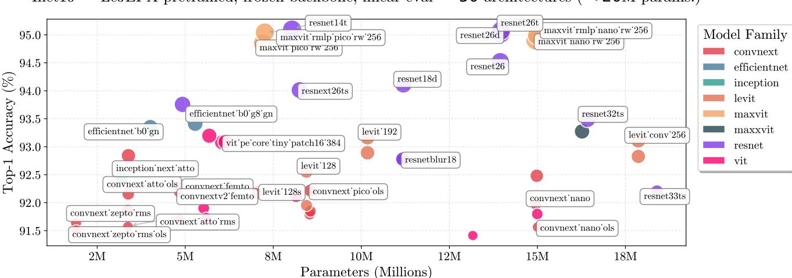

Inet10 — LeJEPA pretrained, frozen backbone, linear eval — 50 architectures (< 20M params.)

**Figure 9.** INet10 pretraining and frozen backbone linear evaluation across 50 timm models using LeJEPA out of the box. We cross-validate the learning rate and weight-decay. While there is a small variation between the best and worst performing model, we clearly see that **across** 50 **models spanning** 8 **families**, **LeJEPA** is able to produce non-trivial representations able to solve the downstream task at SOTA levels.

Stability across architectures. A key advantage of LeJEPA over recent methods (e.g., IJEPA, DINOv2) is its architecture-agnostic design. While most modern selfsupervised methods are tailored to Vision Transformers, LeJEPA works across diverse architecture families without modification. To validate this claim, we pretrain approximately 50 architectures from 8 different families on ImageNet-10, selecting all models in the timm library with fewer than 20M parameters. All models are able to learn high-quality representations reaching between 91.5% to 95% top 1 accuracy with frozen backbone linear probing. It seems that models performing well in supervised learning setups are also the ones to favor for LeJEPA, such as resnets and ViTs. We thus recommend to use standard architectures such as ResNets and ViTs over specialized models like EfficientNet as stating point.

**Removal of popular heuristics.** In addition to providing reliable performance across models and datasets, LeJEPA's provable construction enables us to remove many heuristics traditionally used to prevent collapse. First, prior work has shown both empirically and theoretically that predictors in image JEPA (without asymmetric information) and teacher-student architectures serve primarily to prevent collapse [Grill et al., 2020, Jing et al., 2021, Tian et al., 2021, Caron et al., 2021, Chen et al., 2021]. Removing these components produces collapsed encoders, i.e., with performances at chance-level. Thanks to LeJEPA's SIGReg loss, we can remove both the predictor and teacher-student architecture without suffering from collapse, as shown in Table 4. While a teacher-student configuration does provide a small performance boost for ViT models—consistent with observations in supervised learning via Stochastic

Weight Averaging [Izmailov et al., 2019]—it is not necessary to prevent collapse. In our setup, we apply SWA on the encoder producing  $\mu$  in Equation (6). Second, recent work demonstrated that register tokens are needed to prevent training instabilities in vision models [Oquab et al., 2023, Siméoni et al., 2025, Darcet et al., 2023]. We show in Table 1 that such instabilities likely stem from poorly conditioned training objectives. In contrast, LeJEPA *does not* require register tokens and achieves stable performance with or without them. We thus recommend training without a predictor or register tokens, and optionally applying SWA with ViTs for a possible performance gain.

#### **Experiment Details 1**

We strive for **simplicity** and thus adopt a unified pretraining pipeline. The following parameters apply to *all* experiments and figures unless stated otherwise in the corresponding caption and come from Section 6.1:

- LeJEPA's implementation is given in algorithm 2 with hyperparameter  $\lambda$
- All backbones are from timm and all optimizers/schedulers are from PyTorch without modifications
- We employ eight views (V = 8) containing two global views ( $V_g = 2$ ) with resolution 224x224 and 96x96 for the local views
- AdamW optimizer with  $lr \in \{5e-3, 5e-4\}$  and  $wd \in \{1e-1, 1e-2, 1e-5\}$ —no scheduler on weight-decay, standard linear warm-up cosine-annealing for lr

# <span id="page-13-0"></span>6.2 LeJEPA's Training Loss is Informative of Downstream Performance

A major challenge in SSL pretraining is the lack of reliable signals conveying the quality of the learned representation. As a result, it is common to monitor a supervised

<span id="page-14-2"></span>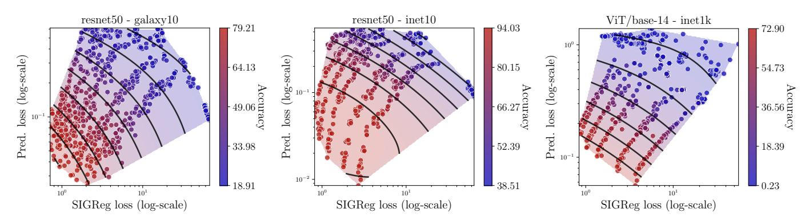

**Figure 10.** (SIGReg, prediction loss) 2d-plane with downstream task accuracy shown with colors from **blue** (low) to **red** (high). We clearly observe that within this plane, **there exists trade-off fronts between the two terms of LeJEPA producing similar downstream performance** corresponding to different values of  $\lambda$ . Yet, those fronts are linear and pointed towards the lower left corner, i.e., LeJEPA's training loss informs of downstream test performance across models and datasets (**columns**). Additional models and datasets provided in Figure 21.

<span id="page-14-3"></span>

**Figure 11.** Spearman correlation (**y-axis**) between LeJEPA's training loss and downstream accuracy on the dataset's classification task with a frozen backbone and linear evaluation. The **x-axis** varies  $\alpha$  in Equation (8) following our scaling law of the loss w.r.t.  $\lambda$ . Using  $\alpha = 0$  recovers the plain training loss. We clearly observe a very high correlation already for  $\alpha = 0$ , which further increases up to 99% for  $\alpha = 0.4$ . The entire set of points is obtained across numerous hyper-parameters such as learning rate, weight decay, number of epochs,  $\lambda$ -demonstrating how LeJEPA's training loss is strongly predictive of downstream performance which can be used for label-free cross-validation.

downstream task performance, sometimes supplemented with unsupervised embedding statistics [Agrawal et al., 2022, Garrido et al., 2023, Thilak et al., 2023]. This process is highly limiting since it requires labeled data that is costly and overly specialized. This is further exacerbated in the latest JEPA models where training losses exhibit low correlation with downstream performance—and may not even decrease monotonically during training.

In contrast, we find that LeJEPA's training loss behaves much more favorably–providing us with a meaningful signal on model quality. First, we provide in Figure 10, the 2D plane spanned by the SIGReg and prediction losses where a clear trend with downstream task accuracy can be observed. More strikingly, the combined training loss (LeJEPA) with mixing coefficient  $\lambda$  exhibits very high Spearman correlation [Spearman, 1961], denoted as  $\rho_s$ , of about 85% with downstream accuracy—which is considered a strong signal. This strong relationship holds across datasets and architectures. As a result, a lower LeJEPA training loss reliably indicates a better downstream performance.

We can further improve this correlation through a simple scaling law based upon the trade-off weighting hyperparameter  $\boldsymbol{\lambda}$ 

<span id="page-14-1"></span>
$$C^{(\alpha)} = \rho_s \left( \frac{\text{train\_loss}}{\lambda^{\alpha}}, \text{test\_accuracy} \right).$$
 (8)

By setting  $\alpha \approx 0.4$ , LeJEPA's training loss is able to achieve nearly 99% correlation with downstream performance across multiple datasets and models. We depict the changes in  $C^{(\alpha)}$  as a function of  $\alpha$  on multiple datasets and models in Figure 11, as well as the training LeJEPA loss against downstream performance in Figure 19. The strong alignment between LeJEPA's training loss and model quality enables label-free SSL model selection and cross-validation.

### <span id="page-14-0"></span>6.3 In-Domain LeJEPA Outperforms Frontier Model Transfer Learning

A key promise of self-supervised learning is to learn universal representations that generalize across tasks and domains. However, current frontier foundation models (e.g., DINOv2/v3, IJEPA) are pretrained on natural images forcing practitioners in specialized domains to collect large amount of labels for supervised finetuning. In fact, most frontier models can not be trained directly on those domains as the number of samples may be small and searching again for the hyper-parameters would be cum-

<span id="page-15-0"></span>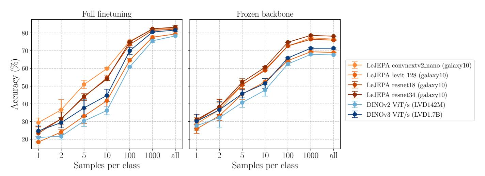

**Figure 12. Small architecture in-domain (Galaxy10) LeJEPA pretraining** with linear probe evaluation using frozen backbone or full finetuning (**columns**) and with varying number of samples per class (**x-axis**). We compare against state-of-the-art foundation models (DINOv2/v3, IJEPA) over 3 different random seeds. We observe that **LeJEPA enables in-domain pretraining out of the box across architectures and able to outperform frontier foundation models**. Corresponding numbers are provided in Table 3.

<span id="page-15-1"></span>Table 2. Few-shot classification accuracy (percentages) on 8 datasets spanning textures, objects, and fine-grained categories. Our LeJEPA achieves superior performance on fine-grained tasks (DTD, flowers102, food101) while requiring only 100 pretraining epochs compared to I-JEPA's 300 epochs—a 3× reduction in training time and computational resources without sacrificing downstream task performance. This efficiency gain is particularly valuable for practical applications where training budget is limited. Bold indicates best performance within the IN-1K comparison group, all numbers are percentages.

|       |                     |        |          |        |       |        |       |         | Datase | ot         |       |       |       |
|-------|---------------------|--------|----------|--------|-------|--------|-------|---------|--------|------------|-------|-------|-------|
| shots | model               | params | pretrain | epochs | DTD   | aircr. | cars  | cifar10 |        | flowers102 | food  | pets  | avg.  |
| -     | LeJEPA ViT-L        | 304M   | IN-1K    | 100    | 33.21 | 9.37   | 3.40  | 51.65   | 27.01  | 48.53      | 17.14 | 46.11 |       |
|       | LeJEPA ConvNeXtV2-H | 660M   | IN-1K    | 100    | 32.15 | 8.07   | 4.28  | 50.95   | 31.48  | 48.74      | 17.95 | 58.98 | 31.58 |
| 1     | I-JEPA ViT-H        | 632M   | IN-1K    | 300    | 27.71 | 9.86   | 4.33  | 56.52   | 30.58  | 44.69      | 14.53 | 53.38 | 30.20 |
|       | I-JEPA ViT-H + STOP | 632M   | IN-1K    | 300    | 26.60 | 11.18  | 4.75  | 56.27   | 35.20  | 47.17      | 15.75 | 59.47 | 32.05 |
|       | I-JEPA ViT-H (22K)  | 632M   | IN-22K   | 900    | 27.98 | 13.00  | 3.45  | 61.84   | 34.70  | 89.72      | 19.62 | 30.86 | 35.15 |
|       | LeJEPA ViT-L        | 304M   | IN-1K    | 100    | 64.72 | 35.25  | 22.25 | 85.15   | 59.77  | 92.53      | 50.90 | 77.00 | 60.95 |
|       | LeJEPA ConvNeXtV2-H | 660M   | IN-1K    | 100    | 61.84 | 30.67  | 24.46 | 85.74   | 63.29  | 91.78      | 49.32 | 78.53 | 60.70 |
| 10    | I-JEPA ViT-H        | 632M   | IN-1K    | 300    | 57.68 | 33.82  | 21.96 | 88.77   | 66.42  | 88.24      | 43.97 | 83.23 | 60.51 |
|       | I-JEPA ViT-H + STOP | 632M   | IN-1K    | 300    | 57.00 | 39.77  | 25.21 | 90.09   | 70.32  | 90.16      | 45.68 | 85.13 | 62.92 |
|       | I-JEPA ViT-H (22K)  | 632M   | IN-22K   | 900    | 58.74 | 43.52  | 18.27 | 94.83   | 75.23  | 98.94      | 49.06 | 67.66 | 63.28 |
|       | LeJEPA ViT-L        | 304M   | IN-1K    | 100    | 78.30 | 57.01  | 57.28 | 96.50   | 83.71  | 91.21      | 82.05 | 89.74 | 79.48 |
|       | LeJEPA ConvNeXtV2-H | 660M   | IN-1K    | 100    | 76.60 | 52.99  | 54.88 | 96.15   | 81.34  | 91.11      | 77.64 | 89.76 | 77.56 |
| all   | I-JEPA ViT-H        | 632M   | IN-1K    | 300    | 73.32 | 56.61  | 54.47 | 97.54   | 86.42  | 86.47      | 81.02 | 92.11 | 78.50 |
|       | I-JEPA ViT-H + STOP | 632M   | IN-1K    | 300    | 73.87 | 61.95  | 61.27 | 98.02   | 87.78  | 88.08      | 81.72 | 92.88 | 80.70 |
|       | I-JEPA ViT-H (22K)  | 632M   | IN-22K   | 900    | 75.67 | 65.39  | 49.79 | 98.46   | 89.95  | 98.54      | 81.58 | 87.19 | 80.82 |

<span id="page-15-2"></span>

**Figure 13.** Emergent Object Segmentation via Last Layer Thresholding. LeJEPA naturally learns to segment and track salient objects (shown in attention maps on the right of each video) without explicit supervision. The results display impressive visual quality and strong temporal consistency across video frames (*videos provided on our project page*). This emergent capability demonstrates the rich semantic representations learned through our self-supervised approach.

<span id="page-16-1"></span>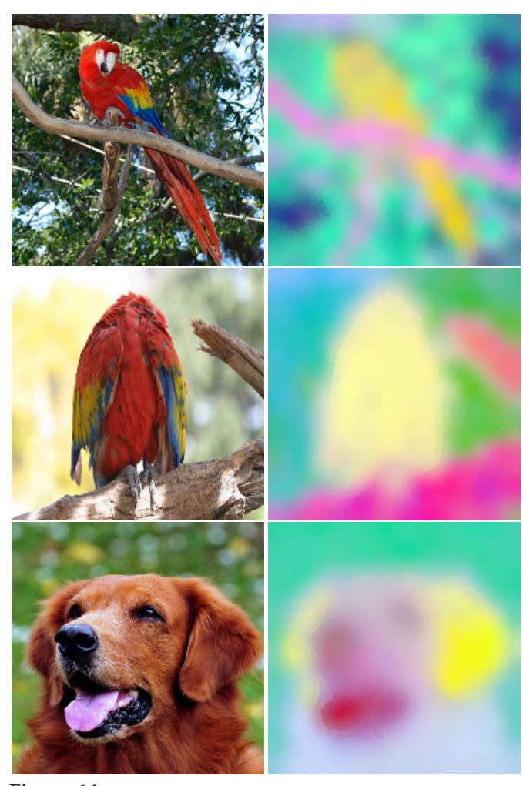

**Figure 14. LeJEPA learns rich semantic representations through self-supervised learning.** PCA visualization of last-layer features from LeJEPA (ViT-Large, 100 epochs on ImageNet-1K). For each image, features are independently projected to RGB using the first 3 principal components. Without any supervision, LeJEPA spontaneously develops semantically meaningful representations: notice how warm colors (red/ magenta/pink) consistently capture foreground objects (parrot bodies, dog face), while cool colors (cyan/green/yellow) represent backgrounds and foliage. This emergent object-background separation and perceptual grouping discovered the visual structure of the world purely from unlabeled data.

bersome yet necessary [\[Assran et al., 2022\]](#page-17-9).

To demonstrate LeJEPA's versatility and ability to resolve that current pain-point, we propose to pretrain directly on a new domain without any change in the loss or the pretraining pipeline. We select the Galaxy10 dataset, a galaxy morphology classification task that differs significantly from natural images in both visual structure and statistical properties [\[Balestriero et al., 2025\]](#page-17-10). The dataset contains 11,000 training samples across 10 galaxy types. For LeJEPA, we use the default hyper-parameters and pretrain for 400 epochs a variety of backbones. We compare against the latest DINOv2, DINOv3 and IJEPA. We report in Figure [12](#page-15-0) the top1 accuracy for linear probing both with frozen backbone and full-finetuning. We observe that **in-domain pretraining with LeJEPA substantially outperforms state-of-the-art frontier models (DINOv2, DINOv3) on both linear probing and full finetuning**. Additional datasets and backbones are provided in Table [5](#page-42-3) depicting LeJEPA's ability to train in-domain, even with a dataset with 1000 samples (flowers102). Coupling this result with the stability of LeJEPA across architectures and hyper-parameters should offer a promising alternatives in domains not yet accounted for by the latest frontier models.

### <span id="page-16-0"></span>**6.4 LeJEPA Scales Across Data and Models**

We now propose to apply LeJEPA over a larger pretraining dataset, i.e., Imagenet-1k, and over larger backbones such as ViT/Large (0.3B), ConvNextV2-Huge (0.6B). For those two models, we reach an online linear probe accuracy on inet1k of 77.1% and 78.5% respectively. Beyond in-distribution performances, we also explore transfer learning. For those experiments, our baselines are IJEPA with a ViT-Huge (0.6B) which is the closest to our setup, and we also include a recent improved version of IJEPA including additional stochastic prediction tasks [\[Bar et al.,](#page-17-11) [2023\]](#page-17-11) that is coined IJEPA + STOP. For LeJEPA, we employ the same recipe as described in Section [6.1](#page-12-0) and report transfer learning performances with frozen backbone in Table [2.](#page-15-1) We observe that we consistently outperform IJEPA while employed a smaller model and shorted training schedule. Beyond top1 accuracy, we also echo our findings from Section [6.2](#page-13-0) about LeJEPA's training loss quality. In our setup, we observe a very stable and smooth training curve indicating a stable optimization landscape removing the need for careful hyperparameter selection (recall thm. [4\)](#page-9-2). We provide an example on a ViT-gigantic (1.8B parameters) in Figure [1.](#page-0-0)

### **6.5 Emergent Semantic Structure in LeJEPA Representations**

A hallmark of successful self-supervised learning is the emergence of semantically meaningful attention patterns without explicit supervision [\[Caron et al., 2021\]](#page-18-3). To assess whether LeJEPA learns such structure, we visualize the attention maps of the learned representations. Following DINO [\[Caron et al., 2021\]](#page-18-3), we apply PCA to the embeddings and visualize the first principal components, which reveal clear correspondence to object boundaries and salient regions (Figure [14\)](#page-16-1). Furthermore, we explore whether these attention patterns can enable unsupervised video segmentation—a challenging task requiring temporal consistency and object understanding. By thresholding the self-attention maps of the [CLS] token, we obtain binary masks that track objects across frames without any segmentation labels during training. As shown in Figure [13,](#page-15-2) **LeJEPA's attention naturally segments foreground objects from background with remarkable temporal coherence**, suggesting that the learned representations capture both spatial semantics and temporal structure. This emergent capability demonstrates that LeJEPA's stabilityfocused objective does not sacrifice the semantic richness of learned features.

### **7 Conclusion**

We have established a principled theoretical framework for JEPA-based self-supervised learning that fundamentally resolves its core pathologies. Our contributions span theory and practice: we proved that isotropic Gaussian embeddings uniquely minimize worst-case downstream risk, introduced SIGReg as a tractable and provably correct method to enforce this distribution, and demonstrated that this approach eliminates representational collapse by design–and not through ad-hoc combinations of teacherstudent networks, stop-gradients, or asymmetric architectures.

We validate LeJEPA across domains and over 60 architectures including gigantic versions with 1.8B parameters. In spite of its simplicify , LeJEPA matches state-of-the-art performance while requiring fewer than 50 lines of core implementation. Critically, our approach provides what SSL has long needed: a mathematically rigorous foundation that directly informs practical algorithm design.

### **Acknowledgments**

We would like to thank Mike Rabbat and Lucas Maes for providing valuable feedbacks on the manuscript.

### **References**

<span id="page-17-5"></span>Haneen Arafat Abu Alfeilat, Ahmad BA Hassanat, Omar Lasassmeh, Ahmad S Tarawneh, Mahmoud Bashir Alhasanat, Hamzeh S Eyal Salman, and VB Surya Prasath. Effects of distance measure choice on k-nearest neighbor classifier performance: a review. *Big data*, 7(4):221–248, 2019.

- <span id="page-17-7"></span>Robert A Adams and John JF Fournier. *Sobolev spaces*, volume 140. Elsevier, 2003.
- <span id="page-17-8"></span>Kumar K Agrawal, Arnab Kumar Mondal, Arna Ghosh, and Blake Richards. a-req: Assessing representation quality in self-supervised learning by measuring eigenspectrum decay. *Advances in Neural Information Processing Systems*, 35:17626–17638, 2022.
- <span id="page-17-6"></span>Theodore W Anderson and Donald A Darling. Asymptotic theory of certain" goodness of fit" criteria based on stochastic processes. *The annals of mathematical statistics*, pages 193–212, 1952.
- <span id="page-17-9"></span>Mahmoud Assran, Randall Balestriero, Quentin Duval, Florian Bordes, Ishan Misra, Piotr Bojanowski, Pascal Vincent, Michael Rabbat, and Nicolas Ballas. The hidden uniform cluster prior in self-supervised learning. *arXiv preprint arXiv:2210.07277*, 2022.
- <span id="page-17-3"></span>Mahmoud Assran, Quentin Duval, Ishan Misra, Piotr Bojanowski, Pascal Vincent, Michael Rabbat, Yann LeCun, and Nicolas Ballas. Self-supervised learning from images with a joint-embedding predictive architecture. In *Proceedings of the IEEE/CVF Conference on Computer Vision and Pattern Recognition*, pages 15619–15629, 2023.
- <span id="page-17-1"></span>Randall Balestriero and Yann LeCun. Contrastive and noncontrastive self-supervised learning recover global and local spectral embedding methods. *Advances in Neural Information Processing Systems*, 35:26671–26685, 2022.
- <span id="page-17-4"></span>Randall Balestriero and Yann LeCun. Learning by reconstruction produces uninformative features for perception. *arXiv preprint arXiv:2402.11337*, 2024.
- <span id="page-17-0"></span>Randall Balestriero, Mark Ibrahim, Vlad Sobal, Ari Morcos, Shashank Shekhar, Tom Goldstein, Florian Bordes, Adrien Bardes, Gregoire Mialon, Yuandong Tian, et al. A cookbook of self-supervised learning. *arXiv preprint arXiv:2304.12210*, 2023.
- <span id="page-17-10"></span>Randall Balestriero, Nicolas Ballas, Mike Rabbat, and Yann LeCun. Gaussian embeddings: How jepas secretly learn your data density. *arXiv preprint arXiv:2510.05949*, 2025.
- <span id="page-17-11"></span>Amir Bar, Florian Bordes, Assaf Shocher, Mahmoud Assran, Pascal Vincent, Nicolas Ballas, Trevor Darrell, Amir Globerson, and Yann LeCun. Stochastic positional embeddings improve masked image modeling. *arXiv preprint arXiv:2308.00566*, 2023.
- <span id="page-17-2"></span>Adrien Bardes, Jean Ponce, and Yann LeCun. Vicreg: Variance-invariance-covariance regularization for selfsupervised learning. *arXiv preprint arXiv:2105.04906*, 2021.

- <span id="page-18-18"></span>Jan Beirlant, Edward J Dudewicz, László Györfi, Edward C Van der Meulen, et al. Nonparametric entropy estimation: An overview. *International Journal of Mathematical and Statistical Sciences*, 6(1):17–39, 1997.
- <span id="page-18-11"></span>Chris M Bishop. Training with noise is equivalent to tikhonov regularization. *Neural computation*, 7(1):108– 116, 1995.
- <span id="page-18-10"></span>Christopher M Bishop and Nasser M Nasrabadi. *Pattern recognition and machine learning*, volume 4. Springer, 2006.
- <span id="page-18-26"></span>Gunnar Blom. *Statistical estimates and transformed betavariables*. PhD thesis, Almqvist & Wiksell, 1958.
- <span id="page-18-19"></span>Nicolas Bonneel, Julien Rabin, Gabriel Peyré, and Hanspeter Pfister. Sliced and radon wasserstein barycenters of measures. *Journal of Mathematical Imaging and Vision*, 51(1):22–45, 2015.
- <span id="page-18-0"></span>Jane Bromley, Isabelle Guyon, Yann LeCun, Eduard Säckinger, and Roopak Shah. Signature verification using a" siamese" time delay neural network. *Advances in neural information processing systems*, 6, 1993.
- <span id="page-18-7"></span>Jerome S Bruner and Leo Postman. On the perception of incongruity: A paradigm. *Journal of personality*, 18(2): 206–223, 1949.
- <span id="page-18-24"></span>Russel E Caflisch. Monte carlo and quasi-monte carlo methods. *Acta numerica*, 7:1–49, 1998.
- <span id="page-18-12"></span>Torsten Carleman. *Les Fonctions quasi analytiques: leçons professées au College de France*. Gauthier-Villars, 1926.
- <span id="page-18-3"></span>Mathilde Caron, Hugo Touvron, Ishan Misra, Hervé Jégou, Julien Mairal, Piotr Bojanowski, and Armand Joulin. Emerging properties in self-supervised vision transformers. In *Proceedings of the IEEE/CVF international conference on computer vision*, pages 9650–9660, 2021.
- <span id="page-18-2"></span>Ting Chen, Simon Kornblith, Mohammad Norouzi, and Geoffrey Hinton. A simple framework for contrastive learning of visual representations. In *International conference on machine learning*, pages 1597–1607. PmLR, 2020a.
- <span id="page-18-9"></span>Ting Chen, Simon Kornblith, Kevin Swersky, Mohammad Norouzi, and Geoffrey E Hinton. Big self-supervised models are strong semi-supervised learners. *Advances in neural information processing systems*, 33:22243–22255, 2020b.
- <span id="page-18-5"></span>Xinlei Chen, Saining Xie, and Kaiming He. An empirical study of training self-supervised vision transformers. In *Proceedings of the IEEE/CVF international conference on computer vision*, pages 9640–9649, 2021.

- <span id="page-18-20"></span>Kacper Chwialkowski, Heiko Strathmann, and Arthur Gretton. A kernel test of goodness of fit. In *International conference on machine learning*, pages 2606–2615. PMLR, 2016.
- <span id="page-18-1"></span>Romain Cosentino, Anirvan Sengupta, Salman Avestimehr, Mahdi Soltanolkotabi, Antonio Ortega, Ted Willke, and Mariano Tepper. Toward a geometrical understanding of self-supervised contrastive learning. *arXiv preprint arXiv:2205.06926*, 2022.
- <span id="page-18-8"></span>Thomas M Cover. *Elements of information theory*. John Wiley & Sons, 1999.
- <span id="page-18-13"></span>Harald Cramér. On the composition of elementary errors: First paper: Mathematical deductions. *Scandinavian Actuarial Journal*, 1928(1):13–74, 1928.
- <span id="page-18-22"></span>Harald Cramér and Herman Wold. Some theorems on distribution functions. *Journal of the London Mathematical Society*, 1(4):290–294, 1936.
- <span id="page-18-14"></span>Marco Cuturi, Olivier Teboul, and Jean-Philippe Vert. Differentiable ranking and sorting using optimal transport. *Advances in neural information processing systems*, 32, 2019.
- <span id="page-18-21"></span>Timothée Darcet, Maxime Oquab, Julien Mairal, and Piotr Bojanowski. Vision transformers need registers. *arXiv preprint arXiv:2309.16588*, 2023.
- <span id="page-18-23"></span>Josef Dick and Friedrich Pillichshammer. *Digital nets and sequences: discrepancy theory and quasi–Monte Carlo integration*. Cambridge University Press, 2010.
- <span id="page-18-16"></span>Ted Dunning. The t-digest: Efficient estimates of distributions. *Software Impacts*, 7:100049, 2021.
- <span id="page-18-15"></span>Ted Dunning and Otmar Ertl. Computing extremely accurate quantiles using t-digests. *arXiv preprint arXiv:1902.04023*, 2019.
- <span id="page-18-25"></span>Gustav Elfving. The asymptotical distribution of range in samples from a normal population. *Biometrika*, 34(1/2): 111–119, 1947.
- <span id="page-18-17"></span>Thomas W Epps and Lawrence B Pulley. A test for normality based on the empirical characteristic function. *Biometrika*, 70(3):723–726, 1983.
- <span id="page-18-4"></span>Aleksandr Ermolov, Aliaksandr Siarohin, Enver Sangineto, and Nicu Sebe. Whitening for self-supervised representation learning. In *International conference on machine learning*, pages 3015–3024. PMLR, 2021.
- <span id="page-18-6"></span>David Fan, Shengbang Tong, Jiachen Zhu, Koustuv Sinha, Zhuang Liu, Xinlei Chen, Michael Rabbat, Nicolas Ballas, Yann LeCun, Amir Bar, et al. Scaling language-free visual representation learning. *arXiv preprint arXiv:2504.01017*, 2025.

- <span id="page-19-12"></span>Ronald Aylmer Fisher. *Statistical methods for research workers*. Number 5. Oliver and Boyd, 1928.
- <span id="page-19-1"></span>Karl Friston. The free-energy principle: a unified brain theory? *Nature reviews neuroscience*, 11(2):127–138, 2010.
- <span id="page-19-21"></span>Quentin Garrido, Randall Balestriero, Laurent Najman, and Yann Lecun. Rankme: Assessing the downstream performance of pretrained self-supervised representations by their rank. In *International conference on machine learning*, pages 10929–10974. PMLR, 2023.
- <span id="page-19-11"></span>Gene H Golub, Per Christian Hansen, and Dianne P O'Leary. Tikhonov regularization and total least squares. *SIAM journal on matrix analysis and applications*, 21(1): 185–194, 1999.
- <span id="page-19-2"></span>Ian Goodfellow, Yoshua Bengio, Aaron Courville, and Yoshua Bengio. *Deep learning*, volume 1. MIT press Cambridge, 2016.
- <span id="page-19-9"></span>Priya Goyal, Dhruv Mahajan, Abhinav Gupta, and Ishan Misra. Scaling and benchmarking self-supervised visual representation learning. In *Proceedings of the ieee/cvf International Conference on computer vision*, pages 6391– 6400, 2019.
- <span id="page-19-0"></span>Richard Langton Gregory. Perceptions as hypotheses. *Philosophical Transactions of the Royal Society of London. B, Biological Sciences*, 290(1038):181–197, 1980.
- <span id="page-19-18"></span>Arthur Gretton, Karsten M Borgwardt, Malte J Rasch, Bernhard Schölkopf, and Alexander Smola. A kernel two-sample test. *The journal of machine learning research*, 13(1):723–773, 2012.
- <span id="page-19-19"></span>Jean-Bastien Grill, Florian Strub, Florent Altché, Corentin Tallec, Pierre Richemond, Elena Buchatskaya, Carl Doersch, Bernardo Avila Pires, Zhaohan Guo, Mohammad Gheshlaghi Azar, et al. Bootstrap your own latent-a new approach to self-supervised learning. *Advances in neural information processing systems*, 33:21271–21284, 2020.
- <span id="page-19-16"></span>Aditya Grover, Eric Wang, Aaron Zweig, and Stefano Ermon. Stochastic optimization of sorting networks via continuous relaxations. *arXiv preprint arXiv:1903.08850*, 2019.
- <span id="page-19-22"></span>AK Gupta. Estimation of the mean and standard deviation of a normal population from a censored sample. *Biometrika*, 39(3/4):260–273, 1952.
- <span id="page-19-7"></span>Michael Gutmann and Aapo Hyvärinen. Noise-contrastive estimation: A new estimation principle for unnormalized statistical models. In *Proceedings of the thirteenth international conference on artificial intelligence and statistics*, pages 297–304. JMLR Workshop and Conference Proceedings, 2010.

- <span id="page-19-23"></span>JM Hammersley and KW Morton. The estimation of location and scale parameters from grouped data. *Biometrika*, 41(3/4):296–301, 1954.
- <span id="page-19-14"></span>Felix Hausdorff. Momentprobleme für ein endliches intervall. *Mathematische Zeitschrift*, 16(1):220–248, 1923.
- <span id="page-19-6"></span>Kaiming He, Haoqi Fan, Yuxin Wu, Saining Xie, and Ross Girshick. Momentum contrast for unsupervised visual representation learning. In *Proceedings of the IEEE/CVF conference on computer vision and pattern recognition*, pages 9729–9738, 2020.
- <span id="page-19-4"></span>H von Helmholtz et al. Handbook of physiological optics. *Voss, Leipzig*, 1867.
- <span id="page-19-8"></span>R Devon Hjelm, Alex Fedorov, Samuel Lavoie-Marchildon, Karan Grewal, Phil Bachman, Adam Trischler, and Yoshua Bengio. Learning deep representations by mutual information estimation and maximization. *arXiv preprint arXiv:1808.06670*, 2018.
- <span id="page-19-15"></span>C. A. R. Hoare. Quicksort. *The Computer Journal*, 5(1):10–16, 01 1962. ISSN 0010-4620. doi: 10.1093/comjnl/5.1.10. URL <https://doi.org/10.1093/comjnl/5.1.10>.
- <span id="page-19-20"></span>Pavel Izmailov, Dmitrii Podoprikhin, Timur Garipov, Dmitry Vetrov, and Andrew Gordon Wilson. Averaging weights leads to wider optima and better generalization, 2019. URL <https://arxiv.org/abs/1803.05407>.
- <span id="page-19-13"></span>Carlos M Jarque and Anil K Bera. Efficient tests for normality, homoscedasticity and serial independence of regression residuals. *Economics letters*, 6(3):255–259, 1980.
- <span id="page-19-3"></span>Li Jing, Pascal Vincent, Yann LeCun, and Yuandong Tian. Understanding dimensional collapse in contrastive selfsupervised learning. *arXiv preprint arXiv:2110.09348*, 2021.
- <span id="page-19-17"></span>Harry Joe. Estimation of entropy and other functionals of a multivariate density. *Annals of the Institute of Statistical Mathematics*, 41(4):683–697, 1989.
- <span id="page-19-10"></span>Thomas Kerdreux, Alexandre Tuel, Quentin Febvre, Alexis Mouche, and Bertrand Chapron. Efficient selfsupervised learning for earth observation via dynamic dataset curation. In *Proceedings of the Computer Vision and Pattern Recognition Conference*, pages 3017–3027, 2025.
- <span id="page-19-5"></span>Alexander Khazatsky, Karl Pertsch, Suraj Nair, Ashwin Balakrishna, Sudeep Dasari, Siddharth Karamcheti, Soroush Nasiriany, Mohan Kumar Srirama, Lawrence Yunliang Chen, Kirsty Ellis, et al. Droid: A large-scale in-the-wild robot manipulation dataset. *arXiv preprint arXiv:2403.12945*, 2024.

- <span id="page-20-3"></span>Diederik P Kingma, Danilo J Rezende, Shakir Mohamed, and Max Welling. Semi-supervised learning with deep generative models. *Advances in neural information processing systems*, 27, 2014.
- <span id="page-20-15"></span>A. N. Kolmogorov. Sulla determinazione empirica di una legge di distribuzione. *Giornale dell'Istituto Italiano degli Attuari*, 4:83–91, 1933.
- <span id="page-20-1"></span>Yann LeCun. A path towards autonomous machine intelligence version 0.9. 2, 2022-06-27. *Open Review*, 62(1):1–62, 2022.
- <span id="page-20-0"></span>Yann LeCun, Yoshua Bengio, and Geoffrey Hinton. Deep learning. *nature*, 521(7553):436–444, 2015.
- <span id="page-20-14"></span>Erich Leo Lehmann and Joseph P Romano. *Testing statistical hypotheses*. Springer, 2005.
- <span id="page-20-5"></span>Xiao Liu, Fanjin Zhang, Zhenyu Hou, Li Mian, Zhaoyu Wang, Jing Zhang, and Jie Tang. Self-supervised learning: Generative or contrastive. *IEEE transactions on knowledge and data engineering*, 35(1):857–876, 2021.
- <span id="page-20-6"></span>Zhuang Ma and Michael Collins. Noise contrastive estimation and negative sampling for conditional models: Consistency and statistical efficiency. *arXiv preprint arXiv:1809.01812*, 2018.
- <span id="page-20-16"></span>Tobias Maltenberger, Ivan Ilic, Ilin Tolovski, and Tilmann Rabl. Evaluating multi-gpu sorting with modern interconnects. In *Proceedings of the 2022 International Conference on Management of Data*, pages 1795–1809, 2022.
- <span id="page-20-23"></span>George Marsaglia. Choosing a point from the surface of a sphere. *The Annals of Mathematical Statistics*, 43(2): 645–646, 1972.
- <span id="page-20-18"></span>Charles Masson, Jee E Rim, and Homin K Lee. Ddsketch: A fast and fully-mergeable quantile sketch with relativeerror guarantees. *arXiv preprint arXiv:1908.10693*, 2019.
- <span id="page-20-9"></span>David McAllester and Karl Stratos. Formal limitations on the measurement of mutual information. In *International Conference on Artificial Intelligence and Statistics*, pages 875–884. PMLR, 2020.
- <span id="page-20-22"></span>H Mhaskar, F Narcowich, and J Ward. Spherical marcinkiewicz-zygmund inequalities and positive quadrature. *Mathematics of computation*, 70(235):1113– 1130, 2001.
- <span id="page-20-19"></span>Erik G Miller. A new class of entropy estimators for multi-dimensional densities. In *2003 IEEE International Conference on Acoustics, Speech, and Signal Processing, 2003. Proceedings.(ICASSP'03).*, volume 3, pages III–297. IEEE, 2003.

- <span id="page-20-25"></span>Frederick Mosteller. *On some useful "inefficient" statistics*. Springer, 2006.
- <span id="page-20-11"></span>Elizbar A Nadaraya. On estimating regression. *Theory of Probability & Its Applications*, 9(1):141–142, 1964.
- <span id="page-20-21"></span>Francis J Narcowich, Pencho Petrushev, and Joseph D Ward. Localized tight frames on spheres. *SIAM Journal on Mathematical Analysis*, 38(2):574–594, 2006.
- <span id="page-20-12"></span>Jerzy Neyman and Egon Sharpe Pearson. Ix. on the problem of the most efficient tests of statistical hypotheses. *Philosophical Transactions of the Royal Society of London. Series A, Containing Papers of a Mathematical or Physical Character*, 231(694-706):289–337, 1933.
- <span id="page-20-20"></span>Khai Nguyen and Nhat Ho. Energy-based sliced wasserstein distance. *Advances in Neural Information Processing Systems*, 36:18046–18075, 2023.
- <span id="page-20-7"></span>Aaron van den Oord, Yazhe Li, and Oriol Vinyals. Representation learning with contrastive predictive coding. *arXiv preprint arXiv:1807.03748*, 2018.
- <span id="page-20-10"></span>Maxime Oquab, Timothée Darcet, Théo Moutakanni, Huy Vo, Marc Szafraniec, Vasil Khalidov, Pierre Fernandez, Daniel Haziza, Francisco Massa, Alaaeldin El-Nouby, et al. Dinov2: Learning robust visual features without supervision. *arXiv preprint arXiv:2304.07193*, 2023.
- <span id="page-20-4"></span>Vardan Papyan, XY Han, and David L Donoho. Prevalence of neural collapse during the terminal phase of deep learning training. *Proceedings of the National Academy of Sciences*, 117(40):24652–24663, 2020.
- <span id="page-20-17"></span>Felix Petersen, Christian Borgelt, Hilde Kuehne, and Oliver Deussen. Monotonic differentiable sorting networks. *arXiv preprint arXiv:2203.09630*, 2022.
- <span id="page-20-26"></span>RoL Plackett. Linear estimation from censored data. *The Annals of Mathematical Statistics*, 29(1):131–142, 1958.
- <span id="page-20-8"></span>Ben Poole, Sherjil Ozair, Aaron Van Den Oord, Alex Alemi, and George Tucker. On variational bounds of mutual information. In *International conference on machine learning*, pages 5171–5180. PMLR, 2019.
- <span id="page-20-24"></span>M Mahibbur Rahman and Z Govindarajulu. A modification of the test of shapiro and wilk for normality. *Journal of Applied Statistics*, 24(2):219–236, 1997.
- <span id="page-20-2"></span>Bryan Rodas, Natalie Montesino, Jakob Ambsdorf, David Klindt, and Randall Balestriero. Diet-cp: Lightweight and data efficient self supervised continued pretraining. *arXiv preprint arXiv:2509.06990*, 2025.
- <span id="page-20-13"></span>Samarendra Nath Roy. On a heuristic method of test construction and its use in multivariate analysis. *The Annals of Mathematical Statistics*, 24(2):220–238, 1953.

- <span id="page-21-6"></span>David E Rumelhart, Geoffrey E Hinton, and Ronald J Williams. Learning representations by back-propagating errors. *nature*, 323(6088):533–536, 1986.
- <span id="page-21-11"></span>Claude E Shannon. A mathematical theory of communication. *The Bell system technical journal*, 27(3):379–423, 1948.
- <span id="page-21-24"></span>Samuel S Shapiro and RS Francia. An approximate analysis of variance test for normality. *Journal of the American statistical Association*, 67(337):215–216, 1972.
- <span id="page-21-15"></span>Samuel Sanford Shapiro and Martin B Wilk. An analysis of variance test for normality (complete samples). *Biometrika*, 52(3-4):591–611, 1965.
- <span id="page-21-9"></span>Ravid Shwartz Ziv and Yann LeCun. To compress or not to compress—self-supervised learning and information theory: A review. *Entropy*, 26(3):252, 2024.
- <span id="page-21-10"></span>Ravid Shwartz-Ziv, Randall Balestriero, and Yann LeCun. What do we maximize in self-supervised learning? *arXiv preprint arXiv:2207.10081*, 2022.
- <span id="page-21-18"></span>Bernard W Silverman. *Density estimation for statistics and data analysis*. Routledge, 2018.
- <span id="page-21-21"></span>Oriane Siméoni, Huy V Vo, Maximilian Seitzer, Federico Baldassarre, Maxime Oquab, Cijo Jose, Vasil Khalidov, Marc Szafraniec, Seungeun Yi, Michaël Ramamonjisoa, et al. Dinov3. *arXiv preprint arXiv:2508.10104*, 2025.
- <span id="page-21-19"></span>Yang Song, Sahaj Garg, Jiaxin Shi, and Stefano Ermon. Sliced score matching: A scalable approach to density and score estimation. In *Uncertainty in artificial intelligence*, pages 574–584. PMLR, 2020.
- <span id="page-21-23"></span>Charles Spearman. The proof and measurement of association between two things. 1961.
- <span id="page-21-20"></span>Bharath K Sriperumbudur, Arthur Gretton, Kenji Fukumizu, Bernhard Schölkopf, and Gert RG Lanckriet. Hilbert space embeddings and metrics on probability measures. *The Journal of Machine Learning Research*, 11: 1517–1561, 2010.
- <span id="page-21-13"></span>Shiliang Sun and Rongqing Huang. An adaptive k-nearest neighbor algorithm. In *2010 seventh international conference on fuzzy systems and knowledge discovery*, volume 1, pages 91–94. IEEE, 2010.
- <span id="page-21-2"></span>Richard S Sutton. Dyna, an integrated architecture for learning, planning, and reacting. *ACM Sigart Bulletin*, 2 (4):160–163, 1991.
- <span id="page-21-17"></span>Gábor J Székely and Maria L Rizzo. A new test for multivariate normality. *Journal of Multivariate Analysis*, 93(1): 58–80, 2005.

- <span id="page-21-16"></span>Ivan Tanasic, Lluís Vilanova, Marc Jordà, Javier Cabezas, Isaac Gelado, Nacho Navarro, and Wen-mei Hwu. Comparison based sorting for systems with multiple gpus. In *Proceedings of the 6th Workshop on General Purpose Processor Using Graphics Processing Units*, pages 1–11, 2013.
- <span id="page-21-12"></span>Kashvi Taunk, Sanjukta De, Srishti Verma, and Aleena Swetapadma. A brief review of nearest neighbor algorithm for learning and classification. In *2019 international conference on intelligent computing and control systems (ICCS)*, pages 1255–1260. IEEE, 2019.
- <span id="page-21-22"></span>Vimal Thilak, Chen Huang, Omid Saremi, Laurent Dinh, Hanlin Goh, Preetum Nakkiran, Joshua M Susskind, and Etai Littwin. Lidar: Sensing linear probing performance in joint embedding ssl architectures. *arXiv preprint arXiv:2312.04000*, 2023.
- <span id="page-21-3"></span>Yonglong Tian, Chen Sun, Ben Poole, Dilip Krishnan, Cordelia Schmid, and Phillip Isola. What makes for good views for contrastive learning? *Advances in neural information processing systems*, 33:6827–6839, 2020.
- <span id="page-21-4"></span>Yuandong Tian, Xinlei Chen, and Surya Ganguli. Understanding self-supervised learning dynamics without contrastive pairs. In *International Conference on Machine Learning*, pages 10268–10278. PMLR, 2021.
- <span id="page-21-1"></span>Edward C Tolman. Cognitive maps in rats and men. *Psychological review*, 55(4):189, 1948.
- <span id="page-21-8"></span>Hugues Van Assel, Mark Ibrahim, Tommaso Biancalani, Aviv Regev, and Randall Balestriero. Joint embedding vs reconstruction: Provable benefits of latent space prediction for self supervised learning. *arXiv preprint arXiv:2505.12477*, 2025.
- <span id="page-21-7"></span>Pascal Vincent, Hugo Larochelle, Isabelle Lajoie, Yoshua Bengio, Pierre-Antoine Manzagol, and Léon Bottou. Stacked denoising autoencoders: Learning useful representations in a deep network with a local denoising criterion. *Journal of machine learning research*, 11(12), 2010.
- <span id="page-21-5"></span>Huy V Vo, Vasil Khalidov, Timothée Darcet, Théo Moutakanni, Nikita Smetanin, Marc Szafraniec, Hugo Touvron, Camille Couprie, Maxime Oquab, Armand Joulin, et al. Automatic data curation for self-supervised learning: A clustering-based approach. *arXiv preprint arXiv:2405.15613*, 2024.
- <span id="page-21-0"></span>Hermann Von Helmholtz. *Handbuch der physiologischen Optik*, volume 9. L. Voss, 1867.
- <span id="page-21-14"></span>Richard Von Mises. *Probability, statistics, and truth*. Courier Corporation, 1981.

- <span id="page-22-0"></span>Xiao Wang, Haoqi Fan, Yuandong Tian, Daisuke Kihara, and Xinlei Chen. On the importance of asymmetry for siamese representation learning. In *Proceedings of the IEEE/CVF conference on computer vision and pattern recognition*, pages 16570–16579, 2022.
- <span id="page-22-3"></span>Geoffrey S Watson. Smooth regression analysis. *Sankhya:¯ The Indian Journal of Statistics, Series A*, pages 359–372, 1964.
- <span id="page-22-4"></span>George S Watson. Goodness-of-fit tests on a circle. *Biometrika*, 48(1/2):109–114, 1961.
- <span id="page-22-5"></span>S Weisburg and C Binham. An approximate analysis of variance test for non-normality suitable for machine computation. *Technometrics*, 17:133–134, 1975.
- <span id="page-22-2"></span>Shichao Zhang, Xuelong Li, Ming Zong, Xiaofeng Zhu, and Ruili Wang. Efficient knn classification with different numbers of nearest neighbors. *IEEE transactions on neural networks and learning systems*, 29(5):1774–1785, 2017.
- <span id="page-22-1"></span>Yifan Zhang, Zhiquan Tan, Jingqin Yang, Weiran Huang, and Yang Yuan. Matrix information theory for selfsupervised learning. *arXiv preprint arXiv:2305.17326*, 2023.

## **LeJEPA**

### **Appendix**

### <span id="page-23-0"></span>A Additional Details on Nonlinear Probing

### A.1 kNN Probing

To allow for more flexible evaluation of the pretrained encoder  $f_{\theta}$ , it is standard to work with a k-NN prober [Taunk et al., 2019], both for regression and classification. We rely on the radial k-NN variation that leverages a sample-dependent k-improving performance for non uniform distributions of samples [Sun and Huang, 2010, Zhang et al., 2017, Abu Alfeilat et al., 2019].

We denote the underlying embedding density as  $p_z \in C^3$  with derivatives of order up to 3 bounded, and finite Fisher information and covariance. This regularity condition is fulfilled by current encoders. The *unknown* labels come from the target function  $\eta: \mathbb{R}^K \to \mathbb{R}$ , assumed  $C^2$ . We handle classification tasks by setting  $\eta(z) = \mathbb{P}(Y = 1 \mid z)$ . The training consists of the N embeddings along with their training labels  $\{(z_n, \eta(z_n))\}_{n=1}^N$ , where we will denote  $y_n \triangleq \eta(z_n)$ . The prediction for a query vector q is formed as

$$\widehat{y}(q) := \frac{1}{y(q)} \sum_{n: ||z_n - q|| \le r_0} y_n, \tag{kNN}$$

with  $y(q) \triangleq \#\{n : ||z_n - q|| \le r_0\}$  counting the number of samples within a r-radius ball around q. The radius r controls how many neighbors predictions are averaged to form the query's prediction. As per the linear probing's lemma. 1, we can characterize the bias of the estimator Equation (kNN) at a particular query point, as formalized below.

#### <span id="page-23-2"></span>Lemma 4: k-NN Pointwise Bias

The (kNN) estimator has bias at query q given by

$$\mathrm{Bias}(\boldsymbol{q}) = \frac{r_0^2}{d+2} \Big( \nabla \eta(\boldsymbol{q})^\top \nabla \log p_z(\boldsymbol{q}) + \frac{1}{2} \Delta \eta(z) \Big)$$

<span id="page-23-1"></span> $+ o(r^2)$ 

where the remainder  $o(r_0^2)$  is uniform in q. (Proof in Section B.3.)

To obtain the integrated bias, i.e., over the distribution of query points, we consider the following two properties. First, the distribution of query points follow the training distribution, i.e.,  $q \sim p_z$ , second, target function  $\eta$  has gradient which is mean-zero and isotropic with  $\mathbb{E}\left[\nabla \eta(z) \nabla \eta(z)^{\top}\right] = \tau_g^2 I_d$  with  $\tau_g^2 \in (0, \infty)$  uniformly in z. We also have any finite scalar-constraint on the covariance of the embeddings such as  $\text{Tr}(\Sigma) = c$  or  $\|\Sigma\|_F = c$  for a finite constant c.

#### <span id="page-24-1"></span>Theorem 7: k-NN isotropic Gaussian Optimality

The integrated squared bias of (kNN) satisfies

$$\mathbb{E}_{z}\left[\text{Bias}(z)^{2}\right] = \frac{r_{0}^{4}}{(K+2)^{2}} \tau_{g}^{2} J(p) + O(r_{0}^{4}),$$

and the isotropic Gaussian is the unique minimizer of the integrated square bias. (Proof in Section B.4.)

As a result, we now have a unique minimizer for the optimal embedding density for both the linear and k-NN probes.

### A.2 Kernel Probing

As an alternative to (kNN), it is also common to leverage kernel methods, which we consider in this section. Consider a kernel  $K : \mathbb{R}^K \to \mathbb{R}$  with the following standard properties

$$\int_{\mathbb{R}^d} K(u)du = 1, \qquad \text{(normalized)}$$

$$\int_{\mathbb{R}^d} uK(u)du = 0, \qquad \text{(symmetric)}$$

$$\int_{\mathbb{R}^d} uu^\top K(u)du = \mu_2(K)I_d, \qquad \text{(isotropic)}$$

$$R(K) \triangleq \int_{\mathbb{R}^d} K(u)^2 du < \infty, \qquad \text{(finite roughness)}$$

for some  $\mu_2(K) \in (0, \infty)$ , some bandwidth h > 0 and denoting  $K_h(t) \triangleq h^{-d}K(t/h)$ , we remind the reader that the Nadaraya-Watson estimator, introduced in Nadaraya [1964], Watson [1964], at a query  $q \in \mathbb{R}^d$  is

<span id="page-24-0"></span>
$$\widehat{y}(q) \triangleq \frac{\sum_{n=1}^{N} K_h(q - x_n) y_n}{\sum_{n=1}^{N} K_h(q - x_n)}.$$
 (NW)

Similarly to (kNN), we will see that the performance of (NW) depends crucially on the distribution of the training points. We have access to our dataset of inputs from  $p_z$  and for each sample  $z_n$  the corresponding target is given from  $\eta(z_n) = \mathbb{E}[Y_n \mid z_n]$ . We also denote the corresponding conditional variance of the target function at that point as  $v(x) = \text{Var}(Y_i \mid X_i = x)$ . We follow the regularity conditions of the k-NN probing derivations and additionally assume that p has sufficiently light tails so that for each coordinate j,  $\lim_{\|x\| \to \infty} p(x) = 0$  and  $\lim_{\|x\| \to \infty} x_j p(x) = 0$ . We first derive the pointwise bias and variance for  $\widehat{y}(q)$ .

#### <span id="page-24-2"></span>Lemma 5: Kernel Bias and Variance

For any fixed  $q \in \mathbb{R}^d$  with p(q) > 0, as  $h \to 0$  and  $nh^d \to \infty$ ,

$$\begin{split} \operatorname{Bias} \left[ \widehat{y}(q) \right] &= \frac{h^2 \mu_2(K)}{2} \left( \Delta y(q) + 2 \nabla y(q)^\top \nabla \log p(q) \right) + o(h^2), \\ \operatorname{Var} \left[ \widehat{y}(q) \right] &= \frac{R(K)}{n h^d} \frac{v(q)}{p(q)} + o\left((n h^d)^{-1}\right). \end{split}$$

The  $o(\cdot)$  terms are uniform over compact sets where p is bounded away from zero. (Proof in Section B.5.)

We now show that, under a fixed mean and total-covariance constraint on  $p_z$ , the isotropic Gaussian distribution uniquely minimizes the bias and variance of the kernel regression estimator at any test point. We restrict the smoothness class of the target function using

$$\mathcal{M}(L,B)\triangleq \left\{m\in C^2(\mathbb{R}^d): \|\nabla y(q)\|\leq L,\right.$$

$$|\Delta y(q)| \leq B, \forall q \in \mathbb{R}^d$$

allowing us to formalize below the worst case integrated bias and the optimal density for .

### <span id="page-25-2"></span>**Theorem 8: Kernel isotropic Gaussian Optimality**

The integrated squared bias of [\(NW\)](#page-24-0) satisfies

$$\sup_{m \in \mathcal{M}(L,B)} \mathbb{E}_{z} \left[ \operatorname{Bias} \left[ \widehat{y}(z) \right] \right] \leq \left( \frac{h^{2} \mu_{2}(K)}{2} \right)^{2} \left( 2B^{2} + 8L^{2} J(p) \right) + o(h^{4}),$$

and the integrated variance is independent of . Among all densities on <sup>R</sup> with total-variance constrained, e.g., Tr(Σ) <sup>=</sup> , the isotropic Gaussian is the unique minimizer. (Proof in Section [B.7.](#page-33-0))

### **B Proofs**

### <span id="page-25-0"></span>**B.1 Proof of lemma. [1](#page-4-4)**

*Proof.* Our proof follows standard derivations when it comes to studying the bias of an estimator. Let's consider the ridge regression problem (Tikhonov regularized least squares estimator) with close form estimator

$$\hat{\boldsymbol{\beta}} = (\mathbf{X}^T \mathbf{X} + \lambda_{\text{wd}} \mathbf{I})^{-1} \mathbf{X}^T \mathbf{Y}.$$
 (9)

The labels are formed from the ground truth parameter true with centered error, as per **Y** = **X**true + where E[] = **0**. We can now look at the bias of our estimator given by

$$\begin{aligned} \text{Bias}(\hat{\boldsymbol{\beta}}) &= \mathbb{E}[\hat{\boldsymbol{\beta}}] - \boldsymbol{\beta}_{\text{true}} \\ &= (\boldsymbol{X}^T \boldsymbol{X} + \boldsymbol{\lambda}_{\text{wd}} \mathbf{I})^{-1} \boldsymbol{X}^T \boldsymbol{X} \boldsymbol{\beta}_{\text{true}} - \boldsymbol{\beta}_{\text{true}} \\ &= -\boldsymbol{\lambda}_{\text{wd}} (\boldsymbol{X}^T \boldsymbol{X} + \boldsymbol{\lambda}_{\text{wd}} \mathbf{I})^{-1} \boldsymbol{\beta}_{\text{true}} \\ &= -\boldsymbol{\lambda}_{\text{wd}} \mathbf{Q} (\boldsymbol{\Lambda} + \boldsymbol{\lambda} \mathbf{I})^{-1} \mathbf{Q}^T \boldsymbol{\beta}_{\text{true}} \end{aligned}$$

We will now compare that bias when has isotropic and anisotropic covariance with same total variance:

$$\frac{\lambda_1 + \lambda_2 + \dots + \lambda_p}{p} = \bar{\lambda}. \tag{10}$$

For any anisotropic covariance matrix of , denote by <sup>1</sup> the eigenvector with smallest eigenvalue, and let's denote by > 0 a positive constant. We now define

$$\boldsymbol{\beta}_{\text{true}} = \kappa \cdot \mathbf{q}_p, \tag{11}$$

leading to

$$\begin{split} \|\mathrm{Bias}(\hat{\pmb{\beta}})\|_{\mathrm{isotropic}} &= \frac{\lambda_{\mathrm{wd}}}{\bar{\lambda} + \lambda_{\mathrm{wd}}} \|\pmb{\beta}_{\mathrm{true}}\|, \\ \|\mathrm{Bias}(\hat{\pmb{\beta}})\|_{\mathrm{non-isotropic}} &= \frac{\lambda_{\mathrm{wd}}}{\lambda_p + \lambda_{\mathrm{wd}}} \|\pmb{\beta}_{\mathrm{true}}\| \end{split}$$

Since <sup>&</sup>lt; ¯ (strict inequality when not isotropic):

$$\frac{\lambda_{\text{wd}}}{\lambda_p + \lambda_{\text{wd}}} > \frac{\lambda_{\text{wd}}}{\bar{\lambda} + \lambda_{\text{wd}}}$$

we obtain that

$$\|\operatorname{Bias}(\hat{\boldsymbol{\beta}})\|_{\operatorname{non-isotropic}} > \|\operatorname{Bias}(\hat{\boldsymbol{\beta}})\|_{\operatorname{isotropic}}$$

<span id="page-25-1"></span>As a result, whenever the covariance matrix of is anisotropic, there will be downstream tasks for which the estimator bias is increased compared to having isotropic covariance matrix. Anisotropic covariance structure thus amplifies regularization bias when the true parameter vector aligns unfavorably with the data's covariance structure. □

### B.2 Proof of lemma, 2

*Proof.* We use the same formula as in Section B.1 with  $\lambda_{wd} = 0$ . We first see that the estimator is unbiased. We will now leverage that result to compute the covariance matrix of the estimator

$$\begin{aligned} \operatorname{Var}(\hat{\boldsymbol{\beta}}|\mathbf{X}) &= \mathbb{E}[(\hat{\boldsymbol{\beta}} - \boldsymbol{\beta})(\hat{\boldsymbol{\beta}} - \boldsymbol{\beta})^T | \mathbf{X}] \\ &= \mathbb{E}[(\mathbf{X}^T \mathbf{X})^{-1} \mathbf{X}^T \boldsymbol{\varepsilon} \boldsymbol{\varepsilon}^T \mathbf{X} (\mathbf{X}^T \mathbf{X})^{-1} | \mathbf{X}] \\ &= (\mathbf{X}^T \mathbf{X})^{-1} \mathbf{X}^T \mathbb{E}[\boldsymbol{\varepsilon} \boldsymbol{\varepsilon}^T | \mathbf{X}] \mathbf{X} (\mathbf{X}^T \mathbf{X})^{-1} \\ &= (\mathbf{X}^T \mathbf{X})^{-1} \mathbf{X}^T (\sigma^2 \mathbf{I}_n) \mathbf{X} (\mathbf{X}^T \mathbf{X})^{-1} \\ &= \sigma^2 (\mathbf{X}^T \mathbf{X})^{-1} \end{aligned}$$

leading to the total variance

$$\operatorname{tr}(\operatorname{Var}(\hat{\boldsymbol{\beta}})) = \sigma^2 \operatorname{tr}(\mathbf{G}^{-1}) = \sigma^2 \sum_{i=1}^p \frac{1}{\lambda_i}$$

where we used the eigendecomposition:

$$\mathbf{G} = \mathbf{Q} \mathbf{\Lambda} \mathbf{Q}^T$$

The function  $f(x) = \frac{1}{x}$  is strictly convex on  $(0, \infty)$  allowing us to leverage Jensen's Inequality:

$$\frac{1}{K} \sum_{k=1}^{K} \frac{1}{\lambda_k} > \frac{1}{\frac{1}{K} \sum_{j=1}^{K} \lambda_k}$$

$$\iff \frac{1}{K} \sum_{k=1}^{K} \frac{1}{\lambda_k} > \frac{1}{K} \sum_{k=1}^{K} \frac{1}{\frac{1}{K} \sum_{j=1}^{K} \lambda_k}$$

$$\iff \sum_{k=1}^{K} \frac{1}{\lambda_k} > \sum_{k=1}^{K} \frac{1}{\frac{1}{K} \sum_{j=1}^{K} \lambda_k}$$

$$\iff \operatorname{tr}(\operatorname{Var}(\hat{\boldsymbol{\beta}}))_{\text{aniso}} > \operatorname{tr}(\operatorname{Var}(\hat{\boldsymbol{\beta}}))_{\text{iso}}$$

The inequality is strict whenever the eigenvalues  $\{\lambda_i\}_{i=1}^p$  are not all equal.

### <span id="page-26-0"></span>B.3 Proof of lemma. 4

*Proof.* Under PPP, conditional expectations of  $\widehat{\eta}(x)$  coincide with the normalized ball average

$$\mathbb{E}\big[\widehat{\eta}(x)\big] = \frac{\int_{\mathsf{B}(0,r_0)} \eta(x+z) p(x+z) dz}{\int_{\mathsf{B}(0,r_0)} p(x+z) dz} \quad \text{to second order in } r_0,$$

which is the key surrogate used below. **Ball integrals.** For computations we use (by symmetry) for any r > 0:

$$\int_{\mathrm{B}(0,r)} z dz = 0, \qquad \int_{\mathrm{B}(0,r)} z z^{\top} dz = \frac{\mathrm{Vol}^{d+2}}{d+2} I_d, \qquad \int_{\mathrm{B}(0,r)} \|z\|^2 \, dz = \frac{d \mathrm{Vol}^{d+2}}{d+2}.$$

Fix  $x \in \mathbb{R}^d$  and write  $z \in B(0, r_0)$  for local displacements. Assume  $p \in C^3$ ,  $\eta \in C^2$  with bounded derivatives on the region of interest, and expand a second-order Taylor expansion:

$$p(x+z) = p(x) + \nabla p(x)^{\mathsf{T}} z + \frac{1}{2} z^{\mathsf{T}} H p(x) z + O(||z||^3),$$
  

$$\eta(x+z) = \eta(x) + \nabla \eta(x)^{\mathsf{T}} z + \frac{1}{2} z^{\mathsf{T}} H \eta(x) z + O(||z||^3),$$

with remainders satisfying  $|R_{\eta}(x;z)| \le C_{\eta} ||z||^3$  and  $|R_p(x;z)| \le C_p ||z||^3$  uniformly for  $||z|| \le r_0$ . Using the ball identities

 $\int_{B(0,r)} z dz = 0$  and  $\int_{B(0,r)} z z^{\top} dz = \frac{v_d r^{d+2}}{d+2} I_d$  and collecting terms up to order  $r_0^{d+2}$ , we simplify the denominator as

$$\begin{split} \mathcal{D}(x) &\triangleq \int_{\mathrm{B}(0,r_0)} p(x+z) dz \\ &= \int_{\mathrm{B}(0,r_0)} \left[ p(x) + \nabla p(x)^\top z + \frac{1}{2} z^\top H p(x) z + R_p(x;z) \right] dz \\ &= \mathrm{Vol}_0^d p(x) \, + \, \frac{\mathrm{Vol}_0^{d+2}}{2(d+2)} \mathrm{tr} \big( H p(x) \big) \, + \, O(r_0^{d+3}), \end{split}$$

since  $\int zdz = 0$  and  $\int z^{\top}Hpzdz = \operatorname{tr}(Hp)\frac{v_dr_0^{d+2}}{d+2}$  and the denominator as

$$\mathcal{N}(x) \triangleq \int_{\mathsf{B}(0,r_0)} \eta(x+z) p(x+z) dz 
= \int \left[ \eta(x) + \nabla \eta(x)^{\mathsf{T}} z + \frac{1}{2} z^{\mathsf{T}} H \eta(x) z \right] \left[ p(x) + \nabla p(x)^{\mathsf{T}} z + \frac{1}{2} z^{\mathsf{T}} H p(x) z \right] dz + O(r_0^{d+3}) 
= \eta(x) p(x) v_d r_0^d + \eta(x) \frac{v_d r_0^{d+2}}{2(d+2)} \operatorname{tr} (H p(x)) + \frac{v_d r_0^{d+2}}{d+2} \nabla \eta(x) \cdot \nabla p(x) + \frac{v_d r_0^{d+2}}{2(d+2)} p(x) \operatorname{tr} (H \eta(x)) + O(r_0^{d+3}).$$

Cubic terms vanish by symmetry, and quartic terms are  $O(r_0^{d+4})$ . Subtract  $\eta(x)\mathcal{D}(x)$  to obtain the bias numerator:

$$\mathcal{N}(x) - \eta(x)\mathcal{D}(x) = \frac{v_d r_0^{d+2}}{d+2} \left( \nabla \eta(x) \cdot \nabla p(x) + \frac{1}{2} p(x) \Delta \eta(x) \right) + O(r_0^{d+3}).$$

Write  $\mathcal{D}(x) = v_d r_0^d p(x) \left(1 + \alpha(x) r_0^2 + O(r_0^3)\right)$  where  $\alpha(x) := \frac{1}{2(d+2)p(x)} \operatorname{tr}(Hp(x))$ . Then

$$\begin{split} \frac{\mathcal{N}(x)}{\mathcal{D}(x)} - \eta(x) &= \frac{\frac{v_d r_0^{d+2}}{d+2} \left( \nabla \eta \cdot \nabla p + \frac{1}{2} p \Delta \eta \right) + O(r_0^{d+3})}{v_d r_0^d p \left( 1 + \alpha r_0^2 + O(r_0^3) \right)} \\ &= \frac{r_0^2}{d+2} \left( \frac{\nabla \eta \cdot \nabla p}{p} + \frac{1}{2} \Delta \eta \right) \left( 1 - \alpha r_0^2 + O(r_0^3) \right) + O(r_0^3) \\ &= \frac{r_0^2}{d+2} \left( \nabla \eta(x) \cdot \nabla \log p(x) + \frac{1}{2} \Delta \eta(x) \right) + o(r_0^2), \end{split}$$

uniformly on K. This gives the bias formula

$$\mathbb{E}\big[\widehat{\eta}(x)\big] - \eta(x) = \frac{r_0^2}{d+2} \Big( \nabla \eta(x) \cdot \nabla \log p(x) + \tfrac{1}{2} \Delta \eta(x) \Big) \ + \ o(r_0^2),$$

completing the proof.

### <span id="page-27-0"></span>B.4 Proof of thm. 7

*Proof.* Recall from Section B.3 that the bias term as sample x is given by

$$Bias(x) = \frac{r_0^2}{d+2} \left( \nabla \eta(x) \cdot \nabla \log p(x) \right) + \frac{r_0^2}{2(d+2)} \Delta \eta(x) + o(r_0^2)$$
$$= \frac{r_0^2}{d+2} \left( A(x) + C(x) \right) + o(r_0^2),$$

where we defined  $A(x) \triangleq \nabla \eta(x) \cdot \nabla \log p(x)$  and  $C(x) \triangleq \frac{1}{2} \Delta \eta(x)$ . We now square and take expectation of  $X \sim p$  and the isotropic gradient prior

$$\mathbb{E}\left[\text{Bias}(X)^{2}\right] = \mathbb{E}\left[\left(\frac{r_{0}^{2}}{d+2}\right)^{2} \left(A(x)^{2} + 2A(x)C(x) + C(x)^{2}\right) + o(r_{0}^{4})\right]$$
(12)

$$= \left(\frac{r_0^2}{d+2}\right)^2 \left\{ \underbrace{\mathbb{E}[A(X)^2]}_{\text{score-gradient term}} + \underbrace{2\mathbb{E}[A(X)C(X)]}_{\text{cross term}} + \underbrace{\mathbb{E}[C(X)^2]}_{\text{curvature term}} \right\} + o(r_0^4). \tag{13}$$

We will derive each term separately, recalling that we assume an isotropic gradient prior for  $\eta$ , i.e.,  $\mathbb{E}\left[\nabla \eta(x)\right] = 0$  and  $\mathbb{E}\left[\nabla \eta(x)\nabla \eta(x)^{\top}\right] = \tau_{g}^{2}I_{d}$ , for some  $\tau_{g}^{2} \in (0, \infty)$ .

**1)** The score-gradient term  $\mathbb{E}[A(X)^2]$ . Using  $v(x) := \nabla \log p(x)$  for brevity:

<span id="page-28-0"></span>
$$\begin{split} \mathbb{E}\big[A(X)^2\big] = & \mathbb{E}_X \left[\mathbb{E}_{\eta}[A(X)^2]\right] \\ = & \mathbb{E}_X \left[\mathbb{E}_{\eta}[\left(\nabla \eta(x)^{\top} v(x)\right)^2]\right] \\ = & \mathbb{E}_X \left[\mathbb{E}_{\eta}[\nabla \eta(x)^{\top} \left(v(x)v(x)^{\top}\right)\nabla \eta(x)\right]\right] \\ = & \mathbb{E}_X \left[\mathbb{E}_{\eta}[\operatorname{tr}\left(v(x)v(x)^{\top}\nabla \eta(x)\nabla \eta(x)^{\top}\right)]\right] \\ = & \mathbb{E}_X \left[\operatorname{tr}\left(v(x)v(x)^{\top}\mathbb{E}_{\eta}[\nabla \eta(x)\nabla \eta(x)^{\top}]\right)\right] \\ = & \mathbb{E}_X \left[\tau_g^2 ||v(x)||^2\right] \\ = & \tau_g^2 \mathbb{E}_X \left[||v(X)||^2\right] \\ = & \tau_g^2 \int_{\mathbb{R}^d} ||\nabla \log p(x)||^2 p(x) dx \end{split}$$

recovering the Fisher-information functional J(p), scaled by  $\tau_g^2$ 

**2)** The cross term  $2\mathbb{E}[A(X)C(X)]$ . We have

$$A(x)C(x) = \frac{1}{2} (\nabla \eta(x)^{\top} v(x)) \Delta \eta(x).$$

Under the prior,  $\nabla \eta$  is mean-zero and isotropic; if, additionally,  $\Delta \eta$  is uncorrelated with  $\nabla \eta$  and has zero mean (or is bounded and mean-zero after centering), then  $\mathbb{E}_{\eta}[A(x)C(x)] = 0$ . If one does *not* assume the orthogonality/vanishing covariance above, then  $\mathbb{E}[A(X)C(X)]$  is a finite constant (depending on the joint law of derivatives of  $\eta$ ), and the cross term contributes

$$\left(\frac{r_0^2}{d+2}\right)^2 \cdot 2\mathbb{E}[A(X)C(X)] = O(r_0^4),$$

not  $o(r_0^4)$ . In that general case, the leading p-dependent term of  $\mathbb{E}[\text{Bias}(X)^2]$  is still the *score-gradient*  $\tau_g^2 J(p)$ .

3) The curvature term  $\mathbb{E}[C(X)^2]$ .

$$\begin{split} \mathbb{E}\left[C(X)^2\right] = & \mathbb{E}_X\left[\mathbb{E}_{\eta}[C(X)^2]\right] \\ = & \frac{1}{4}\mathbb{E}_X\left[\mathbb{E}_{\eta}[(\Delta\eta(X))^2\right] \end{split}$$

which is independent of p, hence  $\mathbb{E}[C(X)^2] = O(1)$ 

**Putting it together.** Substituting into (13):

$$\begin{split} \mathbb{E} \big[ \mathrm{Bias}(X)^2 \big] &= \left( \frac{r_0^2}{d+2} \right)^2 \left\{ \tau_g^2 J(p) + O(1) \right\} + o(r_0^4) \\ &= \frac{r_0^4}{(d+2)^2} \tau_g^2 J(p) \, + \, O(r_0^4), \end{split}$$

We show that, among all mean-zero distributions p on  $\mathbb{R}^d$  with a given *scalar* constraint on the covariance (trace, determinant, Frobenius norm, or spectral radius), the density that minimizes the Fisher-information functional

$$J(p) := \int_{\mathbb{R}^d} \|\nabla \log p(x)\|^2 p(x) dx$$

is the Gaussian with *isotropic* covariance satisfying the same scalar constraint. We proceed in two steps: (i) for fixed covariance matrix  $\Sigma > 0$ , J(p) is minimized by the Gaussian  $\mathcal{N}(0, \Sigma)$  and attains the value  $\operatorname{tr}(\Sigma^{-1})$ ; (ii) for each scalar constraint,  $\operatorname{tr}(\Sigma^{-1})$  is minimized by  $\Sigma = sI_d$  for the appropriate scalar s > 0.

### <span id="page-29-0"></span>Lemma 6: Special case: Recovery of VCReg

Let *p* be a mean-zero probability density on  $\mathbb{R}^d$  with covariance  $\Sigma = \mathbb{E}[XX^T] > 0$ . Then

$$J(p) \geq \operatorname{tr}(\Sigma^{-1}),$$

with equality if and only if  $p = \mathcal{N}(0, \Sigma)$ .

*Proof.* Consider the location family  $p_{\theta}(x) := p(x - \theta), \theta \in \mathbb{R}^d$ . Its Fisher-information matrix at  $\theta$  is

$$I(\theta) \ = \ \mathbb{E} \big[ \nabla_{\theta} \log p_{\theta}(X) \nabla_{\theta} \log p_{\theta}(X)^{\top} \big] \ = \ \mathbb{E} \big[ \nabla \log p(X) \nabla \log p(X)^{\top} \big],$$

so that  $J(p) = \operatorname{tr} I(\theta)$ . The estimator  $T(X) \equiv X$  is unbiased for  $\theta$  under  $p_{\theta}$ , with  $\operatorname{Cov}(T) = \Sigma$ . The matrix Cramér–Rao bound gives  $\operatorname{Cov}(T) \succeq I(\theta)^{-1}$ , i.e.,  $I(\theta) \succeq \Sigma^{-1}$ . Taking traces yields  $J(p) \succeq \operatorname{tr}(\Sigma^{-1})$ . Equality in the matrix Cramér–Rao bound holds if and only if the score is an *affine* function of  $X - \theta$ , i.e.,  $\nabla \log p_{\theta}(X) = A(X - \theta)$  a.s. for some matrix A; integrating this identity shows  $p_{\theta}$  is Gaussian with precision matrix -A, hence  $p = \mathcal{N}(0, \Sigma)$ .

### Step 2: Optimizing over covariance shapes under scalar constraints

Write the eigenvalues of  $\Sigma$  as  $\lambda_1, \ldots, \lambda_d > 0$ . Then

$$\operatorname{tr}(\Sigma^{-1}) = \sum_{i=1}^{d} \frac{1}{\lambda_i}.$$

We now solve min  $\sum_i 1/\lambda_i$  under each scalar constraint; in every case the minimum is attained when all  $\lambda_i$  are equal, i.e.,  $\Sigma = sI_d$ .

(a) Trace constraint. Given  $tr(\Sigma) = \sum_i \lambda_i = t > 0$ , by Cauchy–Schwarz,

$$\left(\sum_{i=1}^{d} \frac{1}{\lambda_i}\right) \left(\sum_{i=1}^{d} \lambda_i\right) \geq \left(\sum_{i=1}^{d} 1\right)^2 = d^2,$$

with equality if and only if  $\lambda_1 = \cdots = \lambda_d$ . Hence

$$\min_{\Sigma > 0: \ \operatorname{tr}(\Sigma) = t} \ \operatorname{tr}(\Sigma^{-1}) \ = \ \frac{d^2}{t}, \quad \text{attained at} \quad \Sigma = \frac{t}{d} I_d.$$

**(b) Determinant constraint.** Given  $\det(\Sigma) = \prod_i \lambda_i = \delta > 0$ , set  $\mu_i := 1/\lambda_i$  so that  $\prod_i \mu_i = \delta^{-1}$ . By the AM–GM inequality,

$$\frac{1}{d}\sum_{i=1}^d \mu_i \, \geq \, \left(\prod_{i=1}^d \mu_i\right)^{1/d} = \delta^{-1/d},$$

with equality iff  $\mu_1 = \cdots = \mu_d$ , i.e.,  $\lambda_1 = \cdots = \lambda_d$ . Thus

$$\min_{\Sigma > 0: \ \det(\Sigma) = \delta} \ \operatorname{tr}(\Sigma^{-1}) \ = \ d\delta^{-1/d}, \quad \text{attained at} \quad \Sigma = \delta^{1/d} I_d.$$

(c) Frobenius-norm constraint. Given  $\|\Sigma\|_F^2 = \sum_i \lambda_i^2 = c^2 > 0$ , minimize  $f(\lambda) := \sum_i 1/\lambda_i$  over  $\lambda_i > 0$  subject to  $g(\lambda) := \sum_i \lambda_i^2 = c^2$ . The Lagrangian

$$\mathcal{L}(\lambda, \nu) = \sum_{i=1}^{d} \frac{1}{\lambda_i} + \nu \left( \sum_{i=1}^{d} \lambda_i^2 - c^2 \right)$$

has first-order conditions  $-\lambda_i^{-2} + 2\nu\lambda_i = 0$  for all i, i.e.,  $\lambda_i^3 = \frac{1}{2\nu}$ , so all  $\lambda_i$  are equal. Imposing  $\sum \lambda_i^2 = c^2$  yields  $\lambda_i = c/\sqrt{d}$ , hence

$$\min_{\Sigma > 0: \ \|\Sigma\|_F = c} \operatorname{tr}(\Sigma^{-1}) \ = \ \sum_{i=1}^d \frac{1}{\lambda_i} \ = \ \frac{d^{3/2}}{c}, \quad \text{attained at} \quad \Sigma = \frac{c}{\sqrt{d}} I_d.$$

(d) Spectral-radius constraint. Let the spectral radius be constrained by  $\rho(\Sigma) = \max_i \lambda_i \le r$  for some r > 0. Since  $x \mapsto 1/x$  is strictly decreasing on  $(0, \infty)$ ,

$$\sum_{i=1}^d \frac{1}{\lambda_i} \geq \sum_{i=1}^d \frac{1}{r} = \frac{d}{r},$$

with equality if and only if  $\lambda_i = r$  for all i. Therefore

$$\min_{\Sigma > 0: \ \rho(\Sigma) \le r} \operatorname{tr}(\Sigma^{-1}) = \frac{d}{r}, \quad \text{attained at} \quad \Sigma = rI_d.$$

(The same conclusion holds if the constraint is  $\rho(\Sigma) = r$ , since one may take all eigenvalues equal to r.)

### **Conclusion: Isotropic Gaussian is optimal**

Combining Lemma 6 with the solutions (a)–(d), we obtain:

### Theorem 9: Special case: Recovery of VCReg

Fix one of the following scalar covariance constraints for a mean-zero distribution p on  $\mathbb{R}^d$ :

- trace: tr(Cov(X)) = t,
- determinant:  $det(Cov(X)) = \delta$ ,
- Frobenius norm:  $\|\text{Cov}(X)\|_F = c$ ,
- spectral radius upper bound:  $\rho(Cov(X)) \le r$ .

Then the Fisher-information functional J(p) is minimized over all such p by the isotropic Gaussian  $p_G = \mathcal{N}(0, sI_d)$  with s chosen to satisfy the constraint. The minimal values are:

trace 
$$t$$
:  $J_{\min} = \frac{d^2}{t}, \quad s = \frac{t}{d},$ 

determinant 
$$\delta$$
:  $J_{\min} = d\delta^{-1/d}$ ,  $s = \delta^{1/d}$ ,

Frobenius 
$$c$$
:  $J_{\min} = \frac{d^{3/2}}{c}, \quad s = \frac{c}{\sqrt{d}},$ 

spectral radius 
$$r$$
:  $J_{\min} = \frac{d}{r}$ ,  $s = r$ .

In each case,  $p_G$  is the unique minimizer (up to null sets).

*Proof.* For any admissible p with covariance  $\Sigma$ , Lemma 6 gives  $J(p) \ge \operatorname{tr}(\Sigma^{-1})$ . Minimizing the right-hand side under the stated scalar constraint yields  $\Sigma = sI_d$  by the calculations in (a)–(d). Equality in Lemma 6 holds if and only if p is Gaussian with that covariance, hence  $p_G$  uniquely attains the bound.

<span id="page-31-0"></span>B.5 Proof of lemma. 5

*Proof.* Write the numerator and denominator of  $\widehat{m}(x)$  as

$$B_n(x) := \sum_{i=1}^n K_h(x - X_i)Y_i, \qquad A_n(x) := \sum_{i=1}^n K_h(x - X_i),$$

so that  $\widehat{m}(x) = \frac{B_n(x)}{A_n(x)}$ . Bias. Compute expectations using independence and change of variables. For the denominator,

$$\mathbb{E}[A_n(x)] = n\mathbb{E}[K_h(x-X)]$$

$$= n \int_{\mathbb{R}^d} h^{-d}K\left(\frac{x-u}{h}\right)p(u)du$$

$$= n \int_{\mathbb{R}^d} K(t)p(x-ht)dt \qquad (t := (x-u)/h)$$

$$= n \int_{\mathbb{R}^d} K(t)\left(p(x) - ht^{\top}\nabla p(x) + \frac{h^2}{2}t^{\top}\nabla^2 p(x)t + o(h^2)\right)dt$$

$$= n\left(p(x) + \frac{h^2}{2}\int_{\mathbb{R}^d} t^{\top}\nabla^2 p(x)tK(t)dt + o(h^2)\right),$$

where we used symmetry  $\int tK(t)dt = 0$  and isotropy  $\int tt^{\top}K(t)dt = \mu_2(K)I_d$ , which implies  $\int t^{\top}\nabla^2 p(x)tK(t)dt = \mu_2(K)tr(\nabla^2 p(x)) = \mu_2(K)\Delta p(x)$ . Similarly, for the numerator,

$$\mathbb{E}[B_n(x)] = n\mathbb{E}\left[K_h(x - X)Y\right] = n\int K(t)(mp)(x - ht)dt$$

$$= n\int K(t)\left((mp)(x) - ht^{\top}\nabla(mp)(x) + \frac{h^2}{2}t^{\top}\nabla^2(mp)(x)t + o(h^2)\right)dt$$

$$= n\left(m(x)p(x) + \frac{h^2}{2}\mu_2(K)\operatorname{tr}(\nabla^2(mp)(x)) + o(h^2)\right)$$

$$= n\left(m(x)p(x) + \frac{h^2\mu_2(K)}{2}\left(p\Delta m + m\Delta p + 2\nabla m^{\top}\nabla p\right)(x) + o(h^2)\right),$$

where the last step uses the fact that  $\text{tr}(\nabla^2(mp)) = p\Delta m + m\Delta p + 2\nabla m^\top \nabla p$  by the product rule and symmetry of mixed derivatives.

Now expand the ratio  $\frac{\mathbb{E}[B_n(x)]}{\mathbb{E}[A_n(x)]}$  using the identity

$$\frac{a_0 + h^2 a_2 + o(h^2)}{b_0 + h^2 b_2 + o(h^2)} = \frac{a_0}{b_0} + h^2 \frac{a_2 b_0 - a_0 b_2}{b_0^2} + o(h^2),$$

with  $a_0 = m(x)p(x)$ ,  $a_2 = \frac{\mu_2(K)}{2} \left(p\Delta m + m\Delta p + 2\nabla m^\top \nabla p\right)(x)$ ,  $b_0 = p(x)$ , and  $b_2 = \frac{\mu_2(K)}{2} \Delta p(x)$ . This yields

$$\begin{split} \frac{\mathbb{E}[B_n(x)]}{\mathbb{E}[A_n(x)]} &= m(x) + \frac{h^2 \mu_2(K)}{2} \frac{\left(p\Delta m + m\Delta p + 2\nabla m^\top \nabla p\right)p - mp\Delta p}{p^2} \bigg|_x + o(h^2) \\ &= m(x) + \frac{h^2 \mu_2(K)}{2} \left(\Delta m(x) + 2\nabla m(x)^\top \frac{\nabla p(x)}{p(x)}\right) + o(h^2), \end{split}$$

which recovers our statement. Variance. Linearize  $\widehat{m}(x) = B_n(x)/A_n(x)$  around  $(\mathbb{E}[B_n(x)], \mathbb{E}[A_n(x)])$  and use independence. To leading order,

$$\operatorname{Var}[\widehat{m}(x)] \approx \frac{\operatorname{Var}[B_n(x)]}{(\mathbb{E}[A_n(x)])^2}$$

Compute

$$Var[B_n(x)] = \sum_{i=1}^n Var(K_h(x - X_i)Y_i) \quad \text{(independence)}$$

$$= n\mathbb{E}[K_h(x - X)^2 Var(Y \mid X)] = n\mathbb{E}[K_h(x - X)^2 v(X)]$$

$$= n \int h^{-2d} K\left(\frac{x - u}{h}\right)^2 v(u)p(u)du$$

$$= nh^{-d} \int K(t)^2 v(x - ht)p(x - ht)dt = nh^{-d}\left(R(K)v(x)p(x) + o(1)\right),$$

while

$$\mathbb{E}[A_n(x)] = n(p(x) + o(1)).$$

Therefore,

$$\operatorname{Var}[\widehat{m}(x)] \approx \frac{nh^{-d}R(K)v(x)p(x)}{n^2p(x)^2} = \frac{R(K)}{nh^d}\frac{v(x)}{p(x)} + o\left((nh^d)^{-1}\right),$$

completing the proof.

### <span id="page-32-0"></span>B.6 Proof of Equation (5) to Equation (6)

*Proof.* Let  $\bar{\mathbf{z}} = \frac{1}{V_g} \sum_{v=1}^{V_g} \mathbf{z}_{n,v}$  denote the mean of the first  $V_g$  vectors.

We prove that:

$$\frac{1}{V_g} \sum_{v=1}^{V_g} \frac{1}{V} \sum_{v'=1}^{V} \|\mathbf{z}_{n,v} - \mathbf{z}_{n,v'}\|_2^2 = \frac{1}{V} \sum_{v'=1}^{V} \|\bar{\mathbf{z}} - \mathbf{z}_{n,v'}\|_2^2$$
(14)

Expanding the left-hand side:

LHS = 
$$\frac{1}{V_g V} \sum_{v=1}^{V_g} \sum_{v'=1}^{V} ||\mathbf{z}_{n,v} - \mathbf{z}_{n,v'}||_2^2$$
 (15)

$$= \frac{1}{V_g V} \sum_{n=1}^{V_g} \sum_{n'=1}^{V} \left( ||\mathbf{z}_{n,v}||_2^2 - 2\mathbf{z}_{n,v}^T \mathbf{z}_{n,v'} + ||\mathbf{z}_{n,v'}||_2^2 \right)$$
(16)

$$= \frac{1}{V_g} \sum_{v=1}^{V_g} \|\mathbf{z}_{n,v}\|_2^2 - \frac{2}{V_g V} \sum_{v=1}^{V_g} \sum_{v'=1}^{V} \mathbf{z}_{n,v}^T \mathbf{z}_{n,v'} + \frac{1}{V} \sum_{v'=1}^{V} \|\mathbf{z}_{n,v'}\|_2^2$$
(17)

$$= \frac{1}{V_g} \sum_{v=1}^{V_g} \|\mathbf{z}_{n,v}\|_2^2 - \frac{2}{V} \bar{\mathbf{z}}^T \sum_{v'=1}^{V} \mathbf{z}_{n,v'} + \frac{1}{V} \sum_{v'=1}^{V} \|\mathbf{z}_{n,v'}\|_2^2$$
(18)

Expanding the right-hand side:

RHS = 
$$\frac{1}{V} \sum_{v'=1}^{V} (\|\bar{\mathbf{z}}\|_{2}^{2} - 2\bar{\mathbf{z}}^{T} \mathbf{z}_{n,v'} + \|\mathbf{z}_{n,v'}\|_{2}^{2})$$
 (19)

$$= \|\bar{\mathbf{z}}\|_{2}^{2} - \frac{2}{V}\bar{\mathbf{z}}^{T} \sum_{v'=1}^{V} \mathbf{z}_{n,v'} + \frac{1}{V} \sum_{v'=1}^{V} \|\mathbf{z}_{n,v'}\|_{2}^{2}$$
(20)

To complete the proof, we verify that:

$$\frac{1}{V_g} \sum_{v=1}^{V_g} \|\mathbf{z}_{n,v}\|_2^2 = \|\bar{\mathbf{z}}\|_2^2$$
 (21)

Expanding the right-hand side:

$$\|\bar{\mathbf{z}}\|_{2}^{2} = \left\| \frac{1}{V_{g}} \sum_{v=1}^{V_{g}} \mathbf{z}_{n,v} \right\|_{2}^{2}$$
(22)

$$= \frac{1}{V_g^2} \sum_{v=1}^{V_g} \sum_{v''=1}^{V_g} \mathbf{z}_{n,v}^T \mathbf{z}_{n,v''}$$
 (23)

$$= \frac{1}{V_g} \sum_{v=1}^{V_g} \|\mathbf{z}_{n,v}\|_2^2$$
 (24)

Therefore, LHS = RHS, completing the proof.

### <span id="page-33-0"></span>B.7 Proof of thm. 8

*Proof.* For each x,

$$\mathrm{Bias}[\widehat{m}(x)] = \frac{h^2 \mu_2(K)}{2} \left( \Delta m(x) + 2 \nabla m(x)^\top \nabla \log p(x) \right) + o(h^2).$$

Square and integrate against p(x):

$$\begin{split} \mathcal{B}^{2}(h;p,m) &= \left(\frac{h^{2}\mu_{2}(K)}{2}\right)^{2} \int \left(\Delta m(x) + 2\nabla m(x)^{\top}\nabla \log p(x)\right)^{2} p(x) dx + o(h^{4}) \\ &\leq \left(\frac{h^{2}\mu_{2}(K)}{2}\right)^{2} \int \left(2(\Delta m(x))^{2} + 2(2\nabla m(x)^{\top}\nabla \log p(x))^{2}\right) p(x) dx + o(h^{4}) \\ &= \left(\frac{h^{2}\mu_{2}(K)}{2}\right)^{2} \left(2\int (\Delta m(x))^{2} p(x) dx + 8\int (\nabla m(x)^{\top}\nabla \log p(x))^{2} p(x) dx\right) + o(h^{4}), \end{split}$$

where we used  $(a + b)^2 \le 2a^2 + 2b^2$  pointwise. Since  $|\Delta m(x)| \le B$  for all x, we have

$$\int (\Delta m)^2 p \le \int B^2 p = B^2.$$

For the second term, first use Cauchy–Schwarz and then integrate against p(x) to obtain

$$(\nabla m(x)^{\top} \nabla \log p(x))^{2} \leq \|\nabla m(x)\|^{2} \|\nabla \log p(x)\|^{2} \leq L^{2} \|\nabla \log p(x)\|^{2}$$

$$\implies \int (\nabla m(x)^{\top} \nabla \log p(x))^{2} p(x) dx \leq L^{2} \int \|\nabla \log p(x)\|^{2} p(x) dx = L^{2} J(p).$$

which can be combined with the bounds above to obtain the desired result. We similarly have for the integrated variance

$$\mathcal{V}(h;p) = \int \left(\frac{R(K)}{nh^d} \frac{v(x)}{p(x)} + o\left((nh^d)^{-1}\right)\right) p(x) dx = \frac{R(K)}{nh^d} \int v(x) dx + o\left((nh^d)^{-1}\right),$$

which is independent of p.

### <span id="page-34-0"></span>B.8 Proof of lemma. 3

*Proof.* We first start by reminding the reader about the original Cramér-Wold theorem that is a function of all possible directions (not unit-norm ones).

### <span id="page-34-1"></span>Theorem 10: Cramér-Wold Cramér and Wold [1936]

Let *X* and *Y* be random vectors in  $\mathbb{R}^D$ :

$$X \stackrel{d}{=} Y \iff \langle X, a \rangle \stackrel{d}{=} \langle Y, a \rangle, \forall a \in \mathbb{R}^{D}. \tag{25}$$

Our proof will follow the same proof as for thm. 10. Necessity is immediate: if  $X \stackrel{d}{=} Y$ , then every measurable function of X has the same distribution as the corresponding function of Y, from which the linear mapping  $x \mapsto \langle u, x \rangle$  for  $u \in \mathbb{S}^{d-1}$  is a special case. For sufficiency, assume  $\langle u, X \rangle \stackrel{d}{=} \langle u, Y \rangle$  for all  $u \in \mathbb{S}^{d-1}$ . Let  $\varphi_X(t) := \mathbb{E}\left[e^{i\langle t, X \rangle}\right]$  and  $\varphi_Y(t) := \mathbb{E}\left[e^{i\langle t, Y \rangle}\right]$  denote the characteristic functions of X and Y. Fix an arbitrary  $t \in \mathbb{R}^d$ ; if t = 0, then  $\varphi_X(0) = \varphi_Y(0) = 1$ . If  $t \neq 0$ , write t = su with t = su with t = su with t = su with t = su with t = su with t = su with t = su with t = su with t = su with t = su with t = su with t = su with t = su with t = su with t = su with t = su with t = su with t = su with t = su with t = su with t = su with t = su with t = su with t = su with t = su with t = su with t = su with t = su with t = su with t = su with t = su with t = su with t = su with t = su with t = su with t = su with t = su with t = su with t = su with t = su with t = su with t = su with t = su with t = su with t = su with t = su with t = su with t = su with t = su with t = su with t = su with t = su with t = su with t = su with t = su with t = su with t = su with t = su with t = su with t = su with t = su with t = su with t = su with t = su with t = su with t = su with t = su with t = su with t = su with t = su with t = su with t = su with t = su with t = su with t = su with t = su with t = su with t = su with t = su with t = su with t = su with t = su with t = su with t = su with t = su with t = su with t = su with t = su with t = su with t = su with t = su with t = su with t = su with t = su with t = su with t = su with t = su with t = su with t = su with t = su with t = su with t = su with t = su with t = su wit

$$\varphi_X(t) \,=\, \mathbb{E}\big[e^{i\langle t,X\rangle}\big] \,=\, \mathbb{E}\big[e^{is\langle u,X\rangle}\big] \,=\, \mathbb{E}\big[e^{is\langle u,Y\rangle}\big] \,=\, \mathbb{E}\big[e^{i\langle t,Y\rangle}\big] \,=\, \varphi_Y(t).$$

Thus  $\varphi_X(t) = \varphi_Y(t)$  for all  $t \in \mathbb{R}^d$ , i.e.,  $\varphi_X \equiv \varphi_Y$  on  $\mathbb{R}^d$ . By the uniqueness theorem for characteristic functions, this implies  $X \stackrel{d}{=} Y$ . (ii) Define  $\psi_{n,t} := \mathbb{E} \left[ e^{i\langle t, X_n \rangle} \right]$  and  $\psi_t := \mathbb{E} \left[ e^{i\langle t, X \rangle} \right]$ . Fix  $t \in \mathbb{R}^d$  and decompose t = su with  $s := ||t|| \ge 0$  and  $u \in \mathbb{S}^{d-1}$  (take, e.g., u = t/||t|| if  $t \ne 0$ , and any u if t = 0). The map  $g_s : \mathbb{R} \to \mathbb{R}$ ,  $g_s(x) = sx$ , is continuous. By the continuous mapping theorem applied to the real-valued random variables  $\langle u, X_n \rangle \stackrel{d}{\to} \langle u, X \rangle$ , we obtain

$$\langle t, X_n \rangle = s \langle u, X_n \rangle \xrightarrow{d} s \langle u, X \rangle = \langle t, X \rangle.$$

Hence, for every fixed  $t \in \mathbb{R}^d$ , the one-dimensional projections satisfy  $\langle t, X_n \rangle \xrightarrow{d} \langle t, X \rangle$ , which in turn yields pointwise convergence of characteristic functions:

$$\psi_{n,t} = \mathbb{E}[e^{i\langle t, X_n \rangle}] \longrightarrow \mathbb{E}[e^{i\langle t, X \rangle}] = \psi_t, \quad \text{for all } t \in \mathbb{R}^d.$$

Therefore, by Lévy's continuity theorem,  $X_n \xrightarrow{d} X$ . This completes the proof.

#### <span id="page-35-0"></span>B.9 Proof of thm. 2

*Proof.* We first formulate the following assumptions required for the proof–all of this are satisfied by typical univariate statistical tests.

P = Q if and only if  $P_a = Q_a$  for all  $a \in S^{d-1}$  (population-level equivalence of laws).

 $A_n$  are finite sets with mesh  $\Delta(A_n) := \sup_{u \in S^{d-1}} \min_{a \in A_n} \|u - a\| \to 0$  as  $n \to \infty$ .

If  $P \neq Q$ , there exists a separating direction  $a^* \in S^{d-1}$  and a neighborhood U of  $a^*$  such that

$$\inf_{a\in U}\lim_{n\to\infty}\Pr\left(T_{a,n}\geq u_n(\alpha)\right)=1.$$

(Intuitively: near a truly separating direction, the 1D statistic eventually exceeds the global null threshold with probability  $\rightarrow$  1.)

(i) Under  $H_0: P = Q$ , our assumption implies no separating direction exists at the population level, and the calibration of  $u_n(\alpha)$  ensures  $\Pr(M_n \ge u_n(\alpha)) \le \alpha$  for all n, hence  $\limsup_{n\to\infty} \Pr(\Psi_n = 1) \le \alpha$ . (ii) Suppose  $P \ne Q$ . Our assumption guarantees that there exists at least one separating direction  $a^*$  with  $P_{a^*} \ne Q_{a^*}$ . Our assumption guarantees a neighborhood U of  $a^*$  in which the projection statistics exceed the global null threshold with probability tending to 1:

$$\inf_{a \in U} \lim_{n \to \infty} \Pr \left( T_{a,n} \ge u_n(\alpha) \right) = 1.$$

By assumption, for all large n the set  $A_n$  contains at least one direction  $a_n \in U$  (dense coverage). Therefore,

$$\Pr(\Psi_n = 1) = \Pr(M_n \ge u_n(\alpha)) \ge \Pr(T_{a_n,n} \ge u_n(\alpha)) \longrightarrow 1$$

which proves consistency.

### <span id="page-35-1"></span>B.10 Proof of thm. 5

*Proof.* For each case, consider the function g(a) on  $\mathbb{S}^{D-1}$  defined by the quantity of interest (CF, CDF, or moment) at a fixed t or k. Since  $f \in H^{\alpha}(\mathbb{R}^{D})$ , the mapping  $a \mapsto g(a)$  is in  $H^{\alpha}(\mathbb{S}^{D-1})$  for each fixed t or k.

Given M samples  $\{a_i\}_{i=1}^M$  on the sphere, the best possible reconstruction of g from its values at these points is given by spherical interpolation. By classical results on Sobolev spaces and spherical harmonics (see, e.g., Narcowich et al. [2006]), the  $L^2$  interpolation error for functions in  $H^{\alpha}(\mathbb{S}^{D-1})$  using M points is bounded by

$$\mathbb{E}_b \left[ |g(b) - g^*(b)|^2 \right] \le C(D, \alpha) M^{-2\alpha/(D-1)} \|g\|_{H^{\alpha}(\mathbb{S}^{D-1})}^2,$$

where  $g^*$  is the interpolant matching g at the M sampled points. The interpolation error bound on the sphere follows from the theory of spherical harmonics and Marcinkiewicz–Zygmund (MZ) inequalities . Any  $f \in H^{\alpha}(\mathbb{S}^d)$  admits a spherical harmonics expansion, and the best  $L^2$  approximation by harmonics of degree at most L satisfies

$$\|f-P_L f\|_{L^2(\mathbb{S}^d)} \leq (1+L^2)^{-\alpha/2} \|f\|_{H^\alpha(\mathbb{S}^d)},$$

where  $P_L f$  is the projection onto harmonics of degree  $\leq L$  [Narcowich et al., 2006, Lemma 2.1]. If M points are distributed quasi-uniformly on  $\mathbb{S}^d$ , then for  $L \sim c M^{1/d}$ , the set forms a Marcinkiewicz–Zygmund (MZ) set for degree L [Mhaskar et al., 2001, Theorem 1.1]. This allows reconstruction of any function in the space of harmonics of degree at most L from its values at these points, and the  $L^2$  interpolation error for f is bounded by

$$||f - I_M f||_{L^2(\mathbb{S}^d)} \le C(1 + L^2)^{-\alpha/2} ||f||_{H^{\alpha}(\mathbb{S}^d)},$$

where  $I_M f$  is any interpolant matching f at the M points [Narcowich et al., 2006, Theorem 3.1]. Substituting  $L \sim c M^{1/d}$  yields the rate  $M^{-\alpha/d}$ , and thus

$$\mathbb{E}_{\omega}|f(\omega)-I_Mf(\omega)|^2\leq C(d,\alpha)M^{-2\alpha/d}\|f\|_{H^{\alpha}(\mathbb{S}^d)}^2,$$

with explicit  $C(d, \alpha)$  as in the main theorem. Integrating (or summing) over t (for CF and CDF) or k (for moments, with weights  $w_k$ ) yields the stated bounds. The explicit constant  $C(D, \alpha)$  arises from the theory of spherical Sobolev spaces and is given above.

For the moment case, the sum over k is weighted to ensure convergence, as higher moments may grow rapidly. The weights  $w_k$  can be chosen, for example, as  $w_k = 1/k!$ .

This completes the proof.

### <span id="page-36-0"></span>B.11 Proof of thm. 3

Pick distinct  $x_0, \ldots, x_{K+1} \in \mathbb{R}$  and consider the linear map  $A : \mathbb{R}^{K+2} \to \mathbb{R}^{K+1}$ ,  $(Ap)_r = \sum_{j=0}^{K+1} p_j x_j^r$  for  $r = 0, \ldots, K$ . Then rank $(A) \le K+1$ , so  $\ker(A) \ne \{0\}$ . Let  $v \in \ker(A) \setminus \{0\}$ ; from  $(Ap)_0 = \sum_j p_j$ , we get  $\sum_j v_j = 0$ , hence v has positive and negative entries. Choose a strictly positive probability vector p and  $\varepsilon > 0$  small such that  $p^{\pm} := p \pm \varepsilon v$  remain probability vectors. Then  $Ap^+ = Ap^-$ , so the distributions supported on  $\{x_j\}$  with masses  $p^{\pm}$  are distinct yet match moments up to order K.

### <span id="page-36-1"></span>B.12 Proof of thm. 4

Proof. Fix the Gaussian weight

$$w_s(t) = e^{-s^2 t^2}, \qquad s > 0,$$

and define the population CF distance

$$D(P,G) = \int_{\mathbb{R}} w_s(t) \big| \varphi_P(t) - \varphi_G(t) \big|^2 dt.$$

Let the empirical CF be

$$\widehat{\varphi}_N(t) = \frac{1}{N} \sum_{i=1}^N e^{itX_i},$$

and consider the V-statistic estimator

$$\widehat{D}_V = \int_{\mathbb{R}} w_s(t) |\widehat{\varphi}_N(t) - \varphi_G(t)|^2 dt.$$

We use only that  $|e^{itX}| = 1$ ,  $|\varphi_P(t)| \le 1$ ,  $|\varphi_G(t)| \le 1$ , and integrability of  $w_s$ . For each i differentiate under the integral (dominated convergence applies because the integrand and its derivative are bounded)

$$\begin{split} \frac{\partial \widehat{D}_V}{\partial X_i} &= \int_{\mathbb{R}} w_s(t) 2\Re\left(\left(\widehat{\varphi}_N(t) - \varphi_G(t)\right) \overline{\frac{\partial \widehat{\varphi}_N(t)}{\partial X_i}}\right) dt\,,\\ \frac{\partial \widehat{\varphi}_N(t)}{\partial X_i} &= \frac{1}{N} ite^{itX_i}, \end{split}$$

since  $|\widehat{\varphi}_N(t)| \le 1$  and  $|\varphi_G(t)| \le 1$ ,

$$\begin{split} \left| \frac{\partial \widehat{D}_V}{\partial X_i} \right| &\leq \frac{2}{N} \int w_s(t) |t| \left( |\widehat{\varphi}_N(t)| + |\varphi_G(t)| \right) dt \\ &\leq \frac{4}{N} \int w_s(t) |t| dt \\ &= \frac{4}{Ns^2}, \end{split}$$

using  $\int_{\mathbb{R}} e^{-s^2t^2} |t| dt = 1/s^2$ .

$$\left|\frac{\partial \widehat{D}_V}{\partial X_i}\right| \leq \frac{4}{N} \int_{\mathbb{R}} w_s(t) |t| dt = \frac{4}{Ns^2}.$$

Moreover, differentiating once more in  $X_i$  and using  $|\widehat{\varphi}_N(t)| \le 1$ ,  $|\varphi_G(t)| \le 1$  gives a global Lipschitz bound

$$\left| \frac{\partial^2 \widehat{D}_V}{\partial X_i^2} \right| \leq \frac{C}{N} \int_{\mathbb{R}} w_s(t) t^2 dt = \frac{C}{N} \cdot \frac{\sqrt{\pi}}{2s^3},$$

for some absolute constant C arising from bounded factors and product rule. Hence ECF gradients are uniformly bounded and Lipschitz, with scale controlled only by (N, s).

(B) (Moment sample-gradients are polynomial in  $X_i$  and unbounded for  $k \ge 2$ .) Let  $\widehat{D}_V$  be as above. Define the moment objective

$$\widehat{D}_k = (\bar{\phi} - \mu)^{\mathsf{T}} W(\bar{\phi} - \mu), \qquad \bar{\phi} := \frac{1}{N} \sum_{i=1}^N \phi(X_i), \quad \phi(x) = (x, x^2, \dots, x^k)^{\mathsf{T}},$$

for a symmetric positive semidefinite  $W \in \mathbb{R}^{k \times k}$  and Gaussian target moments  $\mu = \mathbb{E}_G[\phi(Y)]$ . For each i,

$$\frac{\partial \widehat{D}_k}{\partial X_i} = \frac{2}{N} (\overline{\phi} - \mu)^{\mathsf{T}} W \frac{\partial \phi(X_i)}{\partial X_i},$$
$$\frac{\partial \phi(X)}{\partial X} = (1, 2X, 3X^2, \dots, kX^{k-1})^{\mathsf{T}}.$$

The gradient formula follows by the chain rule and linearity of  $\bar{\phi}$ . Let  $c := W(\bar{\phi} - \mu)$  and write  $c_r$  for its r-th coordinate. Then

$$\frac{\partial \widehat{D}_k}{\partial X_i} = \frac{2}{N} \sum_{r=1}^k c_r r X_i^{r-1},$$

which is a polynomial in  $X_i$  of degree deg =  $\max\{r-1: c_r \neq 0\} \leq k-1$ . In particular, if  $c_k \neq 0$  (the generic case when the top-weighted deviation is nonzero), then

$$\left| \frac{\partial \widehat{D}_k}{\partial X_i} \right| \xrightarrow[|X_i| \to \infty]{} \infty \quad \text{as} \quad |X_i|^{k-1}.$$

The expression is a nonconstant polynomial in  $X_i$  of degree  $\deg \le k-1$  whenever some  $c_r \ne 0$  with  $r \ge 2$ . Thus the gradient cannot be uniformly bounded on  $\mathbb{R}$ . If  $c_k \ne 0$ , the leading term dominates and the magnitude grows like  $|X_i|^{k-1}$ , proving unboundedness for  $k \ge 2$ .

#### <span id="page-37-0"></span>B.13 Proof of thm. 6

*Proof.* A direct calculation shows Fix  $t \in \mathbb{R}^d$  and abbreviate  $Z_j := e^{it^\top X_j}$ , so that  $\phi_n(t) = \frac{1}{n} \sum_{j=1}^n Z_j$ . Note that  $|Z_j| = 1$  almost surely (since  $t^\top X_j \in \mathbb{R}$ ), and  $\mathbb{E}[Z_j] = \phi_\theta(t)$  for all j. We start from the algebraic identity

$$\left|\phi_n(t) - \psi(t)\right|^2 = \phi_n(t)\overline{\phi_n(t)} - \psi(t)\overline{\phi_n(t)} - \overline{\psi(t)}\phi_n(t) + \left|\psi(t)\right|^2.$$

Taking expectations term by term gives

$$\mathbb{E}\left[\left|\phi_{n}-\psi\right|^{2}\right] = \mathbb{E}\left[\left|\phi_{n}\right|^{2}\right] - \psi\mathbb{E}\left[\overline{\phi_{n}}\right] - \overline{\psi}\mathbb{E}\left[\phi_{n}\right] + |\psi|^{2},\tag{26}$$

$$=\mathbb{E}\left[|\phi_n|^2\right] - \psi\overline{\mathbb{E}[\phi_n]} - \overline{\psi}\frac{1}{n}\sum_{j=1}^n \mathbb{E}[Z_j] + |\psi|^2,\tag{27}$$

$$=\mathbb{E}\left[|\phi_n|^2\right] - \psi\overline{\phi_\theta} - \overline{\psi}\phi_\theta + |\psi|^2,\tag{28}$$

$$=\mathbb{E}\left[|\phi_n|^2\right] - 2\operatorname{Re}(\overline{\psi}\phi_\theta) + |\psi|^2,\tag{29}$$

$$=\mathbb{E}\left[\left|\frac{1}{n}\sum_{j=1}^{n}Z_{j}\right|^{2}\right]-2\operatorname{Re}\left(\overline{\psi}\phi_{\theta}\right)+|\psi|^{2},\tag{30}$$

$$= \frac{1}{n^2} \sum_{i=1}^n \sum_{l=1}^n \mathbb{E}\left[Z_j \overline{Z_l}\right] - 2\text{Re}(\overline{\psi}\phi_\theta) + |\psi|^2, \tag{31}$$

(32)

Since the  $Z_i$  are i.i.d.,

$$\mathbb{E}\left[Z_{j}\overline{Z_{l}}\right] = \begin{cases} \mathbb{E}\left[|Z_{1}|^{2}\right] = 1, & \text{if } j = l, \\ \mathbb{E}[Z_{j}]\overline{\mathbb{E}[Z_{l}]} = \phi_{\theta}\overline{\phi_{\theta}} = |\phi_{\theta}|^{2}, & \text{if } j \neq l, \end{cases}$$

hence

$$\mathbb{E}\left[|\phi_n|^2\right] = \frac{1}{n^2} \left(n + n(n-1)|\phi_\theta|^2\right)$$
$$= \frac{1}{n} + \left(1 - \frac{1}{n}\right)|\phi_\theta|^2$$
$$= |\phi_\theta|^2 + \frac{1 - |\phi_\theta|^2}{n}$$

Plugging these, we obtain

$$\mathbb{E}\left[\left|\phi_{n}-\psi\right|^{2}\right] = \left(\left|\phi_{\theta}\right|^{2} + \frac{1-\left|\phi_{\theta}\right|^{2}}{n}\right) - 2\operatorname{Re}\left(\overline{\psi}\phi_{\theta}\right) + \left|\psi\right|^{2}$$
$$= \left(\left|\phi_{\theta}\right|^{2} - 2\operatorname{Re}\left(\overline{\psi}\phi_{\theta}\right) + \left|\psi\right|^{2}\right) + \frac{1-\left|\phi_{\theta}\right|^{2}}{n}$$
$$= \left|\phi_{\theta}-\psi\right|^{2} + \frac{1-\left|\phi_{\theta}\right|^{2}}{n}.$$

Under Dominated convergence,  $\mathbb{E}[\nabla_{\theta}D_n(t)] = \nabla_{\theta}\mathbb{E}[D_n(t)]$ , hence

$$\mathbb{E}\left[\nabla_{\theta}D_{n}(t)\right] = \nabla_{\theta}\left|\phi_{\theta}(t) - \psi(t)\right|^{2} + \nabla_{\theta}\frac{1 - |\phi_{\theta}(t)|^{2}}{n},$$

concluding the proof.

In practice one replaces  $\int_{\mathbb{R}} w(t)(\cdot)dt$  by a deterministic quadrature on a uniform grid  $t_k \in [-T, T]$  with weights  $\omega_k$  (e.g. trapezoidal rule) and a Gaussian window  $w(t) = e^{-\alpha t^2}$ . All statements above remain valid with the integral replaced by  $\sum_k \omega_k(\cdot)$ :

$$L(\theta) \approx \sum_{k} \omega_{k} |\phi_{\theta}(t_{k}) - \psi(t_{k})|^{2}, \quad \widehat{L}_{n}(\theta) \approx \sum_{k} \omega_{k} |\phi_{n}(t_{k}) - \psi(t_{k})|^{2},$$

and the bias term becomes

$$\operatorname{Bias}(\theta) = -\frac{1}{n} \sum_{k} \omega_k \nabla_{\theta} |\phi_{\theta}(t_k)|^2.$$

Since the grid and weights are deterministic, they do not affect unbiasedness with respect to sampling; they only introduce a deterministic approximation error to the target functional  $L(\theta)$ .

### <span id="page-39-0"></span>**B.14** Proof of VICReg's Recovery

*Proof.* We prove this result in two parts.

**Part I:**  $\mathbb{E}[X] = 0$  Given that  $\mathbb{E}[\langle X, a \rangle] = 0$  for all unit vectors **a**, and noting that  $\langle X, a \rangle = \mathbf{a}^T X$ , we have:

<span id="page-39-1"></span>
$$\mathbb{E}[\mathbf{a}^T \mathbf{X}] = 0 \quad \text{for all } \mathbf{a} \in \mathbb{R}^d \text{ with } ||\mathbf{a}|| = 1$$
 (33)

By linearity of expectation:

$$\mathbf{a}^T \mathbb{E}[\mathbf{X}] = 0$$
 for all unit vectors  $\mathbf{a}$  (34)

Let  $\mu = \mathbb{E}[X]$ . We claim that  $\mu = 0$ . Suppose, for the sake of contradiction, that  $\mu \neq 0$ . Then  $\|\mu\|_2 > 0$ . Define the unit vector:

$$\mathbf{a}^* = \frac{\mu}{\|\mu\|_2} \tag{35}$$

Since  $\mathbf{a}^*$  is a unit vector, equation (33) implies:

$$(\mathbf{a}^*)^T \boldsymbol{\mu} = 0 \tag{36}$$

However, substituting the definition of  $\mathbf{a}^*$ :

$$(\mathbf{a}^*)^T \boldsymbol{\mu} = \left(\frac{\boldsymbol{\mu}}{\|\boldsymbol{\mu}\|_2}\right)^T \boldsymbol{\mu} = \frac{\boldsymbol{\mu}^T \boldsymbol{\mu}}{\|\boldsymbol{\mu}\|_2} = \frac{\|\boldsymbol{\mu}\|_2^2}{\|\boldsymbol{\mu}\|_2} = \|\boldsymbol{\mu}\|_2 > 0$$
(37)

This contradiction establishes that  $\mu = 0$ .

**Part II:**  $Cov(X) = I_d$  Since  $\mathbb{E}[X] = 0$ , we have:

$$Var(\langle \mathbf{X}, \mathbf{a} \rangle) = \mathbb{E}[(\langle \mathbf{X}, \mathbf{a} \rangle)^2] = \mathbb{E}[(\mathbf{a}^T \mathbf{X})^2]$$
(38)

Expanding the quadratic form:

$$\mathbb{E}[(\mathbf{a}^T \mathbf{X})^2] = \mathbb{E}[\mathbf{a}^T \mathbf{X} \mathbf{X}^T \mathbf{a}] = \mathbf{a}^T \mathbb{E}[\mathbf{X} \mathbf{X}^T] \mathbf{a}$$
(39)

Since  $\mathbb{E}[X] = 0$ , the covariance matrix is  $Cov(X) = \mathbb{E}[XX^T]$ . Let  $\Sigma = Cov(X)$ . The variance condition gives us:

<span id="page-39-2"></span>
$$\mathbf{a}^T \mathbf{\Sigma} \mathbf{a} = 1$$
 for all unit vectors  $\mathbf{a}$  (40)

We now show that  $\Sigma = \mathbf{I}_d$ . *Step 1: Diagonal entries.* For  $i \in \{1, 2, ..., d\}$ , let  $\mathbf{e}_i$  denote the i-th standard basis vector. Setting  $\mathbf{a} = \mathbf{e}_i$  in equation (40):

$$\mathbf{e}_{i}^{T} \mathbf{\Sigma} \mathbf{e}_{i} = \Sigma_{ii} = 1 \tag{41}$$

Therefore, all diagonal entries of  $\Sigma$  equal 1. *Step 2: Off-diagonal entries.* For distinct indices  $i, j \in \{1, 2, ..., d\}$ , consider the unit vector:

$$\mathbf{a} = \frac{\mathbf{e}_i + \mathbf{e}_j}{\|\mathbf{e}_i + \mathbf{e}_j\|_2} = \frac{\mathbf{e}_i + \mathbf{e}_j}{\sqrt{2}}$$
(42)

Applying equation (40):

$$\mathbf{a}^{T} \mathbf{\Sigma} \mathbf{a} = \frac{1}{2} (\mathbf{e}_{i} + \mathbf{e}_{j})^{T} \mathbf{\Sigma} (\mathbf{e}_{i} + \mathbf{e}_{j}) = 1$$
(43)

Expanding the quadratic form and using the symmetry of  $\Sigma$ :

$$\frac{1}{2}(\mathbf{e}_i^T \mathbf{\Sigma} \mathbf{e}_i + 2\mathbf{e}_i^T \mathbf{\Sigma} \mathbf{e}_j + \mathbf{e}_i^T \mathbf{\Sigma} \mathbf{e}_j) = 1$$
(44)

$$\frac{1}{2}(\Sigma_{ii} + 2\Sigma_{ij} + \Sigma_{jj}) = 1 \tag{45}$$

$$\frac{1}{2}(1+2\Sigma_{ij}+1)=1\tag{46}$$

$$1 + \Sigma_{ij} = 1 \tag{47}$$

$$\Sigma_{ij} = 0 \tag{48}$$

Therefore, all off-diagonal entries of  $\Sigma$  equal zero, establishing that  $\Sigma = I_d$ .

### C Background

Foundation: The Linear Regression Model We start with the standard linear regression model:

$$y = X\beta + \varepsilon$$

where:

- $\mathbf{y} = [y_1, y_2, \dots, y_n]^T \in \mathbb{R}^n$  is the response vector
- $\mathbf{X} \in \mathbb{R}^{n \times p}$  is the design matrix with  $\mathbf{X}_{ij} = x_{ij}$
- $\beta = [\beta_1, \beta_2, \dots, \beta_p]^T \in \mathbb{R}^p$  is the parameter vector
- $\varepsilon = [\varepsilon_1, \varepsilon_2, \dots, \varepsilon_n]^T \sim \mathcal{N}(\mathbf{0}, \sigma^2 \mathbf{I}_n)$  is the error vector

The error assumption means:

$$\mathbb{E}[\varepsilon_i] = 0$$
,  $\operatorname{Var}(\varepsilon_i) = \sigma^2$ ,  $\operatorname{Cov}(\varepsilon_i, \varepsilon_i) = 0$  for  $i \neq j$ 

Step 1: Deriving the OLS Estimator To find the OLS estimator, we minimize the sum of squared residuals:

$$SSR(\boldsymbol{\beta}) = \sum_{i=1}^{n} (y_i - \mathbf{x}_i^T \boldsymbol{\beta})^2 = (\mathbf{y} - \mathbf{X}\boldsymbol{\beta})^T (\mathbf{y} - \mathbf{X}\boldsymbol{\beta})$$

Expanding this quadratic form:

$$SSR(\beta) = \mathbf{y}^T \mathbf{y} - 2\beta^T \mathbf{X}^T \mathbf{y} + \beta^T \mathbf{X}^T \mathbf{X} \beta$$
 (49)

Taking the derivative with respect to  $\beta$ :

$$\frac{\partial SSR}{\partial \boldsymbol{\beta}} = -2\mathbf{X}^T \mathbf{y} + 2\mathbf{X}^T \mathbf{X} \boldsymbol{\beta}$$

Setting equal to zero and solving:

$$-2\mathbf{X}^{T}\mathbf{y} + 2\mathbf{X}^{T}\mathbf{X}\boldsymbol{\beta} = \mathbf{0}$$
$$\mathbf{X}^{T}\mathbf{X}\boldsymbol{\beta} = \mathbf{X}^{T}\mathbf{y}$$

Assuming  $\mathbf{X}^T\mathbf{X}$  is invertible:

$$\hat{\boldsymbol{\beta}} = (\mathbf{X}^T \mathbf{X})^{-1} \mathbf{X}^T \mathbf{y}$$

### <span id="page-40-0"></span>D Details on Low-Discrepancy Sequences

Quasi-Monte Carlo (QMC) methods, such as the Sobol sequence, are widely used to generate low-discrepancy samples in the unit hypercube, providing improved uniformity over purely random sampling. To obtain samples uniformly distributed on the hypersphere, each QMC point is mapped to a standard normal vector via the inverse cumulative

#### LeJEPA:

<span id="page-41-0"></span>

<span id="page-41-2"></span>**Figure 15.** Depiction of the expected BCS loss upper bound (thm. 5) for various smoothness values  $\alpha$ . We clearly see that as the smoothness increases (**blue to red**), as the upper bound decreases more and more rapidly with M.

| Table 3. | Performance | metrics across | different samp | le sizes fron | Figure 12 |
|----------|-------------|----------------|----------------|---------------|-----------|
|          |             |                |                |               |           |

| Freeze Backbone | Model Name       |       |       | Samp  | les per | Class |       |       |
|-----------------|------------------|-------|-------|-------|---------|-------|-------|-------|
|                 |                  | All   | 1     | 2     | 5       | 10    | 100   | 1000  |
|                 | LeJEPA (Ours)    |       |       |       |         |       |       |       |
|                 | ConvNeXt-V2 Nano | 82.72 | 29.42 | 36.65 | 50.94   | 59.85 | 75.34 | 81.97 |
| Mo              | LeViT-128        | 79.41 | 18.45 | 24.08 | 33.11   | 41.76 | 64.59 | 77.59 |
| No              | ResNet-18        | 82.15 | 23.34 | 31.56 | 43.82   | 54.64 | 73.53 | 81.41 |
|                 | ResNet-34        | 83.28 | 24.27 | 31.51 | 44.23   | 53.95 | 74.93 | 82.32 |
|                 | Baselines        |       |       |       |         |       |       |       |
|                 | DINOv2 Small     | 78.34 | 21.05 | 21.71 | 30.33   | 36.23 | 60.81 | 75.55 |
|                 | DINOv3 ViT-S/16  | 81.60 | 24.71 | 29.43 | 37.71   | 44.71 | 69.87 | 80.54 |
|                 | LeJEPA (Ours)    |       |       |       |         |       |       |       |
|                 | ConvNeXt-V2 Nano | 76.52 | 28.74 | 36.65 | 50.60   | 59.50 | 72.62 | 77.24 |
| Vaa             | LeViT-128        | 69.00 | 25.85 | 33.30 | 45.52   | 52.43 | 64.37 | 69.39 |
| Yes             | ResNet-18        | 75.95 | 30.48 | 38.22 | 50.85   | 58.86 | 72.70 | 76.39 |
|                 | ResNet-34        | 78.17 | 31.08 | 38.33 | 52.26   | 60.63 | 74.77 | 78.62 |
|                 | Baselines        |       |       |       |         |       |       |       |
|                 | DINOv2 Small     | 67.62 | 27.68 | 32.22 | 40.72   | 47.72 | 62.49 | 67.89 |
|                 | DINOv3 ViT-S/16  | 71.38 | 30.17 | 36.65 | 45.74   | 51.51 | 65.90 | 71.35 |

**Table 4.** Top 1 accuracy (in %) with LeJEPA pretraining on Imagenet-100 for 400 epochs (All values are percentages)

<span id="page-41-1"></span>

|              | backbone           |         | resnet50 |         |         | nall_patch | 18_224  | vit_ti  | vit_tiny_patch8_224 |         |  |
|--------------|--------------------|---------|----------|---------|---------|------------|---------|---------|---------------------|---------|--|
| w/ predictor | Projector<br>w/SWA | 1-layer | 2-layer  | 3-layer | 1-layer | 2-layer    | 3-layer | 1-layer | 2-layer             | 3-layer |  |
| False        | False              | 79.71   | 82.44    | 83.93   | 76.59   | 80.77      | 81.07   | 71.79   | 76.87               | 80.37   |  |
| False        | True               | 79.79   | 82.69    | 83.50   | 79.96   | 83.63      | 84.12   | 75.86   | 82.36               | 80.50   |  |
| True         | False              | 79.41   | 82.44    | 83.57   | 77.58   | 79.41      | 81.91   | 67.74   | 77.64               | 80.73   |  |
| nue          | True               | 78.87   | 82.04    | 82.82   | 77.11   | 81.77      | 82.58   | 69.53   | 78.27               | 79.77   |  |

distribution function (CDF), and then projected onto the sphere by normalization. This approach leverages the rotational invariance of the multivariate normal distribution, ensuring that the resulting directions are uniformly distributed on

<span id="page-42-3"></span>Table 5. Small architecture in-domain LeJEPA pretraining from random initialization across datasets and architectures, with frozen backbone linear evaluation. First, LeJEPA is able to produce near state-of-the-art performances on tiny dataset with only a thousand samples, e.g., flowers102. Second, on non-natural image data, LeJEPA clearly outperforms the latest frontier vision models, e.g., Galaxy10. See Figure 12 for additional experiments with varying number of training samples and with full finetuning.

|                               | Pretraining<br># train. samples | flowers102<br>1020 | cifar100<br>50000 | food101<br>75750 | inet10<br>13000 | cifar10<br>50000 | galaxy10<br>11008 |
|-------------------------------|---------------------------------|--------------------|-------------------|------------------|-----------------|------------------|-------------------|
| LeJEPA (convnextv2_nano) 14M  | in-domain                       | 64.34              | 69.26             | 69.59            | 90.81           | 92.22            | 76.05             |
| LeJEPA (resnet18) 11M         | in-domain                       | 74.57              | 69.94             | 73.57            | 92.36           | 92.51            | 75.32             |
| LeJEPA (resnet34) 21M         | in-domain                       | 71.85              | 70.44             | 74.95            | 92.80           | 93.16            | 77.29             |
| LeJEPA (resnext26ts) 8M       | in-domain                       | 82.19              | 69.10             | 76.77            | 92.82           | 91.59            | 73.78             |
| LeJEPA (swin_tiny) 27M        | in-domain                       | 63.94              | 65.08             | 78.40            | 92.87           | 92.67            | 74.89             |
| IJEPA-inet22k (ViT-H/14) 630M | inet1k                          | 85.76              | 86.93             | 81.06            | 98.65           | 97.77            | 62.93             |

<span id="page-42-1"></span>Table 6. Time (in millisecond) to compute the proposed SIGReg loss from algorithm 1 on a Tesla V100-SXM2-16GB for varying mini-batch size (N), number of slices (M), integration points. Results are computed over 10 runs.

| N     | M    | # integration points | mean (ms) | std (ms) |
|-------|------|----------------------|-----------|----------|
| 512   | 512  | 16                   | 0.465236  | 0.011642 |
| 512   | 512  | 64                   | 0.461317  | 0.003894 |
| 512   | 512  | 256                  | 0.627644  | 0.003337 |
| 2048  | 512  | 16                   | 1.406441  | 0.002415 |
| 8192  | 512  | 16                   | 6.188304  | 0.007226 |
| 8192  | 8192 | 16                   | 8.685009  | 0.038829 |
| 32768 | 512  | 16                   | 26.373118 | 0.012732 |
| 512   | 2048 | 16                   | 0.465614  | 0.005274 |
| 512   | 8192 | 16                   | 0.670379  | 0.006854 |

**Table 7.** Number of Figure 8.

<span id="page-42-2"></span>

|                |       | resnet50 |       |       |       |       |       |       |       |       |       |       |
|----------------|-------|----------|-------|-------|-------|-------|-------|-------|-------|-------|-------|-------|
| λ<br>#views    | 0.001 | 0.005    | 0.010 | 0.020 | 0.025 | 0.050 | 0.100 | 0.150 | 0.200 | 0.300 | 0.400 | 0.500 |
| 2              | 81.41 | 82.73    | 83.49 | 82.99 | 82.23 | _     | _     | _     | _     | _     | _     | _     |
| $\overline{4}$ | 79.88 | 83.04    | 84.36 | 84.68 | 84.33 | 83.00 | 82.91 | 81.05 | 78.58 | -     | -     | -     |
| 8              | 76.67 | 81.58    | 83.59 | 83.49 | 83.76 | 84.32 | 83.66 | 83.07 | 82.16 | 81.00 | 79.25 | 77.72 |

the sphere's surface. While the low-discrepancy property is not strictly preserved under this nonlinear mapping, the resulting samples are empirically more uniform than random samples and are standard in high-dimensional applications Marsaglia [1972], Dick and Pillichshammer [2010], Caflisch [1998].

**Require:** Number of points N, dimension d**Ensure:** Points  $\{\mathbf{y}_i\}_{i=1}^N$  quasi-uniformly distributed on  $\mathbb{S}^{d-1}$ 

- 1: **for** i = 1 to N **do**
- Generate  $\mathbf{x}_i \in [0, 1]^d$  as the *i*-th point of a Sobol sequence
- Transform each component:  $z_{i,j} = \Phi^{-1}(x_{i,j})$  for j = 1, ..., d▶  $\Phi^{-1}$  is the inverse CDF of the standard normal
- Normalize:  $\mathbf{y}_i = \mathbf{z}_i / ||\mathbf{z}_i||_2$
- 5: end for

### <span id="page-42-0"></span>**Shapiro-Wilk Test**

Let X1 < X2 < . . . < Xn denote an ordered random sample of size n from a standard normal distribution. Also, let m 5 (m1,m2,...,mn) be the vector of expected values of standard normal order statistics, and let V 5 (vij ) be the corresponding n 3 n covariance matrix, so that

$$E(X_i) = m_i$$
 and  $cov(X_i, X_i) = v_{ii}, i, j = 1, 2, ..., n$  (50)

The W test statistic Shapiro and Wilk [1965] for normality is then denoted by

$$W = \frac{\left(\sum_{i=1}^{n} a_{i} Y_{i}\right)}{\sum_{i=1}^{n} \left(Y_{i} - \bar{Y}\right)^{2}} = \frac{(\mathbf{aY})}{S^{2}}$$

$$\mathbf{a'} = (a_{1}, a_{2}, \dots, a_{n}) = \mathbf{mV}^{-1} \left(\mathbf{mV}^{-1} \mathbf{V}^{-1} \mathbf{m}\right)^{-1/2}$$

$$S^{2} = \sum_{i=1}^{n} \left(Y_{i} - \bar{Y}\right)^{2}$$
(51)

Shapiro and Francia [1972] suggested replacing the covariance matrix V by the identity matrix I, because for large samples, the observations Yi may be treated as if they are independent (see Gupta [1952]). Another asymptotic extension was suggested by Weisburg and Binham [1975]

$$E(X_i) = m_i \approx \Phi^{-1}\left(\frac{i - \frac{3}{8}}{n + \frac{1}{4}}\right) \quad i = 1, 2, \dots, n$$
 (52)

building atop Elfving [1947]'s approximation but using 3/8 instead of  $\pi/8$ .

Rahman and Govindarajulu [1997] proposed another variation using the approximation for the expected values of order statistics given by Blom [1958] and the approximations for the elements of the variance± covariance matrix given by Blom [1958], Mosteller [2006]. These approximations are

$$E(X_i) = m_i \approx \Phi^{-1}\left(\frac{i}{N+1}\right), \quad i = 1, 2, ..., n$$
 (53)

$$cov(X_{i}, X_{j}) = v_{ij} \approx \frac{p_{i}p_{j}}{(n+2)f(m_{i})f(m_{j})}, \quad i, j = 1, 2, ..., n$$
(54)

$$p_i = \frac{i}{n+1} \tag{55}$$

We know (see Hammersley and Morton [1954], Plackett [1958])

$$\mathbf{V}^{-1} = (n+1)(n+2) 
\begin{pmatrix}
2\phi^{2}(m_{1}) & -\phi(m_{1})\phi(m_{2}) & 0 & 0 & \dots & 0 \\
-\phi(m_{1})\phi(m_{2}) & 2\phi^{2}(m_{2}) & -\phi(m_{2})\phi(m_{3}) & 0 & \dots & 0 \\
0 & -\phi(m_{2})\phi(m_{3}) & 2\phi^{2}(m_{3}) & -\phi(m_{3})\phi(m_{4}) & \dots & 0 \\
\vdots & & & & & & \\
0 & 0 & 0 & 0 & \dots & 2\phi^{2}(m_{n})
\end{pmatrix} (56)$$

### <span id="page-43-0"></span>F Multivariate Statistics

We ideally would like to compare the distributions. One slight variation is to compare the Characteristic function of the distributions. Given samples  $x_1, \ldots, x_N$ , the Empirical Characteristic Function (ECF) is defined as

$$\hat{\psi}_N(t) = \frac{1}{N} \sum_{n=1}^N e^{-it^\top y_n}.$$

We can now compare our ECF to the one of the target distribution and build the statistic

$$N \int |\hat{\psi}_N(t) - \psi_0(t)|^2 \omega(t) dt = N \int |\hat{\psi}_N(t) - e^{-||t||_2/2}|^2 \omega(t) dt,$$

if the weighting function is given by  $\omega(t) = (2\pi\beta^2)^{-d/2}e^{-\frac{\|t\|_2^2}{2}}$  then the following simplification can be made

BHEP<sub>n,\beta</sub> = 
$$\frac{1}{n} \sum_{j,k=1}^{n} \exp\left(-\frac{\beta^2 \|Y_{n,j} - Y_{n,k}\|^2}{2}\right)$$
  

$$-\frac{2}{(1+\beta^2)^{d/2}} \sum_{j=1}^{n} \exp\left(-\frac{\beta^2 \|Y_{n,j}\|^2}{2(1+\beta^2)}\right) + \frac{n}{(1+2\beta^2)^{d/2}}.$$

with  $\beta > 0$ , Baringhaus-Henze-Epps-Pulley. From <sup>1</sup> leading to the HZ test <sup>2</sup> uses

$$\beta_n = 2^{-1/2} ((2d+1)n/4)^{1/(d+4)} \tag{57}$$

the same can be done with the moment generating function <sup>3</sup>

$$T_{n,\beta} = \pi^{d/2} \left( \frac{1}{n} \sum_{i,j=1}^{n} \frac{1}{\beta^{d/2}} \exp\left( \frac{\left\| Y_{n,i} + Y_{n,j} \right\|^{2}}{4\beta} \right) + \frac{n}{(\beta - 1)^{d/2}} - 2 \sum_{j=1}^{n} \frac{1}{(\beta - 1/2)^{d/2}} \exp\left( \frac{\left\| Y_{n,j} \right\|^{2}}{4\beta - 2} \right) \right),$$

here with  $\beta > 2$ 

There is also one combining both<sup>4</sup>!

$$T_{n,\gamma} := \int_{\mathbb{R}^d} U_n^2(t) w_{\gamma}(t) dt U_n(t) := \sqrt{n} \left( R_n(t) M_n(t) - 1 \right)$$
 (58)

$$T_{n,\gamma} = \left(\frac{\pi}{\gamma}\right)^{d/2} \left\{ \frac{1}{2n^3} \sum_{j,k,l,m=1}^{n} \left[ \exp\left(\frac{\left\|Y_{jk}^{+}\right\|^2 - \left\|Y_{\ell m}^{-}\right\|^2}{4\gamma}\right) \cos\left(\frac{Y_{jk}^{+\top}Y_{\ell m}^{-}}{2\gamma}\right) + \exp\left(\frac{\left\|Y_{jk}^{+}\right\|^2 - \left\|Y_{\ell m}^{+}\right\|^2}{4\gamma}\right) \cos\left(\frac{Y_{jk}^{+\top}Y_{\ell m}^{+}}{2\gamma}\right) \right\} - \frac{2}{n} \sum_{j,k=1}^{n} \exp\left(\frac{\left\|Y_{n,j}^{+}\right\|^2 - \left\|Y_{n,k}^{+}\right\|^2}{4\gamma}\right) \cos\left(\frac{Y_{n,j}^{+\top}Y_{n,k}^{+}}{2\gamma}\right) + n \right\},$$
(59)

and its simplified version

$$\widetilde{T}_{n,\gamma} := \int_{\mathbb{R}^d} U_n(t) w_{\gamma}(t) dt. \tag{60}$$

$$\widetilde{T}_{n,\gamma} = \left(\frac{\pi}{\gamma}\right)^{d/2} \sqrt{n} \left(\frac{1}{n^2} \sum_{j,k=1}^n \exp\left(\frac{\left\|Y_{n,j}\right\|^2 - \left\|Y_{n,k}\right\|^2}{4\gamma}\right) \cos\left(\frac{Y_{n,j}^\top Y_{n,k}}{2\gamma}\right) - 1\right)$$

$$\tag{61}$$

Also one testing the derivative <sup>5</sup>

$$HV_{n,\gamma} := n \int \|\nabla M_n(t) - t M_n(t)\|^2 \widetilde{w}_{\gamma}(t) dt$$
(62)

https://www.routledge.com/Density-Estimation-for-Statistics-and-Data-Analysis/Silverman/p/book/9780412246203?srsltid=AfmBOoodlL-CtlqL0JVC-LcP6mOWw6VTt51\_YstdZOW4W3iuicu1VFyg

<sup>&</sup>lt;sup>2</sup>https://www.tandfonline.com/doi/abs/10.1080/03610929008830400

<sup>&</sup>lt;sup>3</sup>https://arxiv.org/pdf/1711.07199

<sup>4</sup>https://arxiv.org/pdf/1706.03029

<sup>&</sup>lt;sup>5</sup>https://arxiv.org/pdf/1901.03986

Sec 1: Intro | Sec 2: Background | Sec 3: Why Gaussian? | Sec 4: SIGReg | Sec 5: LeJEPA | Sec 6: Experiments

$$HV_{n,\gamma} = \frac{1}{n} \left( \frac{\pi}{\gamma} \right)^{d/2} \sum_{j,k=1}^{n} \exp\left( \frac{\left\| Y_{n,j,k}^{+} \right\|^{2}}{4\gamma} \right) \left( Y_{n,j}^{\top} Y_{n,k} - \frac{\left\| Y_{n,j,k}^{+} \right\|^{2}}{2\gamma} + \frac{d}{2\gamma} + \frac{\left\| Y_{n,j,k}^{+} \right\|^{2}}{4\gamma^{2}} \right).$$
 (63)

skewness 6:

$$b_{1,d} = \frac{1}{n^2} \sum_{i,k=1}^{n} \left( Y_{n,j}^{\top} Y_{n,k} \right)^3$$
 (64)

skewness 7:

$$\widetilde{b}_{1,d} = \frac{1}{n^2} \sum_{j,k=1}^{n} Y_{n,j}^{\mathsf{T}} Y_{n,k} \| Y_{n,j} \|^2 \| Y_{n,k} \|^2$$
(65)

which should be 0 for Gaussian and Kurtosis which should be d(d+2)

$$b_{2,d} = \frac{1}{n} \sum_{j=1}^{n} \|Y_{n,j}\|^4$$
 (66)

<sup>&</sup>lt;sup>6</sup>https://www.jstor.org/stable/2334770

<sup>&</sup>lt;sup>7</sup>https://link.springer.com/article/10.1007/s13171-020-00211-6

<span id="page-46-0"></span>

Figure 16. Reprise of Figure 6 for additional dimensions and number of 1d projections.

<span id="page-47-0"></span>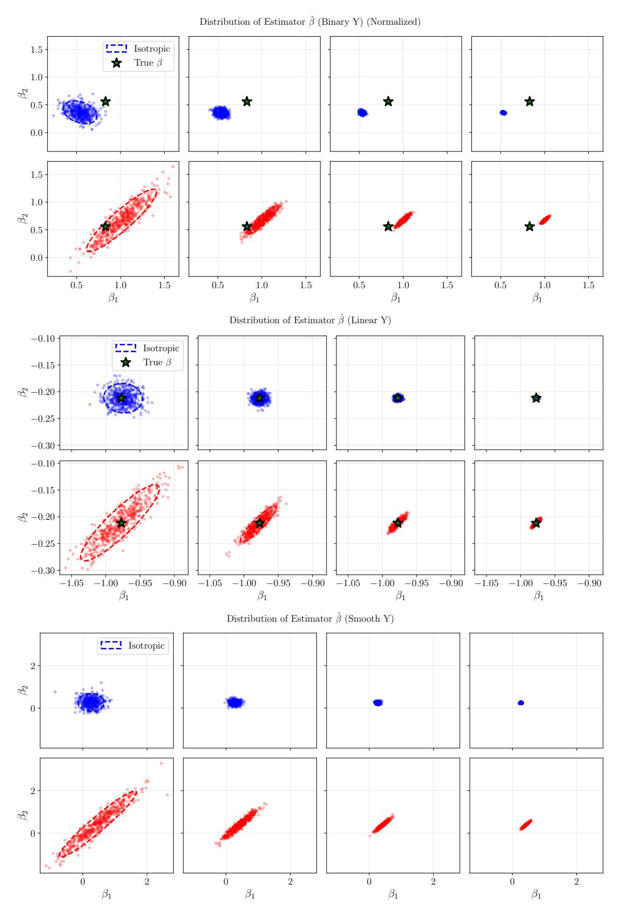

**Figure 17.** Depiction of the distribution of optimized values from OLS when comparing iso and aniso from lemmas. [1](#page-4-4) and [2.](#page-4-5) We clearly observe that the anisotropic version (**blue**) provides much lower variance compared to the isotropic case (**red**). We consider a binary classification (linear separable class) (**top row**), a linear regression task (**middle row**), and a nonlinear regression task with smooth targets (**bottom row**). For each case, we resample the training samples numerous times and produce an estimate for each time. Because the data is 2-dimensional, we can visualize the distribution directly.

<span id="page-48-0"></span>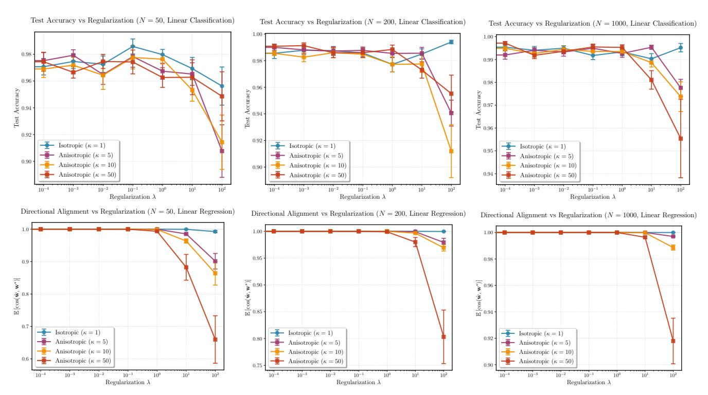

**Figure 18.** Depiction of accuracy (**top**) and cosine similarity between estimated and true estimator (**bottom**) for the OLS setting with varying strength of Tikhonov regularization (**x-axis**) comparing isotropic and anisotropic embeddings. As per thm. 6, the anisotropic distribution creates a bias in the OLS estimation for nonzero regularization.

<span id="page-48-1"></span>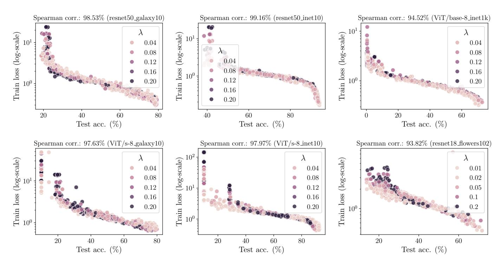

Figure 19. Additional figures provides in Figure 19

<span id="page-49-0"></span>

**Figure 20.** Proposed trapezoid quadrature for the Epps-Pulley statistic as implemented in algorithm 1. We depict the approximation error of the integral for various distributions, demonstrate rapid convergence (faster than quadratic show in **grey line**) across possible embedding distributions.

<span id="page-49-1"></span>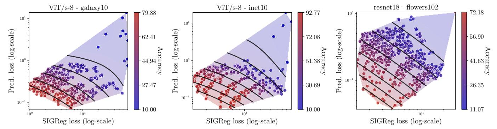

Figure 21. Additional figures for Figure 10.