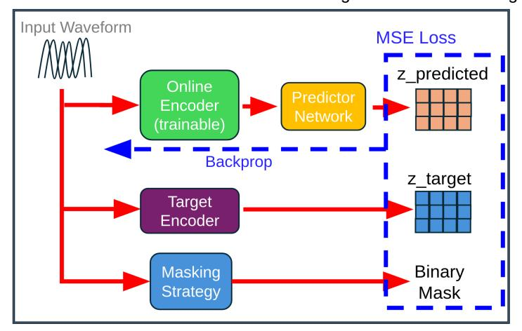
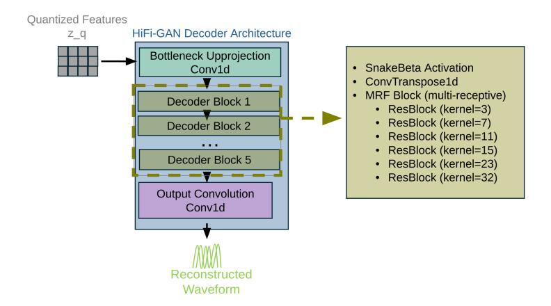

# JEPA as a Neural Tokenizer: Learning Robust Speech Representations with Density Adaptive Attention

Georgios Ioannides∗1 , Christos Constantinou†2 , Aman Chadha‡3 , Aaron Elkins4 , Linsey Pang5 , Ravid Shwartz-Ziv6 , and Yann LeCun6

1Carnegie Mellon University, Amazon GenAI, James Silberrad Brown Center for Artificial Intelligence

2University of Bristol, Amazon GenAI, James Silberrad Brown Center for Artificial Intelligence

3Stanford University, Amazon GenAI, James Silberrad Brown Center for Artificial Intelligence

> 4James Silberrad Brown Center for Artificial Intelligence 5Northeastern University 6New York University

> > October 25, 2025

#### Abstract

We introduce a two-stage self-supervised framework that combines the Joint-Embedding Predictive Architecture (JEPA) with a Density Adaptive Attention Mechanism (DAAM) for learning robust speech representations. Stage 1 uses JEPA with DAAM to learn semantic audio features via masked prediction in latent space, fully decoupled from waveform reconstruction. Stage 2 leverages these representations for efficient tokenization using Finite Scalar Quantization (FSQ) and a mixed-radix packing scheme, followed by high-fidelity waveform reconstruction with a HiFi-GAN decoder. By integrating Gaussian mixturebased density-adaptive gating into the JEPA encoder, the model performs adaptive temporal feature selection and discovers hierarchical speech structure at a low frame rate of 2.5 Hz. The resulting tokens (47.5 tokens/sec) provide a reversible, highly compressed, and language-model-friendly representation that is competitive with, and often more efficient than, existing neural audio codecs.

# Contents

| 1         | Hybrid Discrete-Continuous Speech Representations via JEPA with Density Adaptive |   |  |
|-----------|----------------------------------------------------------------------------------|---|--|
| Attention |                                                                                  |   |  |
|           | 1.1 Overview                                                               | 2 |  |
|           | 1.2 Motivation: Why JEPA for Speech?                                       | 3 |  |
| 2         | Stage 1: Self-Supervised JEPA Encoder with DAAM                                  | 3 |  |
|           | 2.1 JEPA Masking Strategy                                                  | 3 |  |
|           | 2.2 Density Adaptive Attention for Temporal Feature Modulation                | 4 |  |
|           | 2.2.1 Mathematical Formulation                                             | 4 |  |
|           | 2.3 JEPA Encoder Architecture                                                 | 6 |  |

∗Work does not relate to position at Amazon.

†Work does not relate to position at Amazon.

‡Work does not relate to position at Amazon.

|   |     | 2.3.1 Convolutional–Transformer Hybrid Design                   | 6  |
|---|-----|--------------------------------------------------------------------|----|
|   | 2.4 | JEPA Predictor Network                                             | 6  |
|   | 2.5 | Stage 1 Training Objective                                      | 6  |
|   |     | 2.5.1 Loss Function                                             | 6  |
|   |     | 2.5.2 EMA Target Update                                         | 7  |
| 3 |     | Stage 2: Fine-Tuning Encoder + FSQ Quantization + HiFi-GAN Decoder | 8  |
|   | 3.1 | Finite Scalar Quantization (FSQ)                                   | 8  |
|   |     | 3.1.1 FSQ Formulation                                           | 8  |
|   | 3.2 | Mixed-Radix Token Packing                                          | 9  |
|   |     | 3.2.1 Mixed-Radix Encoding                                      | 9  |
|   |     | 3.2.2 Efficient Iterative Computation                           | 9  |
|   |     | 3.2.3 Padding and Grouping                                      | 10 |
|   |     | 3.2.4 Decoding                                               | 10 |
|   |     | 3.2.5 Comparison to Alternatives                                | 10 |
|   |     | 3.2.6 Integration with Language Models                       | 11 |
|   |     | 3.2.7 Frame Rate Comparison with Neural Codecs               | 11 |
|   | 3.3 | HiFi-GAN Decoder                                                   | 11 |
|   |     | 3.3.1 Decoder Architecture                                   | 11 |
|   | 3.4 | Stage 2 Training Objective                                      | 11 |
|   |     | 3.4.1 Total Loss                                                | 12 |
| 4 |     | Experimental Setup                                                 | 13 |
|   | 4.1 | Dataset                                                         | 13 |
|   | 4.2 | Data Preprocessing                                                 | 13 |
|   | 4.3 | Distributed Training                                            | 14 |
|   | 4.4 | Inference Pipeline                                                 | 14 |
| 5 |     | Model Architecture and Efficiency                                  | 14 |
|   | 5.1 | Parameter Counts                                                | 14 |
|   | 5.2 | Training Efficiency                                             | 14 |
|   |     |                                                                    |    |
| 6 |     | Evaluation Metrics                                                 | 15 |
| 7 |     | Discussion                                                         | 15 |
|   | 7.1 | Why DAAM Improves JEPA Representations                             | 15 |
| 8 |     | Limitations and Future Work                                        | 15 |
| 9 |     | Code Availability                                                  | 16 |
|   |     |                                                                    |    |
|   |     | 10 Conclusion                                                      | 16 |

# 1 Hybrid Discrete-Continuous Speech Representations via JEPA with Density Adaptive Attention

## 1.1 Overview

We introduce a two-stage self-supervised learning framework that combines the Joint-Embedding Predictive Architecture (JEPA) [\[Assran et al., 2023\]](#page-15-2) with Density Adaptive Attention Mechanisms (DAAM) for learning robust speech representations. This approach decouples representation learning from reconstruction: Stage 1 employs JEPA with DAAM to learn semantic audio features through masked prediction, while Stage 2 leverages these representations for efficient tokenization via Finite Scalar Quantization (FSQ) [\[Mentzer](#page-16-0) [et al., 2023\]](#page-16-0) and high-quality reconstruction through HiFi-GAN [\[Kong et al., 2020\]](#page-16-1).

Key innovation. By integrating Density Adaptive Attention-based gating (Gaussian Mixture gating) [\[Ioannides et al., 2024\]](#page-16-2) into the JEPA encoder, we achieve adaptive feature selection during self-supervised learning. Combined with a mixed-radix packing scheme, the learned representations capture hierarchical speech structure—due to progressive downsampling from layer to layer—at a low frame rate of 2.5 Hz, enabling efficient speech modeling without labeled data.

# 1.2 Motivation: Why JEPA for Speech?

Traditional speech codec training couples representation learning with reconstruction objectives, forcing the encoder to prioritize features that minimize waveform-level losses. This conflates two distinct goals:

- 1. Learning semantically meaningful representations that capture linguistic and acoustic structure.
- 2. Preserving perceptual quality for high-fidelity reconstruction.

JEPA addresses this by separating concerns: the encoder learns to predict masked representations in latent space (Stage 1), then a separate decoder learns to map these representations to audio (Stage 2). This architectural separation enables:

- Better representations: the encoder optimizes for semantic content rather than low-level waveform details.
- Efficiency: fine-tuning the encoder reduces Stage 2 training cost.
- Flexibility: the same encoder can support multiple downstream tasks (text-to-speech, voice conversion, automatic speech recognition, etc.).
- Scalability: Stage 1 can leverage large unlabeled datasets.

The integration of DAAM enhances this framework by introducing adaptive attention that learns which temporal regions and features are most informative for prediction, naturally discovering speech-relevant patterns.

# 2 Stage 1: Self-Supervised JEPA Encoder with DAAM

## 2.1 JEPA Masking Strategy

The JEPA framework employs block-based temporal masking to create a self-supervised learning objective. For a batch of audio sequences with temporal length T, binary masks m ∈ {0, 1} B×T are generated, where 1 indicates visible (context) regions and 0 indicates masked (target) regions.

Block Masking Algorithm. Given mask ratio ρ ∈ [0, 1], minimum span length smin, and maximum span length smax, we construct masks as follows:

- 1. Initialize: m ← 1B×T (all positions visible).
- 2. For each sample b ∈ {1, . . . , B}:
  - (a) Compute target: nmask = ⌊ρ · T⌋.
  - (b) Initialize counter: nmasked ← 0.
- 3. While nmasked < nmask:
  - (a) Sample span length: ℓ ∼ Uniform(smin, smax).
  - (b) Sample start position: tstart ∼ Uniform(0, T − ℓ).
  - (c) Compute end position: tend ← min(tstart + ℓ, T).
  - (d) Set mask: m[b, t] ← 0 for all t ∈ [tstart, tend).

Figure 1: The input waveform is processed by three parallel pathways: (1) an online encoder (trainable, green) that processes the full audio and feeds into a predictor network (yellow) after feature-space masking with a learned mask token, (2) a target encoder (purple) updated via EMA that also processes the full audio to generate ztarget, and (3) a masking strategy module (blue) that generates binary masks. The MSE loss is computed only on masked regions between zpredicted and ztarget (stop-gradient), with gradients backpropagating only through the online encoder and predictor. The target encoder provides stable representations without receiving gradients directly [\[Grill et al., 2020\]](#page-15-3).

- (e) Update counter: nmasked ← nmasked + (tend − tstart).
- 4. Return: mask tensor m.

This block masking strategy creates contiguous masked spans rather than random individual positions, forcing the model to learn longer-range temporal dependencies and semantic content.

### Masking hyperparameters.

- Mask ratio: ρ = 0.5 (50% of timesteps masked).
- Minimum span: smin = 2 frames.
- Maximum span: smax = T /4 frames (adaptive to sequence length).

At 2.5 Hz frame rate, this corresponds to variable spans adapted to the sequence length.

## 2.2 Density Adaptive Attention for Temporal Feature Modulation

The core innovation integrating a stabilized version of the original DAAM into JEPA is the DensityAdaptiveAttention module, which computes adaptive attention gates based on learned Gaussian mixture distributions. Unlike standard self-attention that computes pairwise dot-products between positions, DAAM learns to identify statistically salient temporal regions based on their distributional characteristics.

## 2.2.1 Mathematical Formulation

For input features x ∈ R B×C×T (batch size, channels, time), the DAAM module operates along the temporal axis.

Step 1: Temporal statistics. For each batch and channel, compute the mean and variance across time:

$$\mu = \frac{1}{T} \sum_{t=1}^{T} x_{:,:,t} \in \mathbb{R}^{B \times C \times 1}, \tag{1}$$

$$\sigma^2 = \frac{1}{T} \sum_{t=1}^{T} (x_{:,:,t} - \mu)^2 \in \mathbb{R}^{B \times C \times 1}.$$
 (2)

Step 2: Learnable Gaussian parameters. For K Gaussian components, we maintain learnable parameters:

- Mean offsets: δ = [δ1, . . . , δK] ∈ R K, initialized to δk = 0.
- Log-scale parameters: ν = [ν1, . . . , νK] ∈ R K, initialized to νk = log(0.5).

The positive scales are computed via softplus:

$$\tilde{\sigma}_k = \text{softplus}(\nu_k) + \epsilon = \log(1 + \exp(\nu_k)) + \epsilon,$$
(3)

with ϵ = 10−3 for numerical stability.

Step 3: Standardized deviations. For each component k and timestep t:

$$z_{k,t} = \frac{x_{:,:,t} - (\mu + \delta_k)}{\sigma \cdot \tilde{\sigma}_k + \epsilon}.$$
 (4)

Step 4: Log-density under each Gaussian. The log-probability density at each timestep is:

$$\log p_k(x_t) = -\frac{1}{2}z_{k,t}^2 - \log \tilde{\sigma}_k - \frac{1}{2}\log(2\pi).$$
 (5)

Step 5: Mixture aggregation via log-sum-exp. To form a mixture of Gaussians:

$$\log \mathbf{G}(x_t) = \operatorname{logsumexp}(\{\log p_1(x_t), \dots, \log p_K(x_t)\}) - \log K.$$
(6)

Step 6: Attention gate and feature modulation. The final attention gate is

$$\mathbf{G}(x_t) = \exp(\log \mathbf{G}(x_t)),\tag{7}$$

and the output features are

$$\mathbf{y}_t = \mathbf{x}_t \odot \mathbf{G}(x_t), \tag{8}$$

where ⊙ denotes element-wise multiplication.

DAAM operates on a learned 1-channel attention projection over time: features are first projected to a single channel, the Gaussian mixture gate is computed on that 1D temporal signal, and the resulting gate scales the full feature tensor.

### Implementation details.

- All computations in FP32 for numerical stability.
- Variance clamped: var ≥ 10−6 .
- Softplus ensures positive scales: ˜σk > 0.
- Number of Gaussians: K = 4 across all layers.

### 2.3 JEPA Encoder Architecture

The JEPA encoder consists of two parallel pathways that share weights but serve different roles.

Context encoder (online network). Processes the full audio input. Masking is applied later in feature space by replacing hidden timesteps with a learned mask token before the predictor. Parameters are updated via gradient descent.

**Target encoder (EMA network).** Processes the full audio input and provides stable targets for prediction. Parameters are updated via exponential moving average (EMA).

### 2.3.1 Convolutional—Transformer Hybrid Design

**Downsampling path.** The input raw waveform  $[B, 1, T_{\text{wav}}]$  passes through Conv1D blocks with stride, progressing through channel dimensions

$$64 \to 128 \to 256 \to 384 \to 512 \to 512$$
.

The total stride is  $8 \times 8 \times 5 \times 5 \times 6 = 9600$  samples/hop at 24 kHz, resulting in a latent representation  $[B, 512, T_z]$ , where  $T_z$  corresponds to approximately 2.5 Hz frame rate.

Conformer blocks [Gulati et al., 2020]. We use 8 Conformer layers with 16 attention heads. Each layer comprises self-attention, feedforward, convolution, and layer normalization. DAAM gating is applied in the encoder blocks (after the strided convolutions and residual stacks); there is no DAAM after the Conformer blocks in the current implementation.

**Integration with DAAM.** After each Conformer block, features pass through GAttnGateG modules that:

- 1. Project features to a single channel via  $1 \times 1$  convolution.
- 2. Compute a DAAM gate from projected features.
- 3. Apply learned scaling

$$\mathbf{y} = \mathbf{x} \cdot (1 + \alpha \cdot \text{gate}),\tag{9}$$

where  $\alpha$  (initialized to 0.05) controls modulation strength.

## 2.4 JEPA Predictor Network

The predictor takes context representations and predicts masked regions. It uses two Conformer blocks with 16 attention heads, processing masked context features and outputting predictions for all temporal positions. The predictor only receives context (visible) regions but must predict features at all positions; the mask is applied to the loss.

#### 2.5 Stage 1 Training Objective

The JEPA training objective is pure self-supervised prediction in latent space.

### 2.5.1 Loss Function

$$\mathcal{L}_{\text{JEPA}} = \frac{1}{N_{\text{mask}} \cdot C} \sum_{t \in \mathcal{M}} \left\| \mathbf{z}_{\text{pred}}^{(t)} - \text{sg}(\mathbf{z}_{\text{target}}^{(t)}) \right\|^2, \tag{10}$$

where:

•  $\mathcal{M} = \{t : m_t = 0\}$  is the set of masked positions,

Figure 2: JEPA online encoder architecture. Input waveform passes through an initial Conv1D layer followed by 5 encoder blocks, each containing Conv1D with stride, SnakeBeta activation, residual blocks, and Gaussian Adaptive Attention gating. Features are projected through a bottleneck Conv1D layer and processed by 8 Conformer blocks (each with FNN, multi-head attention with 16 heads, depthwise convolution, and a second FNN) to produce the final representation z. The target encoder shares this architecture but is updated via exponential moving average rather than backpropagation.

- Nmask = |M|,
- C is the channel dimension,
- sg(·) denotes the stop-gradient operation.

The loss is computed only on masked regions by weighting squared differences and normalized by the number of masked tokens times channels.

### 2.5.2 EMA Target Update

After each training step, the target encoder parameters are updated via EMA:

$$\boldsymbol{\theta}_{\text{target}} \leftarrow \tau \boldsymbol{\theta}_{\text{target}} + (1 - \tau) \boldsymbol{\theta}_{\text{online}},$$
 (11)

with momentum coefficient τ = 0.996.

### Stage 1 hyperparameters.

• Optimizer: AdamW with β1 = 0.8, β2 = 0.99.

• Learning rate: 1.5 × 10−4 .

• Weight decay: 10−3 .

• Batch size: 32.

• Max audio length: 15 s @ 24 kHz.

• Training steps: 24 000.

Collapse monitoring. We monitor (without backpropagation) the standard deviation of predictor outputs across batch and temporal dimensions. If the mean standard deviation falls below 0.01, a warning is logged. This does not contribute to the loss.

Figure 3: JEPA predictor network architecture. The predictor takes masked context features zmasked and processes them through: (1) an expansion Conv1D layer that doubles the channel dimension, (2) two Conformer blocks separated by an intermediate Conv1D for feature refinement, and (3) a projection Conv1D that reduces back to the original dimensionality, producing predicted features zpred at all positions including masked regions.

# 3 Stage 2: Fine-Tuning Encoder + FSQ Quantization + HiFi-GAN Decoder

After Stage 1 completes, the JEPA encoder weights are fine-tuned and used as a feature extractor for Stage 2. Stage 2 introduces quantization and waveform reconstruction.

## 3.1 Finite Scalar Quantization (FSQ)

FSQ provides efficient discrete tokenization without codebook learning [\[Mentzer et al., 2023\]](#page-16-0). Unlike VQ-VAE, which maintains learnable codebooks, FSQ uses fixed scalar quantization per dimension.

Let ze ∈ R B×C×T be encoder features.

### 3.1.1 FSQ Formulation

Projection.

$$\mathbf{z}_e' = \tanh(\mathbf{z}_e). \tag{12}$$

Quantization. For dimension d with level Ld, define boundaries

$$B_d = \left\{ \frac{2i - L_d + 1}{L_d} : i \in \{0, 1, \dots, L_d - 1\} \right\}.$$
(13)

The quantization function is

$$q_d(x) = \arg\min_{b \in B_d} |x - b|. \tag{14}$$

The quantized value is zq[d] = qd(z ′ e [d]).

### Configuration.

- Levels: L = [4, 4, 4, 4].
- Code dimension: C = 128.
- Temperature: τ = 1.0.

Figure 4: Stage 1 JEPA masked prediction loss (MSE) over training steps. JEPA+DAAM (blue) converges faster and to a lower final loss (∼ 0.09) compared to JEPA without DAAM (orange, ∼ 0.17), demonstrating that Density Adaptive Attention enables more efficient representation learning. Both models use identical architectures except for DAAM gating.

Straight-through estimator. During backpropagation,

$$\frac{\partial \mathcal{L}}{\partial \mathbf{z}_e} = \frac{\partial \mathcal{L}}{\partial \mathbf{z}_q}.\tag{15}$$

## 3.2 Mixed-Radix Token Packing

To maximize compression efficiency, we implement a mixed-radix packing algorithm that converts FSQ indices into compact integer tokens [\[Simon, 2024\]](#page-16-4).

Let i ∈ Z B×T ×D denote FSQ indices, with dimension-specific radices r = [r1, . . . , rG] for a group of G dimensions.

### 3.2.1 Mixed-Radix Encoding

Any combination [i1, . . . , iG] is encoded as

$$token = \sum_{k=1}^{G} i_k \prod_{j=k+1}^{G} r_j.$$

$$\tag{16}$$

Example. For G = 7 and r = [4, 4, 4, 4, 4, 4, 4] with i = [2, 1, 3, 0, 2, 1, 3]:

$$token = 2 \cdot 4^{6} + 1 \cdot 4^{5} + 3 \cdot 4^{4} + 0 \cdot 4^{3} + 2 \cdot 4^{2} + 1 \cdot 4^{1} + 3 \cdot 4^{0}$$

$$= 10023,$$
(17)

with maximum value 47 − 1 = 16383.

## 3.2.2 Efficient Iterative Computation

Using Horner's method [\[Knuth, 1997\]](#page-16-5):

$$token = i_1 \cdot r_2 \cdots r_G + \cdots + i_{G-1} \cdot r_G + i_G, \tag{19}$$

implemented right-to-left:

| Approach                  | Tokens/sec | Reversible | Notes                     |
|---------------------------|------------|------------|---------------------------|
| No packing (128 dims)     | 320        | Yes        | Each FSQ dim is a token   |
| Mixed-radix (ours, G = 7) | 47.5       | Yes        | Pack 7 dims/token         |
| VQ codebook               | Variable   | Yes        | Requires learned codebook |

Table 1: Comparison of tokenization approaches.

- 1. Initialize token = iG.
- 2. For k = G − 1 down to 1:

token = ik + token · rk.

### 3.2.3 Padding and Grouping

Our FSQ implementation yields D = 128 quantized dimensions. We choose group size G = 7:

- Number of groups: ⌈128/7⌉ = 19.
- Padding: 19 × 7 − 128 = 5 dimensions with radix 1.

Token rate. Frame rate:

$$f = \frac{\text{sample\_rate}}{\text{hop}} = \frac{24000}{9600} = 2.5 \text{ Hz}.$$

Groups per frame: 19. Tokens/sec:

$$tps = 2.5 \times 19 = 47.5.$$

### 3.2.4 Decoding

The reverse operation extracts indices:

- 1. Initialize rem = token.
- 2. For k = 1 to G:
  - prod = QG j=k+1 rj .
  - ik = ⌊rem/prod⌋.
  - rem = rem mod prod.

### 3.2.5 Comparison to Alternatives

Advantages:

- Perfect reversibility via modular arithmetic.
- Near-optimal compression for given radices.
- No learned codebook (unlike VQ-VAE).
- Flexible grouping G trading vocabulary size versus token rate.
- Integer-only operations, hardware-friendly.

With G = 7 and radix 4, the per-token vocabulary is 47 = 16384, comparable to subword vocabularies used in NLP.

| Model                                         | Frame Rate | Notes                                 |
|-----------------------------------------------|------------|---------------------------------------|
| Ours (JEPA+FSQ)                               | 2.5 Hz     | Mixed-radix packing (19 groups/frame) |
| U-Codec [Yang et al., 2025]                   | 5 Hz       | Ultra-low for LLM-TTS                 |
| Mimi [or Multiple, 2025]                      | 12.5 Hz    | Semantic distillation                 |
| DualCodec [Li et al., 2025]                   | 12.5–25 Hz | Dual-stream architecture              |
| SoundStream (24 kHz) [Zeghidour et al., 2021] | 75 Hz      | 13.3 ms frames                        |
| EnCodec (24 kHz) [D´efossez et al., 2022]     | 75 Hz      | 75 steps/sec @ 24 kHz                 |
| DAC (44.1 kHz) [Kumar et al., 2024]           | 86 Hz      | Stride 512 @ 44.1 kHz                 |

Table 2: Frame rate comparison with state-of-the-art neural codecs.

### 3.2.6 Integration with Language Models

The compact tokens enable direct training of decoder-only Transformers for speech generation:

- Input: discrete token sequence at 47.5 tokens/sec.
- Output: next-token prediction over a 16 384-way vocabulary.
- Decoding: tokens → FSQ indices → dequantized features → waveform via HiFi-GAN.

## 3.2.7 Frame Rate Comparison with Neural Codecs

## 3.3 HiFi-GAN Decoder

The decoder upsamples quantized representations back to waveform using HiFi-GAN with DAAM gating in residual blocks [\[Kong et al., 2020\]](#page-16-1).

## 3.3.1 Decoder Architecture

Quantized features [B, 512, Tz] are upsampled via ConvTranspose1D blocks through channel dimensions

$$512 \to 384 \to 256 \to 128 \to 64$$
,

with strides 6, 5, 5, 8, 8 (total stride 9600), yielding output waveform [B, 1, Twav]. Each block consists of:

- Upsampling ConvTranspose1D.
- Multi-receptive-field (MRF) residual blocks with (optionally) DAAM gating.

### ResBlock with DAAM. Each residual block contains:

- 1. Leaky ReLU activation.
- 2. Dilated convolution.
- 3. Residual connection.

### Decoder hyperparameters.

- Upsample kernels: [3, 7, 11, 15, 23, 32].
- Residual blocks: 8 per stage.

## 3.4 Stage 2 Training Objective

Stage 2 optimizes the FSQ quantizer, HiFi-GAN decoder, and JEPA encoder.

Figure 5: HiFi-GAN decoder architecture (Stage 2). Quantized features zq are upsampled through a bottleneck Conv1D followed by 5 decoder blocks. Each block contains ConvTranspose1D upsampling and MRF residual blocks with different kernel sizes (3, 7, 11, 15, 23, 32) to capture multi-scale temporal patterns. SnakeBeta activations provide periodic inductive bias for high-fidelity audio generation [\[Ziyin et al., 2020\]](#page-16-11).

### 3.4.1 Total Loss

$$\mathcal{L}_{\text{total}} = \mathcal{L}_{\text{rec}} + \lambda_{\text{stft}} \mathcal{L}_{\text{stft}} + \lambda_{\text{gan}} \mathcal{L}_{\text{gan}}. \tag{20}$$

1. Reconstruction loss (L1).

$$\mathcal{L}_{\text{rec}} = \frac{1}{T_{\text{wav}}} \sum_{t=1}^{T_{\text{wav}}} |\hat{x}_t - x_t|. \tag{21}$$

2. Multi-resolution STFT loss [\[Yamamoto et al., 2020\]](#page-16-12).

$$\mathcal{L}_{\text{stft}} = \sum_{m=1}^{M} \left( \mathcal{L}_{\text{sc}}^{(m)} + \mathcal{L}_{\text{mag}}^{(m)} \right), \tag{22}$$

with spectral convergence

$$\mathcal{L}_{sc}^{(m)} = \frac{\||S_m(\hat{x})| - |S_m(x)|\|_F}{\||S_m(x)|\|_F},$$
(23)

and log-magnitude loss

$$\mathcal{L}_{\text{mag}}^{(m)} = \frac{1}{N_m} \left\| \log |S_m(\hat{x})| - \log |S_m(x)| \right\|_1.$$
 (24)

### STFT configurations.

• FFT sizes: [2048, 1024, 512, 256, 128].

• Hop sizes: [512, 256, 128, 64, 32].

• Window: Hann.

3. GAN loss. We use multi-period and multi-scale discriminators [\[Kumar et al., 2019\]](#page-16-13). Generator loss:

$$\mathcal{L}_{\text{gen}} = \sum_{d \in \{\text{MPD,MSD}\}} \mathbb{E}[(D_d(\hat{x}) - 1)^2]. \tag{25}$$

Feature matching:

$$\mathcal{L}_{\text{feat}} = \sum_{d \in \{\text{MPD,MSD}\}} \sum_{l=1}^{L_d} \frac{1}{N_l} \left\| D_d^{(l)}(x) - D_d^{(l)}(\hat{x}) \right\|_1.$$
 (26)

GAN total:

$$\mathcal{L}_{gan} = \mathcal{L}_{gen} + \mathcal{L}_{feat}. \tag{27}$$

Discriminator loss:

$$\mathcal{L}_{\text{disc}} = \sum_{d \in \{\text{MPD,MSD}\}} \left( \mathbb{E}[(D_d(x) - 1)^2] + \mathbb{E}[D_d(\hat{x})^2] \right). \tag{28}$$

### Loss weights and training schedule.

- $\lambda_{\text{stft}} = 2.0$ .
- $\lambda_{\rm gan} = 0.1$ .
- Discriminator warmup: 5000 steps (disc frozen).
- After warmup: discriminator updated every step.

### Stage 2 hyperparameters.

- Optimizer: AdamW,  $\beta_1 = 0.8$ ,  $\beta_2 = 0.99$ .
- Learning rate:  $1.5 \times 10^{-4}$  (decoder),  $0.75 \times 10^{-4}$  (discriminators).
- Weight decay:  $10^{-3}$ .
- Batch size: 8.
- Training steps: 29000.

# 4 Experimental Setup

### 4.1 Dataset

- LibriLight (large-scale unlabeled English speech corpus) [Kahn et al., 2020].
- Training split:  $\sim 9000$  hours (combined across the two stages).
- Validation: held-out speakers.
- Sample rate: 24 kHz.
- Max audio length: 15 s.

## 4.2 Data Preprocessing

- 1. Resample to 24 kHz if needed.
- 2. Convert to mono by averaging channels.
- 3. No further preprocessing (normalization handled in-model).

| Component                      | Parameters | Notes               |  |  |
|--------------------------------|------------|---------------------|--|--|
| Stage 1: JEPA encoder training |            |                     |  |  |
| Online encoder                 | 121.7M     | Trainable           |  |  |
| Target encoder (EMA)           | 118.5M     | Momentum update     |  |  |
| Predictor network              | 3.2M       | Trainable           |  |  |
| Stage 1 total                  | 240.2M     | 121.7M trainable    |  |  |
| Stage 2: decoder training      |            |                     |  |  |
| JEPA encoder                   | 240.2M     | Fine-tuned          |  |  |
| FSQ quantizer                  | ∼ 0.01M    | Trainable           |  |  |
| HiFi-GAN decoder               | 69.2M      | Trainable           |  |  |
| Stage 2 total                  | 309.5M     | 69.3M trainable     |  |  |
| Final model (inference)        |            |                     |  |  |
| Encoder only                   | 121.7M     | Online encoder only |  |  |
| FSQ + decoder                  | 69.3M      |                     |  |  |
| Inference total                | 191.0M     | Single-pass model   |  |  |

Table 3: Model architecture and parameter efficiency.

## 4.3 Distributed Training

- Hardware: 2x NVIDIA A100 (80 GB).
- Mixed precision: FP16 for forward/backward, FP32 for critical ops.
- Gradient accumulation: 1 step.
- Global batch size: 64 (Stage 1), 16 (Stage 2).

## 4.4 Inference Pipeline

At inference time:

- 1. Raw waveform → JEPA encoder → latent features.
- 2. Latent features → FSQ quantization → discrete tokens.
- 3. Tokens → dequantization → quantized features.
- 4. Quantized features → HiFi-GAN decoder → reconstructed waveform.

Token rate: 47.5 tokens/sec (with G = 7 packing).

# 5 Model Architecture and Efficiency

## 5.1 Parameter Counts

## 5.2 Training Efficiency

Key features:

- Two-stage training: self-supervised pretraining + supervised fine-tuning.
- Inference efficiency: 191M parameters (no EMA network).

| Metric               | Stage 1 (JEPA) | Stage 2 (decoder) |
|----------------------|----------------|-------------------|
| Trainable parameters | 121.7M (50.7%) | 69.3M (22.4%)     |
| Training steps       | 24K            | 29K               |
| Batch size           | 32             | 8                 |
| Learning rate        | 1.5 × 10−4     | 1.5 × 10−4        |

Table 4: Training efficiency of the two stages.

# 6 Evaluation Metrics

We report qualitative evaluations, as all variants were trained under limited computational budgets and this work presents preliminary findings.

### Baselines.

- 1. JEPA baseline: JEPA encoder without DAAM gating.
- 2. WavLM-Large [\[Chen et al., 2021\]](#page-15-5): pre-trained self-supervised model.
- 3. JEPA+DAAM: JEPA encoder with DAAM gating (ours).

# 7 Discussion

## 7.1 Why DAAM Improves JEPA Representations

Integrating Density Adaptive Attention into JEPA provides several advantages.

Comparison to standard attention. Standard softmax-based self-attention computes pairwise correlations between positions, answering "Which timesteps are similar to this one?" DAAM instead computes statistical salience: "Which timesteps have unusual or informative statistical properties?" via Gaussian mixture modeling of temporal statistics.

Because it operates on temporal statistics rather than full pairwise similarity matrices, DAAM can capture salient temporal patterns without the quadratic complexity of full self-attention.

# 8 Limitations and Future Work

Current limitations and directions for future work include:

- 1. Fixed masking strategy. Block masking with fixed span distributions may not adapt optimally to varying speech rates or linguistic structure. Future work includes adaptive masking sensitive to acoustic or linguistic boundaries.
- 2. Monolingual evaluation. Experiments are currently limited to English (LibriLight). Generalization to tonal and morphologically rich languages remains open.
- 3. Limited data scale. Pretraining has been conducted on relatively modest amounts of data compared to large-scale SSL systems; conclusions are restricted to emerging capabilities.
- 4. Cross-modal JEPA. Extending to audio–visual or audio–text joint embedding prediction for multimodal representations is a promising direction.

# 9 Code Availability

The complete implementation of the JEPA+DAAM framework, including training scripts, model architectures, and data processing pipelines, is available at:

<https://github.com/gioannides/Density-Adaptive-JEPA>

The repository includes:

- Stage 1 JEPA encoder training with DAAM.
- Stage 2 decoder training with the encoder.
- FSQ quantization and mixed-radix packing algorithms.
- HiFi-GAN decoder with optional DAAM gating.
- DeepSpeed integration for distributed training.

# 10 Conclusion

We introduced a two-stage self-supervised framework combining Joint-Embedding Predictive Architecture (JEPA) with Density Adaptive Attention Mechanisms (DAAM) for efficient speech representation learning. Stage 1 trains a JEPA encoder with DAAM-based gating to learn robust semantic representations via masked prediction using only MSE loss on masked regions. Stage 2 leverages these representations for reconstruction using L1 loss, multi-resolution STFT loss, and adversarial GAN losses, together with FSQ and HiFi-GAN.

Our main contributions are:

- 1. A DAAM-enhanced JEPA encoder that uses Gaussian mixture-based attention for adaptive feature selection during self-supervised learning.
- 2. An efficient tokenization scheme based on mixed-radix FSQ packing, achieving 47.5 tokens/sec, substantially lower than many existing neural audio codecs while remaining reversible.
- 3. A two-stage training paradigm that cleanly separates representation learning from reconstruction, allowing pure self-supervised pretraining followed by reconstruction-focused fine-tuning.

These results show that probabilistic attention mechanisms can improve representation learning by dynamically identifying acoustically salient regions during masked prediction, and that JEPA can serve as a powerful neural tokenizer for speech, suitable for integration with large language models and other sequence models.

# References

Mahmoud Assran, Mathilde Caron, Ishan Misra, Piotr Bojanowski, Armand Joulin, Julien Mairal, Nicolas Ballas, Mike Rabbat, Yann LeCun, and Priya Goyal. Self-supervised learning from images with a jointembedding predictive architecture. In CVPR, 2023. URL <https://arxiv.org/abs/2301.08243>.

Sanyuan Chen, Chengyi Wang, Zhengyang Chen, Yu Wu, Shujie Liu, et al. WavLM: Large-scale selfsupervised pre-training for full stack speech processing. arXiv preprint arXiv:2110.13900, 2021. URL <https://arxiv.org/abs/2110.13900>.

Alexandre D´efossez, Jade Copet, Gabriel Synnaeve, and Yossi Adi. High fidelity neural audio compression. arXiv preprint arXiv:2210.13438, 2022. URL <https://arxiv.org/abs/2210.13438>.

Jean-Bastien Grill, Florian Strub, Florent Altch´e, Corentin Tallec, Pierre H. Richemond, et al. Bootstrap your own latent: A new approach to self-supervised learning. In NeurIPS, 2020. URL [https://arxiv.](https://arxiv.org/abs/2006.07733) [org/abs/2006.07733](https://arxiv.org/abs/2006.07733).

- Anmol Gulati, James Qin, Chung-Cheng Chiu, Niki Parmar, Yu Zhang, et al. Conformer: Convolutionaugmented transformer for speech recognition. In INTERSPEECH, 2020. URL [https://arxiv.org/](https://arxiv.org/abs/2005.08100) [abs/2005.08100](https://arxiv.org/abs/2005.08100).
- Georgios Ioannides, Aman Chadha, and Aaron Elkins. Density adaptive attention is all you need: Robust parameter-efficient fine-tuning across multiple modalities. arXiv preprint arXiv:2401.11143, 2024. URL <https://arxiv.org/abs/2401.11143>.
- Jacob Kahn, Morgane Riviere, Weiran Zheng, Eugene Kharitonov, et al. Libri-light: A benchmark for asr with limited or no supervision. arXiv preprint arXiv:1912.07875, 2020. URL [https://arxiv.org/abs/](https://arxiv.org/abs/1912.07875) [1912.07875](https://arxiv.org/abs/1912.07875).
- Donald E. Knuth. The art of computer programming, vol. 2: Seminumerical algorithms (3rd ed.), 1997. Mixed-radix numeration and Horner's rule (pp. 65–66, 208–209, 290).
- Jungil Kong, Jaehyeon Kim, and Jaekyoung Bae. HiFi-GAN: Generative adversarial networks for efficient and high fidelity speech synthesis. arXiv preprint arXiv:2010.05646, 2020. URL [https://arxiv.org/](https://arxiv.org/abs/2010.05646) [abs/2010.05646](https://arxiv.org/abs/2010.05646).
- Kundan Kumar, Rithesh Kumar, Thibault de Boissiere, et al. Melgan: Generative adversarial networks for conditional waveform synthesis. arXiv preprint arXiv:1910.06711, 2019. URL [https://arxiv.org/abs/](https://arxiv.org/abs/1910.06711) [1910.06711](https://arxiv.org/abs/1910.06711).
- Rithesh Kumar et al. DAC-JAX: A jax implementation of the descript audio codec. arXiv preprint arXiv:2405.11554, 2024. URL <https://arxiv.org/abs/2405.11554>. Token stream rate discussion for 44.1kHz / stride 512.
- Jiaqi Li, Xiaolong Lin, Zhekai Li, Shixi Huang, Yuancheng Wang, Chaoren Wang, Zhenpeng Zhan, and Zhizheng Wu. Dualcodec: A low-frame-rate, semantically-enhanced neural audio codec for speech generation. arXiv preprint arXiv:2505.13000, 2025. URL <https://arxiv.org/abs/2505.13000>.
- Fabian Mentzer, David Minnen, Eirikur Agustsson, and Michael Tschannen. Finite scalar quantization: VQ-VAE made simple. arXiv preprint arXiv:2309.15505, 2023. URL <https://arxiv.org/abs/2309.15505>.
- Anonymous or Multiple. Llama-mimi: Speech language models with interleaved semantic and acoustic tokens. arXiv preprint arXiv:2509.14882, 2025. URL <https://arxiv.org/abs/2509.14882>.
- Damien Simon. Mixed radix numeration bases: Horner's rule, yang-baxter equation and furstenberg's conjecture. arXiv preprint arXiv:2405.19798, 2024. URL <https://arxiv.org/abs/2405.19798>.
- Ryuichi Yamamoto, Eunwoo Song, and Jae-Min Kim. Parallel wavegan: A fast waveform generation model based on generative adversarial networks with multi-resolution spectrogram. arXiv preprint arXiv:1910.11480, 2020. URL <https://arxiv.org/abs/1910.11480>.
- Xuefei Yang et al. Ultra low frame-rate neural speech codec for fast high-fidelity speech synthesis. arXiv preprint arXiv:2510.16718, 2025. URL <https://arxiv.org/abs/2510.16718>.
- Neil Zeghidour, Alejandro Luebs, Ahmed Omran, Jan Skoglund, and Marco Tagliasacchi. Soundstream: An end-to-end neural audio codec. arXiv preprint arXiv:2107.03312, 2021. URL [https://arxiv.org/abs/](https://arxiv.org/abs/2107.03312) [2107.03312](https://arxiv.org/abs/2107.03312).
- Liu Ziyin, Tilman Hartwig, and Masahito Ueda. Neural networks fail to learn periodic functions and how to fix it. In NeurIPS, 2020. URL [https://papers.nips.cc/paper/2020/hash/](https://papers.nips.cc/paper/2020/hash/1160453108d3e537255e9f7b931f4e90-Abstract.html) [1160453108d3e537255e9f7b931f4e90-Abstract.html](https://papers.nips.cc/paper/2020/hash/1160453108d3e537255e9f7b931f4e90-Abstract.html).