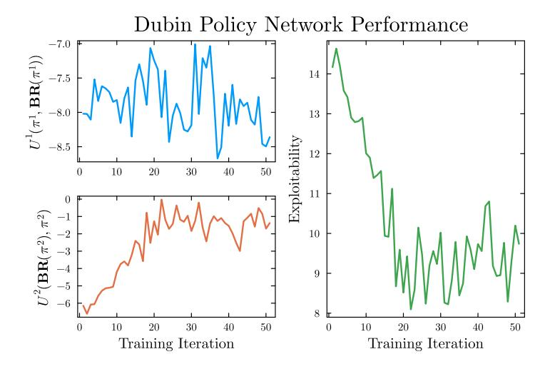
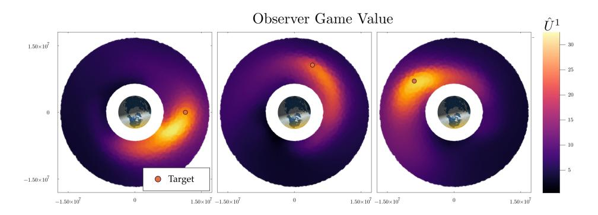
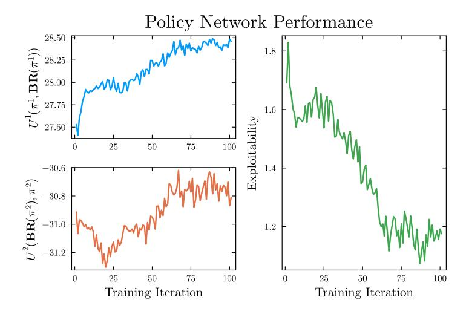

# Simultaneous AlphaZero: Extending Tree Search to Markov Games

Tyler Becker<sup>1</sup> , Zachary Sunberg<sup>1</sup> <sup>1</sup>University of Colorado Boulder

### Abstract

Simultaneous AlphaZero extends the AlphaZero framework to multistep, two-player zero-sum deterministic Markov games with simultaneous actions. At each decision point, joint action selection is resolved via matrix games whose payoffs incorporate both immediate rewards and future value estimates. To handle uncertainty arising from bandit feedback during Monte Carlo Tree Search (MCTS), Simultaneous AlphaZero incorporates a regret-optimal solver for matrix games with bandit feedback. Simultaneous AlphaZero demonstrates robust strategies in a continuous-state discrete-action pursuit-evasion game and satellite custody maintenance scenarios, even when evaluated against maximally exploitative opponents.

# 1 Introduction

Many decision-making problems in multi-agent settings, ranging from aerial combat and space domain awareness (SDA) to robotic coordination and adversarial games, involve simultaneous actions rather than turn taking. In these settings, the strategic complexity increases significantly compared to turn-based environments, as players must commit to actions without knowing their opponent's next move. Classical algorithms like AlphaZero have shown remarkable success in large-scale tabletop games such as Go, Chess, and Shogi, but rely on the assumption of turn-based play. This renders them unsuitable for domains where simultaneous action selection is essential.

This paper extends AlphaZero to handle two-player zero-sum Markov games with simultaneous moves. The key insight is that each decision point in a simultaneous game can be framed as a matrix game, where payoffs depend on both the immediate reward and the expected value of future states. Solving the game at each tree state during MCTS search then reduces to solving a matrix game with bandit feedback.

To this end, Simultaneous AlphaZero incorporates the matrix game solver proposed in O'Donoghue et al. [\[6\]](#page-15-0), which achieves low regret in matrix games with bandit feedback. In contrast to existing AlphaZero variants that require only a single policy head, our formulation employs a separate policy head for each player and constructs joint action probabilities during tree search.

The effectiveness of Simultaneous AlphaZero is demonstrated on two benchmark tasks: a continuous-state 2-player pursuit-evasion game and a space domain awareness scenario comprised of one satellite trying to evade custody and another satellite trying to maintain custody of the evader. In both environments, our method learns robust strategies that remain effective even against fully exploitative adversaries. This work takes a key step toward scalable, game-theoretic planning in domains requiring simultaneous strategic reasoning over long horizons.

# 2 Background

The Markov Game (MG) is a mathematical formalism for problems where multiple agents make decisions sequentially to maximize an objective function [\[1,](#page-15-1) [5\]](#page-15-2). A particular finite horizon MG instance is defined by the tuple (N , S, A, T , r, D, γ, b0), where N is the set of players (i ∈ N ) playing the game. S is a set of possible states; A is the cartesian product of A<sup>i</sup> where Ai is a set of player i's actions; T is the state transition function where T (s ′ |s, a) is the probability of transitioning from state s to state s ′ via joint action a; r i (s, a) is the scalar reward function for player i, given state s and joint action a; D ∈ N is the number of time steps in the horizon; γ ∈ [0, 1] is the discount factor; and b<sup>0</sup> is the initial distribution over states. For this work, we restrict the problem formulation to deterministic transitions, using the notation s ′ = s ◦ (a 1 , a<sup>2</sup> ) to denote the state that deterministically follows from taking joint action (a 1 , a<sup>2</sup> ) in state s.

A policy for player i, π i , is a mapping from state s, to a distribution over actions π i : S → ∆(A<sup>i</sup> ). The space of possible polices for agent i is denoted Πi . A joint policy, π = (π 1 , π<sup>2</sup> , . . . , π|N |), is a collection of individual policies for each player. The superscript −i is used to mean "all other players". For example, π <sup>−</sup><sup>i</sup> denotes the policies for all players except i. Player i's objective is to choose a policy to maximize his or her utility or value (V),

$$V^{i}(\pi) = \mathbb{E}_{\mathcal{T},\pi} \left[ \sum_{t=0}^{D} \gamma^{t} r^{i}(s_{t}, a_{t}) \middle| s_{0} \sim b_{0} \right]. \tag{1}$$

Since this objective depends on the joint policy, and the reward functions for individual players may not align with each other, MGs are not optimization problems where locally or globally optimal solutions are always well-defined. Instead of optima, there are a variety of possible solution concepts. The most common solution concept and the one adopted in this paper is the Nash equilibrium. A joint policy is a Nash equilibrium if every player is playing a best response to all others. Mathematically a best response to  $\pi^{-i}$  is a  $\pi^i$  that satisfies

<span id="page-2-0"></span>
$$V^{i}(\pi^{i}, \pi^{-i}) \ge V^{i}(\pi^{i}, \pi^{-i}) \tag{2}$$

for all possible policies  $\pi^{i}$ . In a Nash equilibrium, Eq. (2) is satisfied for all players.

One particularly important taxonomic feature for MGs is the relationship between the agents' reward functions. In *cooperative* games, all agents have the same reward function,  $r^i(s,a) = r^j(s,a)$  for all i and j. In a two player zero-sum game, the reward functions of the two players are directly opposed and add to zero,  $r^1(s,a) = -r^2(s,a)$ . When there are no restrictions on the reward function, the term general-sum is used to contrast with cooperative, zero-sum, or other special classes. This work focuses specifically on the two-player zero-sum case.

#### 2.1 Alpha ${\bf Z}$ ero Framework

The original AlphaZero is an algorithm that learns the quality of states in a game, as well as a policy that maximizes this quality. AlphaZero leverages MCTS as a policy improvement operator, where a network acts as a baseline policy, MCTS improves the policy, and this improved policy becomes the target for the network, thereby continuously improving the quality of the network policy.

### 2.2 Simultaneous-Move Games

This work focuses on the two-player zero-sum, *simultaneous-action* case, where both players choose actions at each step without observing the other's choice beforehand. This contrasts with turn-based models, where the player moving second in each step can react optimally, often biasing outcomes.

Simultaneous-action MGs more faithfully represent problems such as adversarial orbital maneuvering and avoid the artificial advantages of sequential play, but they also pose greater computational challenges due to the need to resolve joint action selection at every decision point.

# 3 Related Work

A large focus of game-theoretic work is directed towards turn-taking or extensive form games, where, at a given time, only one player is allowed to take an action. This formulation is well-suited for a majority of table-top games such as Chess, Go, and Shogi. However, there exists a large subset of games where this is not true. For example, pursuit evasion games have both players acting simultaneously, as one player always being able to wait and react to another player is unrealistic. This also applies to very simple games like rock paper scissors. While it is not possible to translate simultaneous action games into perfect information extensive form games, it is possible to express them as imperfect information extensive form games. Here, rather than players acting simultaneously, an equivalent game can be constructed where players act sequentially, but neither player knows the other player's move. While these formulations are general to any information not shared between agents, its generality precludes solution methods from exploiting the fact that a Markov game can be thought of as a sequence of matrix games [\[7\]](#page-15-3).

# 4 Simultaneous AlphaZero

AlphaZero [\[8\]](#page-16-0) is a reinforcement learning framework that integrates deep neural networks with Monte Carlo Tree Search (MCTS) to learn strong decision-making strategies. Given a state, the neural network produces both a policy prior and a value estimate of the expected outcome under optimal play, (p, vˆ) = fθ(s). MCTS then uses these outputs to guide search: the policy prior biases exploration toward promising actions, while the value estimate provides an initialization for leaf nodes. Self-play games are generated by sampling actions from these improved policies, and for each state encountered, the MCTS policy and final game outcome are stored. The neural network is subsequently trained to align its policy output with the search-improved distribution and to shift its value estimate toward the realized game outcome. Through this feedback loop, MCTS improves upon the network's current strategy while the network learns to approximate the stronger policies and values discovered by search. Iterating this process leads to strategies that converge toward equilibrium behavior.

#### 4.1 Core Idea

The core idea of simultaneous AlphaZero is the treatment of each decision node as a matrix game over action values. The value of employing two policies from state s in a Markov game is given by

$$V^{\pi^{1},\pi^{2}}(s) = \mathbb{E}\left[\sum_{t=0}^{\infty} \gamma^{t} r(s_{t}, a_{t}^{1}, a_{t}^{2}) \middle| a_{t}^{1} \sim \pi^{1}(s_{t}), a_{t}^{2} \sim \pi^{2}(s_{t}), s_{0} = s\right]$$

$$= \mathbb{E}\left[r(s_{0}, a_{0}^{1}, a_{0}^{2}) + \gamma V^{\pi^{1},\pi^{2}}(s \circ (a_{0}^{1}, a_{0}^{2}))\right].$$
(3)

Not unlike the Bellman principle of optimality for single-agent Markov decision processes, the value under optimal play for some state s is given by the solution of a minimax game over action values:

<span id="page-4-0"></span>
$$V^{*}(s) = \max_{\pi^{1}} \min_{\pi^{2}} \mathbb{E}\left[r(s, a^{1}, a^{2}) + \gamma V^{\pi^{1}, \pi^{2}}(s \circ a^{1} \circ a^{2}) \mid a^{1} \sim \pi^{1}(s), a^{2} \sim \pi^{2}(s)\right]$$

$$= \max_{\sigma^{1}, \pi^{1}} \min_{\sigma^{2}, \pi^{2}} \sum_{a^{1} \in A^{1}, a^{2} \in A^{2}} \sigma^{1}(s, a^{1}) \sigma^{2}(s, a^{2}) \left[r(s, a^{1}, a^{2}) + \gamma V^{\pi^{1}, \pi^{2}}(s \circ (a^{1}, a^{2}))\right]$$

$$= \max_{\sigma^{1}} \min_{\sigma^{2}} \sum_{a^{1} \in A^{1}, a^{2} \in A^{2}} \sigma^{1}(s, a^{1}) \sigma^{2}(s, a^{2}) \left[r(s, a^{1}, a^{2}) + \gamma \max_{\pi^{1}} \min_{\pi^{2}} V^{\pi^{1}, \pi^{2}}(s \circ (a^{1}, a^{2}))\right].$$

$$(4)$$

Here  $\sigma$  denotes the local mixed strategy at state s, while  $\pi$  denotes the continuation strategy at successor states. The relation established in Eq. (4) indicates a hierarchical nature to the problem, where the minimax solution at one state of the game is dependent on the minimax solution for following states.

#### 4.2 Guarantees

Exploitability is defined as the difference between the value that a policy expects to achieve, and the value that is actually achieved when pitted against a maximally exploitative opponent:

$$e^{i}(\pi) = V^{i}(\pi^{i}, \pi^{-i}) - V^{i}(\pi^{i}, \mathbf{BR}^{(-i)}(\pi^{i})).$$
 (5)

Here  $\mathbf{BR}^{(-i)}(\pi^i)$  indicates that player -i is playing a best response strategy to player i's policy  $\pi^i$ :

$$\mathbf{BR}^{(-i)}(\pi^{i}) \in \underset{\pi^{-i}}{\operatorname{argmin}} V^{i}(\pi^{i}, \pi^{-i}) = \underset{\pi^{-i}}{\operatorname{argmax}} V^{-i}(\pi^{i}, \pi^{-i}). \tag{6}$$

For Markov Games, this best response computation reduces to an MDP solution. The exploitability of the joint policy is then the sum of all individual players' exploitabilities. For the two-player zero-sum case, this reduces to the sum of best response utilities which serves as a distance metric from the joint policy in question to a Nash equilibrium policy:

$$e(\pi) = \sum_{i} e^{i}(\pi) = -\sum_{i} V^{i}(\pi^{i}, \mathbf{BR}^{(-i)}(\pi^{i})) = \sum_{i} V^{i}(\mathbf{BR}^{(i)}(\pi^{-i}), \pi^{-i}).$$
(7)

#### 4.2.1 Error Propagation and Exploitability Bounds

A central question in our setting is how to assess the reliability of policies produced by tree search when the value estimates used at the frontier are imperfect. In practice, the search employs an approximate value prior  $\hat{V}$  rather than the true value function  $V^*$ , and the induced minimax backups therefore compute

$$\hat{V}_d(s) = \max_x \min_y y^{\top} \hat{Q}_d(s) x,$$

with  $\hat{Q}_d$  constructed from  $\hat{V}_{d+1}$ , where d indicates depth in a tree. This raises a natural concern: how sensitive is the resulting policy to approximation error in these value priors, and in particular, how does this affect the exploitability of the synthesized strategy?

To answer this, we derive a set of contraction properties for value errors as they propagate through the search tree.

We study the effect of value approximation error on the minimax value used to synthesize a policy. Suppose we solve  $\hat{V} = \max_x \min_y y^{\top} \hat{Q}x$  using an approximate payoff matrix  $\hat{Q}$  satisfying

$$\hat{Q} - E \le Q^* \le \hat{Q} + E. \tag{8}$$

<span id="page-5-0"></span>**Lemma 1** (Recursive error contraction). Let

$$Q_d(s) = [R(s, a_i, a_j) + \gamma V_{d+1}(s \circ (a_i^1, a_j^2))]_{ij}.$$

Then for any depth d and any state s,

$$E_d(s) = |\hat{V}_d(s) - V_d^*(s)| \le \gamma ||E_{d+1}||_{\infty}.$$

Proof.

$$E_{d}(s) = \left| \max_{x} \min_{y} y^{\top} \hat{Q}_{d}(s) x - \max_{x} \min_{y} y^{\top} Q_{d}^{*}(s) x \right|$$

$$= \left| \max_{x} \min_{y} y^{\top} [R(s, a_{i}, a_{j}) + \gamma \hat{V}_{d+1}(s \circ (a_{i}, a_{j}))]_{ij} x \right|$$

$$- \max_{x} \min_{y} y^{\top} [R(s, a_{i}, a_{j}) + \gamma V_{d+1}^{*}(s \circ (a_{i}, a_{j}))]_{ij} x \right|$$

$$\leq \left| \max_{x} \min_{y} y^{\top} [R(s, a_{i}, a_{j}) + \gamma (V_{d+1}^{*}(s \circ (a_{i}, a_{j})) + E_{d+1}(s)_{ij}]_{ij} x \right|$$

$$- \max_{x} \min_{y} y^{\top} [R(s, a_{i}, a_{j}) + \gamma V_{d+1}^{*}(s \circ (a_{i}, a_{j}))]_{ij} x \right|$$

$$\leq \max_{i,j} |\gamma E_{d+1}(s)_{ij}|$$

$$\leq \gamma ||E_{d+1}||_{\infty}.$$

**Theorem 1** (Root error from frontier error). If the tree has depth D then

$$E_0(s) = |\hat{V}_0(s) - V_0^*(s)| \le \gamma^D ||E_D||_{\infty}.$$

*Proof.* Apply Lemma 1 D times and use the base case at depth D-1.  $\square$ 

These results provide a concrete guarantee on the strategic reliability of tree search with imperfect value priors: deeper search reduces root value approximation error geometrically, and the bound depends only on the worstcase approximation error at the frontier.

#### 4.3 Solving Markov games as trees of matrix games

Assuming a finite action space, the utility matrix A at a state is given by

$$A_{ij}(s) = r(s, a_i^1, a_j^2) + \gamma V^*(s \circ (a_i^1, a_j^2)).$$
(9)

For a Markov game, this hierarchical structure lends itself to being solved as a tree of matrix games depicted in Fig. 1.

The solution to a zero-sum matrix game, where player 1 payoffs are given by A ∈ R <sup>n</sup>×<sup>m</sup> is formulated as the following minimax problem

$$\max_{x \in \Delta^{n-1}} \min_{y \in \Delta^{m-1}} x^{\top} A y, \qquad (10)$$

where x is the stochastic strategy for player 1 in the n − 1 simplex, and y is the stochastic strategy for player 2 in the m−1 simplex. The optimal stochastic strategy that solves this minimax matrix game can be found via the following linear program


Figure 1: Markov game tree representation with value function approximation

<span id="page-7-0"></span>maximize 
$$t$$
  
subject to  $A^{\top}x \succeq t$  (11)  
 $x \in \Delta^{n-1}$ .

While the computational cost of solving a linear program is considerably higher than the cost of discrete, unconstrained, maximization problem, as is commonly the case for single agent problems, linear programs can still be solved very quickly. Despite this, tree-based planning with minimax backups requires solving as many linear programs as there are nodes in the game tree, which tends to be far too computationally costly. This computational cost necessitates a coarser and faster zero-sum matrix game solution method.

In practice, we find that solving the minimax problem approximately using regret matching [\[3\]](#page-15-4) results in significantly faster solution times at little cost to solution accuracy. Additionally, the LP solution frequently converges to deterministic solutions, which would be more justified if matrix game utilities were exact. However, matrix game values are just estimates, therefore it benefits us to synthesize a policy that still stochastically explores seemingly suboptimal actions in the case that they become useful given further exploration. For this reason, along with increased speed, we resort to a few iterations of regret matching [\[3\]](#page-15-4) to converge to an approximate Nash for each matrix game quickly.

The regret in some action a is defined as the utility that could have been gained by action a instead of the strategy that was actually played π t i . Mathematically, this is given by

$$R_i^T(a) = \sum_{t=1}^T [U(a, \pi_{-i}^t) - U(\pi_i^t, \pi_{-i}^t)].$$
 (12)

The regret matching strategy is then defined as one that plays actions with probability proportional to the positive regret  $(R_i^{T,+}(a) = \max\{R_i^T(a), 0\})$  in not playing them in the past i.e.

$$\pi_i^{T+1}(a) = \begin{cases} \frac{R_i^{T,+}(a)}{\sum_{a \in A^i} R_i^{T,+}(a)} & \text{if } \sum_{a \in A^i} R_i^{T,+}(a) > 0\\ 1/|A^i| & \text{otherwise.} \end{cases}$$
 (13)

It is shown that the average of these regret matching strategies converges to a Nash equilibrium in zero-sum games [3].

However, the game values at a given state are not known exactly, where instead we rely on a gradually expanding tree to incrementally update and improve estimates of these values. For this reason, we use dedicated methods to solve matrix games with bandit feedback that demonstrate sublinear regret growth in search iterations. O'Donoghue et al. [6] propose a principled upper confidence bound (UCB) method to solve matrix games with bandit feedback by augmenting matrix game utility entries according to the exploration bonus dictated by UCB.

We use the following UCB-augmented matrix game to guide the tree search:

$$\tilde{A}_{ij}^{t,i}(s) = \bar{A}_{ij}^{t,i}(s) + c_{\text{PUCT}}(s)P(s, a_i^1, a_j^2) \frac{\sqrt{N^t(s)}}{1 + N^t(s, a_i^1, a_j^2)}.$$
 (14)

Here,  $\bar{A}_{i,j}^t$  represents the current estimated value for state  $s' = s \circ a_i^1 \circ a_j^2$ .  $N(s,a_i^1,a_j^2)$  represents the number of times joint action  $a_i^1,a_j^2$  has been selected in MCTS search for state s.  $P(s,a_i^1,a_j^2)$  represents the joint prior policy probability of choosing joint action  $a_i^1,a_j^2$ . The policies of either player are independent and as a result we can construct the joint policy as the product of the policies of individual players  $P(s,a_i^1,a_j^2) = \mathbf{p}^1(s,a_i^1)\mathbf{p}^2(s,a_j^2)$ .

#### 4.4 Policy Representation and Training

Our training loop follows the general structure of AlphaZero [8], with modifications to accommodate simultaneous-action, two-player zero-sum games. At a high level, MCTS is used as a policy improvement operator, while a neural network provides state-dependent priors and value estimates. The two

components are trained iteratively, with MCTS improving the actor–critic network and the network in turn guiding future search.

Network architecture. We employ a multi-headed neural network that maps an encoded representation of the game state to three outputs: The policy  $\pi^1(\cdot \mid s)$  for player 1, the policy  $\pi^2(\cdot \mid s)$  for player 2, and the game value estimate  $\hat{U}^1(s)$  predicting the expected return of player 1 under optimal play. For efficiency, the input to the policy and value networks are preprocessed by a single trunk network consisting of 2 fully connected (FC) layers. The full architecture is depicted in Fig. 2. Rather than regressing a scalar value head, we follow Farebrother et al. [2] and represent the value as a discrete distribution over bins, recovering a scalar estimate as the expectation under this distribution. Concretely, we adopt the Gaussian histogram loss of Imani and White [4], which smooths each target value over neighboring bins and trains the value head with cross entropy. This classification style objective has been shown to improve stability and sample efficiency in value based deep RL, and in our experiments it likewise yields more reliable value estimates for guiding search.

Since the game is zero-sum, the estimated value for player 2 is simply  $-\hat{U}^1(s)$ . This shared representation enables the network to capture dependencies between the two players' policies and the underlying game value.

#### MCTS as policy improvement.

At each training iteration, MCTS is run from the current state with search guided by the network. Policy priors from the network bias the action selection process at each node, and the network's value estimate provides the initial evaluation for leaf nodes. After completing simulations, the MCTS-improved policies at each visited state are stored in a buffer to be used for training later.

Data collection and training. During self-play, actions are sampled from the MCTS-improved poli-


<span id="page-9-0"></span>Figure 2: Simultaneous AlphaZero network architecture for SDA game.

cies, and complete episodes are generated. For each visited state, we record the MCTS-derived policy distribution for both players, and the realized return (game outcome) at the end of the episode. These data are stored in a replay buffer. The network is then updated by minimizing two losses: a cross-entropy loss to align the network's policy outputs with the MCTSimproved policies, and an HL-Gauss loss to regress the value output towards the realized return.

Iterative improvement. This training process establishes a feedback loop: MCTS improves upon the current network policy, while the network in turn guides MCTS by providing informative priors and value estimates, allowing the search tree to be expanded more efficiently and judiciously. In this view, MCTS is explicitly posed as a policy improvement operator, π ′ = MCTS(π), producing an improved policy π ′ from the current policy π. Over successive iterations, this interplay drives convergence toward robust equilibrium strategies for both players under the minimax criterion. We refer the reader to Section [7.1](#page-17-0) for algorithmic details.

# 5 Experiments

### 5.1 Continuous Dubin Tag Environment

The first evaluation considers a two-player continuous-state tag game based on Dubin dynamics. This environment serves as a controlled setting for assessing robustness of the learned strategies before turning to a more realistic space domain awareness problem. One agent acts as an attacker seeking to reach a circular goal region of radius 1, while the defender attempts to intercept the attacker before the goal is reached. Agent motion obeys the standard Dubin vehicle model,

$$\dot{x} = V \cos(\theta), \quad \dot{y} = V \sin(\theta), \quad \dot{\theta} = u.$$
 (15)

Figure [3](#page-11-0) displays the best-response utility for both players when evaluated against fully exploitative opponents. The attacker's value remains roughly constant, while the defender's robustness steadily improves over training. Figure [4](#page-11-1) shows the effect of MCTS search at evaluation time: increasing search iterations reduces exploitability further, raising the guaranteed utility against an adversary with perfect knowledge of the policy.

These results confirm that Simultaneous AlphaZero produces strategies with meaningful robustness properties even in a minimal continuous-state



Figure 3: Policy network best-response performance in the Dubin Tag environment.

<span id="page-11-0"></span>

<span id="page-11-1"></span>Figure 4: Exploitability of Simultaneous AlphaZero with increasing search iterations in Dubin Tag.

setting, providing a baseline for interpreting behavior in the more complex SDA environment.

### 5.2 Space Domain Awareness Environment

The second evaluation examines a space domain awareness (SDA) custody maintenance scenario in low Earth orbit (LEO), where an observer satellite seeks to maintain line-of-sight custody of a maneuvering target. The setting captures key operational features such as illumination constraints, occlusion events, and the geometry of observer–target–Sun relationships. Unlike the Dubin Tag domain, this environment models orbital mechanics and sensing conditions relevant to real SDA systems.

Snapshots of the learned value function appear in Fig. [5.](#page-12-0) The green arrow marks the Sun direction, and heatmap intensity denotes the observer's estimated value Uˆ <sup>1</sup> for each relative position to the target. Several features of the domain become apparent. Low-value regions emerge when the target lies in eclipse or transitions toward eclipse; high-value regions form when illumination and line-of-sight geometry are favorable without forcing the observer to point directly toward the Sun.



<span id="page-12-0"></span>Figure 5: Snapshots of the target in circular LEO and the corresponding observer value map Uˆ <sup>1</sup> . Higher intensity indicates higher value.

Trajectory behavior is shown in Fig. [6.](#page-13-0) The target reduces its altitude to increase orbital velocity and exploit occlusion events, while the observer adjusts its motion to retain custody. Green dashed regions indicate maintained line-of-sight; black segments denote occlusion intervals.

Figure [7](#page-13-1) shows the best-response value (BRV) of the learned policy networks over the course of training. The BRV represents the guaranteed value against a maximally exploitative opponent, reflecting the robustness of the learned strategies. The improvement over time indicates decreasing exploitability of the raw policy network.

Applying search on top of the trained networks further strengthens this robustness. Figure [8](#page-14-0) plots the BRV and exploitability of the policies derived from MCTS using the final trained networks. Even though the networks were trained using data generated from MCTS, the evaluation search continues to reduce exploitability beyond that of the raw network policies.


Figure 6: Example custody interaction between observer and target.

<span id="page-13-0"></span>

<span id="page-13-1"></span>Figure 7: Best-response value of the raw policy network in the SDA custody environment.

Collectively, these results demonstrate that Simultaneous AlphaZero captures domain-relevant structure in the SDA setting, produces interpretable value maps, and generates observer strategies with strong robustness to adversarial exploitation. Exploitability-based evaluation confirms that the learned policies satisfy worst-case performance guarantees, not just averagecase behavior against fixed opponents.


<span id="page-14-0"></span>Figure 8: Best-response value and exploitability of MCTS-derived policies in the SDA environment (1σ bounds shown).

# 6 Conclusion

We have introduced Simultaneous AlphaZero as a general framework for solving two player zero sum Markov games with simultaneous actions. By treating each decision node as a matrix game over joint actions and integrating a regret optimal bandit solver into MCTS, the method extends the AlphaZero paradigm beyond turn based settings while retaining a unified view of planning and learning. Together with a classification based value head and dual policy heads, this yields a practical algorithm that can exploit value priors while remaining robust to partial and noisy feedback during search. Our analysis connects value approximation error at the search frontier to root value distortion and exploitability, which provides a concrete measure of how tree depth and value accuracy jointly control worst case strategic performance.

We demonstrate the effectiveness of Simultaneous AlphaZero on two benchmark tasks: continuous-state pursuit evasion and SDA custody maintenance. The learned value functions exhibit interpretable structure that aligns with domain intuition, such as favorable lines of sight and illumination conditions in the observer–target setting. Across environments, exploitability curves for both the raw policy network and the ensuing MCTS policies show that training improves performance and that search further strengthens robustness beyond what the network alone can provide, even when evaluated against fully exploitative best response opponents.

This work has several limitations that motivate future research. Our

experiments focus on deterministic dynamics, finite action spaces, and two player zero sum games, and the current implementation incurs significant computational cost as the joint action space grows. Extending the framework to settings with stochastic transitions, partial observability, continuous control, and more than two players are the natural next steps. On the theoretical side, tightening the error propagation bounds beyond worst case norms and studying convergence properties under realistic function approximation would further clarify when Simultaneous AlphaZero can provide strong guarantees in large scale multiagent systems.

# References

- <span id="page-15-1"></span>[1] Stefano V Albrecht, Filippos Christianos, and Lukas Sch¨afer. Multiagent reinforcement learning: Foundations and modern approaches. MIT Press, 2024.
- <span id="page-15-5"></span>[2] Jesse Farebrother, Jordi Orbay, Quan Vuong, Adrien Ali Ta¨ıga, Yevgen Chebotar, Ted Xiao, Alex Irpan, Sergey Levine, Pablo Samuel Castro, Aleksandra Faust, et al. Stop regressing: Training value functions via classification for scalable deep rl. arXiv preprint arXiv:2403.03950, 2024.
- <span id="page-15-4"></span>[3] Sergiu Hart and Andreu Mas-Colell. A simple adaptive procedure leading to correlated equilibrium. Econometrica, 68(5):1127–1150, 2000. doi: 10.1111/1468-0262.00153.
- <span id="page-15-6"></span>[4] Ehsan Imani and Martha White. Improving regression performance with distributional losses. In Jennifer Dy and Andreas Krause, editors, Proceedings of the 35th International Conference on Machine Learning, volume 80 of Proceedings of Machine Learning Research, pages 2157–2166. PMLR, 10–15 Jul 2018. URL [https://proceedings.mlr.press/v80/](https://proceedings.mlr.press/v80/imani18a.html) [imani18a.html](https://proceedings.mlr.press/v80/imani18a.html).
- <span id="page-15-2"></span>[5] Mykel J Kochenderfer, Tim A Wheeler, and Kyle H Wray. Algorithms for decision making. MIT press, 2022.
- <span id="page-15-0"></span>[6] Brendan O'Donoghue, Tor Lattimore, and Ian Osband. Matrix games with bandit feedback. In Uncertainty in Artificial Intelligence, pages 279–289. PMLR, 2021.
- <span id="page-15-3"></span>[7] Lloyd S Shapley. Stochastic games. Proceedings of the national academy of sciences, 39(10):1095–1100, 1953.

<span id="page-16-0"></span>[8] David Silver, Thomas Hubert, Julian Schrittwieser, Ioannis Antonoglou, Matthew Lai, Arthur Guez, Marc Lanctot, Laurent Sifre, Dharshan Kumaran, Thore Graepel, et al. A general reinforcement learning algorithm that masters chess, shogi, and go through self-play. Science, 362(6419): 1140–1144, 2018.

- 7 Supplementary Material
- <span id="page-17-0"></span>7.1 Algorithms

#### Algorithm 1 Simultaneous AlphaZero Training

```
1: Input: Game environment \mathcal{G} with generative model
             (s_{t+1}, r_t^1, r_t^2) \sim \mathcal{G}(s_t, a_t^1, a_t^2)
 2: Neural network: f_{\theta}(s) outputs (\mathbf{p}_1, \mathbf{p}_2, \hat{v})
 3: Hyperparameters: N_{\text{iter}}, N_{\text{ep}}, N_{\text{sim}}, H, |\mathcal{B}|, B, K, \lambda, \eta
 4: Initialize circular replay buffer \mathcal{B} with capacity |\mathcal{B}|
      for iteration = 1 to N_{\text{iter}} do
                                                                                                           ▶ Self play
            for episode = 1 to N_{\rm ep} do
 6:
 7:
                 s_0 \leftarrow \text{initial state from } \mathcal{G}
                 \tau \leftarrow \text{empty trajectory}
 8:
 9:
                 t \leftarrow 0
                 while s_t is nonterminal and t < H do
10:
                       (\pi_{1,t}, \pi_{2,t}, \hat{v}_t) \leftarrow \text{SIMMCTS}(s_t, f_\theta, N_{\text{sim}}, H)
Sample a_t^1 \sim \pi_{1,t} and a_t^2 \sim \pi_{2,t}
11:
12:
                       Append (s_t, \pi_{1,t}, \pi_{2,t}) to \tau
13:
                       (s_{t+1}, r_t^1, r_t^2) \leftarrow \mathcal{G}(s_t, a_t^1, a_t^2)
14:
                       t \leftarrow t + 1
15:
                 end while
16:
                 Let T be the final time index of the episode
17:
                 for t = T down to 0 do
18:
                       v_t^1 \leftarrow r_t^1 + \gamma v_{t+1}^1
19:
                 end for
20:
                 for each time step t in \tau do
21:
                       Insert (s_t, \pi_{1,t}, \pi_{2,t}, v_t^1) into circular buffer \mathcal{B}
22:
                 end for
23:
            end for
24:
            for gradient step = 1 to K do
                                                                                               ▶ Network update
25:
                 Sample minibatch \{(s^k, \pi_1^k, \pi_2^k, v_1^k)\}_{k=1}^B from \mathcal{B}
26:
                 (\hat{\mathbf{p}}_1^k, \hat{\mathbf{p}}_2^k, \hat{v}^k) \leftarrow f_{\theta}(s^k) for all k
27:
                 Compute value loss using the HL Gaussian loss of Imani et al.:
28:
                                       \mathcal{L}_{v}(\theta) = \frac{1}{B} \sum_{k=1}^{B} \ell_{\text{HL-Gauss}}(\hat{v}^{k}, v_{1}^{k})
                 Compute policy loss for both players in the zero sum game:
29:
                          \mathcal{L}_{\pi}(\theta) = -\frac{1}{B} \sum_{k=1}^{B} \left[ (\pi_1^k)^{\top} \log \hat{\mathbf{p}}_1^k + (\pi_2^k)^{\top} \log \hat{\mathbf{p}}_2^k \right]
```

Total loss:  $\mathcal{L}(\theta) = \mathcal{L}_v(\theta) + \mathcal{L}_{\pi}(\theta) + \lambda \|\theta\|_2^2$ 

19

 $\theta \leftarrow \theta - \eta \nabla_{\theta} \mathcal{L}(\theta)$ 

end for

30:

31:

32:

33: end for

### Algorithm 2 Simultaneous MCTS Search

```
1: function SimMCTS(s0, fθ, Nsim)
2: Construct tree T with root node n0 corresponding to state s0
3: for simulation = 1 to Nsim do
4: Simulate(T, n0)
5: end for
6: (π1, π2, vroot) ← ExtractRootPolicies(T, n0)
7: return (π1, π2, vroot)
8: end function
9: function Simulate(T, n)
10: Let s be the state associated with node n
11: if s is terminal then
12: return 0 ▷ Zero sum value at terminal
13: else if n is a leaf in T then ▷ First time visiting this state
14: ExpandNode(T, n, fθ) ▷ Fill in children, rewards, and priors
   using the oracle
15: vs ← SolveLocalMatrixGame(T, n)
16: return vs
17: else ▷ Internal node: select joint action and recurse
18: (a
          1
           , a2
              ) ← SelectJointAction(T, n)
19: n
          ′ ← child of n reached by joint action (a
                                            1
                                             , a2
                                                )
20: vchild ← Simulate(T, n′
                             )
21: vs ← SimultaneousGameBackup(T, n, a1
                                              , a2
                                                 , vchild)
22: return vs
23: end if
24: end function
```

```
Algorithm 3 Local Simultaneous Action Selection and Backup
```

```
1: function Select Joint Action (T, n)
           Let s be the state associated with node n
           Let N(s) and N(s, a_j^1, a_k^2) be visit counts at state s and joint action
       \bar{A}_{jk}^{(i)}(s) \leftarrow R_{jk}^{(i)}(s) + \gamma V_{jk}^{(i)}(s) \qquad \qquad \triangleright V_{jk}^{(i)}(s) = V^{i}(s \circ a_{j}^{1} \circ a_{k}^{2})
\tilde{A}_{jk}^{(i)}(s) = \bar{A}_{jk}^{(i)}(s) + c_{\text{PUCT}}(s) P(s, a_{j}^{1}, a_{k}^{2}) \frac{\sqrt{N(s)}}{1 + N(s, a_{j}^{1}, a_{k}^{2})} i \in \{1, 2\}
           \tilde{\pi}^i \leftarrow \text{SimultaneousSolver}\left(\tilde{A}^{(i)}(s)\right)\,i \in \{1,2\}
           return (a^1 \sim \tilde{\pi}^1, a^2 \sim \tilde{\pi}^2)
 8: end function
 9: function SimultaneousGameBackup(T, n, a^1, a^2, v_{\text{child}})
           Let s be the state associated with node n
            Update statistics for joint action (a^1, a^2):
11:
             N(s, a^1, a^2) \leftarrow N(s, a^1, a^2) + 1
            N(s) \leftarrow N(s) + 1
           \bar{A}_{jk}^{(i)}(s) \leftarrow \bar{R}_{jk}^{(i)}(s) + \gamma V_{jk}^{(i)}(s)
12:
           (\pi_1, \pi_2, v_s) \leftarrow \text{SimultaneousSolver}(\bar{A}(s))
13:
           Store v_s as the current value estimate for state s in T
14:
           return v_s
15:
16: end function
17: function EXTRACTROOTPOLICIES(T, n_0)
           Let s_0 be the state at the root node n_0
\bar{A}_{jk}^{(1)}(s) \leftarrow R_{jk}^{(1)}(s) + \gamma V_{jk}^{(1)}(s)
18:
19:
           (\pi_1, \pi_2, v_{\text{root}}) \leftarrow \text{SimultaneousSolver}(\bar{A}^{(1)}(s_0))
20:
21:
            return (\pi_1, \pi_2, v_{\text{root}})
```

22: end function