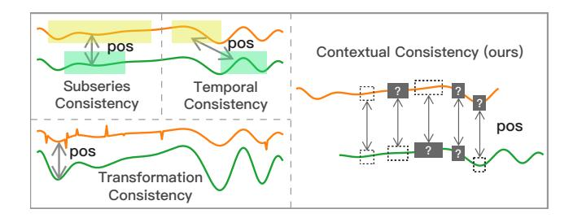
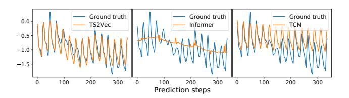

# TS2Vec: Towards Universal Representation of Time Series

Zhihan Yue,1,2 Yujing Wang,1,2 Juanyong Duan,<sup>2</sup> Tianmeng Yang,1,2 Congrui Huang,<sup>2</sup> Yunhai Tong,<sup>1</sup> Bixiong Xu<sup>2</sup>

> <sup>1</sup> Peking University, <sup>2</sup> Microsoft {zhihan.yue,youngtimmy,yhtong}@pku.edu.cn {yujwang,juanyong.duan,conhua,bix}@microsoft.com

### Abstract

This paper presents TS2Vec, a universal framework for learning representations of time series in an *arbitrary semantic level*. Unlike existing methods, TS2Vec performs contrastive learning in a *hierarchical* way over *augmented context* views, which enables a robust contextual representation for each timestamp. Furthermore, to obtain the representation of an arbitrary sub-sequence in the time series, we can apply a simple aggregation over the representations of corresponding timestamps. We conduct extensive experiments on time series classification tasks to evaluate the quality of time series representations. As a result, TS2Vec achieves significant improvement over existing SOTAs of unsupervised time series representation on 125 UCR datasets and 29 UEA datasets. The learned timestamp-level representations also achieve superior results in time series forecasting and anomaly detection tasks. A linear regression trained on top of the learned representations outperforms previous SOTAs of time series forecasting. Furthermore, we present a simple way to apply the learned representations for unsupervised anomaly detection, which establishes SOTA results in the literature. The source code is publicly available at https://github.com/yuezhihan/ts2vec.

# Introduction

Time series plays an important role in various industries such as financial markets, demand forecasting, and climate modeling. Learning universal representations for time series is a fundamental but challenging problem. Many studies (Tonekaboni, Eytan, and Goldenberg 2021; Franceschi, Dieuleveut, and Jaggi 2019; Wu et al. 2018) focused on learning *instance-level* representations, which described the whole segment of the input time series and have showed great success in tasks like clustering and classification. In addition, recent works (Eldele et al. 2021; Franceschi, Dieuleveut, and Jaggi 2019) employed the contrastive loss to learn the inherent structure of time series. However, there are still notable limitations in existing methods.

First, instance-level representations may not be suitable for tasks that need fine-grained representations, for example, time series forecasting and anomaly detection. In such kinds of tasks, one needs to infer the target at a specific timestamp or sub-series, while a coarse-grained representation of the

Copyright © 2022, Association for the Advancement of Artificial Intelligence (www.aaai.org). All rights reserved.

whole time series is insufficient to achieve satisfied performance.

Second, few of the existing methods distinguish the multiscale contextual information with different granularities. For example, TNC (Tonekaboni, Eytan, and Goldenberg 2021) discriminates among segments with a constant length. T-Loss (Franceschi, Dieuleveut, and Jaggi 2019) uses random sub-series from the original time series as positive samples. However, neither of them featurizes time series at different scales to capture scale-invariant information, which is essential to the success of time series tasks. Intuitively, multiscale features may provide different levels of semantics and improve the generalization capability of learned representations.

Third, most existing methods of unsupervised time series representation are inspired by experiences in CV and NLP domains, which have strong inductive bias such as transformation-invariance and cropping-invariance. However, those assumptions are not always applicable in modeling time series. For example, cropping is a frequently used augmentation strategy for images. However, the distributions and semantics of time series may change over time, and a cropped sub-sequence is likely to have a distinct distribution against the original time series.

To address these issues, this paper proposes a universal contrastive learning framework called TS2Vec, which enables the representation learning of time series in *all semantic levels*. It *hierarchically* discriminates positive and negative samples at instance-wise and temporal dimensions; and for an arbitrary sub-series, its overall representation can be obtained by a max pooling over the corresponding timestamps. This enables the model to capture contextual information at multiple resolutions for the temporal data and generate fine-grained representations for any granularity. Moreover, the contrasting objective in TS2Vec is based on *augmented context* views, that is, representations of the same sub-series in two augmented contexts should be consistent. In this way, we obtain a robust contextual representation for each sub-series without introducing unappreciated inductive bias like transformation- and cropping-invariance.

We conduct extensive experiments on multiple tasks to prove the effectiveness of our method. The results of time series classification, forecasting and anomaly detection tasks validate that the learned representations of TS2Vec are gen-


Figure 1: The proposed architecture of TS2Vec. Although this figure shows a univariate time series as the input example, the framework supports multivariate input. Each parallelogram denotes the representation vector on a timestamp of an instance.

eral and effective.

The major contributions of this paper are summarized as follows:

- We propose TS2Vec, a unified framework that learns contextual representations for arbitrary sub-series at various semantic levels. To the best of our knowledge, this is the first work that provides a flexible and universal representation method for all kinds of tasks in the time series domain, including but not limited to time series classification, forecasting and anomaly detection.
- To address the above goal, we leverage two novel designs in the contrastive learning framework. First, we use a *hierarchical contrasting* method in both instance-wise and temporal dimensions to capture multi-scale contextual information. Second, we propose *contextual consistency* for positive pair selection. Different from previous state-of-the-arts, it is more suitable for time series data with diverse distributions and scales. Extensive analyses demonstrate the robustness of TS2Vec for time series with missing values, and the effectiveness of both hierarchical contrasting and contextual consistency are verified by ablation study.
- TS2Vec outperforms existing SOTAs on three benchmark time series tasks, including classification, forecasting, and anomaly detection. For example, our method improves an average of 2.4% accuracy on 125 UCR datasets and 3.0% on 29 UEA datasets compared with the best SOTA of unsupervised representation on classification tasks.

# Method

### Problem Definition

Given a set of time series X = {x1, x2, · · · , x<sup>N</sup> } of N instances, the goal is to learn a nonlinear embedding function f<sup>θ</sup> that maps each x<sup>i</sup> to its representation r<sup>i</sup> that best describes itself. The input time series x<sup>i</sup> has dimension T ×F, where T is the sequence length and F is the feature dimension. The representation r<sup>i</sup> = {ri,1, ri,2, · · · , ri,T } contains representation vectors ri,t ∈ R <sup>K</sup> for each timestamp t, where K is the dimension of representation vectors.

## Model Architecture

The overall architecture of TS2Vec is shown in Figure 1. We randomly sample two overlapping subseries from an input time series x<sup>i</sup> , and encourage consistency of contextual representations on the common segment. Raw inputs are fed into the encoder which is optimized jointly with temporal contrastive loss and instance-wise contrastive loss. The total loss is summed over multiple scales in a hierarchical framework.

The encoder f<sup>θ</sup> consists of three components, including an input projection layer, a timestamp masking module, and a dilated CNN module. For each input x<sup>i</sup> , the input projection layer is a fully connected layer that maps the observation xi,t at timestamp t to a high-dimensional latent vector zi,t. The timestamp masking module masks latent vectors at randomly selected timestamps to generate an augmented context view. Note that we mask latent vectors rather than raw values because the value range for time series is possibly unbounded and it is impossible to find a special token for raw data. We will further prove the feasibility of this design in the appendix.

A dilated CNN module with ten residual blocks is then applied to extract the contextual representation at each timestamp. Each block contains two 1-D convolutional layers with a dilation parameter (2 l for the l-th block). The dilated convolutions enable a large receptive field for different domains (Bai, Kolter, and Koltun 2018). In the experimental section, we will demonstrate its effectiveness on various tasks and datasets.



Figure 2: Positive pair selection strategies.


Figure 3: Two typical cases of the distribution change of time series, with the heatmap visualization of the learned representations over time using subseries consistency and temporal consistency respectively.

### **Contextual Consistency**

The construction of positive pairs is essential in contrastive learning. Previous works have adopted various selection strategies (Figure 2), which are summarized as follows:

- *Subseries consistency* (Franceschi, Dieuleveut, and Jaggi 2019) encourages the representation of a time series to be closer to its sampled subseries.
- *Temporal consistency* (Tonekaboni, Eytan, and Goldenberg 2021) enforces the local smoothness of representations by choosing adjacent segments as positive samples.
- *Transformation consistency* (Eldele et al. 2021) augments input series by different transformations, such as scaling, permutation, etc., encouraging the model to learn transformation-invariant representations.

However, the above strategies are based on strong assumptions of data distribution and may be not appropriate for time series data. For example, subseries consistency is vulnerable when there exist level shifts (Figure 3a) and temporal consistency may introduce false positive pair when anomalies occur (Figure 3b). In these two figures, the green and yellow parts have different patterns, but previous strategies consider them as similar ones. To overcome this issue, we propose a new strategy, *contextual consistency*, which treats the representations at the same timestamp in two augmented contexts as positive pairs. A context is generated by applying timestamp masking and random cropping on the input time series. The benefits are two-folds. First, masking and cropping do not change the magnitude of the time series, which is important to time series. Second, they also

improve the robustness of learned representations by forcing each timestamp to reconstruct itself in distinct contexts.

**Timestamp Masking** We randomly mask the timestamps of an instance to produce a new context view. Specifically, it masks the latent vector  $z_i = \{z_{i,t}\}$  after the Input Projection Layer along the time axis with a binary mask  $m \in \{0,1\}^T$ , the elements of which are independently sampled from a Bernoulli distribution with p=0.5. The masks are independently sampled in every forward pass of the encoder.

**Random Cropping** Random cropping is also adopted to generate new contexts. For any time series input  $x_i \in \mathbb{R}^{T \times F}$ , TS2Vec randomly samples two overlapping time segments  $[a_1,b_1]$ ,  $[a_2,b_2]$  such that  $0 < a_1 \le a_2 \le b_1 \le b_2 \le T$ . The contextual representations on the overlapped segment  $[a_2,b_1]$  should be consistent for two context views. We show in the appendix that random cropping helps learn position-agnostic representations and avoids representation collapse. Timestamp masking and random cropping are only applied in the training phase.

### **Hierarchical Contrasting**

In this section, we propose the hierarchical contrastive loss that forces the encoder to learn representations at various scales. The steps of calculation is summarized in Algorithm 1. Based on the timestamp-level representation, we apply max pooling on the learned representations along the time axis and compute Equation 3 recursively. Especially, the contrasting at top semantic levels enables the model to learn instance-level representations.

Algorithm 1: Calculating the hierarchical contrastive loss

```
1: procedure HIERLOSS(r, r')
 2:
           \mathcal{L}_{hier} \leftarrow \mathcal{L}_{dual}(r, r');
           d \leftarrow 1:
 3:
 4:
           while time length(r) > 1 do
 5:
                 // The maxpool1d operates along the time axis.
 6:
                 r \leftarrow \text{maxpool1d}(r, \text{kernel\_size} = 2);
                 r' \leftarrow \text{maxpool1d}(r', \text{kernel\_size} = 2);
 7:
 8:
                 \mathcal{L}_{hier} \leftarrow \mathcal{L}_{hier} + \mathcal{L}_{dual}(r, r');
                 d \leftarrow d + 1;
 9:
           end while
10:
11:
           \mathcal{L}_{hier} \leftarrow \mathcal{L}_{hier}/d;
           return \mathcal{L}_{hier}
13: end procedure
```

The hierarchical contrasting method enables a more comprehensive representation than previous works. For example, T-Loss (Franceschi, Dieuleveut, and Jaggi 2019) performs instance-wise contrasting only at the instance level; TS-TCC (Eldele et al. 2021) applies instance-wise contrasting only at the timestamp level; TNC (Tonekaboni, Eytan, and Goldenberg 2021) encourages temporal local smoothness in a specific level of granularity. These works do not encapsulate representations in different levels of granularity like TS2Vec.

To capture contextual representations of time series, we leverage both instance-wise and temporal contrastive losses

|        | 125 UCR datasets |           |                       | 29 UEA datasets |           |                       |  |
|--------|------------------|-----------|-----------------------|-----------------|-----------|-----------------------|--|
| Method | Avg. Acc.        | Avg. Rank | Training Time (hours) | Avg. Acc.       | Avg. Rank | Training Time (hours) |  |
| DTW    | 0.727            | 4.33      | _                     | 0.650           | 3.74      | _                     |  |
| TNC    | 0.761            | 3.52      | 228.4                 | 0.677           | 3.84      | 91.2                  |  |
| TST    | 0.641            | 5.23      | 17.1                  | 0.635           | 4.36      | 28.6                  |  |
| TS-TCC | 0.757            | 3.38      | 1.1                   | 0.682           | 3.53      | 3.6                   |  |
| T-Loss | 0.806            | 2.73      | 38.0                  | 0.675           | 3.12      | 15.1                  |  |
| TS2Vec | 0.830 (+2.4%)    | 1.82      | 0.9                   | 0.712 (+3.0%)   | 2.40      | 0.6                   |  |

Table 1: Time series classification results compared to other time series representation methods. The representation dimensions of TS2Vec, T-Loss, TS-TCC, TST and TNC are all set to 320 and under SVM evaluation protocol for fair comparison.

jointly to encode time series distribution. The loss functions are applied to all granularity levels in the hierarchical contrasting model.

**Temporal Contrastive Loss** To learn discriminative representations over time, TS2Vec takes the representations at the same timestamp from two views of the input time series as positives, while those at different timestamps from the same time series as negatives. Let i be the index of the input time series sample and t be the timestamp. Then  $r_{i,t}$  and  $r'_{i,t}$  denote the representations for the same timestamp t but from two augmentations of  $x_i$ . The temporal contrastive loss for the i-th time series at timestamp t can be formulated as

$$\ell_{temp}^{(i,t)} = -\log \frac{\exp(r_{i,t} \cdot r'_{i,t})}{\sum_{t' \in \Omega} \left( \exp(r_{i,t} \cdot r'_{i,t'}) + \mathbb{I}_{[t \neq t']} \exp(r_{i,t} \cdot r_{i,t'}) \right)}, \quad (1)$$

where  $\Omega$  is the set of timestamps within the overlap of the two subseries, and  $\mathbb{I}$  is the indicator function.

**Instance-wise Contrastive Loss** The instance-wise contrastive loss indexed with (i, t) can be formulated as

$$\ell_{inst}^{(i,t)} = -\log \frac{\exp(r_{i,t} \cdot r'_{i,t})}{\sum_{j=1}^{B} \left( \exp(r_{i,t} \cdot r'_{j,t}) + \mathbb{I}_{[i \neq j]} \exp(r_{i,t} \cdot r_{j,t}) \right)}, \quad (2)$$

where B denotes the batch size. We use representations of other time series at timestamp t in the same batch as negative samples.

The two losses are complementary to each other. For example, given a set of electricity consumption data from multiple users, instance contrast may learn the user-specific characteristics, while temporal contrast aims to mine the dynamic trends over time. The overall loss is defined as

$$\mathcal{L}_{dual} = \frac{1}{NT} \sum_{i} \sum_{t} \left( \ell_{temp}^{(i,t)} + \ell_{inst}^{(i,t)} \right). \tag{3}$$

#### **Experiments**

In this section, we evaluate the learned representations of TS2Vec on time series classification, forecasting, and anomaly detection. Detailed experimental settings are presented in the appendix.

### **Time Series Classification**

For classification tasks, the classes are labeled on the entire time series (instance). Therefore we require the instancelevel representations, which can be obtained by max pooling over all timestamps. We then follow the same protocol


Figure 4: Critical Difference (CD) diagram of representation learning methods on time series classification tasks with a confidence level of 95%.

as T-Loss (Franceschi, Dieuleveut, and Jaggi 2019) where an SVM classifier with RBF kernel is trained on top of the instance-level representations to make predictions.

We conduct extensive experiments on time series classification to evaluate the instance-level representations, compared with other SOTAs of unsupervised time series representation, including T-Loss, TS-TCC (Eldele et al. 2021), TST (Zerveas et al. 2021) and TNC (Tonekaboni, Eytan, and Goldenberg 2021). The UCR archive (Dau et al. 2019) and UEA archive (Bagnall et al. 2018) are adopted for evaluation. There are 128 univariate datasets in UCR and 30 multivariate datasets in UEA. Note that TS2Vec works on all UCR and UEA datasets, and full results of TS2Vec on all datasets are provided in the appendix.

The evaluation results are summarized in Table 1. TS2Vec achieves substantial improvement compared to other representation learning methods on both UCR and UEA datasets. In particular, TS2Vec improves an average of 2.4% classification accuracy on 125 UCR datasets and 3.0% on 29 UEA datasets. Critical Difference diagram (Demšar 2006) for Nemenyi tests on all datasets (including 125 UCR and 29 UEA datasets) is presented in Figure 4, where classifiers that are not connected by a bold line are significantly different in average ranks. This validates that TS2Vec significantly outperforms other methods in average ranks. As mentioned in section and, T-Loss, TS-TCC and TNC perform contrastive learning at only a certain level and impose strong inductive bias, such as transformation-invariance, to select positive pairs. TS2Vec applies hierarchical contrastive learning at different semantic levels, thus achieves better performance.

Table 1 also shows the total training time of representation learning methods with an NVIDIA GeForce RTX 3090

| Dataset   | Н   | TS2Vec | Informer | LogTrans | N-BEATS | TCN   | LSTnet |
|-----------|-----|--------|----------|----------|---------|-------|--------|
|           | 24  | 0.039  | 0.098    | 0.103    | 0.094   | 0.075 | 0.108  |
|           | 48  | 0.062  | 0.158    | 0.167    | 0.210   | 0.227 | 0.175  |
| $ETTh_1$  | 168 | 0.134  | 0.183    | 0.207    | 0.232   | 0.316 | 0.396  |
|           | 336 | 0.154  | 0.222    | 0.230    | 0.232   | 0.306 | 0.468  |
|           | 720 | 0.163  | 0.269    | 0.273    | 0.322   | 0.390 | 0.659  |
|           | 24  | 0.090  | 0.093    | 0.102    | 0.198   | 0.103 | 3.554  |
|           | 48  | 0.124  | 0.155    | 0.169    | 0.234   | 0.142 | 3.190  |
| $ETTh_2$  | 168 | 0.208  | 0.232    | 0.246    | 0.331   | 0.227 | 2.800  |
|           | 336 | 0.213  | 0.263    | 0.267    | 0.431   | 0.296 | 2.753  |
|           | 720 | 0.214  | 0.277    | 0.303    | 0.437   | 0.325 | 2.878  |
|           | 24  | 0.015  | 0.030    | 0.065    | 0.054   | 0.041 | 0.090  |
|           | 48  | 0.027  | 0.069    | 0.078    | 0.190   | 0.101 | 0.179  |
| $ETTm_1$  | 96  | 0.044  | 0.194    | 0.199    | 0.183   | 0.142 | 0.272  |
|           | 288 | 0.103  | 0.401    | 0.411    | 0.186   | 0.318 | 0.462  |
|           | 672 | 0.156  | 0.512    | 0.598    | 0.197   | 0.397 | 0.639  |
|           | 24  | 0.260  | 0.251    | 0.528    | 0.427   | 0.263 | 0.281  |
|           | 48  | 0.319  | 0.346    | 0.409    | 0.551   | 0.373 | 0.381  |
| Electric. | 168 | 0.427  | 0.544    | 0.959    | 0.893   | 0.609 | 0.599  |
|           | 336 | 0.565  | 0.713    | 1.079    | 1.035   | 0.855 | 0.823  |
|           | 720 | 0.861  | 1.182    | 1.001    | 1.548   | 1.263 | 1.278  |
| Avg.      |     | 0.209  | 0.310    | 0.370    | 0.399   | 0.338 | 1.099  |

Table 2: Univariate time series forecasting results on MSE.



Figure 5: A prediction slice (H=336) of TS2Vec, Informer and TCN on the test set of ETTh<sub>2</sub>.

GPU. Among these methods, TS2Vec provides the shortest training time. Because TS2Vec applies contrastive losses across different granularities in one batch, the efficiency of representation learning has been greatly improved.

#### **Time Series Forecasting**

Given the last  $T_l$  observations  $x_{t-T_l+1},...,x_t$ , time series forecasting task aims to predict the future H observations  $x_{t+1},...,x_{t+H}$ . We use  $r_t$ , the representation of the last timestamp, to predict future observations. Specifically, we train a linear regression model with  $L_2$  norm penalty that takes  $r_t$  as input to directly predict future values  $\hat{x}$ . When x is a univariate time series,  $\hat{x}$  has dimension H. When x is a multivariate time series with F features, the dimension of  $\hat{x}$  should be FH.

We compare the performance of TS2Vec and existing SOTAs on four public datasets, including three ETT datasets (Zhou et al. 2021) and the Electricity dataset (Dua and Graff 2017). We apply Informer (Zhou et al. 2021), Log-Trans (Li et al. 2019), LSTnet (Lai et al. 2018), TCN (Bai, Kolter, and Koltun 2018) for both univariate and multivariate settings, N-BEATS (Oreshkin et al. 2019) for the univariate setting, and StemGNN (Cao et al. 2020) for the multivariate setting respectively. Follow previous works, we use MSE and MAE to evaluate the forecasting performance.

| Phase     | Н   | TS2Vec        | Informer |  |
|-----------|-----|---------------|----------|--|
|           | 24  | 60.42 + 2.47  | 402.31   |  |
|           | 48  | 60.42 + 3.63  | 163.41   |  |
| Training  | 96  | 60.42 + 5.10  | 392.40   |  |
|           | 288 | 60.42 + 10.76 | 706.94   |  |
|           | 672 | 60.42 + 21.38 | 938.36   |  |
|           | 24  | 3.01 + 0.01   | 15.91    |  |
|           | 48  | 3.01 + 0.02   | 4.85     |  |
| Inference | 96  | 3.01 + 0.03   | 14.57    |  |
|           | 288 | 3.01 + 0.10   | 21.82    |  |
|           | 672 | 3.01 + 0.21   | 28.49    |  |

Table 3: The running time (in seconds) comparison on multivariate forecasting task on ETTm<sub>1</sub> dataset.

The evaluation results on MSE for univariate forecasting are shown in Table 2, while full forecasting results (univariate and multivariate forecasting on both MSE and MAE) are reported in the appendix due to space limitation. In general, TS2Vec establishes a new SOTA in most of the cases, where TS2Vec achieves a 32.6% decrease of average MSE on the univariate setting and 28.2% on the multivariate setting. Furthermore, the representations only need to be learned once for each dataset and can be directly applied to various horizons (Hs) with linear regressions, which demonstrates the *universality* of the learned representations. Figure 5 presents a typical prediction slice with long-term trends and periodical patterns, comparing among the top 3 best-performing methods on univariate forecasting. In this case, Informer shows its capability to capture long-term trends but fails to capture periodical patterns. TCN successfully captures periodical patterns but fails to capture long-term trends. TS2Vec captures both characteristics, showing better predictive results than other methods.

The execution time on an NVIDIA GeForce RTX 3090 GPU of the proposed method on  $ETTm_1$  is presented in Table 3, compared with Informer (Zhou et al. 2021), which is known as its remarkable efficiency for long time series forecasting. The training and inference time of TS2Vec are reported by two stages respectively. The training phase includes two stages: (1) learning time series representations through TS2Vec framework, (2) training a linear regressor for each H on top of the learned representations. Similarly, the inference phase also includes two steps: (1) inference of representations for corresponding timestamps, (2) prediction via trained linear regressor. Note that the representation model of TS2Vec only needs to be trained once for different horizon settings. Whether in training or inference, our method achieves superior efficiency compared to Informer.

#### **Time Series Anomaly Detection**

We follow a streaming evaluation protocol (Ren et al. 2019). Given any time series slice  $x_1, x_2, ..., x_t$ , the task of time series anomaly detection is to determine whether the last point  $x_t$  is an anomaly. On the learned representations, an anomaly point may show a clear difference against normal points (Figure 7c). In addition, TS2Vec encourages the

|                     | Yahoo                 |       |       | KPI            |       |       |
|---------------------|-----------------------|-------|-------|----------------|-------|-------|
|                     | <b>F</b> <sub>1</sub> | Prec. | Rec.  | F <sub>1</sub> | Prec. | Rec.  |
| SPOT                | 0.338                 | 0.269 | 0.454 | 0.217          | 0.786 | 0.126 |
| DSPOT               | 0.316                 | 0.241 | 0.458 | 0.521          | 0.623 | 0.447 |
| DONUT               | 0.026                 | 0.013 | 0.825 | 0.347          | 0.371 | 0.326 |
| SR                  | 0.563                 | 0.451 | 0.747 | 0.622          | 0.647 | 0.598 |
| TS2Vec              | 0.745                 | 0.729 | 0.762 | 0.677          | 0.929 | 0.533 |
| Cold-start:         |                       |       |       |                |       |       |
| FFT                 | 0.291                 | 0.202 | 0.517 | 0.538          | 0.478 | 0.615 |
| Twitter-AD          | 0.245                 | 0.166 | 0.462 | 0.330          | 0.411 | 0.276 |
| Luminol             | 0.388                 | 0.254 | 0.818 | 0.417          | 0.306 | 0.650 |
| SR                  | 0.529                 | 0.404 | 0.765 | 0.666          | 0.637 | 0.697 |
| TS2Vec <sup>†</sup> | 0.726                 | 0.692 | 0.763 | 0.676          | 0.907 | 0.540 |

Table 4: Univariate time series anomaly detection results.

contextual consistency on the same timestamp of an instance. Considering this, we propose to define the anomaly score as the dissimilarity of the representations computed from masked and unmasked inputs. Specifically, on inference stage, the trained TS2Vec forwards twice for an input: for the first time, we mask out the last observation  $x_t$  only; for the second time, no mask is applied. We denote the representations of the last timestamp for these two forwards as  $r_t^u$  and  $r_t^m$  respectively.  $L_1$  distance is used to measure the anomaly score:

$$\alpha_t = \|r_t^u - r_t^m\|_1. (4)$$

To avoid drifting, following previous works (Ren et al. 2019), we take the local average of the preceding Z points  $\overline{\alpha}_t = \frac{1}{Z} \sum_{i=t-Z}^{t-1} \alpha_i$  to adjust the anomaly score by  $\alpha_t^{adj} = \frac{\alpha_t - \overline{\alpha}_t}{\overline{\alpha}_t}$ . On inference, a timestamp t is predicted as an anomaly point when  $\alpha_t^{adj} > \mu + \beta \sigma$ , where  $\mu$  and  $\sigma$  are the mean and standard deviation respectively of the historical scores and  $\beta$  is a hyperparameter.

We compare TS2Vec with other unsupervised methods of univariate time series anomaly detection, including FFT (Rasheed et al. 2009), SPOT, DSPOT (Siffer et al. 2017), Twitter-AD (Vallis, Hochenbaum, and Kejariwal 2014), Luminol (Brennan and Ritesh 2018), DONUT (Xu et al. 2018) and SR (Ren et al. 2019). Two public datasets are used to evaluate our model. Yahoo (Nikolay Laptev 2015) is a benchmark dataset for anomaly detection, including 367 hourly sampled time series with tagged anomaly points. It converges a wide variety of anomaly types such as outliers and change-points. KPI (Ren et al. 2019) is a competition dataset released by AIOPS Challenge. The dataset includes multiple minutely sampled real KPI curves from many Internet companies. The experimental settings are detailed in the appendix.

In the normal setting, each time series sample is split into two halves according to the time order, where the first half is for unsupervised training and the second is for evaluation. However, among the baselines, Luminol, Twitter-AD and FFT do not require additional training data to start. Therefore these methods are compared under a cold-start setting, in which all the time series are for testing. In this setting, the TS2Vec encoder is trained on *FordA* dataset in the UCR

|                            | Avg. Accuracy  |
|----------------------------|----------------|
| TS2Vec                     | 0.829          |
| w/o Temporal Contrast      | 0.819 (-1.0%)  |
| w/o Instance Contrast      | 0.824 (-0.5%)  |
| w/o Hierarchical Contrast  | 0.812 (-1.7%)  |
| w/o Random Cropping        | 0.808 (-2.1%)  |
| w/o Timestamp Masking      | 0.820 (-0.9%)  |
| w/o Input Projection Layer | 0.817 (-1.2%)  |
| Positive Pair Sele         | ction          |
| Contextual Consistency     |                |
| → Temporal Consistency     | 0.807 (-2.2%)  |
| → Subseries Consistency    | 0.780 (-4.9%)  |
| Augmentation               | S              |
| + Jitter                   | 0.814 (-1.5%)  |
| + Scaling                  | 0.814 (-1.5%)  |
| + Permutation              | 0.796 (-3.3%)  |
| Backbone Architec          | ctures         |
| Dilated CNN                |                |
| $\rightarrow$ LSTM         | 0.779 (-5.0%)  |
| $\rightarrow$ Transformer  | 0.647 (-18.2%) |

Table 5: Ablation results on 128 UCR datasets.

archive, and tested on Yahoo and KPI datasets. We denote this transferred version of our model as TS2Vec $^\dagger$ . We set  $\beta=4$  empirically and Z=21 following (Ren et al. 2019) for both settings. In the normal setting,  $\mu$  and  $\sigma$  of our protocol are computed using the training split for each time series, while in the cold-start setting they are computed using all historical data points before the recent point.

Table 4 shows the performance comparison of different methods on  $F_1$  score, precision and recall. In the normal setting, TS2Vec improves the  $F_1$  score by 18.2% on Yahoo dataset and 5.5% on KPI dataset compared to the best result of baseline methods. In the cold-start setting, the  $F_1$  score is improved by 19.7% on Yahoo dataset and 1.0% on KPI dataset than the best SOTA result. Note that our method achieves similar scores on these two settings, demonstrating the *transferability* of TS2Vec from one dataset to another.

### **Analysis**

#### **Ablation Study**

To verify the effectiveness of the proposed components in TS2Vec, a comparison between full TS2Vec and its six variants on 128 UCR datasets is shown in Table 5, where (1) w/o Temporal Contrast removes the temporal contrastive loss, (2) w/o Instance Contrast removes the instance-wise contrastive loss, (3) w/o Hierarchical Contrast only performs contrastive learning at the lowest level, (4) w/o Random Cropping uses full sequence for two views rather than using random cropping, (5) w/o Timestamp Masking uses a mask filled with ones in training, and (6) w/o Input Projection Layer removes the input projection layer. The results show that all the above components of TS2Vec are indispensable.

Table 5 also shows the comparison among different positive pair selection strategies. We replace our proposed contextual consistency, including the timestamp masking


Figure 6: Accuracy scores of the top 4 largest datasets in UCR archive with respect to the rate of missing points.

and random cropping, into temporal consistency (Tonekaboni, Eytan, and Goldenberg 2021) and subseries consistency (Franceschi, Dieuleveut, and Jaggi 2019). The temporal consistency takes the timestamps within a certain distance as positives, while the subseries consistency randomly takes two subseries for the same time series as positives. In addition, we try to add data augmentation techniques to our method, including jitter, scaling and permutation (Eldele et al. 2021), for different views of the input time series. A performance decrease is observed after adding these augmentations. As mentioned earlier, they assume the time series data to follow some invariant assumptions which do not hold for diverse and ever-changing distributions of time series.

To justify our choice of the backbone, we replace the dilated CNN with LSTM and Transformer with a similar parameter size. The accuracy score decreases significantly for both cases, showing dilated CNN is an effective choice for the model architecture of time series.

#### **Robustness to Missing Data**

Missing data is a common occurrence for time series collected from the real world. As a universal framework, TS2Vec provides steady performance when feeding data with a large proportion of missing values, in which the proposed hierarchical contrasting and timestamp masking strategies play an important role. Intuitively, timestamp masking enables the network to infer the representations under incomplete contexts. The hierarchical contrasting brings about long-range information, which helps to predict a missing timestamp if its surrounding information is not complete.

The top 4 largest UCR datasets are selected for analysis. We randomly mask out observations for *both training set and test set* with specific missing rates of timestamps. Figure 6 shows that without hierarchical contrast or timestamp masking, the classification accuracy drops rapidly with the


Figure 7: The heatmap visualization of the learned representations of TS2Vec over time.

growth of the missing rate. We also notice that the performance of *w/o Hierarchical Contrast* drops dramatically as the missing rate grows, indicating the importance of longrange information for handling a large number of missing values. We can conclude that TS2Vec is extremely robust to missing points. Specifically, even with 50% missing values, TS2Vec achieves almost the same accuracy on *UWaveGestureLibraryAll*, and only 2.1%, 2.1% and 1.2% accuracy decrease on *StarLightCurves*, *HandOutlines* and *MixedShapesRegularTrain* respectively.

### Visualized Explanation

This section visualizes the learned representations over time on three datasets from UCR archive, including ScreenType, Phoneme and RefrigerationDevices datasets (Figure 7). We choose the first sample from the test set and select the top 16 representation dimensions with the largest variances for visualization. Figure 7a corresponds to a time series similar to binary digital signals, where the representation learned by TS2Vec clearly distinguishes the timestamps with high and low values respectively. Figure 7b shows an audio signal with shrinking volatility. The learned representation is able to reflect the evolving trend across timestamps. In Figure 7c, the time series has periodical patterns with a sudden spike. One can notice that the learned representations of spiked timestamps show an obvious difference from normal timestamps, demonstrating the ability of TS2Vec for capturing the change of time series distributions.

#### Conclusion

This paper proposes a universal representation learning framework for time series, namely TS2Vec, which applies hierarchical contrasting to learn scale-invariant representations within augmented context views. The evaluation of the learned representations on three time-series-related tasks (including time series classification, forecasting and anomaly detection) demonstrates the universality and effectiveness of TS2Vec. We also show that TS2Vec provides steady performance when feeding incomplete data, in which the hierarchical contrastive loss and timestamp masking play important roles. Furthermore, visualization of the learned representations validates the capability of TS2Vec to capture the dynamics of time series. Ablation study proves the effectiveness of proposed components. The framework of TS2Vec is generic and has potential to be applied for other domains in our future work.

# References

- Bagnall, A. J.; Dau, H. A.; Lines, J.; Flynn, M.; Large, J.; Bostrom, A.; Southam, P.; and Keogh, E. J. 2018. The UEA multivariate time series classification archive, 2018. *CoRR*, abs/1811.00075.
- Bai, S.; Kolter, J. Z.; and Koltun, V. 2018. An Empirical Evaluation of Generic Convolutional and Recurrent Networks for Sequence Modeling. *CoRR*, abs/1803.01271.
- Brennan, V.; and Ritesh, M. 2018. Luminol. https://github. com/linkedin/luminol. Accessed: 2021-05-05.
- Cao, D.; Wang, Y.; Duan, J.; Zhang, C.; Zhu, X.; Huang, C.; Tong, Y.; Xu, B.; Bai, J.; Tong, J.; and Zhang, Q. 2020. Spectral Temporal Graph Neural Network for Multivariate Time-series Forecasting. In *Advances in Neural Information Processing Systems*, volume 33, 17766–17778. Curran Associates, Inc.
- Dau, H. A.; Bagnall, A.; Kamgar, K.; Yeh, C.-C. M.; Zhu, Y.; Gharghabi, S.; Ratanamahatana, C. A.; and Keogh, E. 2019. The UCR time series archive. *IEEE/CAA Journal of Automatica Sinica*, 6(6): 1293–1305.
- Demsar, J. 2006. Statistical comparisons of classifiers over ˇ multiple data sets. *The Journal of Machine Learning Research*, 7: 1–30.
- Dua, D.; and Graff, C. 2017. UCI Machine Learning Repository. http://archive.ics.uci.edu/ml. Accessed: 2021-05-12.
- Eldele, E.; Ragab, M.; Chen, Z.; Wu, M.; Kwoh, C. K.; Li, X.; and Guan, C. 2021. Time-Series Representation Learning via Temporal and Contextual Contrasting. In *Proceedings of the Thirtieth International Joint Conference on Artificial Intelligence, IJCAI-21*, 2352–2359.
- Franceschi, J.-Y.; Dieuleveut, A.; and Jaggi, M. 2019. Unsupervised Scalable Representation Learning for Multivariate Time Series. In *Advances in Neural Information Processing Systems*, volume 32. Curran Associates, Inc.
- Lai, G.; Chang, W.-C.; Yang, Y.; and Liu, H. 2018. Modeling long-and short-term temporal patterns with deep neural networks. In *The 41st International ACM SIGIR Conference on Research & Development in Information Retrieval*, 95– 104.
- Li, S.; Jin, X.; Xuan, Y.; Zhou, X.; Chen, W.; Wang, Y.-X.; and Yan, X. 2019. Enhancing the Locality and Breaking the Memory Bottleneck of Transformer on Time Series Forecasting. In *Advances in Neural Information Processing Systems*, volume 32. Curran Associates, Inc.
- Nikolay Laptev, Y. B., Saeed Amizadeh. 2015. A Benchmark Dataset for Time Series Anomaly Detection. https://yahooresearch.tumblr.com/post/114590420346/ a-benchmark-dataset-for-time-series-anomaly. Accessed: 2021-05-02.
- Oreshkin, B. N.; Carpov, D.; Chapados, N.; and Bengio, Y. 2019. N-BEATS: Neural basis expansion analysis for interpretable time series forecasting. In *International Conference on Learning Representations*.
- Rasheed, F.; Peng, P.; Alhajj, R.; and Rokne, J. 2009. Fourier transform based spatial outlier mining. In *International Conference on Intelligent Data Engineering and Automated Learning*, 317–324. Springer.

- Ren, H.; Xu, B.; Wang, Y.; Yi, C.; Huang, C.; Kou, X.; Xing, T.; Yang, M.; Tong, J.; and Zhang, Q. 2019. Time-series anomaly detection service at Microsoft. In *Proceedings of the 25th ACM SIGKDD International Conference on Knowledge Discovery & Data Mining*, 3009–3017.
- Siffer, A.; Fouque, P.-A.; Termier, A.; and Largouet, C. 2017. Anomaly detection in streams with extreme value theory. In *Proceedings of the 23rd ACM SIGKDD International Conference on Knowledge Discovery and Data Mining*, 1067–1075.
- Tonekaboni, S.; Eytan, D.; and Goldenberg, A. 2021. Unsupervised Representation Learning for Time Series with Temporal Neighborhood Coding. In *International Conference on Learning Representations*.
- Vallis, O.; Hochenbaum, J.; and Kejariwal, A. 2014. A novel technique for long-term anomaly detection in the cloud. In *6th USENIX workshop on hot topics in cloud computing (HotCloud 14)*.
- Wu, L.; Yen, I. E.-H.; Yi, J.; Xu, F.; Lei, Q.; and Witbrock, M. 2018. Random warping series: A random features method for time-series embedding. In *International Conference on Artificial Intelligence and Statistics*, 793–802. PMLR.
- Xu, H.; Chen, W.; Zhao, N.; Li, Z.; Bu, J.; Li, Z.; Liu, Y.; Zhao, Y.; Pei, D.; Feng, Y.; et al. 2018. Unsupervised anomaly detection via variational auto-encoder for seasonal kpis in web applications. In *Proceedings of the 2018 World Wide Web Conference*, 187–196.
- Zerveas, G.; Jayaraman, S.; Patel, D.; Bhamidipaty, A.; and Eickhoff, C. 2021. A Transformer-Based Framework for Multivariate Time Series Representation Learning. In *Proceedings of the 27th ACM SIGKDD Conference on Knowledge Discovery & Data Mining*, KDD '21, 2114–2124. New York, NY, USA: Association for Computing Machinery. ISBN 9781450383325.
- Zhou, H.; Zhang, S.; Peng, J.; Zhang, S.; Li, J.; Xiong, H.; and Zhang, W. 2021. Informer: Beyond Efficient Transformer for Long Sequence Time-Series Forecasting. In *The Thirty-Fifth AAAI Conference on Artificial Intelligence, AAAI 2021*, online. AAAI Press.